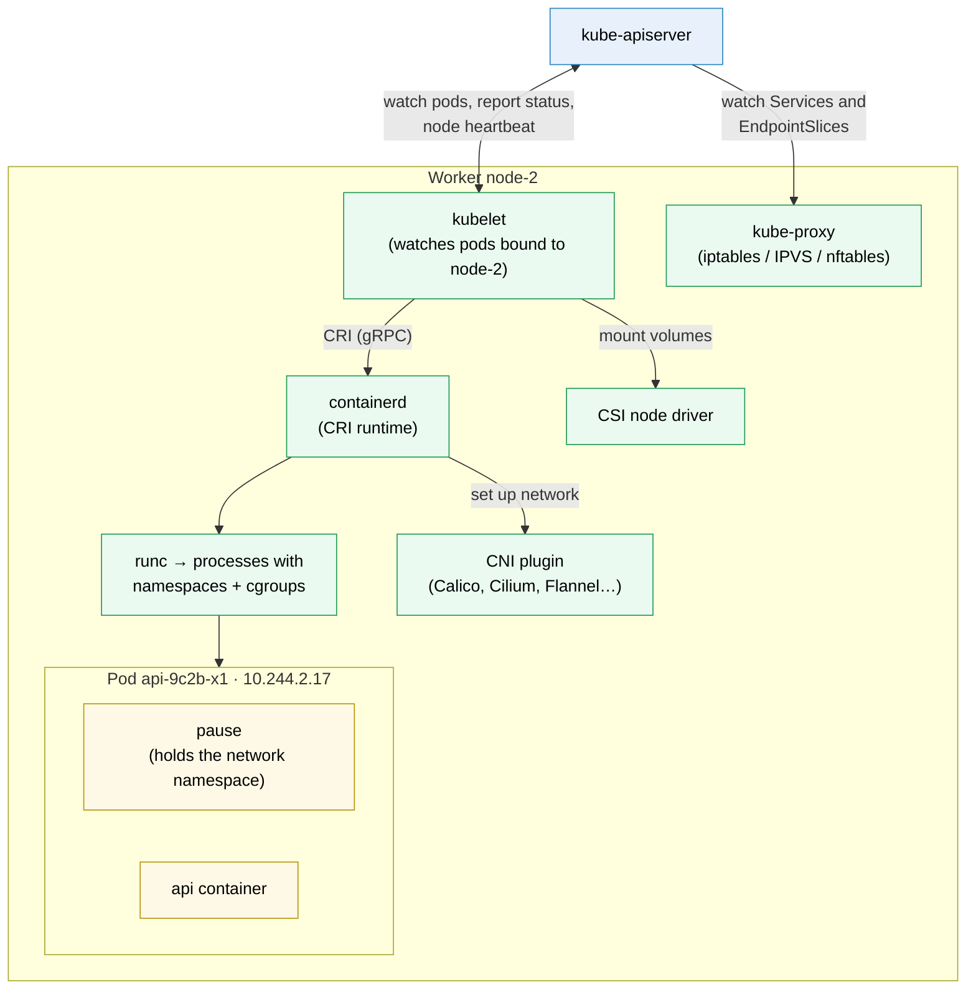
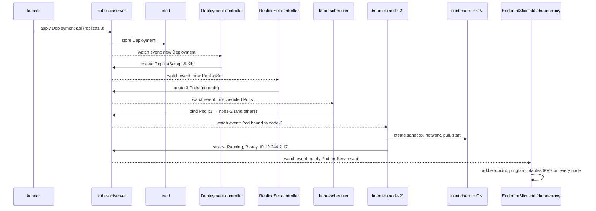

# Kubernetes architecture

> [!abstract] In one sentence
> A Kubernetes cluster is a **database of desired state** (etcd), a single **API (application programming interface) server** that is the only door to it, and a set of independent **controllers** (the scheduler, the controller manager, and on every node the **kubelet** and **kube-proxy**) that each **watch** the API for the objects they care about and act to make reality match. No component gives orders to another: they all coordinate only by reading and writing objects through the API server.

## Build-up: following one `kubectl apply`

The shop's API from [[Kubernetes]] runs on a cluster of three control plane machines (`cp-1..3`, `10.0.0.11-13`) and three workers (`node-1..3`, `10.0.1.21-23`). I run:

```bash
kubectl apply -f api-deployment.yaml     # Deployment api, replicas: 3
```

Ten seconds later, three pods serve traffic. This note follows what happened, one component at a time, each one existing because the previous one can't do the job alone.

### Stage 1: somewhere to keep the desired state (etcd)

The cluster must remember "Deployment `api`, 3 replicas, this image" even if a control plane machine dies. That's **etcd**: a small, strongly consistent **key-value store**, replicated across the control plane machines with **Raft** (see [[Container orchestration]]). Every Kubernetes object lives there as one key:

```
/registry/deployments/shop/api
/registry/pods/shop/api-9c2b-x1
/registry/secrets/shop/db
```

etcd gives two properties everything else depends on:
- **Consistency**: a write is acknowledged only once a majority of members have it. Three members survive one failure, five survive two
- **Watch**: a client can say "tell me about every change under `/registry/pods/` after revision 48211". Changes are streamed in order, each with a **revision number**

> [!info] etcd is the only stateful component
> Everything else in the control plane can be restarted, replaced or scaled at will: they rebuild their view from etcd through the API server. **Backing up etcd is backing up the cluster.** Losing it without a backup means the cluster forgets every object, even though the containers on the nodes keep running for a while.

### Stage 2: one door in front of the database (kube-apiserver)

Letting every component and user write to etcd directly would mean no validation, no permissions, no way to change the storage format. So **only the API server talks to etcd**, and everything else, including `kubectl`, talks to the API server over HTTPS (HTTP, Hypertext Transfer Protocol, over TLS, Transport Layer Security).

My `kubectl apply` went through these steps:

```mermaid
flowchart LR
    K["kubectl apply<br/>(HTTPS request)"] --> AUTHN["1. Authentication<br/>who is this?<br/>(client cert, token, OIDC)"]
    AUTHN --> AUTHZ["2. Authorization<br/>may they do this?<br/>(RBAC)"]
    AUTHZ --> MUT["3. Mutating admission<br/>add defaults, inject sidecars"]
    MUT --> VAL["4. Schema validation"]
    VAL --> VADM["5. Validating admission<br/>policies: no :latest,<br/>quotas, pod security"]
    VADM --> ETCD[("6. Write to etcd")]
    ETCD --> W["7. Notify every watcher"]

    classDef step fill:#e8f1fb,stroke:#2e86c1,color:#000
    classDef store fill:#fef9e7,stroke:#b7950b,color:#000
    class AUTHN,AUTHZ,MUT,VAL,VADM,W step
    class ETCD store
```



1. **Authentication**: a client certificate, a bearer token (ServiceAccount tokens are JWTs, JSON Web Tokens, see [[JWT and bearer tokens]]), or an OIDC (OpenID Connect) login from a company identity provider ([[OpenID Connect]])
2. **Authorization**: usually RBAC (role-based access control). "May user `ci-shop` create deployments in namespace `shop`?"
3. **Admission**: plug-ins and **webhooks** that can **modify** the object (add default values, inject a service mesh sidecar) and then **validate** it (policy engines like Kyverno or OPA (Open Policy Agent) Gatekeeper reject images tagged `:latest`, check quotas)
4. The object is stored in etcd with a new `resourceVersion`
5. Everyone watching Deployments is told

The API server is **stateless**: three copies run behind a load balancer, one per control plane machine, all active. It's also where **extensibility** lives: a CustomResourceDefinition adds a new path to this same API, with the same authentication, RBAC, admission and storage.

> [!info] Optimistic concurrency
> Every object carries a `resourceVersion`. An update says "I'm changing version 48211"; if someone else already changed it, the API server answers **409 Conflict** and the client re-reads and retries. That's how a dozen independent controllers edit the same objects without locks.

### Stage 3: turning a Deployment into pods (kube-controller-manager)

The Deployment is now stored, but nothing runs. Something has to notice it and act. That's the job of **controllers**, and the built-in ones are packaged together in one binary, **kube-controller-manager**. Each is a reconciliation loop on one kind of object:

| Controller | Watches | Does |
|---|---|---|
| **Deployment** | Deployments, ReplicaSets | Creates/scales ReplicaSets for each template version (rolling updates) |
| **ReplicaSet** | ReplicaSets, Pods | Creates or deletes pods to match `replicas` |
| **Node lifecycle** | Nodes | Marks nodes `NotReady` when their heartbeats stop, taints them so pods get evicted |
| **EndpointSlice** | Services, Pods | Keeps each Service's list of ready pod IPs |
| **Job / CronJob** | Jobs | Runs pods to completion, creates Jobs on schedule |
| **StatefulSet, DaemonSet** | Their objects, Pods | Ordered pods with stable names; one pod per node |
| **Namespace** | Namespaces | Deletes everything inside a namespace being deleted |
| **Garbage collector** | Owner references | Deletes objects whose owner is gone (pods of a deleted ReplicaSet) |
| **ServiceAccount, token** | Namespaces | Creates the `default` ServiceAccount in each namespace |

In my case:
1. The **Deployment controller** sees a new Deployment with no ReplicaSet → creates ReplicaSet `api-9c2b` with `replicas: 3`
2. The **ReplicaSet controller** sees a ReplicaSet wanting 3 pods and owning 0 → creates 3 **Pod objects**

These pods are only **records** in etcd. Their `spec.nodeName` is empty: nobody has decided where they run.

> [!info] Only one active copy
> Three controller managers run (one per control plane machine), but only one acts at a time: they hold a **lease** (a lock object in the API) and the others stand by, ready to take over within seconds. Two active copies would fight each other. Same for the scheduler. The API servers, by contrast, are all active.

### Stage 4: choosing a node for each pod (kube-scheduler)

The **kube-scheduler** watches for pods with no `nodeName`. For each one, in two phases:

1. **Filtering**: drop nodes that can't run the pod. Not enough unreserved CPU (central processing unit) or memory for its **requests**, a taint it doesn't tolerate, a `nodeSelector`/affinity that doesn't match, a port already taken, a volume in another availability zone
2. **Scoring**: rank the remaining nodes. Spread replicas of the same app across nodes and zones, balance resource use, prefer nodes that already have the image

Then it writes a **binding**: `pod api-9c2b-x1 → node-2`. That's all. The scheduler doesn't start anything; it records a decision in the API.

If no node passes filtering, the pod stays `Pending` with an event explaining why (`0/3 nodes are available: 3 Insufficient memory`), and the scheduler retries when the cluster changes. If a cluster autoscaler is installed, it watches for exactly these pending pods and adds a node.

### Stage 5: actually running the pod (kubelet and the container runtime)

On every worker runs the **kubelet**, the node's agent. It watches the API for **pods bound to its own node**. `node-2`'s kubelet sees `api-9c2b-x1` and:

1. Asks the **container runtime** to create a **pod sandbox**, through the **CRI** (Container Runtime Interface, a gRPC (Google's remote procedure call framework) API on a local socket like `/run/containerd/containerd.sock`). The sandbox is the pod's network namespace, held open by a tiny **pause** container, so it outlives any one app container's restarts
2. The runtime calls the **CNI (Container Network Interface) plugin** to give the sandbox a network: a veth pair into the node, an IP (Internet Protocol) address from the pod range (`10.244.2.17`), and routes so other nodes can reach it
3. Mounts volumes: ConfigMaps and Secrets as files, PVCs (PersistentVolumeClaims) through the **CSI** (Container Storage Interface) driver
4. Pulls the image (if not present) and starts the containers, init containers first. The runtime (containerd or CRI-O) uses a low-level OCI (Open Container Initiative) runtime, usually **runc**, to create the actual process with namespaces and cgroups, the same mechanism as in [[Docker]]
5. Runs the **probes** (startup, liveness, readiness) and restarts containers per the pod's `restartPolicy`
6. **Reports** the pod's status (`Running`, `Ready: true`, pod IP) back to the API server, and sends a **heartbeat** for the node (a Lease object updated every 10 seconds)



> [!info] "Kubernetes dropped Docker"
> Up to version 1.23, the kubelet could drive Docker Engine through a translation layer (dockershim). It was removed in **1.24** (2022): nodes now use a CRI runtime directly, usually **containerd** (which Docker itself is built on) or CRI-O. Images built with `docker build` still run unchanged, because they're standard OCI images. What changed is only what runs on the node; `docker ps` on a node shows nothing, `crictl ps` does.

The kubelet is also the one component that works **without the control plane**: it keeps running the pods it already has if the API server is unreachable, and it can run **static pods** from manifest files on its local disk. That's how the control plane itself is often run on clusters installed with kubeadm: the API server, etcd, scheduler and controller manager are static pods in `/etc/kubernetes/manifests/` on the control plane nodes.

### Stage 6: making the pods reachable (EndpointSlices, kube-proxy, CoreDNS)

The pods run, but the Service `api` has to send traffic to them:

1. The kubelet reports pod `api-9c2b-x1` as **Ready** (its readiness probe passed)
2. The **EndpointSlice controller** sees a ready pod matching Service `api`'s selector → adds `10.244.2.17:8000` to the Service's EndpointSlice
3. **kube-proxy**, on **every** node, watches Services and EndpointSlices and programs the kernel (iptables, IPVS (IP Virtual Server) or nftables rules): connections to the Service's ClusterIP `10.96.40.12:80` are DNAT'ed (destination NAT, network address translation) to one of the ready pod IPs. See [[NAT and PAT]]
4. **CoreDNS**, running as pods in `kube-system`, also watches Services and answers DNS (Domain Name System) queries: `api.shop.svc.cluster.local → 10.96.40.12`. Every pod's `/etc/resolv.conf` points to it (and inherits the [[DNS]] `ndots:5` trap)

There's no central load balancer: each node does the load balancing for its own outgoing connections, in its kernel. Details in [[Service discovery#How Kubernetes does it (the one I'll meet most)]]. Some CNI plugins (Cilium) replace kube-proxy entirely with eBPF (extended Berkeley Packet Filter) programs.

> [!info] The Kubernetes network model
> Kubernetes doesn't implement pod networking itself; it **requires** a CNI plugin that provides three rules: every pod gets its own IP, every pod can reach every other pod **without NAT**, and nodes can reach every pod. How the plugin does it (routes, a VXLAN (Virtual Extensible LAN, local area network) overlay, BGP (Border Gateway Protocol) with the physical network, cloud VPC (virtual private cloud) addresses) is its business. That's why the plugin choice decides performance, whether NetworkPolicies are enforced, and how many IPs the cluster consumes ([[IP address planning]]).

### Stage 7: the whole picture



Every arrow into the API server is a **write**; every dashed arrow out is a **watch notification**. No component calls another one directly. That design has consequences worth knowing:
- **Each component can fail independently**: if the scheduler is down, new pods stay `Pending`, but everything else works
- **Self-healing is the same path**: when `node-2` dies, the node lifecycle controller marks it `NotReady`, and after about **5 minutes** (the default toleration for `not-ready`/`unreachable` taints) its pods are evicted; the ReplicaSet controller sees 2 of 3 and creates a pod, the scheduler binds it elsewhere, and the rest of the chain repeats
- **The API server is the bottleneck**: every component and every node watches it. Huge clusters fail through API server and etcd load, not through workers

### Stage 8: the components, as a list

| Component | Where | Role | If it's down |
|---|---|---|---|
| **etcd** | Control plane (3 or 5) | The only store of cluster state | Majority lost: API read-only or down. Data lost: cluster lost |
| **kube-apiserver** | Control plane (all active) | The only door to etcd: authn/authz/admission, watch | No changes, no healing; pods keep running |
| **kube-scheduler** | Control plane (one leader) | Binds new pods to nodes | New pods stay `Pending` |
| **kube-controller-manager** | Control plane (one leader) | Built-in reconciliation loops | No new ReplicaSets/pods, no endpoint updates, no node failure handling |
| **cloud-controller-manager** | Control plane (cloud clusters) | Cloud-specific loops: node info, routes, `LoadBalancer` Services | No new cloud load balancers |
| **kubelet** | Every node | Runs the pods bound to its node, probes, reports status | That node goes `NotReady`; its pods get rescheduled after the timeout |
| **Container runtime** (containerd, CRI-O) | Every node | Pulls images, runs containers via runc | No containers on that node |
| **kube-proxy** | Every node (DaemonSet) | Service virtual IPs → pod IPs in the kernel | Existing rules stay; changes stop updating on that node |
| **CNI plugin** | Every node (DaemonSet + binary) | Pod IPs and pod-to-pod networking, NetworkPolicies | New pods on that node get no network |
| **CoreDNS** | Pods (add-on) | Cluster DNS | Name resolution fails cluster-wide |

The last two and other **add-ons** (ingress controller, metrics-server for autoscaling, CSI drivers) are ordinary pods installed on top. A cluster without them starts, but isn't usable.

## Advanced problems

### 1. etcd is slow, the whole cluster is slow

etcd writes its log with `fsync` on every commit (see [[Journaling]]). On a slow or shared disk, commits take hundreds of milliseconds, leader elections happen spontaneously, and the API server times out. Symptoms: `etcdserver: request timed out`, `kubectl` hanging. Fix: dedicated SSDs (solid-state drives) with low fsync latency, etcd members close to each other (low latency between them), and regular **defragmentation** and compaction so its database stays under the size quota (2 GB by default, after which it refuses writes).

### 2. Expired control plane certificates

Every component talks to the API server over mutual TLS ([[mTLS]]) with certificates from the cluster's own CA (certificate authority). With kubeadm, they're valid for **one year**. A cluster nobody upgraded for a year stops working all at once: `x509: certificate has expired`. Upgrading renews them; otherwise `kubeadm certs renew all`. Managed services handle this.

### 3. A node is `NotReady` but its pods aren't moved

The kubelet's heartbeats stopped, but pods are only evicted after the ~5 minute toleration. Pods of a **StatefulSet** are never force-replaced while the node might still be running them (two `db-0` writing to the same disk would corrupt it): someone must confirm the node is really dead (delete the node object, or it's handled by an out-of-service taint). Meanwhile, the Service's EndpointSlices already exclude those pods once they're marked not ready.

### 4. Controllers that fight each other

Two controllers reconciling the same field to different values (an HPA (HorizontalPodAutoscaler) and a GitOps tool both owning `replicas`, or two operators on one object) make the value flip back and forth, causing rolling restarts. One owner per field: remove `replicas` from the Git manifest when an HPA manages it.

### 5. A webhook takes the cluster down

A validating or mutating admission webhook is called on **every** matching request. If its pods are down and its `failurePolicy` is `Fail`, no pods can be created anywhere, including the webhook's own replacement pods. Scope webhooks narrowly (exclude `kube-system` and the webhook's own namespace), give them timeouts, and run several replicas.

## In the cloud

Managed Kubernetes splits along this architecture: the provider runs **etcd, the API servers, the scheduler and the controller managers** (and their certificates, backups and upgrades) and gives me an API endpoint; I run or rent the **nodes** with the kubelet, the runtime, kube-proxy and the CNI plugin, often the provider's own (on AWS (Amazon Web Services), the VPC CNI gives pods real VPC (virtual private cloud) addresses). EKS (Elastic Kubernetes Service) details will go in the AWS area.

## Practice

> [!example]- The scheduler crashes for 10 minutes. What still works and what doesn't?
> Running pods keep running and Services keep routing. Deployments can be created and ReplicaSets create pod objects, but every new pod (deploys, scale-ups, replacements of crashed nodes' pods) stays `Pending` until the scheduler is back. Container restarts on a node still happen, because the kubelet does them.

> [!example]- Which component restarts a container whose liveness probe fails? Which one replaces a pod whose node died?
> The kubelet on that node restarts the container (the pod stays). For a dead node, the node lifecycle controller marks it NotReady and evicts its pods, the ReplicaSet controller creates replacements, the scheduler binds them, and other kubelets start them.

> [!example]- I delete a pod of the `api` Deployment by hand. What happens, and through which components?
> The API server marks it for deletion; the kubelet stops its containers (SIGTERM, grace period). The ReplicaSet controller sees 2 of 3 and creates a new pod object; the scheduler binds it; a kubelet starts it. The EndpointSlice controller removes the old IP and adds the new one when ready.

> [!example]- Why can't a worker node's kubelet be given permission to read every Secret in the cluster?
> A compromised node would then expose every Secret. The API server's Node authorizer limits each kubelet to the objects of pods bound to **its** node.

## Easy to get wrong
- Thinking components call each other: they all only read/write/watch through the API server
- Thinking the scheduler starts pods: it only writes a binding; the kubelet starts them
- Thinking only etcd matters in the control plane, or that the API server is stateful: etcd is the only state
- Forgetting etcd backups, or putting etcd on slow disks
- Thinking a node failure moves pods immediately: about 5 minutes by default, and StatefulSet pods wait for confirmation
- Thinking Docker images stopped working after dockershim's removal: only the node runtime changed
- Thinking kube-proxy is a proxy that traffic passes through: it programs kernel rules
- Expecting pod networking without a CNI plugin

## Related
- What runs on it:: [[Kubernetes]], [[Kubernetes worked example]]
- Concepts:: [[Container orchestration]]
- Compared:: [[Compose vs Swarm vs Kubernetes]], [[Docker Swarm]]
- Networking under it:: [[Network interfaces]] (veth, namespaces, VXLAN), [[NAT and PAT]] (Service DNAT), [[Service discovery]], [[DNS]], [[IP address planning]], [[Policy-based routing]]
- Security under it:: [[mTLS]], [[Certificates and PKI]], [[JWT and bearer tokens]], [[OpenID Connect]]
- Storage under it:: [[Journaling]] (etcd's write-ahead log)
- Runtime under it:: [[Docker]], [[Inter-process communication]] (CRI socket, signals)
- Area:: [[Containers]]

## Flashcards
#flashcards

What does etcd store? :: All Kubernetes objects (desired and reported state). It's the only stateful component
Which component talks to etcd? :: Only kube-apiserver
What steps does a request go through in the API server? :: Authentication, authorization (RBAC), mutating admission, validation, validating admission, write to etcd, notify watchers
How do Kubernetes components coordinate? :: Only by reading, writing and watching objects through the API server
What is resourceVersion for? :: Optimistic concurrency: an update on a stale version gets 409 Conflict and is retried
What does kube-controller-manager contain? :: The built-in controllers (Deployment, ReplicaSet, node lifecycle, EndpointSlice, Job, namespace, garbage collector…)
Why does only one controller manager or scheduler act at a time? :: Leader election through a lease, so copies don't fight
What does kube-scheduler do? :: Filters and scores nodes for unscheduled pods, then writes a binding (pod → node)
What does the kubelet do? :: Watches pods bound to its node, runs them through the CRI runtime, runs probes, reports status and node heartbeats
What is the CRI? :: Container Runtime Interface: the gRPC API between kubelet and runtime (containerd, CRI-O)
What is the pause container? :: The container that holds a pod's network namespace so app containers can restart within it
What is the CNI plugin's job? :: Give each pod an IP and pod-to-pod connectivity without NAT (and often enforce NetworkPolicies)
What is the Kubernetes network model? :: Every pod has its own IP, every pod reaches every pod without NAT, nodes reach all pods
What does kube-proxy do? :: Watches Services and EndpointSlices and programs iptables/IPVS/nftables to DNAT ClusterIPs to pod IPs
What changed when dockershim was removed (1.24)? :: Nodes use containerd/CRI-O directly. Docker-built OCI images still run
What are static pods? :: Pods the kubelet runs from local manifest files without the API server, often the control plane itself
How long before pods of a NotReady node are evicted by default? :: About 5 minutes (300 s tolerations)
What happens if the scheduler is down? :: Running pods are fine; new pods stay Pending
Why must etcd run on fast disks? :: It fsyncs every commit; slow fsync causes timeouts and leader elections
How long are kubeadm cluster certificates valid? :: One year
What does a managed Kubernetes service run for you? :: The control plane: etcd, API servers, scheduler, controller managers
