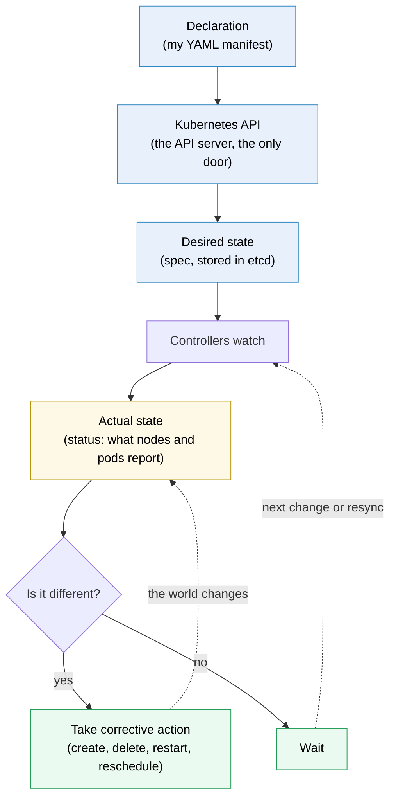
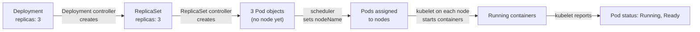
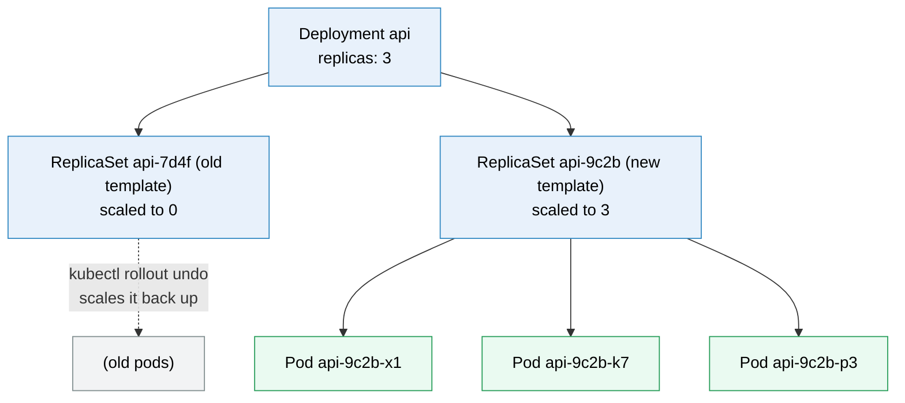
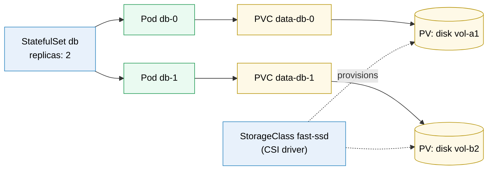

# Kubernetes basics

> [!abstract] In one sentence
> Kubernetes is a container orchestrator built around **one extensible API (application programming interface)**: everything (pods, deployments, services, volumes, permissions) is an **object** I declare in YAML (YAML Ain't Markup Language), stored by the cluster, and kept true by **controllers** running reconciliation loops. What it adds over Compose and Swarm is mostly **that API model**: more building blocks (workloads for stateless, stateful, per-node and batch jobs; storage that follows the pod; autoscaling; access control; network policies) and the ability to **add new kinds of objects**, which is why a whole ecosystem is built on top of it.

## The mental model: a giant state machine

Before any object, the one picture that explains all of them: **Kubernetes is a giant state machine.** I never tell it *what to do*, I tell it *what I want*, and it keeps moving the cluster from whatever state it's in toward that.



Step by step, with the shop's API (3 replicas):

1. **Declaration**: I write a Deployment saying `replicas: 3` and run `kubectl apply`
2. **Kubernetes API**: the API server checks it (authentication, permissions, schema) and stores it. `kubectl apply` returns **here**: nothing is running yet, I've only changed what's *wanted*
3. **Desired state**: the object's `spec` in etcd. That's the "should be"
4. **Controllers watch**: each controller subscribes to the kinds it's responsible for and is told when one changes
5. **Actual state**: what's really there: how many pods exist, which are running and ready, which nodes answer. Reported back in `status`
6. **Is it different?** 3 wanted, 0 existing → yes
7. **Corrective action**: create the missing pods. Then the loop runs again: 3 wanted, 3 running → no → **wait** until something changes (a pod dies, a node disappears, I edit the manifest)

The same loop handles every situation without a special rule for each. A crashed container, a dead node, a pod deleted by hand, a new image version: all of them show up as "actual ≠ desired", and the controller does whatever closes the gap. It works like a thermostat: it doesn't care *why* the room is cold, only that it's colder than the setting.

### Many small machines, chained

There isn't one big loop but **dozens of small ones**, each owning one kind of object. One controller's corrective action is often just **writing a new desired state** for the next one:



| Loop | Desired state it reads | Actual state it observes | Corrective action |
|---|---|---|---|
| Deployment controller | Deployment `spec.template`, `replicas` | Its ReplicaSets | Create a ReplicaSet for a new template, scale old/new ones (rolling update) |
| ReplicaSet controller | ReplicaSet `replicas` | Pods it owns | Create or delete pods |
| Scheduler | Pods with no node | Free capacity on nodes | Assign a node (`spec.nodeName`) |
| kubelet (on each node) | Pods assigned to its node | Containers actually running there | Start, restart or kill containers, run probes |
| EndpointSlice controller | Service `selector` | Ready pods with matching labels | Update the list of addresses the Service sends to |
| HPA (HorizontalPodAutoscaler) | Target CPU/metric | Current usage | Change the Deployment's `replicas` (a new desired state for the loops above) |

### What follows from it

- **`kubectl apply` succeeding means "accepted", not "done".** To know if it worked I watch the actual state converge: `kubectl rollout status`, `kubectl get pods -w`, `kubectl wait`
- **Changes made around the declaration get undone.** Delete a pod by hand → the ReplicaSet controller sees 2 instead of 3 and makes a new one. Scale with `kubectl scale` → the next `apply` from Git sets it back. Fixes go **into the declaration**
- **Debugging = finding the loop that isn't converging.** Compare `spec` with `status`, read the conditions and events (`kubectl describe`), then ask: which controller should close this gap, and why can't it? (Pending pod → the scheduler finds no node; `CrashLoopBackOff` → the kubelet restarts but the app keeps dying; Service with no endpoints → no pod matches the labels)
- **Missed events don't matter.** Controllers re-compare the whole state (level-triggered), and resync periodically, so a lost notification only delays the fix. See [[Container orchestration]] for the general pattern
- **Two loops owning the same field fight.** An HPA and a GitOps tool both setting `replicas` flip it back and forth forever: one owner per field
- **Extending Kubernetes = adding a loop.** A CRD (Custom Resource Definition) adds a new kind of desired state, an operator adds the controller that reconciles it (Stage 8 below)

How each component does its part is in [[Kubernetes architecture]]; how the declaration itself is written is in [[Kubernetes manifest syntax]].

## Build-up: why the shop outgrows Swarm

The shop runs on [[Docker Swarm]] (see its last stage for the list of limits): the database is pinned to one node, scaling is by hand, anyone with access to a manager controls everything, and every new need (certificates, monitoring, a PostgreSQL cluster) is a custom script. Kubernetes solves these by having **more kinds of objects** and **a way to add more**. This note walks through the objects in the order the shop needs them. How the cluster itself works is in [[Kubernetes architecture]].

### Stage 1: the pod, the smallest unit

Kubernetes doesn't schedule containers, it schedules **pods**. A pod is **one or more containers that always run together on the same node** and share:
- **One network namespace**: one IP (Internet Protocol) address for the pod, and its containers reach each other on `localhost`
- **Volumes** declared in the pod, which each container can mount
- **A lifecycle**: scheduled together, started together, gone together

```yaml
apiVersion: v1
kind: Pod
metadata:
  name: api
  labels: { app: api }
spec:
  containers:
    - name: api
      image: registry.example.com/shop-api@sha256:4b1e…
      ports: [{ containerPort: 8000 }]
```

```bash
kubectl apply -f pod.yaml     # send the desired state to the cluster
kubectl get pods -o wide      # status, pod IP, node
kubectl logs api
kubectl exec -it api -- sh
```

Most pods have **one** container. Several containers go in one pod only when they're inseparable: a **sidecar** (a proxy, a log shipper) that serves the main container, or an **init container** that runs to completion before the main one starts (run database migrations, wait for a dependency).

> [!warning] A pod is disposable
> A pod is never moved or repaired. If its node dies, the pod is gone; something else must create a **new** pod (new name, new IP). Nobody creates bare pods in production, for exactly this reason: a bare pod that dies stays dead.

### Stage 2: Deployment, for stateless replicas

The thing that recreates pods is a controller. For a stateless service like the API, that's a **Deployment**:

```yaml
apiVersion: apps/v1
kind: Deployment
metadata:
  name: api
  namespace: shop
spec:
  replicas: 3
  selector:
    matchLabels: { app: api }        # "the pods I manage are the ones with app=api"
  strategy:
    rollingUpdate: { maxSurge: 1, maxUnavailable: 0 }
  template:                           # the pod to create, as in stage 1
    metadata:
      labels: { app: api }
    spec:
      containers:
        - name: api
          image: registry.example.com/shop-api@sha256:4b1e…
          ports: [{ containerPort: 8000 }]
          resources:
            requests: { cpu: 250m, memory: 256Mi }   # what the scheduler reserves
            limits:   { memory: 512Mi }              # the cgroup ceiling
          readinessProbe:                             # may it receive traffic?
            httpGet: { path: /health, port: 8000 }
            periodSeconds: 5
          livenessProbe:                              # should it be restarted?
            httpGet: { path: /health, port: 8000 }
            periodSeconds: 10
            failureThreshold: 3
```

Three ideas carry the whole of Kubernetes:
- **Labels and selectors**: objects find each other by labels, not by names. The Deployment owns "pods with `app=api`", a Service sends traffic to "pods with `app=api`"
- **Layers of controllers**: the Deployment doesn't create pods directly. It creates a **ReplicaSet** (one per version of the pod template), and the ReplicaSet keeps N pods alive. A rolling update = a new ReplicaSet scaled up while the old one is scaled down, one pod at a time here (`maxSurge: 1, maxUnavailable: 0`). Rollback = scaling the old ReplicaSet back up: `kubectl rollout undo deployment/api`
- **Three kinds of probes**, more precise than Swarm's single health check: **readiness** (remove from load balancing while failing, don't kill), **liveness** (restart the container when failing), and **startup** (hold off the other two while a slow app boots)



> [!info] Requests and limits are separate
> **Requests** are what the scheduler **reserves** on a node: it places the pod only where the sum of requests still fits. **Limits** are enforced by the kernel's cgroups at runtime: over the memory limit, the container is OOM-killed (out of memory, exit 137); over a CPU (central processing unit) limit, it's throttled. Swarm has both too, but in Kubernetes requests are the basis of scheduling, quotas and autoscaling, so leaving them out breaks all three.

### Stage 3: Service, a stable address in front of moving pods

Pods come and go with new IPs. A **Service** gives a stable name and virtual IP to "all ready pods with `app=api`":

```yaml
apiVersion: v1
kind: Service
metadata: { name: api, namespace: shop }
spec:
  selector: { app: api }
  ports: [{ port: 80, targetPort: 8000 }]
```

Any pod in the cluster can now call `http://api.shop.svc.cluster.local` (or just `http://api` from the same namespace). Only pods passing their readiness probe receive traffic. The mechanics (EndpointSlices, kube-proxy, cluster DNS (Domain Name System)) are in [[Service discovery#How Kubernetes does it (the one I'll meet most)]] and [[Kubernetes architecture]].

Service types build on each other:

| Type | Reachable from | How |
|---|---|---|
| **ClusterIP** (default) | Inside the cluster only | A virtual IP and a DNS name |
| **NodePort** | Outside, on `<any node IP>:30000-32767` | ClusterIP + a port opened on every node (like Swarm's routing mesh) |
| **LoadBalancer** | Outside, through a cloud load balancer | NodePort + a load balancer provisioned by the cloud integration |
| **Headless** (`clusterIP: None`) | Inside | No virtual IP: DNS returns the pod IPs directly (for databases) |

For HTTP (Hypertext Transfer Protocol), one entry point for many services is better than one load balancer per service: an **Ingress** (or the newer **Gateway API**) object describes host and path routing (`shop.example.com/api` → Service `api`), and an **ingress controller** (a [[Reverse proxy]] such as ingress-nginx, Traefik or Envoy Gateway running in the cluster) implements it, often with certificates issued automatically.

### Stage 4: configuration and secrets

```yaml
apiVersion: v1
kind: ConfigMap
metadata: { name: api-config, namespace: shop }
data:
  LOG_LEVEL: info
---
apiVersion: v1
kind: Secret
metadata: { name: db, namespace: shop }
stringData:
  password: s3cr3t
```

The pod template references them as environment variables (`envFrom`) or as mounted files. The image stays the same across environments, only the ConfigMaps and Secrets change.

> [!warning] A Secret is not encrypted by default
> A Secret is base64-**encoded** (which anyone can decode) and stored in the cluster's database in plain text unless **encryption at rest** is configured. What protects it is **access control**: who may read Secrets in that namespace. Teams often keep the real values in an external manager (Vault, a cloud secrets manager) and sync them in.

### Stage 5: the database, with storage that follows the pod

In Swarm the database was pinned to a node because the data lived on that node's disk. Kubernetes separates **asking for storage** from **providing it**:

- A **PersistentVolumeClaim** (PVC) says "I need 20 GiB, read-write by one node, of class `fast-ssd`"
- A **StorageClass** says how to create such storage. Its **provisioner** is a CSI (Container Storage Interface) driver that talks to the actual storage: a cloud disk, Ceph, a SAN (storage area network), NFS (Network File System)
- A **PersistentVolume** (PV) is the actual disk, created automatically to satisfy the claim

If the database pod's node dies, the new pod lands on another node, and the CSI driver **detaches the disk and attaches it there**. (Within the limits of the storage: a cloud block disk usually only attaches to nodes in the same availability zone.)

For the database itself, a Deployment is the wrong tool: its pods are interchangeable, with random names. A **StatefulSet** gives each replica:
- A **stable name and DNS** name: `db-0`, `db-1`, `db-2`, reachable as `db-0.db.shop.svc.cluster.local` through a headless Service
- **Its own PVC** (from `volumeClaimTemplates`), which follows that exact replica: `db-1` always gets back `data-db-1`
- **Ordered** start, update and shutdown (`db-0` first)



> [!info] StatefulSet ≠ replicated database
> A StatefulSet gives stable identities and disks. It does **not** set up PostgreSQL replication or failover: three pods are three independent databases unless something configures them. That "something" is usually an **operator** (stage 8).

### Stage 6: the other workload shapes

| Object | Runs | Shop example | Swarm equivalent |
|---|---|---|---|
| **Deployment** | N interchangeable replicas | API, worker | Replicated service |
| **StatefulSet** | N replicas with stable names and own disks | PostgreSQL, Kafka, Redis cluster | None really |
| **DaemonSet** | One pod per node (or per matching node) | Log shipper, monitoring agent, the network plugin itself | Global service |
| **Job** | Pods that run **to completion**, retried on failure | A one-off data migration | None |
| **CronJob** | A Job on a schedule | Nightly report, cleanup | None (external cron) |

### Stage 7: scaling, limits and isolation between teams

- **HorizontalPodAutoscaler** (HPA): adjusts a Deployment's replicas from metrics: "keep average CPU at 60% of requests, between 3 and 20 replicas" (or from requests per second, queue length). This is the autoscaling Swarm doesn't have. Adding **nodes** when pods don't fit is a separate component (Cluster Autoscaler, Karpenter)
- **Namespaces**: `shop`, `payments`, `monitoring`. Names are unique per namespace, and permissions and quotas apply per namespace. They're an **organizational** boundary, not a security wall by themselves
- **RBAC (role-based access control)**: a Role lists allowed verbs on resources ("get, list, watch pods in `shop`"), a RoleBinding grants it to a user, group or **ServiceAccount** (the identity pods run as). The shop's CI (continuous integration) pipeline can deploy to `shop` and nothing else
- **ResourceQuota** and **LimitRange**: cap what a namespace can request in total, and set defaults for pods that forget
- **NetworkPolicy**: firewall rules between pods by label: "only pods with `app=api` may connect to `app=db` on 5432". By default **everything can reach everything**; policies only take effect if the network plugin enforces them

### Stage 8: extending the API (what nothing else has)

The shop wants three things Kubernetes doesn't know about: TLS (Transport Layer Security) certificates renewed automatically, a PostgreSQL cluster with replication and failover, and alerting rules.

In Kubernetes, these become **new kinds of objects**:
1. A **CustomResourceDefinition** (CRD) registers a new type with the API server, for example `Certificate` or `PostgresCluster`. From then on, `kubectl get certificates` works, with the same storage, access control and versioning as built-in objects
2. A **controller** for that type (running as a normal Deployment in the cluster) watches those objects and reconciles them, exactly like the built-in controllers do for Deployments

```yaml
apiVersion: postgresql.cnpg.io/v1
kind: Cluster
metadata: { name: shop-db, namespace: shop }
spec:
  instances: 3
  storage: { size: 20Gi, storageClass: fast-ssd }
```

That object, handled by the CloudNativePG **operator**, becomes a StatefulSet-like set of pods, replication, automatic failover, backups. An **operator** = CRDs + a controller that encodes how a human operator would run that software. cert-manager (`Certificate`), the Prometheus operator (`ServiceMonitor`, `PrometheusRule`) and Argo CD (`Application`) all work this way.

This is the real difference with Swarm: Kubernetes is less "a container runner" than **a platform for building reconciliation loops**, and container scheduling is the first thing built on it.

### Stage 9: how the shop actually deploys

Writing YAML by hand stops scaling quickly. The usual tools:
- **Helm**: packages a set of manifests as a **chart** with templates and a values file. `helm install`, `helm upgrade`, `helm rollback`. Most third-party software is installed this way
- **Kustomize** (built into `kubectl apply -k`): a base set of manifests plus per-environment patches, no templating
- **GitOps** (Argo CD, Flux): the manifests live in Git, and a controller **in the cluster** keeps the cluster equal to the repository. A deploy is a commit; drift is corrected automatically. The reconciliation idea, applied to deployment itself (see [[GitOps basics]])

## What Kubernetes costs

Kubernetes solves a lot, and it's a lot to run:
- **Learning curve**: dozens of object types, networking with several layers of NAT (network address translation) and virtual IPs, and failures that need knowledge of all of them to debug
- **Operating the cluster**: the control plane (etcd backups, certificates, upgrades every few months, since each minor version is supported for only about a year) and the add-ons (network plugin, DNS, ingress controller, CSI drivers, autoscaler, monitoring). Managed services (EKS, Elastic Kubernetes Service, on AWS (Amazon Web Services); GKE, Google Kubernetes Engine; AKS, Azure Kubernetes Service) run the control plane, not the add-ons or the workloads
- **Overhead**: system pods use memory and CPU on every node, which matters on small clusters

For a few services on a few machines, [[Docker Compose]] or [[Docker Swarm]] (or a managed service like [[ECS]], AWS's Elastic Container Service) is often the better engineering choice. See [[Compose vs Swarm vs Kubernetes]].

## Advanced problems

### 1. Pods stuck in `Pending`

`kubectl describe pod` shows `0/3 nodes are available: 3 Insufficient memory`. The scheduler found no node where the pod's **requests** fit, or no node satisfies its node selector, affinity or **taints** (marks on a node that repel pods without a matching toleration), or its PVC is not bound. The events at the bottom of `describe` always say which.

### 2. `CrashLoopBackOff`

The container starts and exits, and the kubelet waits longer and longer (up to 5 minutes) between restarts. `kubectl logs api-… --previous` shows the logs of the **crashed** run. Typical causes: a missing environment variable or Secret, a dependency not reachable, wrong command. If the exit reason is `OOMKilled`, the memory limit is too low.

### 3. The liveness probe kills a healthy app

A liveness probe that calls the database, or with a short timeout, fails under load or while the database is slow: Kubernetes restarts every replica at once and turns a slow database into an outage. Liveness should check only "is this process stuck"; dependencies belong in readiness (or nowhere); slow starts belong in a **startup** probe.

### 4. Requests in flight dropped on every deploy

A pod being stopped is removed from the Service's endpoints and sent SIGTERM (the termination signal) **at the same time**; for a few seconds, other nodes still route to it. The fix: handle SIGTERM by finishing in-flight requests (see [[Inter-process communication]]), add a short `preStop` sleep so the endpoint removal propagates first, and keep `terminationGracePeriodSeconds` (30 s by default) longer than that.

### 5. `ImagePullBackOff`

The node can't pull the image: wrong name or tag, a private registry without `imagePullSecrets` (or node credentials), or registry rate limits. With mutable tags and `imagePullPolicy: IfNotPresent`, different nodes can also run **different** images under the same tag: pin by digest (see [[Docker image tags]]).

## In the cloud

Every major cloud sells managed Kubernetes: EKS on AWS, GKE on Google Cloud, AKS on Azure. The provider runs the control plane; integrations turn `LoadBalancer` Services into cloud load balancers, PVCs into cloud disks, and ServiceAccounts into cloud identities. EKS specifics will go in the AWS area.

## Practice

> [!example]- Why can't I just run my API as a Pod?
> A bare pod that dies (or whose node dies) is never recreated. A Deployment's ReplicaSet notices the missing replica and creates a new pod.

> [!example]- A pod fails its readiness probe. What happens? And if it fails its liveness probe?
> Readiness: it stays running but is removed from the Service's endpoints (no traffic) until it passes again. Liveness: the kubelet restarts the container.

> [!example]- Deployment or StatefulSet for Redis used as a cache that can be lost? And for PostgreSQL?
> The cache: a Deployment is fine (nothing to keep, any replica can replace any other). PostgreSQL: a StatefulSet (stable names, one disk per replica), and in practice an operator to handle replication and failover.

> [!example]- The payments team must not be able to read the shop's Secrets. What do I use?
> Separate namespaces, and RBAC Roles/RoleBindings that grant each team rights only in its own namespace. NetworkPolicies to also block network access between them.

## Easy to get wrong
- Thinking Kubernetes schedules containers: it schedules pods
- Creating bare pods in production
- Thinking a Secret is encrypted: it's base64 unless encryption at rest is enabled
- Thinking a StatefulSet replicates a database
- Leaving out resource requests: bad scheduling, no autoscaling, noisy neighbours
- Dependency checks in liveness probes
- Expecting NetworkPolicies to work with any network plugin, or expecting isolation without any policy
- Treating namespaces as a security boundary on their own
- Thinking a managed service runs everything: it runs the control plane, not the add-ons and workloads

## Related
- Concepts:: [[Container orchestration]], [[GitOps basics]] (how the shop deploys, Stage 9), [[Deployment strategies]] (rolling, blue/green via Service selectors, canary with Argo Rollouts/Flagger)
- Under the hood:: [[Kubernetes architecture]]
- All of it on one app:: [[Kubernetes worked example]]
- How to read and write the YAML:: [[Kubernetes manifest syntax]]
- Objects, one note each:: [[Kubernetes Pod]], [[Kubernetes ReplicaSet]], [[Kubernetes Deployment]], [[Kubernetes StatefulSet]], [[Kubernetes DaemonSet]], [[Kubernetes Job]], [[Kubernetes CronJob]], [[Kubernetes Service]], [[Kubernetes Ingress]], [[Kubernetes NetworkPolicy]], [[Kubernetes ConfigMap]], [[Kubernetes Secret]], [[Kubernetes PersistentVolumeClaim]], [[Kubernetes StorageClass]], [[Kubernetes ServiceAccount]], [[Kubernetes RBAC]], [[Kubernetes Namespace]], [[Kubernetes Node]], [[Kubernetes ResourceQuota and LimitRange]], [[Kubernetes HorizontalPodAutoscaler]], [[Kubernetes PodDisruptionBudget]], [[Kubernetes CustomResourceDefinition]]
- Compared:: [[Compose vs Swarm vs Kubernetes]], [[Docker Swarm]], [[Docker Compose]]
- Networking:: [[Service discovery]], [[Reverse proxy]], [[Load balancing]], [[Network interfaces]], [[DNS]] (the `ndots:5` trap)
- Identity:: [[Workload identity (SPIFFE)]], [[OpenID Connect]] (service account tokens), [[Service mesh]]
- Images:: [[Docker]], [[Docker image tags]]
- Area:: [[Containers]]

## Flashcards
#flashcards

What is a pod? :: One or more containers scheduled together on one node, sharing one IP/network namespace and volumes
Why not run bare pods in production? :: A pod that dies or loses its node is never recreated. A controller (Deployment, StatefulSet…) recreates pods
Deployment vs ReplicaSet? :: The ReplicaSet keeps N pods of one template alive. The Deployment manages ReplicaSets to roll out and roll back template changes
How do Kubernetes objects find each other? :: Labels and selectors
Readiness vs liveness vs startup probe? :: Readiness: remove from traffic. Liveness: restart the container. Startup: delay the other probes while the app boots
Resource requests vs limits? :: Requests are reserved by the scheduler for placement. Limits are enforced by cgroups at runtime (OOM kill, CPU throttling)
What does a Service do? :: Gives a stable virtual IP and DNS name to the ready pods matching its selector
ClusterIP vs NodePort vs LoadBalancer? :: Internal virtual IP; plus a port on every node; plus a cloud load balancer in front
What is a headless Service? :: A Service without a virtual IP: DNS returns the pod IPs directly
Ingress vs ingress controller? :: The Ingress object declares HTTP routing rules. The controller is the reverse proxy that implements them
Is a Kubernetes Secret encrypted? :: Only base64-encoded, unless encryption at rest is configured. Access control protects it
PVC vs PV vs StorageClass? :: Claim (what I need), the actual volume, and the recipe (CSI driver) that provisions volumes for claims
What does a StatefulSet add over a Deployment? :: Stable pod names/DNS, one PVC per replica that follows it, ordered start and stop
What is a DaemonSet? :: One pod on every (matching) node
Job vs CronJob? :: A Job runs pods to completion. A CronJob creates Jobs on a schedule
What does a HorizontalPodAutoscaler do? :: Adjusts a workload's replica count from metrics (CPU, requests per second…)
What is RBAC in Kubernetes? :: Roles listing allowed verbs on resources, bound to users, groups or ServiceAccounts
What is the default network policy between pods? :: Everything can reach everything until a NetworkPolicy selects the pod
What is a CRD? :: A CustomResourceDefinition: registers a new object type with the Kubernetes API
What is an operator? :: CRDs plus a controller that encodes how to run a specific piece of software (failover, backups, upgrades)
What does GitOps do? :: A controller in the cluster keeps it equal to manifests in Git
Pending pod: where do you look? :: kubectl describe pod, events: insufficient requests, taints, affinity, unbound PVC
How do you see the logs of a crashed container? :: kubectl logs <pod> --previous
Why are requests dropped during pod shutdown? :: Endpoint removal and SIGTERM happen at the same time. Handle SIGTERM gracefully and add a preStop delay
What's the mental model for Kubernetes as a whole? :: A giant state machine: declaration → API → desired state → controllers watch → actual state → different? yes: take corrective action, no: wait
What does a successful kubectl apply mean? :: The desired state was accepted and stored, not that anything is running yet. Watch the actual state converge (rollout status, get -w, wait)
Why does a pod I delete by hand come back? :: The ReplicaSet controller sees fewer pods than desired and creates a new one. Changes must go into the declaration
How are Kubernetes controllers chained? :: One loop's corrective action writes the next loop's desired state: Deployment → ReplicaSet → Pods → scheduler (node) → kubelet (containers)
How do I debug something that isn't working in Kubernetes? :: Compare spec with status, read conditions and events, and find which controller should close the gap and why it can't
