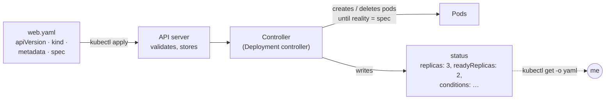
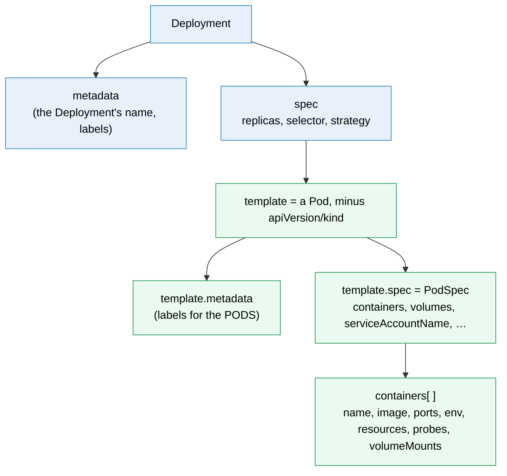

# Kubernetes manifest syntax

> [!abstract] In one sentence
> Every Kubernetes manifest answers the same four questions with the same four top-level fields: **what kind of thing is this** (`kind`), **which API (Application Programming Interface) defines it** (`apiVersion`), **what is it called** (`metadata`), and **what do I want it to look like** (`spec`); the cluster then adds a fifth, **what does it look like right now** (`status`).

The objects themselves are explained in [[Kubernetes]] and their own notes, and [[Kubernetes worked example]] shows a full application. This note is the grammar: how to read and write any manifest, field by field.

## Build-up: reading a manifest like a sentence

### The four questions

A manifest is a description of one object, written in YAML (YAML Ain't Markup Language). Whatever the object, it starts the same way:

```text
WHAT KIND OF THING IS THIS?
        ↓
kind

WHAT API DEFINES IT?
        ↓
apiVersion

WHAT IS THIS THING CALLED?
        ↓
metadata

WHAT DO I WANT IT TO LOOK LIKE?
        ↓
spec
```

Applied to the smallest useful example, a web server for a shop:

```yaml
apiVersion: apps/v1          # which API (group "apps", version "v1") defines this kind
kind: Deployment             # what kind of thing: a Deployment
metadata:                    # what it's called, and tags about it
  name: web
  namespace: shop
  labels:
    app: web
spec:                        # what I want: 3 copies of this pod
  replicas: 3
  selector:
    matchLabels:
      app: web
  template:
    metadata:
      labels:
        app: web
    spec:
      containers:
        - name: web
          image: registry.example.com/shop-web:1.4.0
          ports:
            - containerPort: 8080
```

| Field | Question it answers | Who writes it |
|---|---|---|
| `apiVersion` | Which API defines this kind? | Me |
| `kind` | What kind of thing is it? | Me |
| `metadata` | What is it called, where does it live, how is it tagged? | Me (name, namespace, labels, annotations) and the server (ID, timestamps, versions) |
| `spec` | What do I want it to look like? (desired state) | Me |
| `status` | What does it look like right now? (observed state) | **Kubernetes only**. I never write it |

### The fifth field: status

When I send this file with `kubectl apply -f web.yaml`, the API server stores it, a controller works to make reality match `spec`, and it reports back in `status`:



That's the whole of Kubernetes in one picture: `spec` is the desired state, `status` the actual state, and controllers keep closing the gap between them (see [[Kubernetes basics#The mental model: a giant state machine]]).

`kubectl get deployment web -n shop -o yaml` shows my four fields **plus** what the server added:

```yaml
metadata:
  name: web
  namespace: shop
  uid: 0b7c1e9a-…               # added by the server
  resourceVersion: "184223"      # added: changes on every write
  generation: 4                  # added: bumps when spec changes
  creationTimestamp: "2026-10-06T09:12:44Z"
spec:
  replicas: 3
  # … plus every default I didn't set: strategy, revisionHistoryLimit, …
status:
  observedGeneration: 4          # the controller has seen spec version 4
  replicas: 3
  readyReplicas: 2
  conditions:
    - type: Available
      status: "True"
      reason: MinimumReplicasAvailable
```

> [!warning] Don't copy `kubectl get -o yaml` back into Git
> The output contains server fields (`uid`, `resourceVersion`, `status`, every default). Applying it again either fails (`resourceVersion` conflict) or freezes defaults I never chose. Keep my own short file as the source; use `-o yaml` for reading.

The rest of this note goes field by field. First, the YAML underneath, because most manifest errors are YAML errors.

## The YAML underneath

Kubernetes reads YAML but stores JSON (JavaScript Object Notation): every manifest is converted to JSON before the API server sees it. So only the **data** matters, the formatting doesn't. Five building blocks cover every manifest:

```yaml
# 1. Map (key: value). Keys are unique, order doesn't matter
name: web
replicas: 3

# 2. Nested map: indentation (spaces, never tabs) means "belongs to"
metadata:
  name: web
  labels:
    app: web

# 3. List: one "- " per item
args:
  - --port=8080
  - --verbose

# 4. List of maps: the "- " starts a new map, the keys under it line up
containers:
  - name: web              # item 1 starts here
    image: shop-web:1.4.0  # same item (aligned with "name")
  - name: proxy            # item 2
    image: envoy:1.31

# 5. Inline (flow) form: same data, JSON-like
labels: { app: web, tier: frontend }
args: ["--port=8080", "--verbose"]
```

Multi-line strings (scripts, config files inside a ConfigMap):

```yaml
data:
  nginx.conf: |        # "|" keeps the line breaks exactly
    server {
      listen 8080;
    }
  motd: >              # ">" folds lines into one line with spaces
    Welcome to the
    shop cluster
```

Several objects in one file are separated by `---` on its own line:

```yaml
apiVersion: v1
kind: Service
metadata: { name: web }
# …
---
apiVersion: apps/v1
kind: Deployment
metadata: { name: web }
# …
```

### Types: when to quote

YAML guesses types from the text. Kubernetes fields have **fixed** types, and a wrong guess is an error:

| I write | YAML reads | Problem | Write instead |
|---|---|---|---|
| `value: 8080` (env var) | number | Env values must be strings: `cannot unmarshal number into … of type string` | `value: "8080"` |
| `value: true` / `yes` / `on` | boolean | Same error. Unquoted `yes`, `no`, `on`, `off` can also be read as booleans | `value: "true"` |
| `version: 1.10` (a label) | number `1.1` | Label values must be strings, and the trailing 0 is lost | `version: "1.10"` |
| `defaultMode: 0644` | octal → 420 | Fine in YAML (it means octal), but in JSON I must write `420` | Keep `0644` in YAML |
| `memory: 128m` | string "128m" | `m` means **milli**: 0.128 bytes, not megabytes | `memory: 128Mi` |
| `status: "True"` in conditions | string | Condition statuses are the strings `"True"`, `"False"`, `"Unknown"`, not booleans | (written by the server) |

Rule of thumb: **quote anything that's a string but looks like a number or a boolean.**

## apiVersion: which API defines this kind

The API is split into **groups**, each with **versions**. `apiVersion` is `<group>/<version>`, except for the original **core** group, which has no name and is written as just `v1`.

| apiVersion | Group | Kinds |
|---|---|---|
| `v1` | core | Pod, Service, ConfigMap, Secret, Namespace, ServiceAccount, PersistentVolumeClaim, PersistentVolume, Node, ResourceQuota, LimitRange |
| `apps/v1` | apps | Deployment, ReplicaSet, StatefulSet, DaemonSet |
| `batch/v1` | batch | Job, CronJob |
| `networking.k8s.io/v1` | networking | Ingress, IngressClass, NetworkPolicy |
| `rbac.authorization.k8s.io/v1` | RBAC (Role-Based Access Control) | Role, ClusterRole, RoleBinding, ClusterRoleBinding |
| `autoscaling/v2` | autoscaling | HorizontalPodAutoscaler |
| `policy/v1` | policy | PodDisruptionBudget |
| `storage.k8s.io/v1` | storage | StorageClass |
| `apiextensions.k8s.io/v1` | API extensions | CustomResourceDefinition |
| `gateway.networking.k8s.io/v1` | Gateway API (installed as CRDs, Custom Resource Definitions) | Gateway, HTTPRoute, GatewayClass |
| `cert-manager.io/v1`, … | Any installed CRD | Certificate, … (whatever the add-on defines) |

**Versions say how stable the API is:**
- `v1alpha1`: experimental, off by default, can change or vanish
- `v1beta1`: mostly stable, may still change
- `v1`, `v2`: stable (GA, General Availability). Fields don't break

Old versions get **removed** in later Kubernetes releases. That's the classic upgrade break: `Ingress` used to be `extensions/v1beta1`, and after the upgrade to 1.22 every manifest still using it fails with `no matches for kind "Ingress" in version "extensions/v1beta1"`.

To see what *this* cluster supports:

```bash
kubectl api-resources                 # every kind: short name, apiVersion, namespaced?, kind
kubectl api-resources --namespaced=false   # cluster-wide kinds only
kubectl api-versions                  # every group/version the server serves
```

## kind: what kind of thing

`kind` is the type, written in **singular CamelCase** exactly as the API defines it: `Deployment`, `ConfigMap`, `PersistentVolumeClaim`, `HorizontalPodAutoscaler`. Not `deployment`, not `Deployments`. (The command line is lenient: `kubectl get deploy`, `kubectl get deployments` and `kubectl get pvc` all work through plural and short names, but the manifest isn't.)

A kind is either:
- **Namespaced**: lives inside a namespace (Pod, Deployment, Service, ConfigMap, Secret, Role, PVC (PersistentVolumeClaim), …)
- **Cluster-scoped**: one for the whole cluster, no `namespace` field (Node, Namespace, PersistentVolume, StorageClass, ClusterRole, ClusterRoleBinding, IngressClass, CRD)

## metadata: what is it called

The same structure for every kind.

```yaml
metadata:
  name: web                       # required (unless generateName)
  namespace: shop                 # namespaced kinds only. Default: "default" (or the kubectl context's)
  labels:                         # for SELECTING: Services, Deployments, policies find objects by these
    app.kubernetes.io/name: web
    app.kubernetes.io/part-of: shop
    tier: frontend
  annotations:                    # for TOOLS and humans: never used for selection
    nginx.ingress.kubernetes.io/rewrite-target: /
    team: payments
```

### name and namespace

- The name is **unique per kind per namespace**: a Service `web` and a Deployment `web` in `shop` don't clash, two Deployments `web` in `shop` do
- Names are lowercase DNS (Domain Name System) style: letters, digits, `-` (and `.` for most kinds), up to 253 characters. Some kinds (Service, Namespace, container names) are stricter: **DNS label**, up to 63 characters, no dots, because they become DNS names (`web.shop.svc.cluster.local`)
- `generateName: migrate-` instead of `name` lets the server add a random suffix (`migrate-x7k2p`): useful for Jobs created with `kubectl create`, not with `apply`
- `namespace` in the file wins over the current context. Leave it out if the same file is applied to several namespaces with `kubectl apply -n …`

### labels vs annotations

| | Labels | Annotations |
|---|---|---|
| Purpose | Identify and **select** objects | Attach information for tools and people |
| Used by | Selectors (Service → pods, Deployment → pods, NetworkPolicy, PDB (PodDisruptionBudget), `kubectl get -l`) | Ingress controllers, cert-manager, Prometheus scraping, `kubectl rollout` change causes, notes |
| Key | Optional prefix + name: `app.kubernetes.io/name`, `tier` (name ≤ 63 characters) | Same key format |
| Value | ≤ 63 characters, letters/digits/`-_.`, can be empty | Any string, even JSON or a multi-line script |

The recommended label set (`app.kubernetes.io/…`) that Helm and most tools understand: `name` (web), `instance` (web-prod), `version` (1.4.0), `component` (frontend), `part-of` (shop), `managed-by` (helm).

### Fields the server owns

Never written by me, but worth reading when debugging:

| Field | Meaning |
|---|---|
| `uid` | Unique ID (identifier) for this incarnation. Delete and recreate with the same name → new uid |
| `resourceVersion` | Changes on every write. Used for optimistic locking: an update based on an old version is rejected (`the object has been modified`) |
| `generation` | Bumps when `spec` changes (not on status or metadata changes). Compare with `status.observedGeneration` to know if the controller has caught up |
| `creationTimestamp` / `deletionTimestamp` | When it was created / when deletion was requested (object still there because of finalizers) |
| `ownerReferences` | Who owns me: a pod points to its ReplicaSet, the ReplicaSet to its Deployment. Delete the owner → garbage collector deletes the owned |
| `finalizers` | "Don't delete me until this is cleaned up." See [[Kubernetes CustomResourceDefinition]] |
| `managedFields` | Which tool set which field (server-side apply). Hidden from `-o yaml` unless `--show-managed-fields` |

## spec: what I want it to look like

`spec` is different for every kind: that's where the real content is. But a handful of patterns repeat everywhere, and once I know them most specs read the same way.

### Pattern 1: objects nested inside objects

A Deployment doesn't contain containers directly. It contains a **pod template**, which is a Pod without `apiVersion` and `kind`:



So `metadata` and `spec` appear **twice**: once for the Deployment, once for the pods it creates. The same nesting goes one level deeper elsewhere:

| Kind | Path down to the containers |
|---|---|
| Pod | `spec.containers` |
| Deployment, ReplicaSet, StatefulSet, DaemonSet, Job | `spec.template.spec.containers` |
| CronJob | `spec.jobTemplate.spec.template.spec.containers` |

Learning the **PodSpec** once (next section) covers every workload kind.

### Pattern 2: wiring by labels (selectors)

Objects that manage or route to a *group* of pods find them by **labels**, never by name, because pods come and go with random names.

```yaml
# Deployment: "the pods I manage are the ones labelled app=web"
spec:
  selector:
    matchLabels:
      app: web
  template:
    metadata:
      labels:
        app: web           # MUST match the selector, or the API rejects the Deployment
---
# Service: "send traffic to pods labelled app=web"
spec:
  selector:
    app: web               # plain map here, no matchLabels
```

Two selector syntaxes exist:

```yaml
# Set-based (Deployments, StatefulSets, Jobs, NetworkPolicies, PDBs, affinity)
selector:
  matchLabels:
    app: web
  matchExpressions:
    - key: tier
      operator: In          # In, NotIn, Exists, DoesNotExist
      values: [frontend, edge]

# Equality-only (Service, ReplicationController): just a map
selector:
  app: web
```

All conditions are **ANDed**: a pod must match every label and every expression. A Deployment's selector **can't be changed** after creation (`field is immutable`): pick it carefully, usually just `app: <name>`.

### Pattern 3: wiring by name (references)

Objects that point at **one specific** other object use its name, in the same namespace:

```yaml
spec:
  serviceAccountName: web                 # → ServiceAccount "web"
  imagePullSecrets:
    - name: registry-creds                # → Secret "registry-creds"
  containers:
    - name: web
      envFrom:
        - configMapRef: { name: web-config }    # → ConfigMap "web-config"
      env:
        - name: DB_PASSWORD
          valueFrom:
            secretKeyRef: { name: db-secret, key: password }   # → key in Secret "db-secret"
  volumes:
    - name: data
      persistentVolumeClaim: { claimName: web-data }           # → PVC "web-data"
```

Other examples: an Ingress backend's `service.name`, a RoleBinding's `roleRef.name`, an HPA's `scaleTargetRef.name`. A **typo in a name** usually isn't rejected when applied: the pod just stays in `CreateContainerConfigError` or `Pending` until the referenced object exists.

> [!tip] The two kinds of wire
> **Labels** connect to a *group* that changes over time (pods). **Names** connect to *one* object (a Secret, a Service, a PVC). Most "it applied fine but nothing works" bugs are a label that doesn't match or a name that doesn't exist.

### Pattern 4: lists of named items

`containers`, `volumes`, `volumeMounts`, `env`, `ports` are lists where every item has a `name`. The name is how Kubernetes matches items when it merges a change (`kubectl apply` updates the container **called** `web`, it doesn't rely on its position), and how items refer to each other (a `volumeMount` names a `volume`, a Service's `targetPort` can name a container port).

## The PodSpec: the part I write most

```yaml
spec:                                   # PodSpec (inside template: for workloads)
  serviceAccountName: web               # identity for the API and cloud (see ServiceAccount)
  restartPolicy: Always                 # Always (default) | OnFailure | Never. Jobs need OnFailure or Never
  terminationGracePeriodSeconds: 30     # time between SIGTERM and SIGKILL
  nodeSelector: { disktype: ssd }       # only nodes with this label
  tolerations: []                       # allowed onto tainted nodes (see Node)
  affinity: {}                          # node/pod affinity and anti-affinity
  securityContext:                      # pod-level: applies to all containers
    runAsNonRoot: true
    fsGroup: 2000
  initContainers:                       # run to completion, in order, before containers start
    - name: wait-db
      image: busybox:1.36
      command: ["sh", "-c", "until nc -z postgres 5432; do sleep 2; done"]
  containers:
    - name: web                         # DNS label, unique in the pod
      image: registry.example.com/shop-web:1.4.0
      imagePullPolicy: IfNotPresent     # Always | IfNotPresent | Never
      command: ["gunicorn"]             # replaces the image's ENTRYPOINT
      args: ["app:app", "-b", "0.0.0.0:8080"]   # replaces the image's CMD
      workingDir: /app
      ports:
        - name: http                    # can be referenced by name (targetPort: http)
          containerPort: 8080
          protocol: TCP                 # TCP (Transmission Control Protocol) by default, or UDP (User Datagram Protocol)
      env:
        - name: LOG_LEVEL
          value: "info"                 # always a string
        - name: POD_IP
          valueFrom:
            fieldRef: { fieldPath: status.podIP }    # the Downward API: pod facts (here its IP (Internet Protocol) address) as env vars
        - name: DB_PASSWORD
          valueFrom:
            secretKeyRef: { name: db-secret, key: password }
      envFrom:
        - configMapRef: { name: web-config }   # every key becomes an env var
      resources:
        requests: { cpu: 250m, memory: 256Mi }  # what the scheduler reserves
        limits:   { memory: 512Mi }             # hard ceiling (memory over → OOMKilled, OOM = Out Of Memory)
      readinessProbe:                   # ready for traffic? (fails → removed from Service)
        httpGet: { path: /healthz, port: http }
        periodSeconds: 5
      livenessProbe:                    # alive? (fails → container restarted)
        httpGet: { path: /livez, port: http }
        initialDelaySeconds: 10
      startupProbe:                     # slow starter: other probes wait until this passes
        httpGet: { path: /livez, port: http }
        failureThreshold: 30
        periodSeconds: 2
      volumeMounts:
        - name: config                  # → volumes[].name below
          mountPath: /etc/web
          readOnly: true
      securityContext:                  # container-level: overrides the pod level
        allowPrivilegeEscalation: false
        readOnlyRootFilesystem: true
  volumes:
    - name: config
      configMap: { name: web-config }
    - name: cache
      emptyDir: {}                      # scratch space, deleted with the pod
```

`imagePullPolicy` defaults to `Always` when the tag is `:latest` or missing, `IfNotPresent` otherwise. Probes take `httpGet`, `tcpSocket`, `exec` or `grpc`. `command`/`args` vs the image (Dockerfile terms from [[Docker]]):

| Manifest | Dockerfile | Effect |
|---|---|---|
| neither | `ENTRYPOINT` + `CMD` | Image defaults |
| `args` only | `ENTRYPOINT` + **my args** | Same program, different arguments |
| `command` only | **my command**, image's `CMD` ignored | Different program |
| both | **my command** + **my args** | Fully replaced |

### Units

| Field | Units | Examples |
|---|---|---|
| CPU (Central Processing Unit) | cores, or `m` = millicores | `1` = one core, `500m` = `0.5` = half a core, `100m` = a tenth |
| Memory, storage | bytes with suffixes. `Ki Mi Gi Ti` = powers of 1024, `k M G T` = powers of 1000 | `256Mi` = 268,435,456 bytes, `256M` = 256,000,000 bytes, `1Gi` |
| Durations | Mostly integer **seconds** in fields named `…Seconds` | `periodSeconds: 10`, `terminationGracePeriodSeconds: 30` |
| Durations in CRDs / Gateway API | Strings | `"30s"`, `"5m"` |
| Schedules (CronJob) | cron syntax, quoted | `schedule: "0 3 * * *"` (03:00 every day) |

## Ports: the four numbers that get mixed up

| Field | Where | Means |
|---|---|---|
| `containerPort` | Pod container | The port the process listens on. Mostly documentation: the pod is reachable on any port it listens on |
| `port` | Service | The port clients use on the Service's address (`web:80`) |
| `targetPort` | Service | The pod port traffic is sent to: a number (`8080`) or a container port **name** (`http`). Defaults to `port` |
| `nodePort` | Service (NodePort/LoadBalancer) | The port opened on every node, 30000–32767 by default |

```yaml
apiVersion: v1
kind: Service
metadata: { name: web, namespace: shop }
spec:
  type: ClusterIP
  selector: { app: web }
  ports:
    - name: http
      port: 80            # clients call web:80
      targetPort: http    # → containerPort named "http" (8080)
```

## Kinds without spec

Not every kind has `spec`. Kinds that are pure data or pure rules put their fields at the top level:

| Kind | Top-level fields instead of spec |
|---|---|
| ConfigMap | `data` (strings), `binaryData` (base64), `immutable` |
| Secret | `type`, `data` (**base64**-encoded values), `stringData` (plain text, encoded for me on write), `immutable` |
| ServiceAccount | `automountServiceAccountToken`, `imagePullSecrets` |
| Role / ClusterRole | `rules` (apiGroups, resources, verbs) |
| RoleBinding / ClusterRoleBinding | `subjects` (who) and `roleRef` (which role) |
| StorageClass | `provisioner`, `parameters`, `reclaimPolicy`, `volumeBindingMode`, `allowVolumeExpansion` |
| IngressClass | has a `spec` (controller), included here because it's often guessed wrong |

```yaml
apiVersion: v1
kind: Secret
metadata: { name: db-secret, namespace: shop }
type: Opaque
stringData:                 # plain text in, stored base64-encoded
  password: "s3cr3t-change-me"
---
apiVersion: rbac.authorization.k8s.io/v1
kind: RoleBinding
metadata: { name: web-reads-config, namespace: shop }
subjects:
  - kind: ServiceAccount
    name: web
    namespace: shop
roleRef:                    # can't be changed after creation: delete and recreate
  apiGroup: rbac.authorization.k8s.io
  kind: Role
  name: config-reader
```

Note the `kind` and `apiGroup` **inside** `subjects` and `roleRef`: a reference to another type carries its type. Same idea in an HPA's (HorizontalPodAutoscaler) `scaleTargetRef` (`apiVersion`, `kind`, `name`).

## status in practice: conditions

Most kinds report health as a list of **conditions**:

```yaml
status:
  conditions:
    - type: Ready               # what is being judged
      status: "False"           # "True" | "False" | "Unknown" (strings)
      reason: ContainersNotReady    # short CamelCase code, good for grepping
      message: "containers with unready status: [web]"
      lastTransitionTime: "2026-10-06T09:14:02Z"
```

`kubectl describe` prints them in a table, and `kubectl wait --for=condition=Available deployment/web` waits on them in scripts.

## Finding any field: the cluster is the reference

I don't need to memorise every field. The API server publishes its schema, and kubectl can print it:

```bash
kubectl explain deployment.spec.strategy          # one field, with its type and docs
kubectl explain pod.spec.containers.resources
kubectl explain deployment --recursive | less     # the whole tree, field names only

# generate a correct skeleton instead of typing from memory
kubectl create deployment web --image=nginx:1.27 --replicas=3 --dry-run=client -o yaml
kubectl create service clusterip web --tcp=80:8080 --dry-run=client -o yaml
kubectl create configmap web-config --from-file=nginx.conf --dry-run=client -o yaml
kubectl create secret generic db-secret --from-literal=password=x --dry-run=client -o yaml

# check before changing anything
kubectl apply -f web.yaml --dry-run=server        # full server validation + admission, nothing saved
kubectl diff -f web.yaml                          # what would change on the live object
```

`explain` works for CRDs too (`kubectl explain certificate.spec`), because they publish a schema. Recent kubectl versions ask the server for **strict field validation**: an unknown or duplicated field fails the apply instead of being silently dropped.

## Advanced problems

### 1. A field at the wrong indentation
**Symptom:** `unknown field "spec.template.spec.resources"` or, with old tooling, the setting just has no effect (no limits on the pod).
**Cause:** `resources` belongs to a **container**, but it was indented one level too far left, at pod level. YAML is valid, the schema isn't.
**Fix:** `kubectl explain` the path, run `--dry-run=server`. Editors with the Kubernetes JSON schema (the YAML language server) underline it while typing.

### 2. `selector does not match template labels`
**Symptom:** the Deployment is rejected on create.
**Cause:** `spec.selector.matchLabels` and `spec.template.metadata.labels` differ (`app: web` vs `app: web-app`), so the Deployment would create pods it doesn't manage.
**Fix:** make them equal. And because the selector is immutable, changing it later means deleting and recreating the Deployment.

### 3. The Service has no endpoints
**Symptom:** applies fine, `kubectl get endpointslices -l kubernetes.io/service-name=web` is empty, requests time out or get refused.
**Cause:** the Service's `selector` matches no ready pod: a label typo, a wrong namespace, or a `targetPort` that nothing listens on.
**Fix:** `kubectl get pods -l app=web -n shop` with the Service's exact selector. Empty → labels; pods but not ready → probes; ready but refused → `targetPort`.

### 4. `no matches for kind … in version …`
**Symptom:** apply fails after a cluster upgrade, or on a fresh cluster.
**Cause:** the `apiVersion` was removed (old beta) or the kind comes from a CRD that isn't installed yet (Gateway API, cert-manager).
**Fix:** `kubectl api-resources | grep -i <kind>` shows the version the cluster serves. Install CRDs before the objects that use them.

### 5. Type errors from unquoted values
**Symptom:** `cannot unmarshal number into Go struct field EnvVar.value of type string` (or `bool`).
**Cause:** `value: 8080` or `value: true` in an env var, or a numeric-looking label value.
**Fix:** quote it. See [[#Types: when to quote]].

## Practice

> [!example]- A Deployment applies without error but `kubectl get pods` shows no new pods with the expected labels, and the Service has no endpoints. Where do I look first?
> Compare three label sets: the Deployment's `spec.selector`, its `spec.template.metadata.labels`, and the Service's `spec.selector`. The Deployment checks that the first two match, but nothing checks the Service against the pods. Then check the namespace of each object.

> [!example]- What's the path to the container image in a CronJob?
> `spec.jobTemplate.spec.template.spec.containers[].image`: CronJob → Job template → Pod template → PodSpec → container.

> [!example]- I write `memory: 512m` in limits. What happens?
> `m` means milli, so the limit is 0.512 bytes. The API accepts it (it's a valid quantity), then the container can't be created because the runtime refuses a limit that small. I wanted `512Mi`.

> [!example]- Which fields of this object did I write, and which did the server write: `uid`, `labels`, `generation`, `replicas`, `readyReplicas`?
> Mine: `labels` (metadata) and `replicas` (spec). Server: `uid` and `generation` (metadata) and `readyReplicas` (status).

> [!example]- Which apiVersion for: a Job, an Ingress, a ClusterRole, a ConfigMap, an HPA?
> `batch/v1`, `networking.k8s.io/v1`, `rbac.authorization.k8s.io/v1`, `v1`, `autoscaling/v2`.

## Easy to get wrong
- Core kinds use `apiVersion: v1`, not `core/v1`. Everything else is `<group>/<version>`
- `kind` is singular CamelCase and case-sensitive: `ConfigMap`, not `Configmap`
- `metadata` and `spec` appear twice in a workload: the controller's, and the pod template's. Pod labels go in `spec.template.metadata.labels`
- Deployment selectors use `matchLabels`, Service selectors are a plain map
- Labels select, annotations don't
- Env values, label values that look like numbers, and booleans meant as text must be quoted
- `m` is milli: `500m` CPU is half a core, `128m` memory is a fraction of a byte. Memory is `Mi`/`Gi`
- `Mi` (1024²) isn't `M` (1000²)
- `command` replaces `ENTRYPOINT`, `args` replaces `CMD`
- ConfigMaps, Secrets, ServiceAccounts, RBAC and StorageClasses have no `spec`
- Secret `data` is base64, which is encoding, not encryption. `stringData` takes plain text
- `status` is never written by hand, and `kubectl get -o yaml` output isn't a good manifest to keep
- Some fields are immutable (Deployment selector, RoleBinding `roleRef`, Service `clusterIP`, most of a Job's template): changing them means recreate

## Related
- The objects:: [[Kubernetes]], [[Kubernetes Pod]], [[Kubernetes Deployment]], [[Kubernetes Service]], [[Kubernetes ConfigMap]], [[Kubernetes Secret]], [[Kubernetes RBAC]], [[Kubernetes CronJob]]
- All of it on one app:: [[Kubernetes worked example]]
- What happens after apply:: [[Kubernetes architecture]], [[Container orchestration]] (desired state and reconciliation)
- Adding kinds:: [[Kubernetes CustomResourceDefinition]]
- The image side (ENTRYPOINT/CMD):: [[Docker]], [[Docker image tags]]
- Another YAML format:: [[Docker Compose]]
- Area:: [[Containers]]

## Flashcards
#flashcards

What are the four top-level fields I write in every Kubernetes manifest? :: apiVersion (which API defines it), kind (what kind of thing), metadata (what it's called), spec (what I want it to look like)
What is the fifth top-level field, and who writes it? :: status, the observed state. Only Kubernetes (controllers) writes it
What's the format of apiVersion? :: <group>/<version>, e.g. apps/v1. The core group has no name, so core kinds use just v1
Which apiVersion do Deployment, StatefulSet and DaemonSet use? :: apps/v1
Which apiVersion do Job and CronJob use? :: batch/v1
Which apiVersion do Ingress and NetworkPolicy use? :: networking.k8s.io/v1
What do alpha, beta and v1 mean in an API version? :: Experimental (off by default, may vanish) → mostly stable (may change) → stable (GA)
What does "no matches for kind X in version Y" usually mean? :: That apiVersion was removed from the cluster, or the kind is a CRD that isn't installed
How do I list every kind the cluster serves, with its apiVersion and scope? :: kubectl api-resources
What's the difference between labels and annotations? :: Labels identify and are used by selectors (≤ 63-character values). Annotations carry free-form information for tools and people and are never selected on
What's the difference between metadata.generation and status.observedGeneration? :: generation bumps when spec changes; observedGeneration is the generation the controller has acted on. Equal = the controller has caught up
What is resourceVersion for? :: Optimistic locking: it changes on every write, and an update based on an old version is rejected
Why do workload manifests have metadata and spec twice? :: The outer pair is the controller's (Deployment); spec.template holds a pod template with its own metadata (pod labels) and spec (PodSpec)
What's the path to the containers in a Deployment? In a CronJob? :: spec.template.spec.containers / spec.jobTemplate.spec.template.spec.containers
How does a Deployment's selector differ in syntax from a Service's? :: Deployment: selector.matchLabels (and optionally matchExpressions). Service: a plain map under selector
What happens if a Deployment's selector doesn't match its template labels? :: The API rejects it ("selector does not match template labels")
Can I change a Deployment's selector after creation? :: No, it's immutable. Delete and recreate
Which objects are wired by labels, and which by name? :: Groups that change (pods) by labels: Service, Deployment, NetworkPolicy, PDB. Single objects by name: ConfigMap, Secret, PVC, ServiceAccount, Service in an Ingress
What do command and args replace in the image? :: command replaces ENTRYPOINT, args replaces CMD
Why must env values like 8080 or true be quoted? :: Env var values are strings, and unquoted YAML turns them into a number or boolean, which the API rejects
What does 500m CPU mean? What does 128m memory mean? :: Half a core. 0.128 bytes (m = milli), almost certainly meant to be 128Mi
What's the difference between 256Mi and 256M? :: Mi is powers of 1024 (268,435,456 bytes), M powers of 1000 (256,000,000 bytes)
What's the difference between port, targetPort, containerPort and nodePort? :: port: the Service's port for clients. targetPort: the pod port traffic goes to (number or name). containerPort: what the container listens on (informational). nodePort: the port opened on every node (30000–32767)
Which common kinds have no spec? :: ConfigMap, Secret (data/stringData), ServiceAccount, Role/ClusterRole (rules), RoleBinding (subjects, roleRef), StorageClass (provisioner…)
What's the difference between data and stringData in a Secret? :: data takes base64-encoded values, stringData takes plain text and encodes it on write. Both are only encoding, not encryption
How do I look up the fields of any kind from the command line? :: kubectl explain <kind>.<path> (add --recursive for the whole tree)
How do I generate a correct manifest skeleton? :: kubectl create <kind> … --dry-run=client -o yaml
How do I validate a manifest against the server without saving it? :: kubectl apply -f file.yaml --dry-run=server (and kubectl diff -f to see changes)
How are several objects put in one YAML file? :: Separated by a line containing only ---
