# Kubernetes worked example

> [!abstract] In one sentence
> One small production-style e-commerce shop (frontend, backend, PostgreSQL) deployed on Kubernetes using almost every common object, one at a time: **Namespace, ConfigMap, Secret, ServiceAccount, Role/RoleBinding, StatefulSet + PVC, Services, Deployments, Ingress, HPA, PodDisruptionBudget, NetworkPolicy, Job, CronJob, DaemonSet, StorageClass**. Each object describes **one dimension** of the desired state, and each is handled by its own controller.

The objects are explained in [[Kubernetes]] and the machinery behind them in [[Kubernetes architecture]]. This note puts them together on one application, so the YAML (YAML Ain't Markup Language) manifests can be read as a whole.

## The application

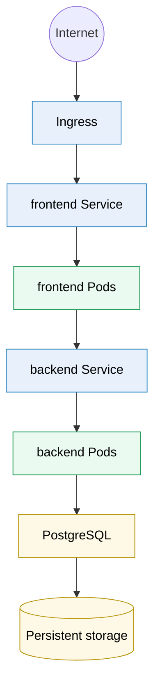

Around it:

| Object | Job in this shop |
|---|---|
| **ConfigMap** | Application configuration |
| **Secret** | Credentials |
| **ServiceAccount** | The backend pods' identity |
| **RBAC** (role-based access control): Role + RoleBinding | What that identity may do in the Kubernetes API (application programming interface) |
| **StatefulSet** | PostgreSQL |
| **PVC** (PersistentVolumeClaim) | The database's persistent storage |
| **HPA** (HorizontalPodAutoscaler) | Scale the backend automatically |
| **PDB** (PodDisruptionBudget) | Prevent too many pods disappearing during maintenance |
| **NetworkPolicy** | Restrict who can connect to what |
| **Job** | Database migration |
| **CronJob** | Nightly cleanup |
| **DaemonSet** | A node-level monitoring agent |

## 1. Namespace

Everything belongs to the `shop` namespace.

```yaml
apiVersion: v1
kind: Namespace
metadata:
  name: shop
```

```
Cluster
├── default
├── kube-system
└── shop          ← our application
```

This gives **logical** isolation: names are unique per namespace, and RBAC, quotas and NetworkPolicies are scoped to it. It isn't a security wall on its own (see [[Kubernetes#Stage 7: scaling, limits and isolation between teams]]).

## 2. ConfigMap

Non-sensitive configuration:

```yaml
apiVersion: v1
kind: ConfigMap
metadata:
  name: backend-config
  namespace: shop
data:
  LOG_LEVEL: "info"
  PORT: "8080"
  DATABASE_HOST: "postgres"
  DATABASE_PORT: "5432"
  DATABASE_NAME: "shop"
```

```
ConfigMap backend-config
├── LOG_LEVEL
├── PORT
├── DATABASE_HOST    ← "postgres": the name of a Service (step 8), not an IP address
├── DATABASE_PORT
└── DATABASE_NAME
```

No passwords here. Values are always **strings** (hence the quotes around `"8080"`).

## 3. Secret

Sensitive information:

```yaml
apiVersion: v1
kind: Secret
metadata:
  name: database-secret
  namespace: shop
type: Opaque
stringData:
  DATABASE_USER: "shop_user"
  DATABASE_PASSWORD: "change-me"
```

The backend and PostgreSQL will both consume it. `stringData` takes plain text; Kubernetes stores it base64-encoded in `data`.

> [!warning] Don't commit this file
> A Secret is only base64-**encoded**, not encrypted, and the manifest above contains the password in clear. In a real production environment the actual value isn't committed to Git: it comes from an external secret manager (Vault, a cloud secrets manager) through a tool like External Secrets Operator, or is stored encrypted in Git (Sealed Secrets, SOPS). What protects a Secret in the cluster is RBAC (who may read Secrets in `shop`) and encryption at rest if enabled.

## 4. ServiceAccount

Give the backend its own Kubernetes identity:

```yaml
apiVersion: v1
kind: ServiceAccount
metadata:
  name: backend
  namespace: shop
```

A backend pod now identifies itself to the Kubernetes API as:

```
system:serviceaccount:shop:backend
```

The kubelet mounts a short-lived, automatically rotated token for it into the pod (a JWT, JSON Web Token, see [[JWT and bearer tokens]]). Without this object, pods run as the namespace's `default` ServiceAccount, which every other pod in the namespace shares.

## 5. RBAC Role

Suppose the backend needs to read ConfigMaps through the API (for example to reload its configuration when it changes):

```yaml
apiVersion: rbac.authorization.k8s.io/v1
kind: Role
metadata:
  name: backend-config-reader
  namespace: shop
rules:
  - apiGroups: [""]              # "" = the core API group (pods, services, configmaps…)
    resources: ["configmaps"]
    verbs: ["get", "list"]
```

This says: **inside the `shop` namespace**, this role can read ConfigMaps. A **Role** is namespaced; a **ClusterRole** applies cluster-wide.

## 6. RoleBinding

Now associate the ServiceAccount with that Role:

```yaml
apiVersion: rbac.authorization.k8s.io/v1
kind: RoleBinding
metadata:
  name: backend-config-reader-binding
  namespace: shop
subjects:
  - kind: ServiceAccount
    name: backend
    namespace: shop
roleRef:
  kind: Role
  name: backend-config-reader
  apiGroup: rbac.authorization.k8s.io
```

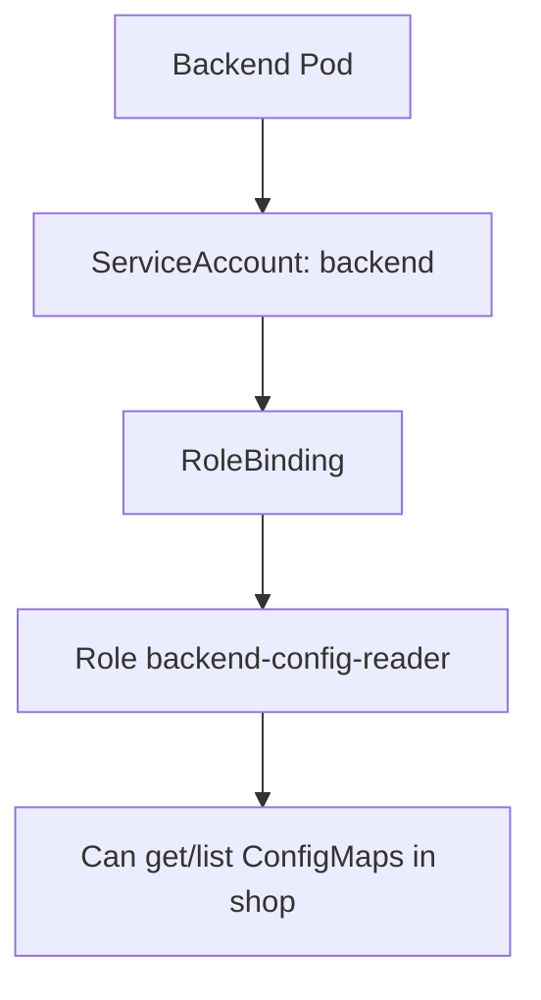

> [!info] Only if the app calls the API
> Reading the ConfigMap as **environment variables** (step 9) needs no RBAC at all: the kubelet injects the values. A Role is only needed when the application itself talks to the Kubernetes API. Most application pods don't, and for those it's safer to set `automountServiceAccountToken: false` so a compromised pod has no API token to steal.

## 7. PostgreSQL StatefulSet

A database is different from the backend pods: it needs a **stable identity** and **storage that survives the pod**.

```yaml
apiVersion: apps/v1
kind: StatefulSet
metadata:
  name: postgres
  namespace: shop
spec:
  serviceName: postgres
  replicas: 1
  selector:
    matchLabels:
      app: postgres
  template:
    metadata:
      labels:
        app: postgres
    spec:
      containers:
        - name: postgres
          image: postgres:17
          ports:
            - containerPort: 5432
          env:
            - name: POSTGRES_DB
              value: "shop"
            - name: POSTGRES_USER
              valueFrom:
                secretKeyRef:
                  name: database-secret
                  key: DATABASE_USER
            - name: POSTGRES_PASSWORD
              valueFrom:
                secretKeyRef:
                  name: database-secret
                  key: DATABASE_PASSWORD
            - name: PGDATA  # a subdirectory of the volume (see below)
              value: /var/lib/postgresql/data/pgdata
          readinessProbe:
            exec:
              command: ["pg_isready", "-U", "shop_user", "-d", "shop"]
            periodSeconds: 5
          resources:
            requests: { cpu: "500m", memory: "1Gi" }
            limits:   { memory: "1Gi" }
          volumeMounts:
            - name: postgres-storage
              mountPath: /var/lib/postgresql/data
  volumeClaimTemplates:
    - metadata:
        name: postgres-storage
      spec:
        accessModes:
          - ReadWriteOnce # 1 node at a time can mount it read-write
        storageClassName: fast-storage   # step 20
        resources:
          requests:
            storage: 20Gi
```

Several things happen here. The StatefulSet says: **keep a PostgreSQL workload with a stable identity**. And `volumeClaimTemplates` creates **one PVC per replica**, named `<template>-<pod>`: `postgres-storage-postgres-0`.

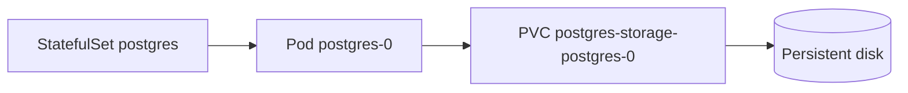

If `postgres-0` dies, the StatefulSet creates a **new pod with the same name**, `postgres-0`, and attaches **the same PVC**, so the same disk and the same data:

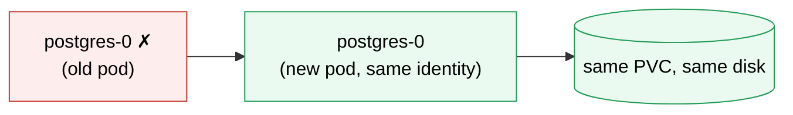

That's why a StatefulSet makes more sense for a database than a Deployment, whose pods have random names and would share (or lose) their storage.

> [!warning] Two details that bite on the first deploy
> - **`PGDATA` in a subdirectory**: a freshly formatted disk often contains a `lost+found` folder, and PostgreSQL's initialisation refuses a non-empty data directory. Pointing `PGDATA` one level down avoids it
> - **`serviceName` expects a headless Service**: it's what gives each replica its own DNS name (`postgres-0.postgres.shop.svc.cluster.local`). With one replica, the normal Service of step 8 is enough for the backend, but a replicated database needs a headless Service (`clusterIP: None`) so replicas and clients can address a specific member
>
> And a StatefulSet doesn't make PostgreSQL highly available: `replicas: 3` would be three independent databases. Replication and failover need an operator (see [[Kubernetes#Stage 8: extending the API (what nothing else has)]]).

## 8. PostgreSQL Service

The backend shouldn't connect to the pod's IP (Internet Protocol) address, `10.244.2.37`, which changes every time the pod is recreated. Instead:

```yaml
apiVersion: v1
kind: Service
metadata:
  name: postgres
  namespace: shop
spec:
  type: ClusterIP
  selector:
    app: postgres
  ports:
    - port: 5432
      targetPort: 5432
```

Kubernetes DNS (Domain Name System, served by CoreDNS) now answers for:

```
postgres.shop.svc.cluster.local
```

Inside the namespace, simply `postgres`. So the backend uses `postgres:5432`, which is exactly the `DATABASE_HOST` and `DATABASE_PORT` of the ConfigMap.

## 9. Backend Deployment

Now the actual application:

```yaml
apiVersion: apps/v1
kind: Deployment
metadata:
  name: backend
  namespace: shop
spec:
  # no "replicas:" here: the HPA (step 14) owns the count
  selector:
    matchLabels:
      app: backend
  template:
    metadata:
      labels:
        app: backend
    spec:
      serviceAccountName: backend
      containers:
        - name: backend
          image: registry.example.com/shop-backend:1.4.0
          ports:
            - containerPort: 8080
          env:
            - name: LOG_LEVEL
              valueFrom:
                configMapKeyRef:
                  name: backend-config
                  key: LOG_LEVEL
            - name: PORT
              valueFrom:
                configMapKeyRef:
                  name: backend-config
                  key: PORT
            - name: DATABASE_HOST
              valueFrom:
                configMapKeyRef:
                  name: backend-config
                  key: DATABASE_HOST
            - name: DATABASE_PORT
              valueFrom:
                configMapKeyRef:
                  name: backend-config
                  key: DATABASE_PORT
            - name: DATABASE_NAME
              valueFrom:
                configMapKeyRef:
                  name: backend-config
                  key: DATABASE_NAME
            - name: DATABASE_USER
              valueFrom:
                secretKeyRef:
                  name: database-secret
                  key: DATABASE_USER
            - name: DATABASE_PASSWORD
              valueFrom:
                secretKeyRef:
                  name: database-secret
                  key: DATABASE_PASSWORD
          resources:
            requests:
              cpu: "250m"           # a quarter of a CPU core, reserved by the scheduler
              memory: "256Mi"
            limits:
              cpu: "1"
              memory: "512Mi"       # above this: OOM-killed
          readinessProbe: # may it receive traffic?
            httpGet:
              path: /ready
              port: 8080
          livenessProbe:  # is the process stuck? 
            httpGet:
              path: /health
              port: 8080
```

This one object ties together most of what came before (CPU means central processing unit; a container over its memory limit is OOM-killed, out of memory, exit 137). The Deployment says **"I want backend pods like this"** (3 of them, through the HPA's minimum), and each pod gets:

```
backend Pod
├── ServiceAccount backend        (step 4)
├── ConfigMap values              (step 2)
├── Secret values                 (step 3)
├── CPU/memory requests and limits
├── readiness probe
└── liveness probe
```

The fifteen lines of `env:` can be replaced by two:
```yaml
          envFrom:
            - configMapRef: { name: backend-config }
            - secretRef:    { name: database-secret }
```
which imports every key as an environment variable. The long form is useful when only some keys are needed or must be renamed.

> [!warning] Two probes, two endpoints
> Pointing readiness and liveness at the same `/health` that checks the database means a slow database makes **every** backend pod fail liveness, and Kubernetes restarts them all at once. Readiness may check dependencies (the pod stops getting traffic); liveness should only check that the process itself responds. And environment variables are read **at container start**: changing the ConfigMap doesn't change running pods until they're restarted (`kubectl rollout restart deployment/backend`).

## 10. Backend Service

Give those pods a stable network identity:

```yaml
apiVersion: v1
kind: Service
metadata:
  name: backend
  namespace: shop
spec:
  type: ClusterIP
  selector:
    app: backend
  ports:
    - port: 80            # what clients call
      targetPort: 8080    # what the container listens on
```

`backend.shop.svc.cluster.local` now resolves to the Service's virtual IP, and connections are spread over the **ready** pods:

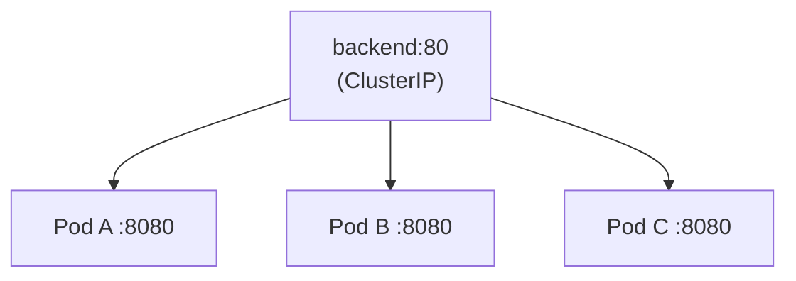

## 11. Frontend Deployment

```yaml
apiVersion: apps/v1
kind: Deployment
metadata:
  name: frontend
  namespace: shop
spec:
  replicas: 2
  selector:
    matchLabels:
      app: frontend
  template:
    metadata:
      labels:
        app: frontend
    spec:
      automountServiceAccountToken: false #never calls Kubernetes API
      containers:
        - name: frontend
          image: registry.example.com/shop-frontend:2.1.0
          ports:
            - containerPort: 3000
          resources:
            requests:
              cpu: "100m"
              memory: "128Mi"
            limits:
              cpu: "500m"
              memory: "256Mi"
```

## 12. Frontend Service

```yaml
apiVersion: v1
kind: Service
metadata:
  name: frontend
  namespace: shop
spec:
  type: ClusterIP
  selector:
    app: frontend
  ports:
    - port: 80
      targetPort: 3000
```

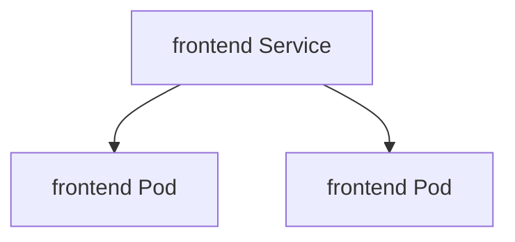

## 13. Ingress

Now the application is exposed to the internet:

```yaml
apiVersion: networking.k8s.io/v1
kind: Ingress
metadata:
  name: shop
  namespace: shop
  annotations:
    cert-manager.io/cluster-issuer: letsencrypt   
    # if cert-manager is installed: certificate issued automatically
spec:
  ingressClassName: nginx # which ingress controller implements this
  tls:
    - hosts: [shop.example.com]
      secretName: shop-tls  # the certificate and key, as a Secret
  rules:
    - host: shop.example.com
      http:
        paths:
          - path: /
            pathType: Prefix
            backend:
              service:
                name: frontend
                port:
                  number: 80
          - path: /api
            pathType: Prefix
            backend:
              service:
                name: backend
                port:
                  number: 80
```

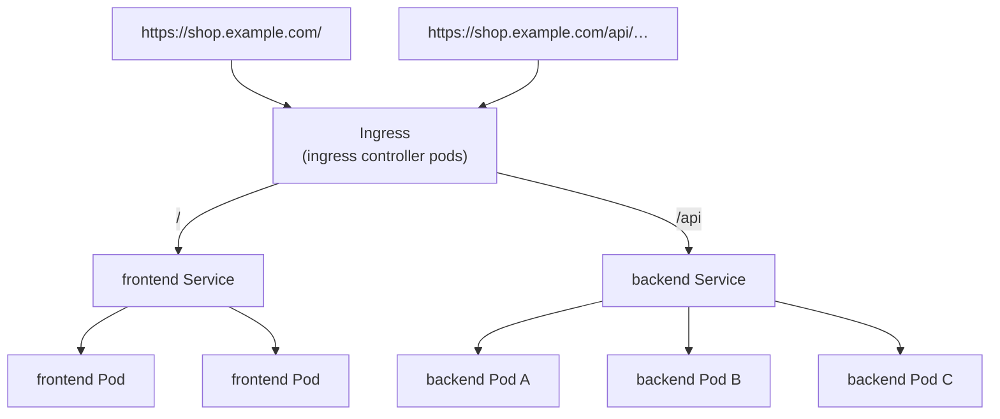

The longest matching path wins, so `/api/cart` goes to the backend and everything else to the frontend.

**Service = internal stable networking. Ingress = external HTTP (Hypertext Transfer Protocol) routing.** The Ingress object is only a set of rules; an **ingress controller** (a [[Reverse proxy]] running as pods, reached from outside through a `LoadBalancer` or `NodePort` Service) reads them and does the routing and TLS (Transport Layer Security) termination.

> [!info] Details worth knowing
> - The backend receives the **full path** `/api/cart`, not `/cart`: it must serve under `/api`, or the controller must be told to rewrite the path (a controller-specific annotation)
> - The `tls` section is what makes `https://` work. Without it, the controller serves its own default, self-signed certificate
> - **Gateway API** (HTTPRoute objects) is the newer, more expressive replacement for Ingress (weighted routing for canaries, header matching, roles split between cluster operators and app teams). The community ingress-nginx controller has been retired, so new clusters usually pick a Gateway API implementation or another controller

## 14. HorizontalPodAutoscaler

Three replicas handle normal traffic. When traffic increases:

```yaml
apiVersion: autoscaling/v2
kind: HorizontalPodAutoscaler
metadata:
  name: backend
  namespace: shop
spec:
  scaleTargetRef:
    apiVersion: apps/v1
    kind: Deployment
    name: backend
  minReplicas: 3
  maxReplicas: 10
  metrics:
    - type: Resource
      resource:
        name: cpu
        target:
          type: Utilization
          averageUtilization: 70
```

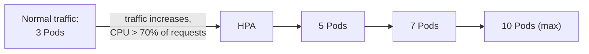

- **The Deployment still owns the pods**. The HPA only changes the Deployment's desired replica count; the Deployment's ReplicaSet creates the pods
- **70% is relative to the request** (`250m`): the HPA aims for about 175m of CPU per pod on average. Without requests, it can't compute utilisation at all
- It needs the **metrics-server** add-on (or another metrics source) to read pod CPU
- That's why the Deployment in step 9 has no `replicas:`: if it did, every `kubectl apply` would reset the count to that number, fighting the HPA (see [[Kubernetes architecture#4. Controllers that fight each other]])
- The HPA scales pods, not machines. If 10 pods don't fit on the nodes, the extra ones stay `Pending` until a cluster autoscaler adds nodes

## 15. PodDisruptionBudget

When a node is drained for maintenance (an upgrade, a kernel patch), Kubernetes evicts its pods. Without protection, draining two nodes at once could take down all the backend pods at the same moment.

```yaml
apiVersion: policy/v1
kind: PodDisruptionBudget
metadata:
  name: backend
  namespace: shop
spec:
  minAvailable: 2
  selector:
    matchLabels:
      app: backend
```

Meaning: **during voluntary disruptions, keep at least 2 backend pods available.** With pods A ✓, B ✓, C ✓, `kubectl drain` may evict one; the next eviction waits until its replacement is running and ready elsewhere.

> [!warning] What a PDB does and doesn't cover
> - Only **voluntary** disruptions that go through the eviction API: `kubectl drain`, cluster upgrades, the cluster autoscaler removing a node. A node that **crashes** or a pod that's OOM-killed isn't stopped by a PDB
> - A PDB that can never be satisfied (`minAvailable: 3` with 3 replicas, or a single-replica database with `minAvailable: 1`) **blocks drains forever**, and cluster upgrades hang. Leave room for at least one eviction, or use `maxUnavailable: 1`

## 16. NetworkPolicy

The intended flows are:

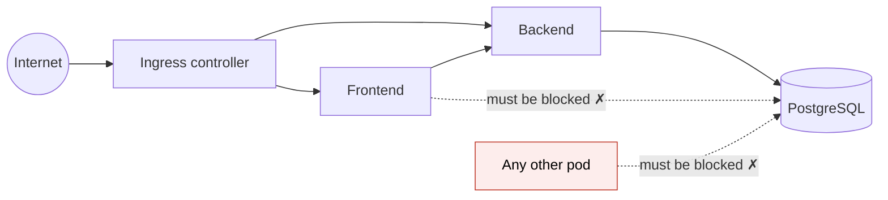

By default every pod can reach every other pod, including `frontend → postgres`. A NetworkPolicy for PostgreSQL:

```yaml
apiVersion: networking.k8s.io/v1
kind: NetworkPolicy
metadata:
  name: postgres
  namespace: shop
spec:
  podSelector:              # the pods this policy protects
    matchLabels:
      app: postgres
  policyTypes:
    - Ingress 
      # incoming connections (nothing to do with the Ingress object)
  ingress:
    - from:
        - podSelector:
            matchLabels:
              app: backend
      ports:
        - protocol: TCP
          port: 5432
```

Now PostgreSQL accepts connections on 5432 only from backend pods:

| From | To PostgreSQL :5432 |
|---|---|
| Backend pod | ✓ |
| Frontend pod | ✗ |
| Any other pod | ✗ |

How it works: as soon as **any** policy selects a pod for `Ingress`, that pod accepts **only** what some policy allows; everything else is dropped. Pods no policy selects stay wide open, which is why clusters usually add a **default-deny** policy for the namespace (`podSelector: {}` with no rules) and then allow each flow explicitly, including from the ingress controller's namespace to the frontend and backend.

> [!warning] Enforced by the network plugin, not by Kubernetes
> The API server accepts NetworkPolicies on any cluster, but only a CNI (Container Network Interface) plugin that implements them (Calico, Cilium, and others) actually drops traffic. On a plugin without support, the policy above exists and does **nothing**. Test a forbidden flow (`kubectl exec` into a frontend pod and try port 5432) rather than trusting the YAML. And once **egress** policies are added, remember to allow DNS (UDP (User Datagram Protocol) and TCP (Transmission Control Protocol) port 53 to CoreDNS), or every lookup fails.

## 17. Job: the database migration

Every release needs a database migration. That's not a continuously running pod, it's **"run this once and stop when finished"**: a Job.

```yaml
apiVersion: batch/v1
kind: Job
metadata:
  name: database-migration-1-4-0      # one Job per release (Job specs can't be changed once created)
  namespace: shop
spec:
  backoffLimit: 3                     # retry a failing pod up to 3 times, then mark the Job failed
  ttlSecondsAfterFinished: 86400      # delete the finished Job after a day
  template:
    spec:
      restartPolicy: Never
      serviceAccountName: backend
      containers:
        - name: migration
          image: registry.example.com/shop-backend:1.4.0   # same image as the backend it prepares for
          command: ["./app", "migrate"]
          envFrom:
            - configMapRef: { name: backend-config }       # DATABASE_HOST, PORT, NAME
            - secretRef: { name: database-secret }         # USER, PASSWORD
```

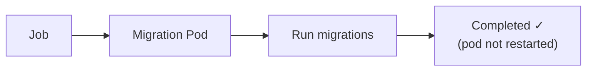

The Job doesn't need to stay alive: the controller tracks **completions**, not running replicas.

> [!info] Migrations and rolling updates
> The migration runs **while the old backend is still serving**, and the rolling update then runs old and new pods side by side. So the migration must work with both versions: expand/contract (see [[Deployment strategies#Stage 8: the database problem, and expand/contract]]). Pipelines usually run the Job, wait with `kubectl wait --for=condition=complete job/database-migration-1-4-0`, and only then update the Deployment (Helm does the same with hooks).

## 18. CronJob: nightly cleanup

Delete expired shopping carts every night at 02:00:

```yaml
apiVersion: batch/v1
kind: CronJob
metadata:
  name: cleanup-carts
  namespace: shop
spec:
  schedule: "0 2 * * *"            # cron syntax: minute 0, hour 2, every day
  timeZone: "Europe/Paris"         # otherwise the controller's time zone (usually UTC)
  concurrencyPolicy: Forbid        # don't start tonight's run if yesterday's is still going
  jobTemplate:
    spec:
      template:
        spec:
          restartPolicy: Never
          containers:
            - name: cleanup
              image: registry.example.com/shop-backend:1.4.0
              command: ["./app", "cleanup-carts"]
              envFrom:
                - configMapRef: { name: backend-config }
                - secretRef: { name: database-secret }
```

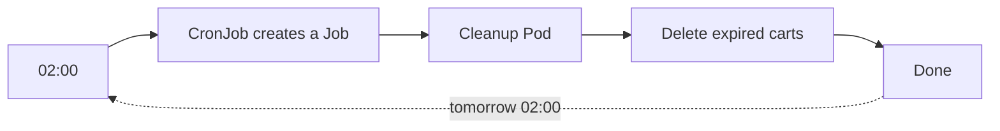

The CronJob only creates Jobs on schedule; each Job runs exactly like step 17. UTC means Coordinated Universal Time.

## 19. DaemonSet: one agent per node

Every node needs a monitoring/logging agent. Not "3 replicas" placed anywhere, but **one agent on every node**: a DaemonSet.

```yaml
apiVersion: apps/v1
kind: DaemonSet
metadata:
  name: node-monitor
  namespace: monitoring            # cluster-wide agents usually live in their own namespace
spec:
  selector:
    matchLabels:
      app: node-monitor
  template:
    metadata:
      labels:
        app: node-monitor
    spec:
      tolerations: # also run on control plane nodes which are tainted
        - key: node-role.kubernetes.io/control-plane
          effect: NoSchedule
      containers:
        - name: monitor
          image: registry.example.com/node-monitor:1.0
          volumeMounts:
            - name: varlog
              mountPath: /var/log
              readOnly: true
      volumes:
        - name: varlog
          hostPath:                # the node's own log directory
            path: /var/log
```

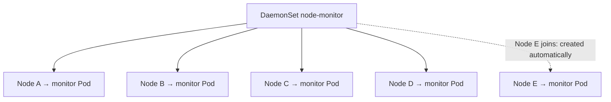

Add a node, and the DaemonSet controller creates its pod; remove one, and the pod goes with it. Unlike the shop's own workloads, a node agent usually needs access to the **node** (`hostPath` volumes, sometimes the host network), which is why it's kept in a separate namespace with its own permissions.

## 20. StorageClass

The PostgreSQL PVC (step 7) asks for `storageClassName: fast-storage`. The StorageClass says how such storage is created on demand, as a PV (PersistentVolume, the actual disk) bound to the claim:

```yaml
apiVersion: storage.k8s.io/v1
kind: StorageClass
metadata:
  name: fast-storage
provisioner: example.com/fast-storage     # the CSI driver's name
parameters:
  type: ssd                               # passed to the driver; meaning depends on it
reclaimPolicy: Retain                     # keep the disk when the PVC is deleted
volumeBindingMode: WaitForFirstConsumer   # create the disk only once the pod is scheduled
allowVolumeExpansion: true
```

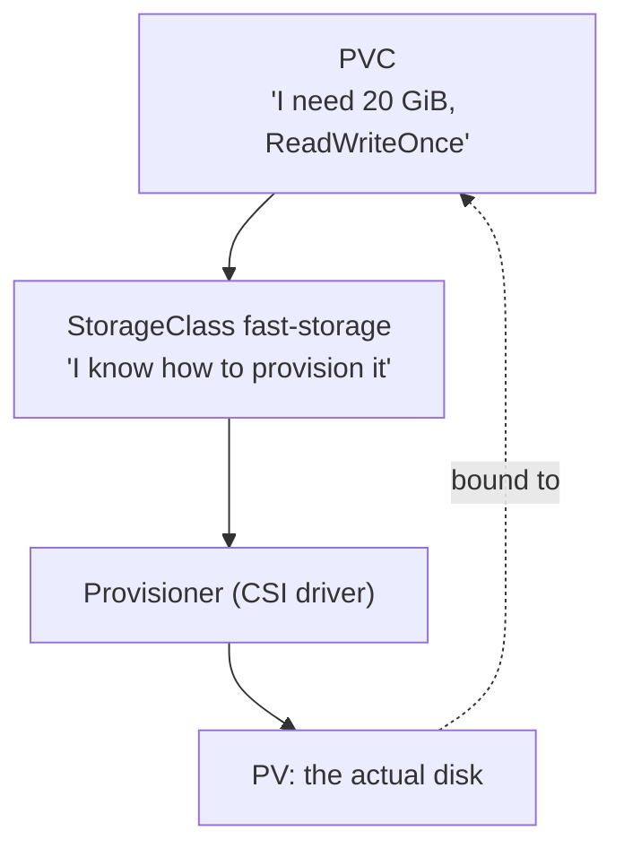

- In a real cluster the provisioner is a **CSI** (Container Storage Interface) driver supplied by the storage or cloud platform (a cloud block-disk driver, Ceph, a SAN (storage area network) vendor's driver)
- **`Retain`**: deleting the PVC (or the whole namespace by mistake) keeps the disk and its data; an administrator cleans it up. The default for most classes is `Delete`, which destroys the disk with the PVC. For a database, `Retain` is the safer choice
- **`WaitForFirstConsumer`**: the disk is created **after** the scheduler has picked a node, in that node's zone. With `Immediate`, the disk might be created in one zone and the pod scheduled in another, where it can't attach

## Putting everything together

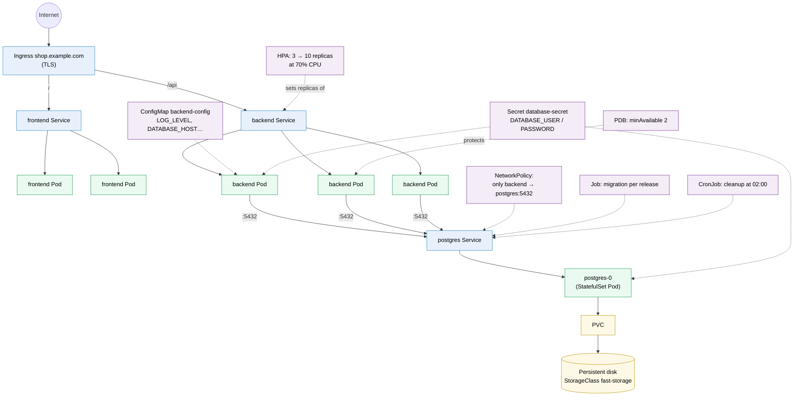

(The HPA and PDB really target the backend **Deployment** and its pods; the arrows point at the backend side of the picture.) The DaemonSet runs beside all of this, one monitor pod per node.

Applying it all:

```bash
kubectl apply -f k8s/                    # every manifest in the folder (the namespace first, or apply it separately)
kubectl -n shop get all                  # Deployments, ReplicaSets, pods, Services, StatefulSets, HPA, Jobs…
kubectl -n shop rollout status deployment/backend
kubectl -n shop describe pod <name>      # events: scheduling, image pulls, probe failures
```

In practice the folder becomes a Helm chart or a Kustomize base with per-environment overlays, deployed by a GitOps tool (see [[Kubernetes#Stage 9: how the shop actually deploys]]).

## The mental model

Don't memorise the YAML first. Think of Kubernetes as a collection of controllers, **each responsible for one kind of problem**. Each object answers one question about the system:

| Question | Objects |
|---|---|
| What should be running? | [[Kubernetes Deployment\|Deployment]], [[Kubernetes StatefulSet\|StatefulSet]], [[Kubernetes DaemonSet\|DaemonSet]], [[Kubernetes Job\|Job]], [[Kubernetes CronJob\|CronJob]] |
| How do I find it? | [[Kubernetes Service\|Service]] |
| How does traffic enter? | [[Kubernetes Ingress\|Ingress, Gateway]] |
| What configuration does it need? | [[Kubernetes ConfigMap\|ConfigMap]], [[Kubernetes Secret\|Secret]] |
| Where does its data live? | [[Kubernetes PersistentVolumeClaim\|PVC, PV]], [[Kubernetes StorageClass\|StorageClass]] |
| Should it scale? | [[Kubernetes HorizontalPodAutoscaler\|HPA]] |
| Can it be disrupted? | [[Kubernetes PodDisruptionBudget\|PDB]] |
| Who is it, and what may it do? | [[Kubernetes ServiceAccount\|ServiceAccount]], [[Kubernetes RBAC\|Role/RoleBinding (RBAC)]] |
| Who can talk to whom? | [[Kubernetes NetworkPolicy\|NetworkPolicy]] |

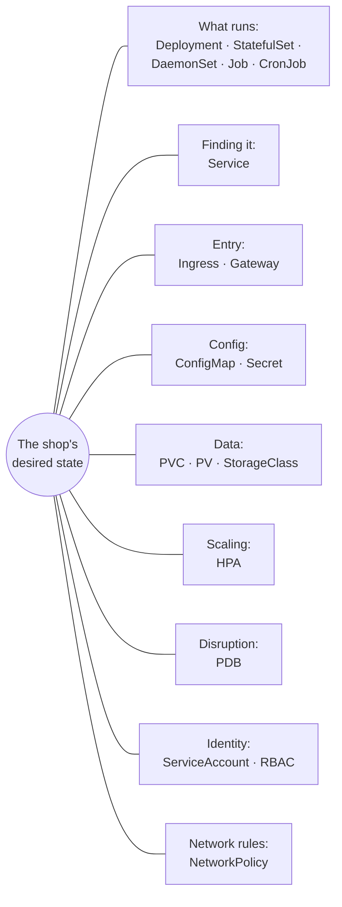

That's why Kubernetes has so many YAML objects: each one describes a **different dimension** of the desired state, and a separate controller keeps that dimension true. The objects connect through **names** (the Deployment references `backend-config` and `database-secret`, the Ingress references Services) and **labels** (Services, the PDB and NetworkPolicies select pods by `app: backend`).

## Advanced problems

### 1. A label typo breaks the wiring silently

**Symptom:** the backend Service exists, the pods run, but requests fail with `503` from the ingress controller. **Cause:** the Service's selector (`app: backend`) doesn't match the pods' labels (`app: back-end`), so the Service has **no endpoints**. Nothing errors: a selector matching nothing is valid. **Check:** `kubectl -n shop get endpointslices -l kubernetes.io/service-name=backend` (empty = no matching ready pods). The same silent failure affects PDBs and NetworkPolicies.

### 2. Pods stuck in `CreateContainerConfigError`

**Cause:** a referenced ConfigMap or Secret (or one of its keys) doesn't exist, often because it was created in another namespace, or the names differ by one character. `kubectl describe pod` names the missing key.

### 3. The PVC stays `Pending`

**Cause:** no StorageClass named `fast-storage`, no CSI driver running for its provisioner, or (with `WaitForFirstConsumer`) the pod isn't scheduled yet, which is normal until it is. `kubectl describe pvc` shows the provisioner's events.

### 4. Changing the ConfigMap changes nothing

**Cause:** environment variables are copied at container start. **Fix:** restart the Deployment, or put a hash of the ConfigMap in the pod template's annotations (Helm and Kustomize can do this) so a config change triggers a rolling update automatically. ConfigMaps mounted as **files** are updated in place after a delay, but the app must re-read them.

### 5. The migration Job "already exists"

**Cause:** Jobs can't be updated, and a Job with the same name from the last release is still there. **Fix:** a name per release, `ttlSecondsAfterFinished` to clean up, or a Helm hook that deletes it first.

## Practice

> [!example]- The frontend pods can still connect to PostgreSQL after the NetworkPolicy was applied. Name two possible reasons.
> The CNI plugin doesn't enforce NetworkPolicies, or the policy's `podSelector` doesn't match the PostgreSQL pods' labels (so it protects nothing). A policy that's accepted by the API isn't proof that it's enforced.

> [!example]- During a cluster upgrade, node drains hang forever. The only change: a PDB with `minAvailable: 1` on PostgreSQL. Why?
> PostgreSQL has one replica. Evicting it would leave 0 available, below the minimum, so the eviction is refused forever. A single-replica workload can't have a PDB that forbids any disruption without blocking drains.

> [!example]- The backend Deployment has `replicas: 3` and an HPA with `minReplicas: 3`. Traffic pushed it to 8 pods, then a teammate ran `kubectl apply -f k8s/`. What happened?
> The apply set the Deployment back to 3 replicas, killing 5 pods under load, until the HPA scaled up again. Remove `replicas` from the manifest when an HPA owns it.

> [!example]- `postgres-0`'s node dies. What does the pod come back with?
> The same name `postgres-0` and the same PVC (`postgres-storage-postgres-0`), so the same disk, attached on another node (in the same zone as the disk). Data that was written is still there; there's downtime until the new pod is ready.

> [!example]- Which objects in this shop would still exist if the `shop` namespace were deleted?
> None of the namespaced objects (everything in steps 2 to 18). The StorageClass is cluster-scoped and stays. The disk survives only because of `reclaimPolicy: Retain`; with `Delete`, the database would be gone. The DaemonSet in `monitoring` is unaffected.

## Easy to get wrong
- Thinking objects are wired by structure: they're wired by names and labels, and a mismatch fails silently
- Keeping `replicas:` in a Deployment managed by an HPA
- One `/health` endpoint, checking the database, used for liveness
- Expecting a running pod to see a changed ConfigMap in its environment variables
- Committing a Secret manifest with real values
- A NetworkPolicy without a CNI plugin that enforces it, or with egress rules that block DNS
- A PDB that can never be satisfied
- Reusing a Job name across releases
- `reclaimPolicy: Delete` on database storage
- A StatefulSet with `replicas: 3` treated as a replicated database
- Forgetting that the backend behind `/api` receives the full path

## Related
- The objects explained:: [[Kubernetes]]
- The YAML grammar:: [[Kubernetes manifest syntax]]
- The same shop on AWS:: [[Kubernetes worked example on EKS]]
- Objects, one note each:: [[Kubernetes Pod]], [[Kubernetes ReplicaSet]], [[Kubernetes Deployment]], [[Kubernetes StatefulSet]], [[Kubernetes DaemonSet]], [[Kubernetes Job]], [[Kubernetes CronJob]], [[Kubernetes Service]], [[Kubernetes Ingress]], [[Kubernetes NetworkPolicy]], [[Kubernetes ConfigMap]], [[Kubernetes Secret]], [[Kubernetes PersistentVolumeClaim]], [[Kubernetes StorageClass]], [[Kubernetes ServiceAccount]], [[Kubernetes RBAC]], [[Kubernetes Namespace]], [[Kubernetes Node]], [[Kubernetes ResourceQuota and LimitRange]], [[Kubernetes HorizontalPodAutoscaler]], [[Kubernetes PodDisruptionBudget]], [[Kubernetes CustomResourceDefinition]]
- How they're processed:: [[Kubernetes architecture]]
- Releasing new versions:: [[Deployment strategies]]
- Images:: [[Docker]], [[Docker image tags]] (pin digests rather than `1.4.0`)
- Networking:: [[Service discovery]], [[Reverse proxy]], [[DNS]], [[TLS]]
- Identity:: [[JWT and bearer tokens]], [[Workload identity (SPIFFE)]]
- Area:: [[Containers]]

## Flashcards
#flashcards

ConfigMap vs Secret? :: Non-sensitive configuration vs credentials (base64-encoded, protected by RBAC and optional encryption at rest)
What identity does a pod with serviceAccountName backend in namespace shop have? :: system:serviceaccount:shop:backend
Role vs RoleBinding? :: The Role lists allowed verbs on resources in a namespace. The RoleBinding grants it to users, groups or ServiceAccounts
Does reading a ConfigMap as environment variables need RBAC? :: No. Only an app that calls the Kubernetes API needs a Role
What does volumeClaimTemplates do in a StatefulSet? :: Creates one PVC per replica (template-podname) that follows that replica
What happens when postgres-0 dies? :: A new pod named postgres-0 is created and reattached to the same PVC
Why set PGDATA to a subdirectory of the volume? :: A fresh disk may contain lost+found, and PostgreSQL refuses a non-empty data directory
What DNS name does Service postgres in namespace shop get? :: postgres.shop.svc.cluster.local (just postgres inside the namespace)
port vs targetPort in a Service? :: port is what clients call on the Service. targetPort is what the container listens on
What does envFrom do? :: Imports every key of a ConfigMap or Secret as environment variables
Service vs Ingress? :: Service: stable internal address for pods. Ingress: external HTTP routing (host/path, TLS) to Services
What implements an Ingress? :: An ingress controller (a reverse proxy running in the cluster)
Which Ingress path wins for /api/cart: / or /api? :: The longest match, /api
What is the HPA's averageUtilization relative to? :: The pods' CPU requests
Why remove replicas from a Deployment managed by an HPA? :: Every apply would reset the count, fighting the HPA
What does a PodDisruptionBudget protect against? :: Too many pods evicted at once during voluntary disruptions (drains, upgrades), not crashes
What PDB blocks node drains forever? :: One that can't allow any eviction, like minAvailable equal to the replica count
What happens to a pod once any NetworkPolicy selects it for Ingress? :: Only allowed incoming traffic is accepted; everything else is dropped
Who enforces NetworkPolicies? :: The CNI plugin, if it supports them. Otherwise they do nothing
What must egress NetworkPolicies always allow? :: DNS (port 53 to CoreDNS)
Job vs Deployment? :: A Job runs pods to completion. A Deployment keeps pods running
What does backoffLimit do in a Job? :: How many times failed pods are retried before the Job is marked failed
Why name the migration Job per release? :: Jobs can't be updated, and the old one may still exist
What does concurrencyPolicy: Forbid do in a CronJob? :: Skips a run if the previous one is still running
Why use a DaemonSet for a node monitoring agent? :: It runs exactly one pod per node and follows nodes as they join or leave
What does reclaimPolicy: Retain do? :: Keeps the disk when its PVC is deleted
What does volumeBindingMode: WaitForFirstConsumer do? :: Creates the disk after the pod is scheduled, in that node's zone
How are Kubernetes objects connected to each other? :: By names (references) and labels (selectors)
