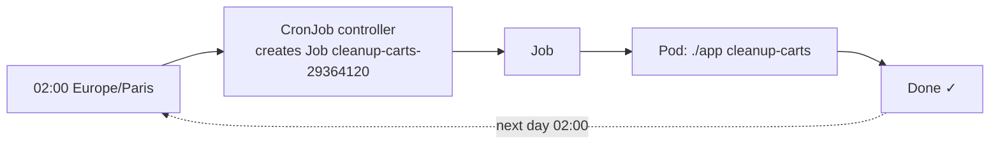

# Kubernetes CronJob

> [!abstract] In one sentence
> A CronJob creates a [[Kubernetes Job]] **on a schedule** written in cron syntax (`0 2 * * *` = every day at 02:00), with rules for **overlapping runs** (`concurrencyPolicy`), **missed runs** (`startingDeadlineSeconds`), the **time zone**, and how many finished Jobs to keep. It's the cluster's `crontab`, with the difference that a run may happen late, twice, or not at all, so the work must tolerate that.

## Build-up: deleting expired carts every night

### Stage 1: the classic way and its problems

On a single server, a `crontab` line runs the cleanup at 02:00. On a cluster: which machine? If that machine is down at 02:00, the cleanup doesn't run. If the script hangs, the next night's run starts on top of it. Its logs live on one machine's disk.

### Stage 2: the CronJob

```yaml
apiVersion: batch/v1
kind: CronJob
metadata:
  name: cleanup-carts
  namespace: shop
spec:
  schedule: "0 2 * * *"            # minute hour day-of-month month day-of-week
  timeZone: "Europe/Paris"         # otherwise the controller's zone, usually UTC
  concurrencyPolicy: Forbid        # skip a run while the previous one is still going
  startingDeadlineSeconds: 3600    # if a run couldn't start on time, still start it within 1 h
  successfulJobsHistoryLimit: 3    # keep the last 3 successful Jobs (default 3)
  failedJobsHistoryLimit: 3        # keep the last 3 failed Jobs (default 1)
  jobTemplate:                     # a Job spec (see Job)
    spec:
      backoffLimit: 2
      activeDeadlineSeconds: 1800
      template:
        spec:
          restartPolicy: Never
          containers:
            - name: cleanup
              image: registry.example.com/shop-backend:1.5.0
              command: ["./app", "cleanup-carts"]
              envFrom:
                - configMapRef: { name: backend-config }
                - secretRef: { name: database-secret }
```



The Job's name gets a suffix derived from the scheduled time. Each run is an ordinary Job: retries, deadlines and pods work as in [[Kubernetes Job]].

Cron syntax reminders (UTC means Coordinated Universal Time):

| Schedule | Meaning |
|---|---|
| `0 2 * * *` | Every day at 02:00 |
| `*/15 * * * *` | Every 15 minutes |
| `0 9 * * 1-5` | 09:00 Monday to Friday |
| `0 0 1 * *` | Midnight on the first day of each month |
| `@hourly`, `@daily`, `@weekly` | Shortcuts |

### Stage 3: overlapping runs

The cleanup normally takes 5 minutes. One night the database is slow and it takes 26 hours. What happens at 02:00 the next day depends on `concurrencyPolicy`:

| Policy | Next run while the previous is still running |
|---|---|
| `Allow` (default) | Starts anyway: two cleanups in parallel |
| `Forbid` | Skipped; counted as a missed run |
| `Replace` | The running Job is deleted and the new one starts |

For most maintenance tasks, `Forbid` is right: two cleanups deleting the same rows fight over locks. `Allow` fits independent runs (each processes its own time window).

### Stage 4: missed runs

If the controller couldn't create the Job on time (control plane down, the CronJob suspended, a `Forbid` skip), what happens next?
- With `startingDeadlineSeconds: 3600`: a run that's at most 1 hour late still starts; later than that, it's skipped
- Without it: the controller looks at **all** missed schedules since the last run, and if there are **more than 100**, it doesn't start any and logs an error. A CronJob every minute, suspended for two hours, is stuck that way until a deadline is set

`suspend: true` pauses the schedule (useful during maintenance) without deleting the CronJob.

> [!warning] Zero, one or two runs
> The CronJob controller aims for one Job per schedule, but documents that a Job **may occasionally be created twice, or not at all**. Combined with Job retries, the task must be **idempotent** (deleting carts older than X is; "send the daily report email" needs a record of what was sent) and must catch up correctly if a run is skipped (process "everything since the last successful run", not "yesterday").

## Running it by hand

```bash
kubectl -n shop create job cleanup-manual --from=cronjob/cleanup-carts   # a one-off run with the same template
kubectl -n shop get cronjob cleanup-carts                                 # LAST SCHEDULE, ACTIVE
kubectl -n shop get jobs -l batch.kubernetes.io/cronjob-name=cleanup-carts   # recent runs (label on newer clusters)
```

## Advanced problems

### 1. It ran at the wrong time
Without `timeZone`, schedules use the controller manager's time zone (usually UTC). 02:00 becomes 04:00 local in summer. Set `timeZone`; daylight saving changes still skip or repeat a run around the switch hour, so avoid 02:00–03:00 in zones with DST (daylight saving time).

### 2. Jobs pile up
Many failed runs with a high history limit, or `Allow` with long runs, accumulate Jobs and pods. Keep history limits small and set `activeDeadlineSeconds` on the job template so a stuck run doesn't live forever.

### 3. Silent failure
A cleanup fails every night and nobody notices: the CronJob keeps scheduling. Alert on failed Jobs, or on "time since last successful run", rather than reading logs.

## Easy to get wrong
- Forgetting `timeZone` and assuming local time
- `concurrencyPolicy: Allow` (the default) for tasks that mustn't overlap
- Expecting exactly one run per schedule
- No `startingDeadlineSeconds`: >100 missed schedules block the CronJob
- No alerting on failed runs
- Logic that assumes the previous run happened

## Related
- Creates:: [[Kubernetes Job]] → [[Kubernetes Pod]]
- Overview:: [[Kubernetes]], [[Kubernetes worked example]]
- In AWS (Amazon Web Services):: [[EventBridge]] (scheduled rules as the AWS equivalent)
- Area:: [[Containers]]

## Flashcards
#flashcards

What does a CronJob do? :: Creates a Job on a cron schedule
What does schedule "0 2 * * *" mean? :: Every day at 02:00
What time zone does a CronJob use by default? :: The controller manager's (usually UTC) unless timeZone is set
concurrencyPolicy values? :: Allow (default, overlap), Forbid (skip if running), Replace (kill the running one)
What does startingDeadlineSeconds do? :: A late run still starts if within that delay; later runs are skipped
What happens after more than 100 missed schedules without startingDeadlineSeconds? :: The CronJob stops creating Jobs and logs an error
How do you trigger a CronJob by hand? :: kubectl create job <name> --from=cronjob/<cronjob>
How do you pause a CronJob? :: suspend: true
Why must CronJob tasks be idempotent? :: A run can occasionally happen twice or not at all, plus Job retries
