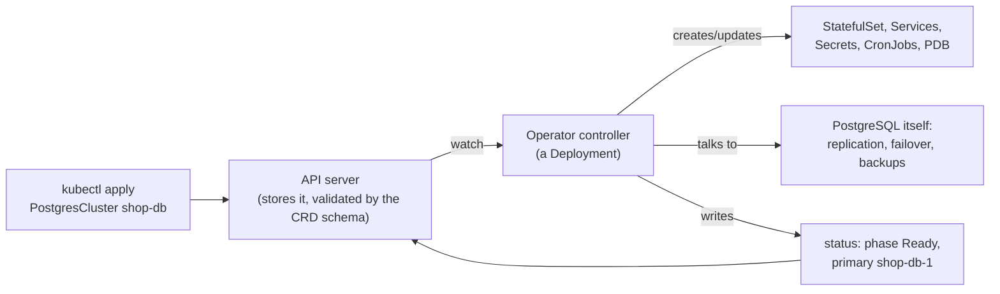

# Kubernetes CustomResourceDefinition

> [!abstract] In one sentence
> A CustomResourceDefinition (CRD) **adds a new object type to the Kubernetes API**, with its own name, schema and versions, stored in etcd and protected by RBAC like built-in objects; on its own it's just data. Paired with a **controller** that watches those objects and reconciles the world to match, it becomes an **operator**: the way cert-manager, Prometheus, Argo CD, database operators and most of the Kubernetes ecosystem extend the cluster.

## Build-up: teaching Kubernetes about databases

### Stage 1: what built-in objects can't express

Running PostgreSQL well means a primary and replicas, failover, backups to object storage, version upgrades. With built-in objects, that's a [[Kubernetes StatefulSet]], a few Services, CronJobs for backups, and a runbook for failover that a human follows at 3 a.m. What the shop wants to write is:

```yaml
kind: PostgresCluster
spec:
  instances: 3
  storage: 20Gi
  backups: { schedule: "0 3 * * *", destination: s3://shop-backups }
```

and have something make it true, continuously, like a Deployment does for pods.

### Stage 2: defining the type

```yaml
apiVersion: apiextensions.k8s.io/v1
kind: CustomResourceDefinition
metadata:
  name: postgresclusters.db.example.com         # <plural>.<group>
spec:
  group: db.example.com
  scope: Namespaced
  names:
    kind: PostgresCluster
    plural: postgresclusters
    singular: postgrescluster
    shortNames: [pgc]
  versions:
    - name: v1
      served: true
      storage: true                              # the version stored in etcd
      subresources:
        status: {}                               # spec written by users, status by the controller
      additionalPrinterColumns:
        - { name: Instances, type: integer, jsonPath: .spec.instances }
        - { name: Phase, type: string, jsonPath: .status.phase }
      schema:
        openAPIV3Schema:                         # validation, enforced by the API server
          type: object
          properties:
            spec:
              type: object
              required: [instances, storage]
              properties:
                instances: { type: integer, minimum: 1, maximum: 9 }
                storage: { type: string, pattern: '^[0-9]+Gi$' }
              x-kubernetes-validations:          # CEL (Common Expression Language) rules
                - rule: "self.instances % 2 == 1"
                  message: "use an odd number of instances"
            status:
              type: object
              x-kubernetes-preserve-unknown-fields: true
```

From the moment it's applied:

```bash
kubectl get crds
kubectl -n shop get postgresclusters          # or: kubectl get pgc
kubectl explain postgrescluster.spec          # documentation from the schema
kubectl -n shop apply -f shop-db.yaml         # validated: instances: 2 is rejected
```

The API server now serves `/apis/db.example.com/v1/namespaces/shop/postgresclusters` with everything built-in types get: storage in etcd, RBAC (role-based access control), admission, watch, `kubectl` support. See [[Kubernetes architecture]].

### Stage 3: the controller makes it an operator

**A CRD alone does nothing.** `kubectl apply` stores a `PostgresCluster` and no database appears. Something must watch these objects and act: a **controller**, usually running as a Deployment in the cluster.



The controller runs the same reconciliation loop as built-in ones ([[Container orchestration]]): read the desired state (`spec`), observe reality (pods, PostgreSQL's replication status), act on the difference, report in `status`. An **operator** encodes the knowledge of a human operator for one piece of software. Examples:

| Operator / tool | Custom resources |
|---|---|
| cert-manager | `Certificate`, `Issuer`, `ClusterIssuer` |
| Prometheus operator | `ServiceMonitor`, `PrometheusRule`, `Prometheus` |
| Argo CD | `Application`, `AppProject` |
| CloudNativePG | `Cluster`, `Backup`, `ScheduledBackup` |
| Strimzi (Kafka) | `Kafka`, `KafkaTopic`, `KafkaUser` |
| Gateway API | `Gateway`, `HTTPRoute` (CRDs maintained by Kubernetes itself, see [[Kubernetes Ingress]]) |

### Stage 4: versions

The schema will evolve. A CRD can serve several versions (`v1beta1`, `v1`) while storing objects in one; if their shapes differ, a **conversion webhook** (run by the operator) translates between them. Removing a version that objects are still stored in breaks them: storage migration first. In practice, upgrading an operator usually means upgrading its CRDs first, following its upgrade notes.

### Stage 5: finalizers

When a `PostgresCluster` is deleted, the operator may need to clean up outside the cluster (delete backups, deregister DNS (Domain Name System) records). It adds a **finalizer** to the object: deletion then only sets a deletion timestamp, the operator does its cleanup and removes the finalizer, and only then is the object really gone. Built-in objects use the same mechanism (PVC protection, namespace deletion).

## Advanced problems

### 1. Deleting a CRD deletes every object of that type
`kubectl delete crd postgresclusters.db.example.com` removes **all** `PostgresCluster` objects in every namespace, and with them whatever the operator cascades (StatefulSets, PVCs). Uninstalling an operator chart carelessly can do this. Protect CRDs (Helm keeps them on uninstall by default for this reason).

### 2. Objects stuck deleting
The operator was uninstalled **before** its objects were deleted, so nothing removes their finalizers. The objects (and their namespace) stay `Terminating` forever. Reinstall the operator, or remove the finalizers by hand knowing the cleanup won't happen.

### 3. CRD sprawl and API load
Each operator adds CRDs and watches. Large CRDs (some are megabytes of schema) and hundreds of them slow API discovery and `kubectl`. Install what's used.

### 4. Who may create these objects?
A new type isn't in the built-in `edit`/`view` roles unless the installer adds aggregated ClusterRoles, and creating a `PostgresCluster` may let someone create StatefulSets and Secrets **through** the operator, which runs with broad rights. RBAC on custom resources needs the same thought as on built-ins ([[Kubernetes RBAC]]).

## Easy to get wrong
- Thinking a CRD does something on its own: without a controller, it's just stored data
- Deleting a CRD (or an operator chart with its CRDs) and losing every object of that type
- Uninstalling an operator before deleting its objects: stuck finalizers
- Skipping the schema: invalid objects accepted, operator crashes later
- Forgetting RBAC for new types, or the operator's own broad permissions

## Related
- The idea it implements:: [[Container orchestration]] (reconciliation loops), [[Kubernetes architecture]] (API server, controllers)
- Built on top:: [[Kubernetes StatefulSet]] (database operators), [[Kubernetes Ingress]] (Gateway API CRDs)
- Access:: [[Kubernetes RBAC]]
- Scope:: [[Kubernetes Namespace]] (CRDs are cluster-scoped, their objects usually namespaced)
- Overview:: [[Kubernetes]]
- Area:: [[Containers]]

## Flashcards
#flashcards

What is a CRD? :: A CustomResourceDefinition: registers a new object type with the Kubernetes API (name, schema, versions)
What does a CRD do without a controller? :: Nothing: objects are only stored
What is an operator? :: CRDs plus a controller that encodes how to run a specific piece of software
CRD name format? :: <plural>.<group>, e.g. postgresclusters.db.example.com
What validates custom objects? :: The CRD's openAPIV3Schema (and CEL x-kubernetes-validations rules), enforced by the API server
What is the status subresource for? :: Separating user-written spec from controller-written status
What happens when you delete a CRD? :: Every object of that type, in all namespaces, is deleted
What is a finalizer? :: A marker that delays an object's deletion until a controller has done its cleanup and removed it
Why do objects get stuck Terminating after an operator is uninstalled? :: Nobody removes their finalizers
What is a conversion webhook for? :: Translating custom objects between served versions with different schemas
