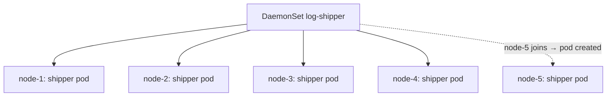

# Kubernetes DaemonSet

> [!abstract] In one sentence
> A DaemonSet runs **one pod on every node** (or every node matching a selector), adding a pod when a node joins and removing it when the node leaves. It's how **node-level agents** run: log shippers, monitoring exporters, the network plugin, kube-proxy, storage drivers, security agents.

## Build-up: a log shipper on every machine

Each node writes container logs to `/var/log/pods/`. A log shipper must read them **on that node** and send them to central storage. The same goes for a metrics exporter reading the node's CPU (central processing unit) and disk stats.

### Stage 1: why a Deployment doesn't fit

A [[Kubernetes Deployment]] with `replicas: 4` on a 4-node cluster might put two shippers on one node and none on another. Adding a fifth node means editing the count. Spreading constraints help but don't guarantee "exactly one per node, always".

### Stage 2: the DaemonSet

```yaml
apiVersion: apps/v1
kind: DaemonSet
metadata:
  name: log-shipper
  namespace: monitoring
spec:
  selector:
    matchLabels: { app: log-shipper }
  updateStrategy:
    type: RollingUpdate
    rollingUpdate: { maxUnavailable: 1 }      # replace one node's agent at a time
  template:
    metadata:
      labels: { app: log-shipper }
    spec:
      priorityClassName: system-node-critical # agents should not be evicted before apps
      tolerations:
        - key: node-role.kubernetes.io/control-plane
          effect: NoSchedule                  # also run on control plane nodes
      containers:
        - name: shipper
          image: registry.example.com/log-shipper:2.0
          resources:
            requests: { cpu: 50m, memory: 64Mi }
            limits:   { memory: 128Mi }
          volumeMounts:
            - { name: pods-logs, mountPath: /var/log/pods, readOnly: true }
      volumes:
        - name: pods-logs
          hostPath: { path: /var/log/pods }    # the node's own directory
```



- **One pod per eligible node**, maintained by the DaemonSet controller. The pods are scheduled by the normal scheduler, pinned to their node through node affinity
- **`hostPath` volumes** give access to the node's files. Agents often also use `hostNetwork: true` (the node's network namespace) or extra privileges, which is why they live in their own namespace with strict access
- **Eligible nodes** can be narrowed: `nodeSelector: { gpu: "true" }` runs a GPU (graphics processing unit) driver agent only on GPU nodes
- DaemonSet pods automatically **tolerate** some node problems (not-ready, unreachable, disk pressure), so an agent isn't evicted from a sick node it may be needed to diagnose. Control plane taints aren't tolerated by default: add a toleration if the agent must run there

### Stage 3: updates

- `RollingUpdate` (default): the agent is replaced node by node, `maxUnavailable` at a time (default 1). With `maxSurge: 1` (and `maxUnavailable: 0`) the new agent starts before the old one stops on each node, for agents that must never have a gap
- `OnDelete`: a node's agent is updated only when its pod is deleted, for agents whose restart must be coordinated (a CNI (Container Network Interface) plugin restart can disturb pod networking)

On a 200-node cluster with `maxUnavailable: 1`, a rollout touches 200 pods one after the other: slow but safe. A percentage (`10%`) speeds it up.

### Where DaemonSets show up

| Agent | Why per node |
|---|---|
| **CNI plugin** (Calico, Cilium) | Sets up pod networking on each node (see [[Kubernetes architecture]]) |
| **kube-proxy** | Programs each node's Service rules |
| **CSI (Container Storage Interface)** (Container Storage Interface) node plugin | Attaches and mounts volumes on each node |
| Log shippers (Fluent Bit, Vector) | Read each node's log files |
| Metrics exporters (node-exporter) | Report each node's hardware stats |
| Security agents | Watch each kernel's activity |

## Advanced problems

### 1. The agent uses more than expected, everywhere
A DaemonSet's requests are reserved on **every** node: 200m CPU × 100 nodes = 20 CPUs for one agent. Several agents per node can eat a large share of small nodes. Count DaemonSet overhead when sizing nodes.

### 2. Pods missing on some nodes
`kubectl -n monitoring get ds` shows `DESIRED 10, CURRENT 8`. Usually a taint the pods don't tolerate, a node selector, or nodes too full to fit the agent's requests. A higher `priorityClassName` lets agents preempt ordinary pods to fit.

### 3. A bad agent version breaks every node at once
A DaemonSet rollout hits the whole cluster. With an agent like the CNI plugin, a bad version breaks networking everywhere. Slow rollouts (`maxUnavailable: 1`, health checks), or `OnDelete` with a manual canary node first.

## Easy to get wrong
- Using a Deployment for per-node agents
- Forgetting tolerations for control plane or tainted node pools
- Large requests multiplied by the node count
- `hostPath` and `hostNetwork` without restricting who can create such pods
- Rolling out a networking agent to all nodes without a canary

## Related
- Manages:: [[Kubernetes Pod]]
- Placement:: [[Kubernetes Node]] (taints, labels)
- Differs from:: [[Kubernetes Deployment]], [[Kubernetes StatefulSet]]
- Swarm equivalent:: [[Docker Swarm]] (global services)
- Overview:: [[Kubernetes]], [[Kubernetes worked example]]
- Area:: [[Containers]]

## Flashcards
#flashcards

What does a DaemonSet do? :: Runs one pod on every (matching) node, following nodes as they join and leave
Typical DaemonSet workloads? :: CNI plugin, kube-proxy, CSI node plugin, log shippers, metrics exporters, security agents
How do you limit a DaemonSet to some nodes? :: nodeSelector or node affinity in the pod template
Why doesn't a DaemonSet run on control plane nodes by default? :: They're tainted; the pods need a toleration
DaemonSet update strategies? :: RollingUpdate (maxUnavailable per node, optionally maxSurge) and OnDelete
Why are DaemonSet resource requests costly? :: They're reserved on every node
Swarm equivalent of a DaemonSet? :: A global service
