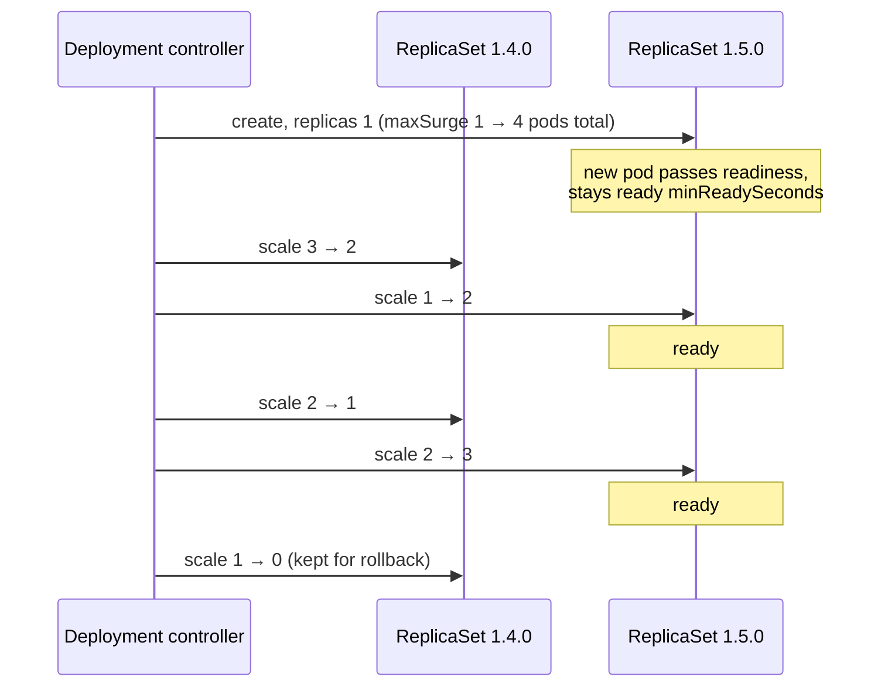

# Kubernetes Deployment

> [!abstract] In one sentence
> A Deployment runs **stateless, interchangeable replicas** and manages **changes** to them: when its pod template changes, it creates a new [[Kubernetes ReplicaSet]] and shifts pods from the old one to the new one gradually (a **rolling update**) or all at once (**recreate**), keeps old ReplicaSets for **rollback**, and records the rollout's progress. It's the default object for APIs (application programming interfaces), web frontends and workers.

## Build-up: shipping version 1.5.0 of the backend

### Stage 1: the object

```yaml
apiVersion: apps/v1
kind: Deployment
metadata:
  name: backend
  namespace: shop
spec:
  replicas: 3
  selector:
    matchLabels: { app: backend }       # immutable after creation
  strategy:
    type: RollingUpdate
    rollingUpdate:
      maxSurge: 1                        # at most 1 pod above 3 during the rollout
      maxUnavailable: 0                  # never fewer than 3 ready pods
  minReadySeconds: 10                    # a new pod must stay ready 10 s before it counts
  progressDeadlineSeconds: 600           # report failure if no progress for 10 minutes
  revisionHistoryLimit: 10               # old ReplicaSets kept for rollback
  template:
    metadata:
      labels: { app: backend }
    spec:
      containers:
        - name: backend
          image: registry.example.com/shop-backend:1.4.0
          readinessProbe: { httpGet: { path: /ready, port: 8080 } }
```

The Deployment creates ReplicaSet `backend-7d4f9c`, which creates 3 pods. Nothing new so far: the value is in what happens on a change.

### Stage 2: a rolling update

```bash
kubectl -n shop set image deployment/backend backend=registry.example.com/shop-backend:1.5.0
# or, better: change the manifest in Git and apply it
kubectl -n shop rollout status deployment/backend
```

Any change to the **pod template** (image, environment, resources, labels, annotations) starts a rollout. Changes outside the template (like `replicas`) don't.



`maxSurge` and `maxUnavailable` (numbers or percentages, both **25%** by default) set the speed and the capacity cost:

| Setting | Effect |
|---|---|
| `maxSurge: 1, maxUnavailable: 0` | Always full capacity, needs room for one extra pod |
| `maxSurge: 0, maxUnavailable: 1` | No extra capacity, one pod fewer during the rollout |
| `maxSurge: 100%, maxUnavailable: 0` | Starts all new pods at once, then removes the old: fast, double capacity briefly |

The other strategy, `type: Recreate`, deletes all old pods before creating new ones: downtime, but the two versions never run together. The trade-offs, and what lies beyond (blue/green, canary), are in [[Deployment strategies]].

### Stage 3: history and rollback

```bash
kubectl -n shop rollout history deployment/backend
kubectl -n shop rollout undo deployment/backend                 # back to the previous revision
kubectl -n shop rollout undo deployment/backend --to-revision=4
kubectl -n shop rollout pause deployment/backend                # stop mid-rollout (a crude canary)
kubectl -n shop rollout resume deployment/backend
kubectl -n shop rollout restart deployment/backend              # new pods, same spec (e.g. to reload a ConfigMap)
```

A rollback is **a rolling update to the old template**: the old ReplicaSet is scaled up and the current one down. It's as fast as the rollout, not instant.

> [!warning] Rollback undoes the template, nothing else
> `rollout undo` restores the pod template of an older revision. It doesn't undo a database migration, a changed [[Kubernetes ConfigMap]] referenced by name, or anything outside the Deployment. And if the manifest in Git still says 1.5.0, the next apply re-deploys 1.5.0: in a GitOps setup, roll back by reverting the commit.

### Stage 4: progress and failure

The Deployment's status conditions report the rollout:
- `Progressing=True`: new pods are becoming ready
- `Available=True`: at least `replicas - maxUnavailable` pods are ready
- `Progressing=False, reason ProgressDeadlineExceeded`: no progress for `progressDeadlineSeconds`

A failing rollout **stops**: new pods crash or never become ready, so the controller never removes more old pods than `maxUnavailable` allows. With `maxUnavailable: 0`, the old version keeps serving at full capacity. But Kubernetes **doesn't roll back on its own**: the pipeline must check `rollout status` (which exits non-zero on failure) and run `rollout undo`, or a tool like Argo Rollouts does it.

### Stage 5: Deployments and the HPA

A [[Kubernetes HorizontalPodAutoscaler]] changes `spec.replicas` of the Deployment. If the manifest also sets `replicas: 3`, every apply resets the count. Leave `replicas` out of the manifest when an HPA (HorizontalPodAutoscaler) owns it. During a rollout, the HPA and the Deployment cooperate: `maxSurge` applies on top of whatever count the HPA set.

## When not to use a Deployment

| Need | Object |
|---|---|
| Stable names, one disk per replica, ordered start (databases, Kafka) | [[Kubernetes StatefulSet]] |
| One pod per node (agents) | [[Kubernetes DaemonSet]] |
| Run to completion | [[Kubernetes Job]], [[Kubernetes CronJob]] |

A Deployment with a [[Kubernetes PersistentVolumeClaim]] works only with `replicas: 1` and a `ReadWriteOnce` volume, and even then a rolling update deadlocks: the new pod waits for the volume the old pod still holds. Use `Recreate` in that case, or a StatefulSet.

## Advanced problems

### 1. The rollout never finishes
`rollout status` waits forever (or until the deadline). Look at the **new** ReplicaSet's pods: `ImagePullBackOff` (wrong tag), `CrashLoopBackOff` (config), readiness never passing, or `Pending` because there's no room for the surge pod (quota or node capacity, see [[Kubernetes ResourceQuota and LimitRange]]).

### 2. Applying the same manifest does nothing
The image tag didn't change (`latest`, or a tag that was re-pushed): the template is identical, so no rollout. Pin images by digest or unique tags ([[Docker image tags]]); `rollout restart` forces new pods if needed.

### 3. Selector change rejected
`spec.selector` is immutable in `apps/v1`. Changing labels in a way that changes the selector requires deleting and recreating the Deployment (with care: `--cascade=orphan` keeps pods running during the swap).

### 4. Old and new pods disagree
During every rolling update, both versions serve at once. Incompatible changes (database schema, message formats, session data) break here. Expand/contract changes, as in [[Deployment strategies#Stage 8: the database problem, and expand/contract]].

## Easy to get wrong
- Expecting automatic rollback on failure
- Thinking `rollout undo` reverts anything besides the pod template
- `replicas` in the manifest together with an HPA
- Readiness probes that pass before the app can serve: broken versions roll out fully
- Deployments for stateful databases
- Re-using image tags: no rollout, or different images on different nodes
- Forgetting that changing a ConfigMap doesn't trigger a rollout

## Related
- Manages:: [[Kubernetes ReplicaSet]] → [[Kubernetes Pod]]
- Exposed by:: [[Kubernetes Service]]
- Scaled by:: [[Kubernetes HorizontalPodAutoscaler]]
- Protected during maintenance by:: [[Kubernetes PodDisruptionBudget]]
- Strategies:: [[Deployment strategies]]
- Alternatives:: [[Kubernetes StatefulSet]], [[Kubernetes DaemonSet]], [[Kubernetes Job]]
- Overview:: [[Kubernetes]], [[Kubernetes worked example]]
- Area:: [[Containers]]

## Flashcards
#flashcards

What does a Deployment add over a ReplicaSet? :: Rolling updates and rollbacks, by managing one ReplicaSet per pod template version
What triggers a Deployment rollout? :: Any change to the pod template (not replicas)
Default maxSurge and maxUnavailable? :: 25% each
maxSurge: 1, maxUnavailable: 0 means? :: One extra pod at a time, never below the desired number of ready pods
Deployment strategy types? :: RollingUpdate (default) and Recreate
How does kubectl rollout undo work? :: A rolling update back to the previous ReplicaSet's template
Does a Deployment roll back automatically when a rollout fails? :: No. It reports ProgressDeadlineExceeded; something else must undo
What does minReadySeconds do? :: A new pod must stay ready that long before it counts as available
What does revisionHistoryLimit control? :: How many old ReplicaSets are kept for rollback (default 10)
How do you restart all pods of a Deployment without changing it? :: kubectl rollout restart
Why does a Deployment with one RWO volume deadlock on rolling update? :: The new pod waits for the volume the old pod still holds. Use Recreate
Is a Deployment's selector mutable? :: No, immutable in apps/v1
