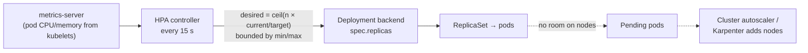

# Kubernetes HorizontalPodAutoscaler

> [!abstract] In one sentence
> A HorizontalPodAutoscaler (HPA) **adjusts the replica count** of a Deployment or StatefulSet between a minimum and a maximum so that a **metric** (average CPU relative to requests, memory, requests per second, queue length…) stays near a **target**, computing `desired = ceil(current × currentValue / target)` every 15 seconds, scaling up quickly and down cautiously. It scales **pods**, not machines: adding nodes is the cluster autoscaler's job.

## Build-up: Black Friday traffic

### Stage 1: a fixed replica count

The backend runs 3 replicas. Normal traffic: 40% CPU (central processing unit). Black Friday: traffic ×4, CPU pinned at 100%, latency climbs, readiness probes start failing, pods are removed from the Service, the remaining ones get even more load. Someone runs `kubectl scale --replicas=12` at 9 a.m., forgets to scale back, and pays for 12 replicas all week.

### Stage 2: an HPA on CPU

```yaml
apiVersion: autoscaling/v2
kind: HorizontalPodAutoscaler
metadata:
  name: backend
  namespace: shop
spec:
  scaleTargetRef:
    apiVersion: apps/v1
    kind: Deployment
    name: backend
  minReplicas: 3
  maxReplicas: 20
  metrics:
    - type: Resource
      resource:
        name: cpu
        target:
          type: Utilization
          averageUtilization: 60          # 60% of the pods' CPU REQUEST, on average
```

The controller's loop (every 15 s):

```
desired = ceil( currentReplicas × currentMetric / target )

3 pods at 90% average, target 60%:  ceil(3 × 90 / 60) = ceil(4.5) = 5 pods
5 pods at 70%:                       ceil(5 × 70 / 60) = ceil(5.83) = 6 pods
6 pods at 58%:                       within the 10% tolerance → no change
```



- **Utilization is relative to requests**: 60% of a 250m request is 150m. Pods without CPU requests can't be autoscaled on CPU utilization at all
- It needs a **metrics source**: the `metrics-server` add-on for CPU and memory (the Resource Metrics API (application programming interface)), an adapter (Prometheus Adapter, KEDA) for custom and external metrics
- The HPA writes `spec.replicas` of the Deployment. **Remove `replicas` from the Deployment's manifest**, or every apply resets it ([[Kubernetes Deployment]])

### Stage 3: better metrics than CPU

CPU is a proxy. The shop cares about load and latency:

```yaml
  metrics:
    - type: Pods                       # average of a per-pod custom metric
      pods:
        metric: { name: http_requests_per_second }
        target: { type: AverageValue, averageValue: "100" }   # 100 req/s per pod
    - type: External                   # a metric from outside the cluster
      external:
        metric:
          name: queue_messages_ready
          selector: { matchLabels: { queue: orders } }
        target: { type: AverageValue, averageValue: "30" }    # 30 queued messages per worker
```

With several metrics, the HPA computes a desired count for each and takes the **highest**. Queue-based scaling fits workers well: the backlog per worker is exactly what matters ([[Messaging]]).

**KEDA** (Kubernetes Event-Driven Autoscaling) builds on the HPA with ready-made scalers (Kafka lag, SQS (Simple Queue Service) depth, cron schedules…) and adds what the HPA can't do by default: scaling **to zero** replicas and back when events arrive.

### Stage 4: behaviour, or avoiding flapping

Load is noisy: scaling down as soon as CPU dips, then back up a minute later, churns pods and cold caches. Defaults: scale up immediately (up to doubling, or +4 pods, per 15 s), scale down only after a **5-minute stabilization window** (the highest recommendation of the last 5 minutes is used). Tunable:

```yaml
  behavior:
    scaleUp:
      stabilizationWindowSeconds: 0
      policies:
        - { type: Percent, value: 100, periodSeconds: 30 }   # at most double every 30 s
    scaleDown:
      stabilizationWindowSeconds: 600                        # wait 10 minutes of lower load
      policies:
        - { type: Pods, value: 2, periodSeconds: 60 }        # remove at most 2 pods a minute
```

### Stage 5: the other autoscalers

| Autoscaler | Scales | Notes |
|---|---|---|
| **HPA** | Number of pods | Built in |
| **VPA** (VerticalPodAutoscaler) | Requests and limits of pods | Add-on. Recommends or applies right-sized requests; don't let both HPA and VPA act on CPU for the same pods |
| **Cluster Autoscaler / Karpenter** | Number of **nodes** | Adds nodes when pods are `Pending` for lack of room, removes underused ones |
| **KEDA** | Pods, from event sources, including to zero | Drives an HPA |

They chain: HPA adds pods → pods don't fit → cluster autoscaler adds a node → pods start. That chain takes **minutes** (a new machine must boot), so `minReplicas` and spare capacity must absorb the first spike.

## Advanced problems

### 1. `<unknown>` targets, no scaling
`kubectl get hpa` shows `cpu: <unknown>/60%`: metrics-server isn't installed or working, or the pods have no CPU requests. `kubectl describe hpa` gives the reason.

### 2. Scale-up does nothing
The HPA raised replicas, but new pods are `Pending` (no node room, no cluster autoscaler), or blocked by a [[Kubernetes ResourceQuota and LimitRange|ResourceQuota]], or `maxReplicas` is reached. The HPA did its job; the capacity wasn't there.

### 3. Startup CPU spikes trigger more scaling
New pods burn CPU while starting (JIT (just-in-time) compilation, cache warm-up), raising the average and triggering more scale-up. The HPA partly ignores pods that aren't ready yet, but slow-starting apps need readiness probes that only pass once warm, and a scale-up policy that isn't too aggressive.

### 4. Memory-based scaling that never scales down
Many runtimes don't give memory back, so average memory stays high after the spike and replicas never drop. Memory is rarely a good HPA metric; use load metrics.

## Easy to get wrong
- No CPU requests: utilization can't be computed
- `replicas:` in the Deployment manifest alongside an HPA
- Expecting the HPA to add nodes
- Expecting instant scale-down (5-minute window by default)
- HPA and VPA both acting on CPU for the same workload
- `minReplicas: 1` for a service that must survive a pod failure
- Scaling on memory for runtimes that don't release it

## Related
- Scales:: [[Kubernetes Deployment]], [[Kubernetes StatefulSet]]
- Depends on:: [[Kubernetes Pod]] (requests), [[Kubernetes Node]] (capacity)
- Limited by:: [[Kubernetes ResourceQuota and LimitRange]]
- Queue-based scaling:: [[Messaging]], [[SQS]]
- In AWS (Amazon Web Services):: [[Auto Scaling]] (the EC2 (Elastic Compute Cloud) equivalent: target tracking)
- Overview:: [[Kubernetes]], [[Kubernetes worked example]]
- Area:: [[Containers]]

## Flashcards
#flashcards

What does an HPA change? :: The replica count of its target (Deployment, StatefulSet), within min and max
HPA formula? :: desired = ceil(currentReplicas × currentMetric / target)
CPU averageUtilization is relative to? :: The pods' CPU requests
What does the HPA need for CPU metrics? :: metrics-server (Resource Metrics API) and CPU requests on the pods
How often does the HPA evaluate? :: Every 15 seconds
Default scale-down stabilization window? :: 5 minutes
With several metrics, which count does the HPA pick? :: The highest desired count
HPA vs VPA vs Cluster Autoscaler? :: Pod count; pod requests/limits; node count
What does KEDA add? :: Event-driven scalers and scaling to zero
Why does an HPA show <unknown> targets? :: No metrics (metrics-server missing) or no requests on the pods
