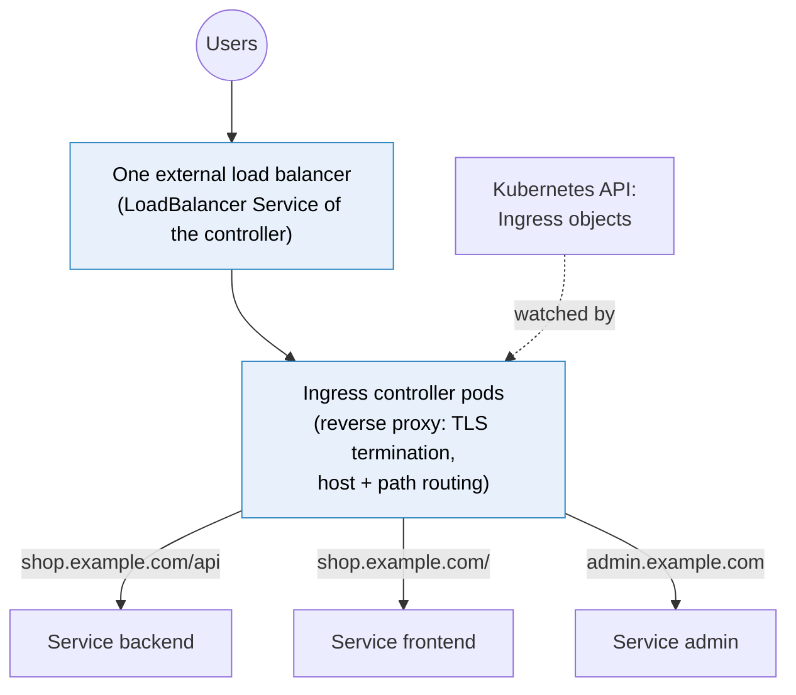

# Kubernetes Ingress

> [!abstract] In one sentence
> An Ingress is a set of **HTTP routing rules** (host and path → [[Kubernetes Service]], plus TLS certificates) that an **ingress controller**, a reverse proxy running in the cluster, reads and implements, so many services share **one external entry point**. The **Gateway API** (GatewayClass, Gateway, HTTPRoute) is its newer, more expressive successor, and is what new clusters increasingly use.

## Build-up: putting the shop on the internet

### Stage 1: one load balancer per service

The shop has a frontend, a backend API (application programming interface) and an admin app. Making each a `type: LoadBalancer` Service gives three external load balancers, three IP (Internet Protocol) addresses, three places to install TLS (Transport Layer Security) certificates, and no way to route `shop.example.com/api` to one service and `/` to another: a Layer 4 load balancer doesn't read HTTP (Hypertext Transfer Protocol).

What's needed is **one** Layer 7 entry point that reads the host and path and forwards to the right Service: a [[Reverse proxy]].

### Stage 2: the Ingress and its controller

```yaml
apiVersion: networking.k8s.io/v1
kind: Ingress
metadata:
  name: shop
  namespace: shop
  annotations:
    cert-manager.io/cluster-issuer: letsencrypt     # optional: cert-manager issues the certificate
spec:
  ingressClassName: nginx                            # which controller handles this Ingress
  tls:
    - hosts: [shop.example.com, admin.example.com]
      secretName: shop-tls                           # a Secret of type kubernetes.io/tls
  rules:
    - host: shop.example.com
      http:
        paths:
          - path: /api
            pathType: Prefix
            backend: { service: { name: backend, port: { number: 80 } } }
          - path: /
            pathType: Prefix
            backend: { service: { name: frontend, port: { number: 80 } } }
    - host: admin.example.com
      http:
        paths:
          - path: /
            pathType: Prefix
            backend: { service: { name: admin, port: { number: 80 } } }
```



- The **Ingress** object is only rules. Without a controller installed, nothing happens: no error, no traffic
- The **controller** watches Ingress objects (and the Services' EndpointSlices), configures its proxy, and is itself exposed with a `LoadBalancer` or `NodePort` Service. Many controllers send traffic **directly to pod IPs** from the EndpointSlices, skipping the ClusterIP
- **`ingressClassName`** picks the controller when several are installed (an `IngressClass` object names each); a class marked default handles Ingresses without one
- **`pathType`**: `Prefix` (matches `/api`, `/api/`, `/api/cart` by path segment), `Exact`, or `ImplementationSpecific` (controller's own rules). The longest matching path wins
- **TLS**: the certificate and key come from a Secret of type `kubernetes.io/tls` in the same namespace; cert-manager can create and renew it automatically ([[Certificates and PKI]])

### Stage 3: the limits of Ingress

The Ingress API was kept deliberately small and is now frozen. Everything beyond host/path routing and TLS is done through **controller-specific annotations**:

```yaml
  annotations:
    nginx.ingress.kubernetes.io/rewrite-target: /$2
    nginx.ingress.kubernetes.io/proxy-body-size: 20m
    nginx.ingress.kubernetes.io/canary: "true"
    nginx.ingress.kubernetes.io/canary-weight: "10"
```

Problems with that:
- Annotations aren't portable: switching controllers means rewriting them all
- They aren't validated: a typo in an annotation is silently ignored
- Header matching, traffic splitting, timeouts, retries, TCP (Transmission Control Protocol) and UDP (User Datagram Protocol) routing: all non-standard or impossible
- One object mixes concerns of the **cluster operator** (which load balancer, which certificates are allowed) and the **app team** (paths)

### Stage 4: the Gateway API

The Gateway API splits the same job into objects owned by different roles:

| Object | Owner | Says |
|---|---|---|
| **GatewayClass** | Platform / infrastructure provider | "This is an Envoy-based gateway implementation" |
| **Gateway** | Cluster operator | "One entry point listening on 443 for `*.example.com`, with this certificate, and routes from namespaces labelled `team=shop` may attach" |
| **HTTPRoute** (also GRPCRoute, TCPRoute…) | App team, in its own namespace | "On `shop.example.com`, `/api` goes to Service `backend`" |

```yaml
apiVersion: gateway.networking.k8s.io/v1
kind: HTTPRoute
metadata:
  name: shop
  namespace: shop
spec:
  parentRefs:
    - { name: public, namespace: infra }      # attach to the operator's Gateway
  hostnames: [shop.example.com]
  rules:
    - matches:
        - path: { type: PathPrefix, value: /api }
      backendRefs:
        - { name: backend-v1, port: 80, weight: 90 }    # canary: standard weighted routing
        - { name: backend-v2, port: 80, weight: 10 }
    - matches:
        - path: { type: PathPrefix, value: / }
      backendRefs:
        - { name: frontend, port: 80 }
```

Weighted backends, header matching, redirects, rewrites and timeouts are **part of the spec**, validated and portable across implementations (Envoy Gateway, Istio, Cilium, Kong, Traefik, cloud gateways). That makes canary releases ([[Deployment strategies]]) a standard field instead of an annotation.

> [!info] Which to use
> Existing clusters run Ingress everywhere, and it isn't going away. But the Ingress API gets no new features, and the widely used community **ingress-nginx** controller was retired in 2026. New platforms usually start with a Gateway API implementation; Ingress knowledge still matters for reading and migrating existing setups.

## Advanced problems

### 1. 404 from the controller for every request
The Ingress has no (or the wrong) `ingressClassName`, so no controller picked it up, or the `host` doesn't match the requested name. `kubectl describe ingress` shows whether an address was assigned and which backends were resolved.

### 2. 503 Service Unavailable
The Ingress points to a Service with no ready endpoints (selector mismatch, failing readiness). Check the Service's EndpointSlices ([[Kubernetes Service]]).

### 3. The backend gets `/api/cart` instead of `/cart`
Ingress forwards the full path. The app must serve under `/api`, or the path is rewritten (controller annotation, or a `URLRewrite` filter in an HTTPRoute).

### 4. The app sees the controller's IP as the client
The controller is a proxy: the real client is in `X-Forwarded-For`. The app must trust that header only from the controller, and the controller's own Service needs `externalTrafficPolicy: Local` (or the PROXY protocol from the load balancer) to know the real client IP in the first place (see [[Reverse proxy]]).

## Easy to get wrong
- Creating an Ingress in a cluster with no controller installed
- Forgetting `ingressClassName` when several controllers exist
- Expecting Ingress to route TCP/UDP: HTTP and HTTPS (HTTP over TLS) only
- Annotations copied from another controller's docs: silently ignored
- The TLS Secret in a different namespace than the Ingress
- Treating "Ingress" (the object) and NetworkPolicy "ingress" (incoming traffic rules) as related

## Related
- Routes to:: [[Kubernetes Service]]
- Implemented by:: [[Reverse proxy]], [[Load balancing]]
- Not to confuse with:: [[Ingress and egress]] (the general idea of traffic in vs out)
- Certificates:: [[TLS]], [[Certificates and PKI]], [[Kubernetes Secret]]
- Canary routing:: [[Deployment strategies]]
- Overview:: [[Kubernetes]], [[Kubernetes worked example]]
- Area:: [[Containers]]

## Flashcards
#flashcards

What is an Ingress? :: HTTP routing rules (host/path → Service, TLS) implemented by an ingress controller
What happens to an Ingress with no controller installed? :: Nothing: no traffic, no error
What does ingressClassName select? :: Which ingress controller handles the Ingress
pathType values? :: Prefix, Exact, ImplementationSpecific
Which path wins in an Ingress? :: The longest match
Where does an Ingress get its TLS certificate? :: A kubernetes.io/tls Secret in the same namespace (often created by cert-manager)
Why are Ingress annotations a problem? :: Controller-specific, not portable, not validated
What is the Gateway API? :: The successor to Ingress: GatewayClass, Gateway, HTTPRoute (and other routes), split by role
GatewayClass vs Gateway vs HTTPRoute owners? :: Infrastructure provider; cluster operator; app team
How does Gateway API do a canary? :: Weighted backendRefs in an HTTPRoute
Can Ingress route TCP or UDP? :: No, HTTP/HTTPS only
