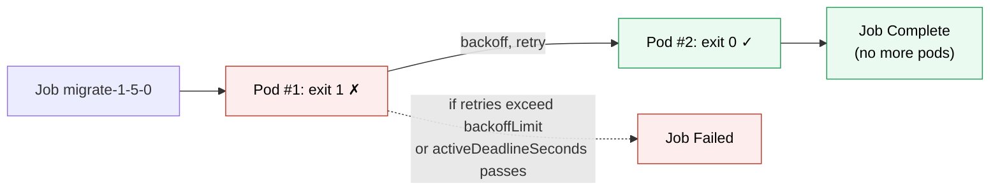

# Kubernetes Job

> [!abstract] In one sentence
> A Job runs pods **until a task completes successfully**, then stops: it retries failed pods up to `backoffLimit`, can run several pods **in parallel** or a fixed number of **completions**, and records success or failure. It's for migrations, batch processing, one-off scripts and anything that should **finish** rather than run forever.

## Build-up: running the database migration

### Stage 1: why not a Deployment?

Release 1.5.0 needs `./app migrate` to run once before the new backend starts. A [[Kubernetes Deployment]] keeps pods running: when `migrate` exits with 0, the Deployment restarts it (its pods only allow `restartPolicy: Always`), forever. A bare [[Kubernetes Pod]] runs once but isn't retried if its node dies, and nothing tracks whether it succeeded.

### Stage 2: the Job

```yaml
apiVersion: batch/v1
kind: Job
metadata:
  name: migrate-1-5-0
  namespace: shop
spec:
  backoffLimit: 3                  # failed pods retried up to 3 times (default 6)
  activeDeadlineSeconds: 900       # give up after 15 minutes in total, whatever happens
  ttlSecondsAfterFinished: 86400   # delete the Job (and its pods) one day after it finishes
  template:
    spec:
      restartPolicy: Never         # Never or OnFailure; Always isn't allowed
      containers:
        - name: migrate
          image: registry.example.com/shop-backend:1.5.0
          command: ["./app", "migrate"]
          envFrom:
            - configMapRef: { name: backend-config }
            - secretRef: { name: database-secret }
```



```bash
kubectl -n shop get jobs
kubectl -n shop wait --for=condition=complete job/migrate-1-5-0 --timeout=15m
kubectl -n shop logs job/migrate-1-5-0
```

- `restartPolicy: Never`: a failed container makes a **new pod** (the failed one is kept, with its logs). `OnFailure`: the container is restarted **in the same pod** (fewer pods, but logs of earlier attempts are lost)
- Retries back off exponentially (10 s, 20 s, 40 s…, capped at 6 minutes)
- Finished pods are **kept** (for their logs) until the Job is deleted, which `ttlSecondsAfterFinished` automates

### Stage 3: parallel work

A Job can run many pods for one task:

| Settings | Pattern |
|---|---|
| `completions: 1, parallelism: 1` (default) | One task, one pod at a time |
| `completions: 10, parallelism: 3` | 10 successful pods needed, 3 at a time |
| `completions: 10, parallelism: 10, completionMode: Indexed` | 10 pods, each gets `JOB_COMPLETION_INDEX` 0 to 9: "process shard N" |
| `completions` unset, `parallelism: 5` | Work-queue: 5 workers pull from a queue; the Job is complete when one succeeds and all have stopped |

Indexed Jobs are the simplest way to split a big batch: the image reads its index and processes `orders-shard-$JOB_COMPLETION_INDEX`.

### Stage 4: failing smartly

- `backoffLimit` counts failed pods for the whole Job (or per index, with `backoffLimitPerIndex`)
- `podFailurePolicy` distinguishes failures: **fail the Job immediately** on exit code 42 (a bug, retrying won't help), **ignore** pod disruptions (node drained: retry without counting it)
- `activeDeadlineSeconds` bounds the total time, retries included

> [!warning] A Job's pod can run more than once
> Retries, node failures and evictions mean the same task may run twice, partly or fully. The work must be **idempotent**: a migration tool that records applied steps, a batch that upserts instead of inserting, an email job that records what it sent.

## Jobs in a release pipeline

Migrations as Jobs are common: create the Job, `kubectl wait` for completion, then update the Deployment (Helm does this with hooks). Two details:
- The **Job's pod template can't be changed** after creation, and a Job name can't be reused while the old one exists: name Jobs per release (`migrate-1-5-0`) or delete the old one first
- The migration runs while the old version still serves, and the rolling update runs both versions together: changes must be backward compatible ([[Deployment strategies#Stage 8: the database problem, and expand/contract]])

For a schedule, a [[Kubernetes CronJob]] creates Jobs.

## Advanced problems

### 1. The Job never completes because of a sidecar
A service mesh proxy or log shipper added as a regular container keeps running after the main container exits, so the pod never finishes. Native sidecars (init containers with `restartPolicy: Always`) are stopped automatically when the main containers finish (see [[Kubernetes Pod]]).

### 2. Thousands of finished pods
Jobs created often (by CronJobs or pipelines) without `ttlSecondsAfterFinished` leave every pod behind, slowing `kubectl get pods` and loading the API (application programming interface) server. Set a TTL (time to live).

### 3. The Job is retried on a deterministic failure
A bug fails every attempt, wasting `backoffLimit` retries with growing delays. Use `podFailurePolicy` with `FailJob` on the exit codes that mean "won't work next time".

## Easy to get wrong
- Using a Deployment or bare pod for run-to-completion work
- `restartPolicy: Always` (rejected for Jobs)
- Non-idempotent tasks: a retried pod repeats side effects
- Reusing a Job name across releases
- No `ttlSecondsAfterFinished`: finished pods pile up
- `OnFailure` when the logs of failed attempts matter

## Related
- Scheduled by:: [[Kubernetes CronJob]]
- Runs:: [[Kubernetes Pod]]
- Differs from:: [[Kubernetes Deployment]]
- Release use:: [[Deployment strategies]], [[Kubernetes worked example]]
- Overview:: [[Kubernetes]]
- Area:: [[Containers]]

## Flashcards
#flashcards

What is a Job? :: A controller that runs pods until a task completes successfully, retrying failures
restartPolicy allowed for Job pods? :: Never (new pod per failure) or OnFailure (restart in place). Not Always
What does backoffLimit do? :: Number of retries before the Job is marked failed (default 6)
What does activeDeadlineSeconds do on a Job? :: Fails the Job after that total time, retries included
What does ttlSecondsAfterFinished do? :: Deletes the finished Job and its pods after that time
completions vs parallelism? :: How many successful pods are needed vs how many run at once
What is an Indexed Job? :: Each pod gets a JOB_COMPLETION_INDEX, to process its own shard
Why must Job work be idempotent? :: Retries, node failures and evictions can run it more than once
What does podFailurePolicy allow? :: Failing the Job immediately on some exit codes, or ignoring disruptions
Why can a Job with a sidecar never complete? :: A regular sidecar container keeps running; use a native sidecar (init container with restartPolicy: Always)
