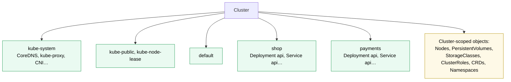

# Kubernetes Namespace

> [!abstract] In one sentence
> A Namespace is a **named partition of the cluster's objects**: names are unique within it, and permissions (RBAC), quotas, default limits, network policies and pod security rules are applied **per namespace**. It's an **administrative** boundary that makes those controls possible, not an isolation boundary by itself: without them, pods in different namespaces still share nodes and can reach each other over the network.

## Build-up: three teams on one cluster

### Stage 1: one big shared space

The shop team, the payments team and the data team deploy to one cluster. Two teams want a Deployment called `api`. Nobody can tell whose pods are using all the memory. Giving the payments team access to "their" objects is impossible, because nothing groups them.

### Stage 2: namespaces

```yaml
apiVersion: v1
kind: Namespace
metadata:
  name: shop
  labels:
    team: shop
    pod-security.kubernetes.io/enforce: restricted    # see stage 4
```

```bash
kubectl create namespace shop
kubectl -n shop get pods
kubectl config set-context --current --namespace=shop   # stop typing -n shop
kubectl get pods -A                                      # all namespaces
```



Both teams now have a Deployment named `api`. Built-in namespaces:
- `default`: where objects go when no namespace is given. Better left empty in production
- `kube-system`: the cluster's own components
- `kube-public`: readable by everyone, rarely used
- `kube-node-lease`: one Lease object per node, the nodes' heartbeats ([[Kubernetes Node]])

Not everything is namespaced: Nodes, PersistentVolumes, StorageClasses, ClusterRoles, CustomResourceDefinitions and Namespaces themselves are **cluster-scoped** (`kubectl api-resources --namespaced=false`).

DNS (Domain Name System) names include the namespace: Service `api` in `payments` is `api.payments.svc.cluster.local`; from `shop`, plain `api` means shop's own.

### Stage 3: what hangs off a namespace

The namespace itself does little. Its value is that **other controls are scoped to it**:

| Control | Per namespace |
|---|---|
| [[Kubernetes RBAC]] | RoleBindings: the shop team gets `edit` in `shop` only |
| [[Kubernetes ResourceQuota and LimitRange]] | Total CPU (central processing unit), memory, objects for `payments`; default requests for pods that forget |
| [[Kubernetes NetworkPolicy]] | Default deny in `payments`, allow only from the ingress controller |
| Pod Security admission | `restricted` in app namespaces, `privileged` only where node agents run |
| [[Kubernetes Secret]] visibility | Secrets are only mountable by pods in the same namespace |

### Stage 4: Pod Security admission

The API (application programming interface) server checks pods against three built-in **Pod Security Standards**, chosen by namespace labels:

| Level | Allows |
|---|---|
| `privileged` | Anything (node agents, CNI (Container Network Interface) plugins) |
| `baseline` | Blocks known privilege escalations: host namespaces, privileged containers, hostPath |
| `restricted` | Baseline plus hardening: non-root, no privilege escalation, dropped capabilities, seccomp profile |

Each level can be set in `enforce` (reject), `audit` (log) or `warn` (warn the client) mode:

```yaml
  labels:
    pod-security.kubernetes.io/enforce: baseline
    pod-security.kubernetes.io/warn: restricted     # see what would break before tightening
```

This matters because "can create pods" otherwise means "can take over the node" (see [[Kubernetes RBAC#The permissions that are more than they look]]).

### Stage 5: namespaces vs real isolation

A namespace **doesn't** isolate:
- **The network**: pods across namespaces reach each other unless NetworkPolicies say otherwise
- **Nodes**: pods from `shop` and `payments` share kernels. A container escape on a shared node crosses namespaces
- **Cluster-scoped objects**: CRDs (CustomResourceDefinition), StorageClasses, node resources are shared
- **The control plane**: one namespace flooding the API server slows everyone

For teams that trust each other moderately (one company), namespaces plus RBAC, quotas, NetworkPolicies and Pod Security give **soft multi-tenancy**. For untrusted tenants, separate node pools (taints, see [[Kubernetes Node]]), sandboxed runtimes (gVisor, Kata Containers), or separate clusters.

## Advanced problems

### 1. A namespace stuck in `Terminating`
Deleting a namespace deletes everything in it, and waits. If an object has a **finalizer** whose controller is gone (a CRD's operator uninstalled first), or an API service is unavailable, deletion never completes. `kubectl get namespace shop -o yaml` shows the conditions; the fix is to restore the controller or remove the stuck finalizers after understanding why they're there.

### 2. Deleting a namespace deleted the data
All PVCs (PersistentVolumeClaim) in it were deleted, and with a `Delete` reclaim policy, their disks ([[Kubernetes StorageClass]]). Namespace deletion is the most destructive single command in a cluster: restrict who can do it.

### 3. Everything ended up in `default`
Manifests without `metadata.namespace` applied with no `-n` land in `default`. Set the namespace in manifests (or Kustomize), and give `default` a quota of zero to catch mistakes.

## Easy to get wrong
- Treating a namespace as a security boundary on its own
- Expecting cluster-scoped objects (PVs, StorageClasses, CRDs) to belong to a namespace
- Calling a Service in another namespace by its short name
- Deleting a namespace casually: it deletes all its objects and possibly disks
- Running workloads in `default` or `kube-system`

## Related
- Scoped to it:: [[Kubernetes RBAC]], [[Kubernetes ResourceQuota and LimitRange]], [[Kubernetes NetworkPolicy]], [[Kubernetes Secret]], [[Kubernetes ServiceAccount]]
- Not scoped:: [[Kubernetes Node]], [[Kubernetes StorageClass]], [[Kubernetes CustomResourceDefinition]]
- Concepts:: [[Network interfaces]] (Linux network namespaces, a different thing)
- Overview:: [[Kubernetes]], [[Kubernetes worked example]]
- Area:: [[Containers]]

## Flashcards
#flashcards

What is a Kubernetes namespace? :: A named partition of objects: unique names inside, and the scope for RBAC, quotas, NetworkPolicies and pod security
Is a namespace a security boundary by itself? :: No: network, nodes and cluster-scoped objects are shared unless other controls are added
Examples of cluster-scoped objects? :: Nodes, PersistentVolumes, StorageClasses, ClusterRoles, CRDs, Namespaces
What is kube-node-lease for? :: Node heartbeat Lease objects
How do you reach Service api in namespace payments from shop? :: api.payments (or api.payments.svc.cluster.local)
What are the Pod Security Standards levels? :: privileged, baseline, restricted
How is Pod Security admission configured? :: Namespace labels pod-security.kubernetes.io/<enforce|audit|warn>: <level>
What happens when you delete a namespace? :: Every object in it is deleted (including PVCs, and disks with a Delete reclaim policy)
Why does a namespace get stuck Terminating? :: Objects with finalizers whose controller is gone, or an unavailable API service
How do you change kubectl's default namespace? :: kubectl config set-context --current --namespace=<ns>
