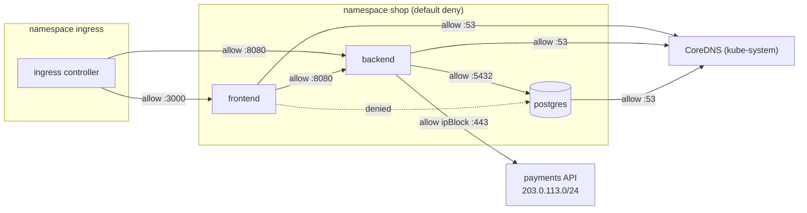

# Kubernetes NetworkPolicy

> [!abstract] In one sentence
> A NetworkPolicy is a **firewall rule for pods, written with labels**: it selects pods and lists which pods, namespaces or IP (Internet Protocol) ranges may connect **to** them (ingress) and which they may connect **to** (egress). Pods no policy selects accept everything; once selected, they accept **only** what some policy allows. The rules are **enforced by the network plugin**, not by Kubernetes itself, so on a plugin without support they do nothing.

## Build-up: locking down the shop's database

### Stage 1: everything can reach everything

By default the Kubernetes network is **flat**: any pod, in any namespace, can open a connection to any other pod. The PostgreSQL pod in `shop` is reachable from the frontend, from the monitoring namespace, from a compromised test pod in `dev`. If one container is broken into, the whole cluster is one hop away.

IP-based firewall rules don't fit: pod IPs change all the time. Rules must follow **labels**, like everything else in Kubernetes.

### Stage 2: a first policy

```yaml
apiVersion: networking.k8s.io/v1
kind: NetworkPolicy
metadata:
  name: postgres-from-backend
  namespace: shop
spec:
  podSelector:                     # the pods this policy applies to
    matchLabels: { app: postgres }
  policyTypes: [Ingress]           # incoming connections (no relation to the Ingress object)
  ingress:
    - from:
        - podSelector:
            matchLabels: { app: backend }
      ports:
        - { protocol: TCP, port: 5432 }
```

The semantics:
- Before this policy, `postgres` accepted everything. Now it's **selected** for ingress, so it accepts **only** connections allowed by some policy selecting it: TCP (Transmission Control Protocol) 5432 from pods labelled `app: backend` **in the same namespace**
- Policies are **additive allow-lists**: there are no deny rules, and several policies selecting the same pod combine as a union
- They're **stateful**: replies to an allowed connection are allowed automatically

| From | To postgres:5432 |
|---|---|
| backend pod (namespace `shop`) | ✓ |
| frontend pod | ✗ |
| any pod in another namespace | ✗ |

### Stage 3: default deny, then allow each flow

Selecting pods one policy at a time leaves every unselected pod open. The safer pattern is **deny by default** for the namespace, then explicit allows:

```yaml
apiVersion: networking.k8s.io/v1
kind: NetworkPolicy
metadata:
  name: default-deny
  namespace: shop
spec:
  podSelector: {}                  # every pod in the namespace
  policyTypes: [Ingress, Egress]   # no rules listed = nothing allowed in either direction
---
apiVersion: networking.k8s.io/v1
kind: NetworkPolicy
metadata:
  name: allow-dns
  namespace: shop
spec:
  podSelector: {}
  policyTypes: [Egress]
  egress:
    - to:
        - namespaceSelector:
            matchLabels: { kubernetes.io/metadata.name: kube-system }
          podSelector:
            matchLabels: { k8s-app: kube-dns }
      ports:
        - { protocol: UDP, port: 53 }
        - { protocol: TCP, port: 53 }
```

Then one allow per real flow: ingress controller → frontend and backend, frontend → backend, backend → postgres, backend → the payment provider's IP range (`ipBlock`).



`kubernetes.io/metadata.name` is a label every namespace gets automatically, so namespaces can be selected by name. UDP means User Datagram Protocol; DNS (Domain Name System) uses both UDP and TCP port 53.

### Stage 4: the AND/OR trap

The `from` list's structure changes the meaning completely:

```yaml
# ONE element with both selectors = AND:
# pods labelled app=prometheus that are IN namespaces labelled team=monitoring
  ingress:
    - from:
        - namespaceSelector: { matchLabels: { team: monitoring } }
          podSelector:       { matchLabels: { app: prometheus } }

# TWO elements = OR:
# ANY pod in namespaces labelled team=monitoring, OR pods labelled app=prometheus in THIS namespace
  ingress:
    - from:
        - namespaceSelector: { matchLabels: { team: monitoring } }
        - podSelector:       { matchLabels: { app: prometheus } }
```

One dash of YAML (YAML Ain't Markup Language) indentation turns a narrow rule into a wide one, and both are valid.

### Stage 5: what NetworkPolicies can't do

- **No enforcement without the plugin**: the API (application programming interface) accepts policies on every cluster; only a CNI (Container Network Interface) plugin that implements them (Calico, Cilium, and others) drops packets
- **No explicit deny, no priorities, no logging** in the standard API
- **Layer 3/4 only**: IPs, ports, protocols, nothing from HTTP (Hypertext Transfer Protocol). Not "allow `GET /orders` but not `DELETE`" (that's a [[Service mesh]] or Cilium's extended policies)
- **Namespace-scoped**: a cluster administrator can't set a guardrail every namespace must obey with standard NetworkPolicies alone. Plugin-specific cluster-wide policies (and newer upstream APIs under development) fill that gap
- **Identity is labels**: anyone who can create pods with `app: backend` in `shop` gets backend's access. RBAC (role-based access control) on who can create pods there matters ([[Kubernetes RBAC]])

## Advanced problems

### 1. Everything broke after adding egress rules
Default-deny egress without the DNS allow: every name lookup times out, which looks like "the database is down". Always allow port 53 to the cluster DNS first.

### 2. The policy "works" in the YAML but not in practice
Test the forbidden flow: `kubectl -n shop exec deploy/frontend -- nc -zv postgres 5432`. If it connects, the plugin doesn't enforce policies, or the `podSelector` matches nothing (label typo: the policy silently protects zero pods).

### 3. Health checks fail after default deny
Kubelet probes come from the node itself; most plugins always allow node-to-local-pod traffic, but some setups (or `ipBlock` rules excluding node ranges) block them, and pods go unready. Ingress controllers or load balancers sending health checks from node IPs need the same attention.

### 4. `ipBlock` and pod IPs
`ipBlock` is meant for addresses **outside** the cluster. Traffic to Services is translated to pod IPs before policies apply, so policies match pod IPs and labels, not ClusterIPs. Allowing "the ClusterIP of postgres" with an `ipBlock` doesn't work.

## Easy to get wrong
- Assuming policies are enforced without checking the CNI plugin
- Thinking pods are isolated by default (or by namespace)
- Forgetting DNS when denying egress
- One extra `-` in `from` turning AND into OR
- Label typos: a policy that selects nothing protects nothing
- Expecting deny rules or HTTP-level rules
- Confusing NetworkPolicy "Ingress" (direction) with the Ingress object

## Related
- Protects:: [[Kubernetes Pod]], [[Kubernetes Service]] (applies to pods behind it)
- Scoped by:: [[Kubernetes Namespace]]
- Who can create matching pods:: [[Kubernetes RBAC]]
- Concepts:: [[Ingress and egress]] (what the two rule lists mean), [[ACL]] (stateless vs stateful rule lists), [[Security groups]] (the AWS (Amazon Web Services) equivalent for instances), [[Service mesh]] (Layer 7 policies with identity)
- Overview:: [[Kubernetes]], [[Kubernetes architecture]] (CNI), [[Kubernetes worked example]]
- Area:: [[Containers]]

## Flashcards
#flashcards

What does a NetworkPolicy do? :: Allows connections to (ingress) and from (egress) the pods it selects, by labels, namespaces and IP blocks
Are pods isolated by default? :: No. Everything can reach everything until a policy selects the pod
What happens once a pod is selected by an Ingress-type policy? :: Only incoming traffic allowed by some policy is accepted
Can a NetworkPolicy deny traffic explicitly? :: No. Policies are additive allow-lists
Who enforces NetworkPolicies? :: The CNI plugin, if it supports them
What is a default-deny policy? :: podSelector: {} with policyTypes and no rules: nothing allowed for every pod in the namespace
What must you allow after a default-deny egress? :: DNS (UDP and TCP 53 to CoreDNS)
namespaceSelector and podSelector in one from element vs two? :: One element: AND (those pods in those namespaces). Two elements: OR
Are NetworkPolicies stateful? :: Yes: replies to allowed connections are allowed
Which label selects a namespace by name? :: kubernetes.io/metadata.name
Can NetworkPolicies filter HTTP methods or paths? :: No, Layer 3/4 only. Use a service mesh or plugin-specific policies
