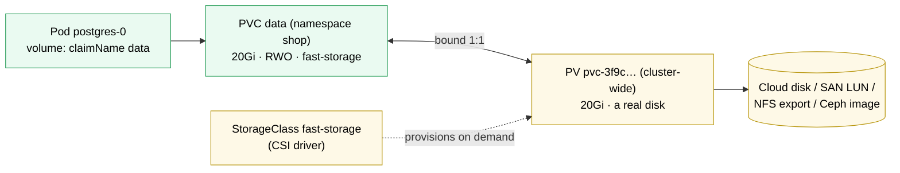

# Kubernetes PersistentVolumeClaim

> [!abstract] In one sentence
> A **PersistentVolumeClaim (PVC)** is a pod's request for storage ("20 GiB, read-write from one node, class `fast-storage`"); a **PersistentVolume (PV)** is an actual piece of storage in the cluster (a cloud disk, an NFS export, a Ceph volume). Kubernetes **binds** each claim to one volume, usually creating the volume on demand through a [[Kubernetes StorageClass]], and the pod mounts the claim by name. The split lets applications ask for storage without knowing where it comes from, and lets the data outlive any pod.

## Build-up: the database's data must survive the pod

### Stage 1: storage that dies with the pod

A container's filesystem is a writable layer that disappears with the container (see [[Docker]]). An `emptyDir` volume survives container restarts but is deleted with the pod. When the PostgreSQL pod is rescheduled to another node, its data must follow, which means storage that isn't tied to the pod **or** to the node.

### Stage 2: two objects, two roles



| | PersistentVolumeClaim | PersistentVolume |
|---|---|---|
| Who writes it | The app team | The cluster (dynamic provisioning) or an administrator (static) |
| Scope | **Namespaced** | **Cluster-wide** |
| Says | What I need: size, access mode, class | What exists: capacity, where it is, how to mount it |

```yaml
apiVersion: v1
kind: PersistentVolumeClaim
metadata:
  name: uploads
  namespace: shop
spec:
  accessModes: [ReadWriteOnce]
  storageClassName: fast-storage
  resources:
    requests: { storage: 20Gi }
---
# in the pod spec:
  volumes:
    - name: uploads
      persistentVolumeClaim: { claimName: uploads }
  containers:
    - name: backend
      volumeMounts: [{ name: uploads, mountPath: /var/lib/shop/uploads }]
```

For StatefulSets, `volumeClaimTemplates` creates one PVC per replica ([[Kubernetes StatefulSet]]).

### Stage 3: dynamic vs static provisioning

- **Dynamic** (normal): the PVC names a StorageClass; its CSI (Container Storage Interface) driver creates a new disk and a PV for it, and binds them. With `volumeBindingMode: WaitForFirstConsumer`, that happens only after the pod is scheduled, so the disk is created in the node's zone
- **Static**: an administrator creates PVs for existing storage (an NFS (Network File System) export, a pre-existing disk with data), and claims bind to a matching one by size, access mode and class. `storageClassName: ""` on a PVC means "no dynamic provisioning, bind to an existing PV only"

### Stage 4: access modes

| Mode | Meaning | Typical storage |
|---|---|---|
| **ReadWriteOnce (RWO)** | Read-write by **one node** (several pods on that node can share it) | Block disks: cloud disks, iSCSI (Internet Small Computer Systems Interface) LUNs (logical unit numbers), Ceph block devices |
| **ReadWriteOncePod (RWOP)** | Read-write by **one pod** only | Same, with a stricter guarantee |
| **ReadOnlyMany (ROX)** | Read-only by many nodes | Shared datasets |
| **ReadWriteMany (RWX)** | Read-write by many nodes | File storage: NFS, CephFS, cloud file services |

The mode must be supported by the storage: a block disk can't be RWX, because two machines writing one filesystem would corrupt it (see *[[Block, file and object storage]]*). A Deployment with several replicas across nodes sharing uploads needs RWX file storage (or, better, object storage accessed over HTTP (Hypertext Transfer Protocol)).

### Stage 5: lifecycle and reclaim

PV phases: `Available` → `Bound` → (claim deleted) `Released` → reclaimed or `Failed`. What happens when the claim is deleted is the PV's **reclaim policy**, inherited from its StorageClass:
- **Delete** (default for dynamic volumes): the PV **and the underlying disk** are deleted. The data is gone
- **Retain**: the PV stays `Released` with the data. It's **not** reusable automatically (it still references the old claim): an administrator recovers the data or clears `claimRef` to let a new claim bind it

Protections: a PVC used by a pod isn't deleted until the pod is gone (`kubernetes.io/pvc-protection` finalizer: it stays `Terminating`), and a bound PV isn't deleted while its claim exists.

Other operations:
- **Expansion**: edit `resources.requests.storage` upward if the class has `allowVolumeExpansion: true`; the driver grows the disk and the filesystem (sometimes on the next pod start). Shrinking isn't supported
- **Snapshots**: `VolumeSnapshot` objects (with a CSI driver that supports them) take point-in-time copies; a new PVC can be created from one (`dataSource`)
- **`volumeMode: Block`**: the pod gets a raw block device instead of a mounted filesystem (for databases that manage their own)

## Advanced problems

### 1. PVC stuck `Pending`
`kubectl describe pvc`: no StorageClass of that name, no default class, the CSI driver not installed or failing, or (with `WaitForFirstConsumer`) simply no pod using it yet, which is normal.

### 2. Pod stuck `ContainerCreating` with `Multi-Attach error`
An RWO disk is still attached to the old node (the pod moved, the old node is dead or slow to detach). The attach/detach controller waits about 6 minutes before force-detaching from an unreachable node. A rolling update of a single-replica Deployment with an RWO volume deadlocks the same way: use `strategy: Recreate`.

### 3. Pod `Pending` with `volume node affinity conflict`
The disk is in zone A and no node in zone A has room. Zonal block storage pins pods to its zone: keep capacity per zone, or use regional/replicated storage.

### 4. Data lost after deleting a namespace
Every PVC in it was deleted, and with `reclaimPolicy: Delete`, their disks too. Use `Retain` classes for important data, plus real backups (snapshots aren't backups if they live in the same system).

## Easy to get wrong
- Thinking RWO means one pod: it means one **node**
- Expecting RWX from block storage
- Deleting a PVC with a `Delete` reclaim policy and expecting the data to stay
- Expecting a `Released` PV to be reused automatically
- Rolling updates of single-replica Deployments with RWO volumes
- Forgetting zones: disks don't follow pods across zones
- Treating volume snapshots as backups

## Related
- Provisioned by:: [[Kubernetes StorageClass]]
- Created per replica by:: [[Kubernetes StatefulSet]]
- Mounted by:: [[Kubernetes Pod]]
- Storage concepts:: [[Mounting]], [[Partitions and filesystems]], [[NFS and SMB]], *[[iSCSI and SAN]]*, *[[Block, file and object storage]]*, *[[Snapshots]]*, *[[Backups]]*
- Overview:: [[Kubernetes]], [[Kubernetes worked example]]
- Area:: [[Containers]]

## Flashcards
#flashcards

PVC vs PV? :: A PVC is a namespaced request for storage. A PV is a cluster-wide piece of actual storage. They bind 1:1
What is dynamic provisioning? :: A StorageClass's CSI driver creates a PV (and disk) automatically for a new PVC
What does storageClassName: "" mean on a PVC? :: No dynamic provisioning: bind only to an existing PV
ReadWriteOnce means? :: Read-write mounted by one node (pods on that node can share it)
Which access mode guarantees a single pod? :: ReadWriteOncePod
Which storage supports ReadWriteMany? :: File storage (NFS, CephFS, cloud file services), not block disks
Reclaim policy Delete vs Retain? :: Delete removes the PV and disk with the claim. Retain keeps them (Released) for manual recovery
Is a Released PV reused automatically? :: No, it still references the old claim
Can a PVC be shrunk? :: No. It can be expanded if the StorageClass allows it
What is a Multi-Attach error? :: An RWO volume still attached to another node, blocking the new pod
Why does a single-replica Deployment with an RWO PVC deadlock on rolling update? :: The new pod waits for the volume the old pod holds; use Recreate
Why can a pod with a PVC be stuck Pending after a node failure? :: Its disk is zonal and no node in that zone has room
