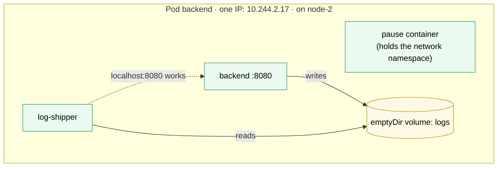

# Kubernetes Pod

> [!abstract] In one sentence
> A Pod is the smallest thing Kubernetes runs: **one or more containers scheduled together on one node**, sharing **one network namespace (one IP address, `localhost` between them)** and the pod's **volumes**, started and stopped as a unit. Pods are **disposable**: never repaired or moved, only replaced, which is why they're almost always created by a controller (Deployment, StatefulSet, DaemonSet, Job) rather than by hand.

## Build-up: why not just "a container"?

### Stage 1: one container is often not enough

The shop's backend writes logs to a file, and a log shipper must read that file and send it away. A thumbnail service needs its cache warmed **before** it starts. A legacy app only speaks plain HTTP (Hypertext Transfer Protocol), and a proxy must add TLS (Transport Layer Security) in front of it.

Each case is **two processes that must run on the same machine, share files or the network, and live and die together**. Scheduling them as two independent containers would let the scheduler put them on different nodes. Putting both processes in one image breaks the "one process per container" model (one crashes, who restarts it?).

So Kubernetes schedules a **group** of containers: the pod.

### Stage 2: what the containers of a pod share

```yaml
apiVersion: v1
kind: Pod
metadata:
  name: backend
  namespace: shop
  labels: { app: backend }
spec:
  volumes:
    - name: logs
      emptyDir: {}                       # a scratch directory that lives as long as the pod
  containers:
    - name: backend
      image: registry.example.com/shop-backend:1.4.0
      ports: [{ containerPort: 8080 }]
      volumeMounts: [{ name: logs, mountPath: /var/log/app }]
    - name: log-shipper
      image: registry.example.com/log-shipper:2.0
      volumeMounts: [{ name: logs, mountPath: /logs, readOnly: true }]
```



- **Network**: one IP (Internet Protocol) address and one port space for the whole pod. Containers talk over `localhost`, and two containers can't both listen on port 8080. A tiny **pause** container holds the namespace so it survives app container restarts (see [[Kubernetes architecture]])
- **Storage**: volumes are declared at pod level and mounted by any container. An `emptyDir` is created when the pod starts and deleted with it
- **Fate**: scheduled to one node together, deleted together. Each container still has its own filesystem, image, resources and restarts

> [!info] One container per pod is the normal case
> Several containers belong in one pod only when they're **inseparable** (a sidecar serving the main container). The frontend and the backend are **not** one pod: they scale differently, deploy separately, and talk over the network through a [[Kubernetes Service]].

### Stage 3: init containers and sidecars

```yaml
spec:
  initContainers:
    - name: wait-for-db                      # runs to completion before anything else starts
      image: postgres:17
      command: ["sh", "-c", "until pg_isready -h postgres; do sleep 2; done"]
    - name: log-shipper                      # a native sidecar: an init container that keeps running
      image: registry.example.com/log-shipper:2.0
      restartPolicy: Always
  containers:
    - name: backend
      image: registry.example.com/shop-backend:1.4.0
```

- **Init containers** run **one after the other, each to completion**, before the main containers start. If one fails, the kubelet retries it (per the pod's restart policy). Uses: wait for a dependency, fetch configuration, fix volume permissions
- **Sidecars** (init containers with `restartPolicy: Always`, stable since Kubernetes 1.33) start **before** the main containers, keep running alongside them, and are stopped **after** them. Before this existed, sidecars were ordinary containers, with two classic bugs: the app started before its proxy was ready, and a Job never completed because its log-shipper sidecar never exited

### Stage 4: the lifecycle

A pod's **phase** summarises where it is:

| Phase | Meaning |
|---|---|
| `Pending` | Accepted, but not running yet: waiting for a node (scheduling), pulling images, running init containers |
| `Running` | Bound to a node, at least one container running |
| `Succeeded` | All containers exited with 0 and won't restart (Jobs) |
| `Failed` | All containers stopped, at least one with an error, and won't restart |
| `Unknown` | The node stopped reporting |

Each **container** has its own state (`Waiting` with a reason like `ImagePullBackOff` or `CrashLoopBackOff`, `Running`, `Terminated` with an exit code and reason like `OOMKilled`), and the pod has **conditions** (`PodScheduled`, `Initialized`, `ContainersReady`, `Ready`). `Ready` is what a Service uses to decide whether to send traffic.

The pod's `restartPolicy` decides what the kubelet does when a container exits: `Always` (default; Deployments only allow this), `OnFailure` or `Never` (Jobs). Restarts happen **in place on the same node**, with an exponential back-off up to 5 minutes: that waiting state is `CrashLoopBackOff`.

### Stage 5: probes, resources and shutdown

```yaml
  containers:
    - name: backend
      image: registry.example.com/shop-backend:1.4.0
      resources:
        requests: { cpu: 250m, memory: 256Mi }
        limits:   { memory: 512Mi }
      startupProbe:   { httpGet: { path: /health, port: 8080 }, failureThreshold: 30, periodSeconds: 2 }
      readinessProbe: { httpGet: { path: /ready,  port: 8080 }, periodSeconds: 5 }
      livenessProbe:  { httpGet: { path: /health, port: 8080 }, periodSeconds: 10 }
      lifecycle:
        preStop: { sleep: { seconds: 5 } }          # let endpoint removal propagate before shutdown
      securityContext:
        runAsNonRoot: true
        allowPrivilegeEscalation: false
        readOnlyRootFilesystem: true
  terminationGracePeriodSeconds: 30
```

- **Probes**: startup (holds off the others while the app boots), readiness (in or out of Service traffic), liveness (restart the container). Each can be an HTTP GET, a TCP (Transmission Control Protocol) connect, a gRPC (Google's remote procedure call framework) check or a command
- **Requests and limits** decide scheduling and the **QoS (quality of service) class**, which decides who is evicted first when a node runs out of memory:

| QoS class | When | Evicted |
|---|---|---|
| **Guaranteed** | Every container has CPU (central processing unit) and memory requests **equal** to limits | Last |
| **Burstable** | At least one request or limit set, not Guaranteed | In between |
| **BestEffort** | No requests or limits at all | First |

- **Shutdown**: when a pod is deleted, it's removed from Service endpoints, the `preStop` hook runs, the containers get **SIGTERM** (the termination signal), and after `terminationGracePeriodSeconds` (30 s by default) whatever is left gets **SIGKILL (the kill signal, which can't be caught)** (see [[Inter-process communication]])

### Stage 6: why pods are never created by hand

The pod above runs on `node-2`. When `node-2` dies, the pod is marked failed and **nothing recreates it**: a pod is never rescheduled. Most of its spec is also immutable (only a few fields like the image can change in place), so "changing" a pod means deleting it and creating a new one with a new name and IP.

That's the job of controllers: a [[Kubernetes Deployment]] (through a [[Kubernetes ReplicaSet]]) for stateless replicas, a [[Kubernetes StatefulSet]] for stable identities, a [[Kubernetes DaemonSet]] for one per node, a [[Kubernetes Job]] for run-to-completion. They all contain a **pod template**: the spec above, without `apiVersion` and `kind`.

## Useful commands

```bash
kubectl -n shop get pods -o wide                 # phase, restarts, IP, node
kubectl -n shop describe pod backend-7d4f-x1     # events: scheduling, pulls, probe failures, OOM kills
kubectl -n shop logs backend-7d4f-x1 -c backend --previous   # the crashed run's logs
kubectl -n shop exec -it backend-7d4f-x1 -- sh
kubectl -n shop debug -it backend-7d4f-x1 --image=busybox --target=backend   # ephemeral debug container
kubectl -n shop get pod backend-7d4f-x1 -o yaml  # the full object, including status
```

`kubectl debug` adds an **ephemeral container** to a running pod: useful when the app image has no shell (distroless images).

## Advanced problems

### 1. `CrashLoopBackOff`
The container keeps exiting. `logs --previous` shows why; `describe` shows the exit code (`137` with reason `OOMKilled` = memory limit; `1` = app error). Missing configuration and unreachable dependencies at startup are the usual causes.

### 2. `Pending` forever
The scheduler can't place it: requests too big for any node, a taint without toleration, a node selector or affinity that matches nothing, an unbound volume claim. The events at the bottom of `describe` say which (see [[Kubernetes Node]]).

### 3. OOM kills with plenty of free memory on the node
An OOM (out of memory) kill follows the **container's** limit, not the node's free memory. A JVM (Java Virtual Machine) or Node.js process sized for the machine instead of the container exceeds its limit. Set runtime heap sizes from the limit.

### 4. CPU throttling with low average CPU
A CPU limit is enforced per 100 ms period: a burst that uses the whole quota early waits for the rest of the period, adding latency even though the average is low. Many teams set CPU **requests** but no CPU **limits** for latency-sensitive services.

### 5. Dropped requests during rollouts
Endpoint removal and SIGTERM happen at the same time, so requests still arrive for a moment after the app starts shutting down. A short `preStop` sleep and an app that drains on SIGTERM fix it.

## Easy to get wrong
- Putting several independent services in one pod: they then scale and deploy together
- Creating bare pods in production: nothing recreates them
- Expecting a pod to move to another node: it's replaced, with a new name and IP
- Two containers in one pod listening on the same port
- Using `latest` image tags: nodes can run different images under one name
- No requests: BestEffort, evicted first, and invisible to autoscaling
- Liveness probes that check dependencies
- Ignoring SIGTERM: in-flight requests cut at every deploy

## Related
- Created by:: [[Kubernetes ReplicaSet]], [[Kubernetes Deployment]], [[Kubernetes StatefulSet]], [[Kubernetes DaemonSet]], [[Kubernetes Job]]
- Reached through:: [[Kubernetes Service]]
- Configured by:: [[Kubernetes ConfigMap]], [[Kubernetes Secret]], [[Kubernetes ServiceAccount]]
- Storage:: [[Kubernetes PersistentVolumeClaim]]
- The YAML fields (PodSpec):: [[Kubernetes manifest syntax]]
- Runs on:: [[Kubernetes Node]]
- Overview:: [[Kubernetes]], [[Kubernetes architecture]], [[Kubernetes worked example]]
- Under the hood:: [[Docker]] (images, PID 1), [[Network interfaces]] (namespaces, veth)
- Area:: [[Containers]]

## Flashcards
#flashcards

What is a pod? :: One or more containers scheduled together on one node, sharing one network namespace and the pod's volumes
What do containers in one pod share? :: The IP address and port space (localhost), declared volumes, and their fate (scheduled and deleted together)
When do two containers belong in the same pod? :: Only when inseparable, like a sidecar serving the main container
What is an init container? :: A container that runs to completion before the main containers start, one after another
What is a native sidecar container? :: An init container with restartPolicy: Always: starts before the app, runs alongside it, stops after it
The five pod phases? :: Pending, Running, Succeeded, Failed, Unknown
What is CrashLoopBackOff? :: The kubelet waiting longer and longer (up to 5 minutes) between restarts of a container that keeps exiting
Pod restartPolicy values? :: Always (default, Deployments), OnFailure, Never (Jobs)
QoS classes and eviction order? :: BestEffort (no requests/limits) first, then Burstable, Guaranteed (requests = limits) last
What happens when a pod is deleted? :: Removed from endpoints, preStop runs, SIGTERM, then SIGKILL after terminationGracePeriodSeconds (30 s)
Is a pod rescheduled when its node dies? :: No. A controller creates a new pod elsewhere
What is the pause container? :: The container holding the pod's network namespace
What does kubectl debug do on a pod? :: Adds an ephemeral container (with tools) to a running pod
Exit code 137 with OOMKilled? :: The container exceeded its memory limit
