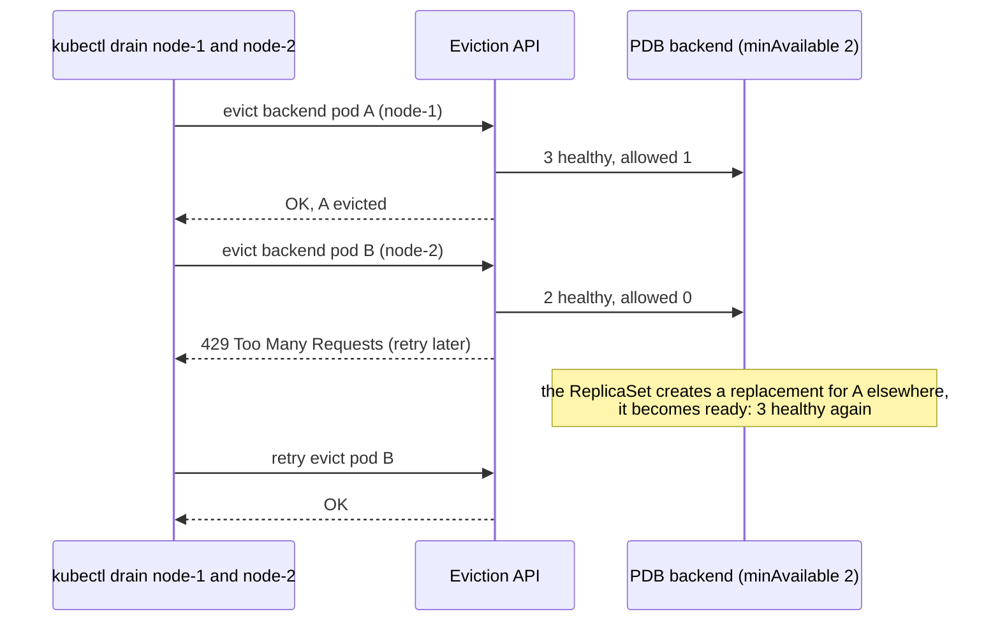
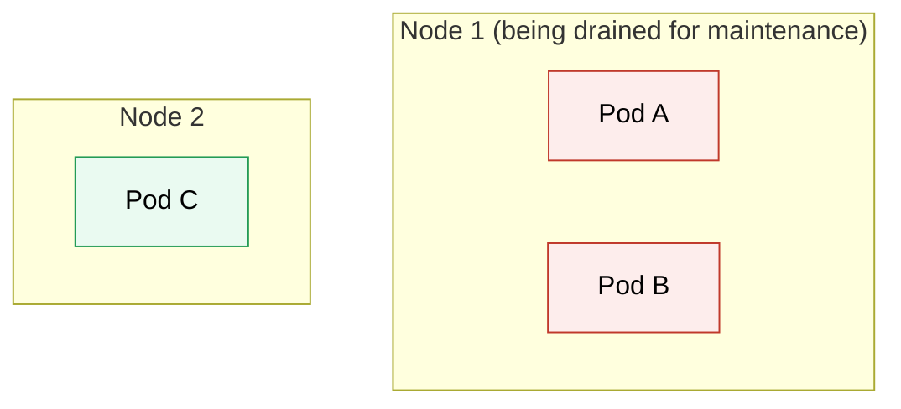
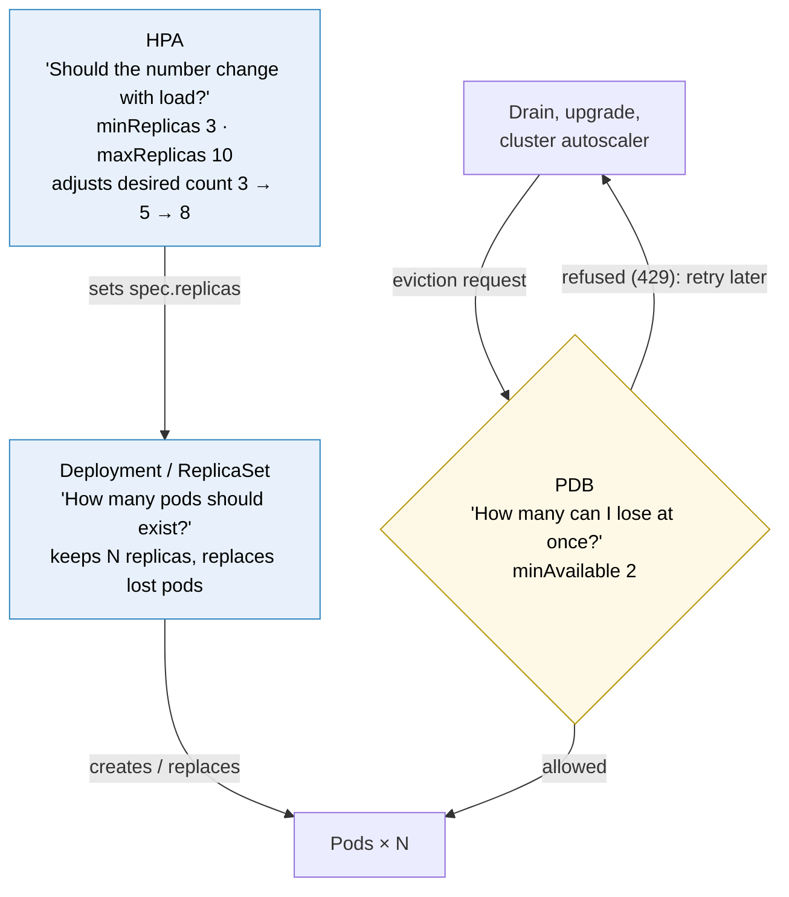

# Kubernetes PodDisruptionBudget

> [!abstract] In one sentence
> A PodDisruptionBudget (PDB) limits how many pods of an application may be **voluntarily** taken down at the same time (`minAvailable` or `maxUnavailable`), and the **eviction API (application programming interface)** refuses evictions that would break it. It protects against **maintenance** (node drains, cluster upgrades, autoscaler scale-downs), not against crashes, and not against a plain `kubectl delete pod`.

## Build-up: upgrading the nodes without an outage

### Stage 1: the drain that took everything down

The cluster's nodes need a kernel update. The operator drains two nodes at once to save time. Two of the backend's three replicas happened to be on those nodes, so they're evicted together, and the third pod alone can't handle the traffic. A routine upgrade becomes an outage. Nothing told the tooling that the backend needs at least two replicas up.

### Stage 2: the budget

```yaml
apiVersion: policy/v1
kind: PodDisruptionBudget
metadata:
  name: backend
  namespace: shop
spec:
  minAvailable: 2                 # or: maxUnavailable: 1
  selector:
    matchLabels: { app: backend }
```

```bash
kubectl -n shop get pdb
```

```
NAME      MIN AVAILABLE   MAX UNAVAILABLE   ALLOWED DISRUPTIONS   AGE
backend   2               N/A               1                     3d
```

`ALLOWED DISRUPTIONS` = healthy pods − 2. With 3 healthy pods, one eviction is allowed at a time.



`kubectl drain` simply retries until the budget allows. The drain takes longer; the service stays up.

### Stage 3: minAvailable or maxUnavailable?

| | `minAvailable: 2` | `maxUnavailable: 1` |
|---|---|---|
| With 3 replicas | 1 may be disrupted | 1 may be disrupted |
| HPA (HorizontalPodAutoscaler) scales to 10 | Still only "keep 2": 8 may go at once | Still 1 at a time |
| Scaled to 2 replicas | 0 may be disrupted: drains block | 1 may go |

`maxUnavailable` (absolute or percentage) usually follows the application's size better.

### Stage 4: what goes through the budget, and what doesn't

| Event | Respects the PDB? |
|---|---|
| `kubectl drain`, cluster upgrades, node pool rotations | ✓ (eviction API) |
| Cluster autoscaler removing an underused node | ✓ |
| Node failure, kernel panic, network partition | ✗ (involuntary) |
| Kubelet evicting pods under memory/disk pressure | ✗ |
| `kubectl delete pod` (a direct delete, not an eviction) | ✗ |
| A Deployment's rolling update | ✗ (it uses its own `maxUnavailable`) |
| Deleting the Deployment or scaling it down | ✗ |

A PDB is a contract with **maintenance tooling**, nothing more. Surviving crashes still needs enough replicas spread across nodes and zones ([[Kubernetes Node]] topology spread).

### Stage 5: unhealthy pods

By default, pods that are running but not ready count against the budget: if 2 of 3 pods are already unready, no eviction is allowed, and a drain can block on an app that's broken anyway. `unhealthyPodEvictionPolicy: AlwaysAllow` lets unhealthy pods be evicted regardless, which unblocks maintenance without risking healthy capacity.

### Stage 6: why a PDB when the HPA already has minReplicas

The backend has both of these, and at first sight they say the same thing ("at least N pods"):

```yaml
apiVersion: autoscaling/v2
kind: HorizontalPodAutoscaler
spec:
  minReplicas: 3
  maxReplicas: 10
---
apiVersion: policy/v1
kind: PodDisruptionBudget
spec:
  minAvailable: 2
```

They look alike, but they answer **different questions** and act at different points in the cluster.

**The HPA (HorizontalPodAutoscaler) answers "how many pods should I run?"** `minReplicas: 3` means: under normal operation, never scale below 3. The HPA reacts to **metrics**:

```text
CPU ↑  →  HPA  →  3 → 5 → 8 pods
CPU ↓  →  HPA  →  8 → 5 → 3 pods
```

It controls **scaling**, by changing the Deployment's desired replica count.

**The PDB answers "how many pods may be unavailable at once?"** `minAvailable: 2` means: when Kubernetes performs a **voluntary** disruption, don't voluntarily take so many pods down that fewer than 2 are available. It controls **evictions**, and has nothing to do with load.

#### The scenario that shows the difference

HPA `minReplicas: 3`, PDB `minAvailable: 2`, three pods spread like this:



The drain asks to evict the pods of Node 1, one by one:

| Step | Eviction request | Available if it goes ahead | PDB check (`minAvailable: 2`) | Result |
|---|---|---|---|---|
| 1 | Evict pod A | B, C → 2 | 2 ≥ 2 | A evicted. B and C running |
| 2 | Evict pod B (A's replacement not ready yet) | C → 1 | 1 < 2 | **Refused**. The drain waits and retries |
| 3 | A's replacement is running and ready on Node 2 | → 2 after evicting B | 2 ≥ 2 | B evicted |

Without the PDB, step 2 goes through, and for a while a single pod (C) carries all the traffic.

#### "But wouldn't the HPA just create another pod?"

Not necessarily, and this is the crucial point. The HPA decides **how many replicas the workload should have, from metrics**. A node drain isn't a metrics event:

```text
Desired replicas = 3, running = 3          → HPA is perfectly happy
Node maintenance → pod eviction → running = 2
```

The HPA doesn't react with "we lost a pod, create another one": its desired count is still 3, and nothing about CPU changed. It's the **workload controller** (the Deployment's ReplicaSet) that notices 2 running instead of 3 and creates a replacement. But that replacement has to be scheduled somewhere else (the drained node is cordoned), pull its image, start and pass its readiness probe, which takes time, or never happens if no other node has room. **During that window**, nothing in the HPA or the Deployment stops the drain from evicting the next pod. Only the PDB does.

#### Three mechanisms, three questions



| Mechanism | Question it answers | Setting | Acts when |
|---|---|---|---|
| **Deployment** | How many pods should exist? | `replicas: 3` | Always: replaces any missing pod |
| **HPA** | Should that number change with load? | `minReplicas: 3`, `maxReplicas: 10` | Metrics change |
| **PDB** | During voluntary disruptions, how many can I afford to lose at the same time? | `minAvailable: 2` | Something asks to **evict** a pod |

A PDB doesn't say "there must always be 2 pods alive". It says "when the system is **intentionally** evicting pods, respect this availability floor". Node crashes, kernel panics or a node that simply disappears are **involuntary** disruptions, and no PDB can prevent them (see the table in Stage 4).

#### Why production uses both

```yaml
# HPA
minReplicas: 3
maxReplicas: 20
# PDB
minAvailable: 2
```

- **HPA**: normally keep between 3 and 20 pods depending on load
- **PDB**: if Kubernetes needs to voluntarily disrupt them, don't take availability below 2

They're **complementary, not redundant**. The HPA is the **thermostat**: keep capacity within these limits depending on demand. The PDB is the **safety constraint during maintenance**: even while things are being rearranged, don't take too much capacity offline at once. `minReplicas` and `minAvailable` look similar in the YAML, but they act at different points in Kubernetes' control system (see [[Kubernetes#The mental model: a giant state machine]]): one sets the desired state, the other guards the path that removes pods.

> [!tip] Choosing the PDB number with an HPA
> With the HPA moving between 3 and 20, a fixed `minAvailable: 2` allows 18 evictions at once when scaled to 20. `maxUnavailable: 1` (or a percentage such as `maxUnavailable: 20%`) follows the current size better (Stage 3). And keep the PDB below `minReplicas`: `minAvailable: 3` with `minReplicas: 3` allows zero evictions when traffic is low, and drains block.

## Advanced problems

### 1. A drain hangs forever
The budget can never allow an eviction: `minAvailable: 1` on a single-replica workload, `minAvailable` equal to the replica count, or `maxUnavailable: 0`. Cluster upgrades stall with "Cannot evict pod as it would violate the pod's disruption budget". For single-replica workloads, accept the disruption (no PDB, or `maxUnavailable: 1`) or run more replicas.

### 2. Two PDBs select the same pod
Evictions of that pod fail with an error: one pod must be covered by at most one budget. Selectors must not overlap.

### 3. The PDB protects nothing
A selector typo matches zero pods: `kubectl get pdb` shows `ALLOWED DISRUPTIONS 0` with no pods, or the expected count is wrong. Check `kubectl describe pdb`.

## Easy to get wrong
- Expecting a PDB to protect against crashes or node failures
- Expecting it to limit rolling updates (that's the Deployment's `maxUnavailable`)
- Expecting `kubectl delete pod` to respect it
- PDBs that allow zero disruptions: drains block forever
- `minAvailable` fixed while the HPA scales the workload up and down
- Thinking the HPA's `minReplicas` makes a PDB redundant: the HPA sets how many pods should exist from metrics, the PDB limits how many may be evicted at once. A drain isn't a metrics event
- Thinking the HPA replaces evicted pods: the ReplicaSet does, and the replacement takes time to become ready
- Overlapping selectors across PDBs

## Related
- Protects:: [[Kubernetes Deployment]], [[Kubernetes StatefulSet]] pods
- Used by:: [[Kubernetes Node]] (drain), cluster upgrades, cluster autoscaler
- Differs from:: [[Kubernetes Deployment]] (rolling update `maxUnavailable`)
- Complements:: [[Kubernetes HorizontalPodAutoscaler]] (how many pods should run vs how many may be evicted at once)
- Concepts:: [[High availability networking]] (redundancy only helps if maintenance doesn't take the replicas down together)
- Overview:: [[Kubernetes]], [[Kubernetes worked example]]
- Area:: [[Containers]]

## Flashcards
#flashcards

What does a PodDisruptionBudget do? :: Limits how many selected pods may be voluntarily evicted at once
Which API enforces PDBs? :: The eviction API (it returns 429 when an eviction would violate the budget)
Does a PDB protect against node crashes? :: No, only voluntary disruptions (drains, upgrades, autoscaler)
Does kubectl delete pod respect PDBs? :: No, only evictions do
Does a Deployment rolling update respect PDBs? :: No, it uses its own maxUnavailable
minAvailable vs maxUnavailable in a PDB? :: Minimum pods that must stay vs maximum that may be down; maxUnavailable scales better with replica changes
Which PDB blocks drains forever? :: One that allows zero disruptions (minAvailable = replicas, single replica with minAvailable 1, maxUnavailable 0)
What does unhealthyPodEvictionPolicy: AlwaysAllow do? :: Lets unready pods be evicted without counting against the budget
Can two PDBs cover the same pod? :: No, evictions of that pod then fail
Why have a PDB when the HPA already sets minReplicas? :: They answer different questions: the HPA sets how many pods should run based on metrics; the PDB limits how many may be voluntarily evicted at the same time
HPA vs PDB in one line each? :: HPA: how many pods should I run (scaling, from metrics). PDB: how many pods may be unavailable at once during voluntary disruptions
Does the HPA create a new pod when a drain evicts one? :: No. Its desired count hasn't changed and a drain isn't a metrics event. The ReplicaSet replaces the pod, and the replacement takes time to schedule and become ready
HPA minReplicas 3, PDB minAvailable 2, pods A and B on a drained node, C elsewhere: what happens? :: A is evicted (2 left ≥ 2). B's eviction is refused (1 < 2) until A's replacement is ready elsewhere, then B goes
Deployment vs HPA vs PDB: which question does each answer? :: Deployment: how many pods should exist. HPA: should that number change with load. PDB: during voluntary disruptions, how many can I lose at once
Analogy for HPA vs PDB? :: HPA is the thermostat (capacity within limits by demand); PDB is the safety constraint during maintenance (don't take too much offline at once)
