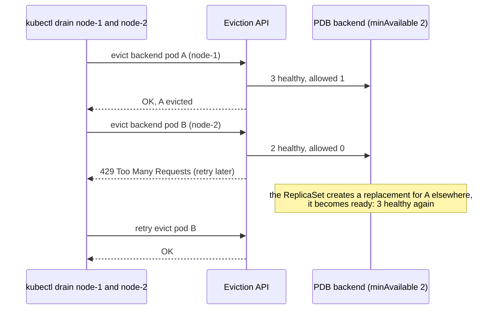

# Kubernetes PodDisruptionBudget

> [!abstract] In one sentence
> A PodDisruptionBudget (PDB) limits how many pods of an application may be **voluntarily** taken down at the same time (`minAvailable` or `maxUnavailable`), and the **eviction API (application programming interface)** refuses evictions that would break it. It protects against **maintenance** (node drains, cluster upgrades, autoscaler scale-downs), not against crashes, and not against a plain `kubectl delete pod`.

## Build-up: upgrading the nodes without an outage

### Stage 1: the drain that took everything down

The cluster's nodes need a kernel update. The operator drains two nodes at once to save time. Two of the backend's three replicas happened to be on those nodes, so they're evicted together, and the third pod alone can't handle the traffic. A routine upgrade becomes an outage. Nothing told the tooling that the backend needs at least two replicas up.

### Stage 2: the budget

```yaml
apiVersion: policy/v1
kind: PodDisruptionBudget
metadata:
  name: backend
  namespace: shop
spec:
  minAvailable: 2                 # or: maxUnavailable: 1
  selector:
    matchLabels: { app: backend }
```

```bash
kubectl -n shop get pdb
```

```
NAME      MIN AVAILABLE   MAX UNAVAILABLE   ALLOWED DISRUPTIONS   AGE
backend   2               N/A               1                     3d
```

`ALLOWED DISRUPTIONS` = healthy pods − 2. With 3 healthy pods, one eviction is allowed at a time.



`kubectl drain` simply retries until the budget allows. The drain takes longer; the service stays up.

### Stage 3: minAvailable or maxUnavailable?

| | `minAvailable: 2` | `maxUnavailable: 1` |
|---|---|---|
| With 3 replicas | 1 may be disrupted | 1 may be disrupted |
| HPA (HorizontalPodAutoscaler) scales to 10 | Still only "keep 2": 8 may go at once | Still 1 at a time |
| Scaled to 2 replicas | 0 may be disrupted: drains block | 1 may go |

`maxUnavailable` (absolute or percentage) usually follows the application's size better.

### Stage 4: what goes through the budget, and what doesn't

| Event | Respects the PDB? |
|---|---|
| `kubectl drain`, cluster upgrades, node pool rotations | ✓ (eviction API) |
| Cluster autoscaler removing an underused node | ✓ |
| Node failure, kernel panic, network partition | ✗ (involuntary) |
| Kubelet evicting pods under memory/disk pressure | ✗ |
| `kubectl delete pod` (a direct delete, not an eviction) | ✗ |
| A Deployment's rolling update | ✗ (it uses its own `maxUnavailable`) |
| Deleting the Deployment or scaling it down | ✗ |

A PDB is a contract with **maintenance tooling**, nothing more. Surviving crashes still needs enough replicas spread across nodes and zones ([[Kubernetes Node]] topology spread).

### Stage 5: unhealthy pods

By default, pods that are running but not ready count against the budget: if 2 of 3 pods are already unready, no eviction is allowed, and a drain can block on an app that's broken anyway. `unhealthyPodEvictionPolicy: AlwaysAllow` lets unhealthy pods be evicted regardless, which unblocks maintenance without risking healthy capacity.

## Advanced problems

### 1. A drain hangs forever
The budget can never allow an eviction: `minAvailable: 1` on a single-replica workload, `minAvailable` equal to the replica count, or `maxUnavailable: 0`. Cluster upgrades stall with "Cannot evict pod as it would violate the pod's disruption budget". For single-replica workloads, accept the disruption (no PDB, or `maxUnavailable: 1`) or run more replicas.

### 2. Two PDBs select the same pod
Evictions of that pod fail with an error: one pod must be covered by at most one budget. Selectors must not overlap.

### 3. The PDB protects nothing
A selector typo matches zero pods: `kubectl get pdb` shows `ALLOWED DISRUPTIONS 0` with no pods, or the expected count is wrong. Check `kubectl describe pdb`.

## Easy to get wrong
- Expecting a PDB to protect against crashes or node failures
- Expecting it to limit rolling updates (that's the Deployment's `maxUnavailable`)
- Expecting `kubectl delete pod` to respect it
- PDBs that allow zero disruptions: drains block forever
- `minAvailable` fixed while the HPA scales the workload up and down
- Overlapping selectors across PDBs

## Related
- Protects:: [[Kubernetes Deployment]], [[Kubernetes StatefulSet]] pods
- Used by:: [[Kubernetes Node]] (drain), cluster upgrades, cluster autoscaler
- Differs from:: [[Kubernetes Deployment]] (rolling update `maxUnavailable`)
- Concepts:: [[High availability networking]] (redundancy only helps if maintenance doesn't take the replicas down together)
- Overview:: [[Kubernetes]], [[Kubernetes worked example]]
- Area:: [[Containers]]

## Flashcards
#flashcards

What does a PodDisruptionBudget do? :: Limits how many selected pods may be voluntarily evicted at once
Which API enforces PDBs? :: The eviction API (it returns 429 when an eviction would violate the budget)
Does a PDB protect against node crashes? :: No, only voluntary disruptions (drains, upgrades, autoscaler)
Does kubectl delete pod respect PDBs? :: No, only evictions do
Does a Deployment rolling update respect PDBs? :: No, it uses its own maxUnavailable
minAvailable vs maxUnavailable in a PDB? :: Minimum pods that must stay vs maximum that may be down; maxUnavailable scales better with replica changes
Which PDB blocks drains forever? :: One that allows zero disruptions (minAvailable = replicas, single replica with minAvailable 1, maxUnavailable 0)
What does unhealthyPodEvictionPolicy: AlwaysAllow do? :: Lets unready pods be evicted without counting against the budget
Can two PDBs cover the same pod? :: No, evictions of that pod then fail
