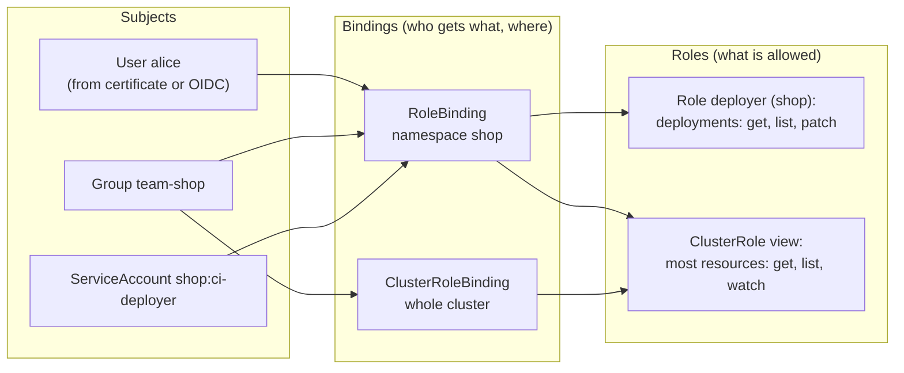

# Kubernetes RBAC

> [!abstract] In one sentence
> Kubernetes RBAC (role-based access control) decides **who may do what to which resources**, with four objects: a **Role** (namespaced) or **ClusterRole** (cluster-wide) lists allowed **verbs on resources**, and a **RoleBinding** or **ClusterRoleBinding** grants a role to **subjects** (users, groups, ServiceAccounts). Permissions are **additive only**: everything is denied unless some binding allows it, and there are no deny rules.

## Build-up: three teams, one cluster

### Stage 1: everyone is admin

At first, everyone uses the admin kubeconfig. Then a developer from the payments team deletes a Deployment in `shop` by mistake, the CI (continuous integration) pipeline's credentials leak and can do anything to any namespace, and the auditor asks who can read production Secrets. The answer to all three needs per-subject, per-namespace permissions.

### Stage 2: the four objects



| | Namespaced | Cluster-wide |
|---|---|---|
| What is allowed | **Role** | **ClusterRole** |
| Granted to whom, where | **RoleBinding**: in its namespace | **ClusterRoleBinding**: everywhere |

A RoleBinding can reference a **ClusterRole**: it grants that role's permissions **only in the binding's namespace**. That's how one `deployer` ClusterRole is defined once and granted per namespace.

```yaml
apiVersion: rbac.authorization.k8s.io/v1
kind: Role
metadata:
  name: deployer
  namespace: shop
rules:
  - apiGroups: ["apps"]
    resources: ["deployments"]
    verbs: ["get", "list", "watch", "patch", "update"]
  - apiGroups: [""]                          # the core group: pods, services, configmaps…
    resources: ["pods", "pods/log"]          # pods/log is a subresource
    verbs: ["get", "list", "watch"]
  - apiGroups: ["batch"]
    resources: ["jobs"]
    verbs: ["create", "get", "delete"]
---
apiVersion: rbac.authorization.k8s.io/v1
kind: RoleBinding
metadata:
  name: ci-deployer
  namespace: shop
subjects:
  - kind: ServiceAccount
    name: ci-deployer
    namespace: shop
  - kind: Group
    name: team-shop                          # from the OIDC token's groups claim
    apiGroup: rbac.authorization.k8s.io
roleRef:                                     # immutable: delete and recreate to change it
  kind: Role
  name: deployer
  apiGroup: rbac.authorization.k8s.io
```

The parts of a rule:
- **apiGroups**: `""` (core), `apps`, `batch`, `networking.k8s.io`, a CRD (CustomResourceDefinition)'s group… (`kubectl api-resources` lists them)
- **resources** and **subresources**: `pods`, `pods/log`, `pods/exec`, `deployments/scale`
- **verbs**: `get`, `list`, `watch`, `create`, `update`, `patch`, `delete`, `deletecollection`, and special ones (`escalate`, `bind`, `impersonate`)
- **resourceNames**: optionally, only specific objects (`configmaps` named `backend-config`)

### Stage 3: subjects come from outside

Kubernetes stores no users. The API (application programming interface) server authenticates a request (client certificate: the `CN` (common name) is the user, `O` (organization) the groups; or an OIDC (OpenID Connect) token: claims map to user and groups; or a ServiceAccount token, see [[Kubernetes ServiceAccount]]) and RBAC matches the resulting **names as strings**. A binding to user `alice` works for whoever presents a credential that says `alice`. Binding **groups** from the identity provider, rather than individual users, keeps access in sync with the company directory ([[Single sign-on]]).

### Stage 4: built-in roles

| ClusterRole | Grants |
|---|---|
| `cluster-admin` | Everything, everywhere (with a ClusterRoleBinding) or everything in one namespace (with a RoleBinding) |
| `admin` | Full control within a namespace, including RoleBindings, not the namespace itself or quotas |
| `edit` | Read/write most objects in a namespace, not roles or bindings |
| `view` | Read most objects, **not Secrets** |

Granting `edit` per namespace with RoleBindings covers most teams. ClusterRoles labelled for **aggregation** (`rbac.authorization.k8s.io/aggregate-to-edit: "true"`) automatically add a CRD's permissions to these built-in roles.

### Stage 5: checking

```bash
kubectl auth can-i delete deployments -n shop                                  # as myself
kubectl auth can-i '*' '*' --all-namespaces --as=alice                         # is alice cluster-admin?
kubectl auth can-i --list -n shop --as=system:serviceaccount:shop:ci-deployer  # everything it can do
kubectl get rolebindings,clusterrolebindings -A -o wide | grep team-shop       # where a group is bound
```

## The permissions that are more than they look

Some rights are equivalent to much broader ones:

| Permission | Effectively gives |
|---|---|
| `list` / `watch` on `secrets` | The **values** of every Secret (list returns full objects) |
| `create` on `pods` (or Deployments, Jobs…) | Running as **any ServiceAccount** in the namespace and mounting **any Secret** in it |
| `pods/exec` | A shell in any pod: its files, tokens and network position |
| `create` on `pods` with privileged settings (if no admission policy blocks it) | The **node**: hostPath `/`, host network, host PID (process ID) namespace |
| `escalate`, `bind` on roles | Granting oneself any permission |
| `impersonate` | Acting as any user or group |
| `update` on `nodes`, `create` on `tokenrequests`, webhooks… | Various routes to cluster-admin |

RBAC prevents **direct** escalation (no one can create a Role granting more than they hold, without `escalate`), but these indirect routes must be considered when granting "harmless" rights. Pod Security admission (namespace labels like `pod-security.kubernetes.io/enforce: restricted`) blocks privileged pods even for those who can create pods ([[Kubernetes Namespace]]).

## Advanced problems

### 1. "Forbidden" despite a binding
The binding is in another namespace than the request, the Role's `apiGroups` is wrong (`deployments` is in `apps`, not `""`), the subject's name differs (`system:serviceaccount:shop:ci-deployer` vs a ServiceAccount in another namespace), or the user's group claim isn't what was assumed. `kubectl auth can-i --as … --as-group …` and the API server's audit log show the exact identity.

### 2. Permission creep
Bindings accumulate: someone was given `cluster-admin` for a migration two years ago. Review ClusterRoleBindings regularly, bind groups (removing someone from the group removes access), and prefer namespaced RoleBindings.

### 3. A CRD's objects are invisible to `edit`
New resource types aren't in built-in roles unless the CRD's installer adds aggregated ClusterRoles. Teams get `Forbidden` on `certificates.cert-manager.io` while having `edit`.

## Easy to get wrong
- Looking for deny rules: RBAC is allow-only
- Thinking `view` reads Secrets (it doesn't) or that `list` on secrets only shows names (it shows values)
- Granting pod creation as if it were harmless
- ClusterRoleBinding when a RoleBinding to a ClusterRole was meant: cluster-wide instead of one namespace
- Binding individual users instead of groups
- Expecting to edit a binding's `roleRef`: it's immutable
- Wrong `apiGroups` for a resource

## Related
- Identities:: [[Kubernetes ServiceAccount]], [[OpenID Connect]], [[Single sign-on]], [[Certificates and PKI]] (client certificates)
- Scope:: [[Kubernetes Namespace]]
- Protects:: [[Kubernetes Secret]], every other object
- Where it runs:: [[Kubernetes architecture]] (authentication, authorization, admission)
- Concepts:: *[[Authorization models]]*, [[IAM]] (the AWS (Amazon Web Services) counterpart)
- Overview:: [[Kubernetes]], [[Kubernetes worked example]]
- Area:: [[Containers]]

## Flashcards
#flashcards

The four RBAC objects? :: Role, ClusterRole (what), RoleBinding, ClusterRoleBinding (who and where)
Role vs ClusterRole? :: Role is namespaced. ClusterRole is cluster-wide (or reusable across namespaces)
What does a RoleBinding to a ClusterRole grant? :: The ClusterRole's permissions only in the binding's namespace
Does Kubernetes RBAC have deny rules? :: No, permissions are additive; everything else is denied
What are the parts of an RBAC rule? :: apiGroups, resources (and subresources), verbs, optionally resourceNames
Which API group are Deployments in? :: apps
Does the built-in view role read Secrets? :: No
Why is create on pods a powerful permission? :: It allows running as any ServiceAccount and mounting any Secret in the namespace
What does list on secrets return? :: The full Secrets, values included
Where do RBAC users and groups come from? :: Authentication: certificate CN/O, OIDC claims, ServiceAccount tokens
Can you change a binding's roleRef? :: No, it's immutable
How do you list everything a subject can do in a namespace? :: kubectl auth can-i --list -n <ns> --as=<subject>
