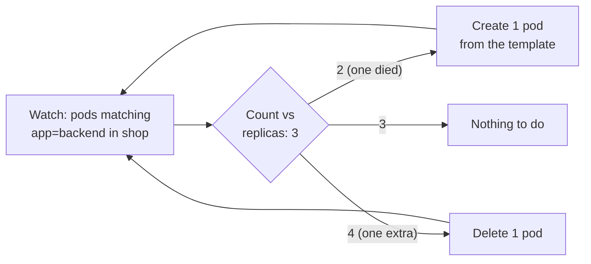
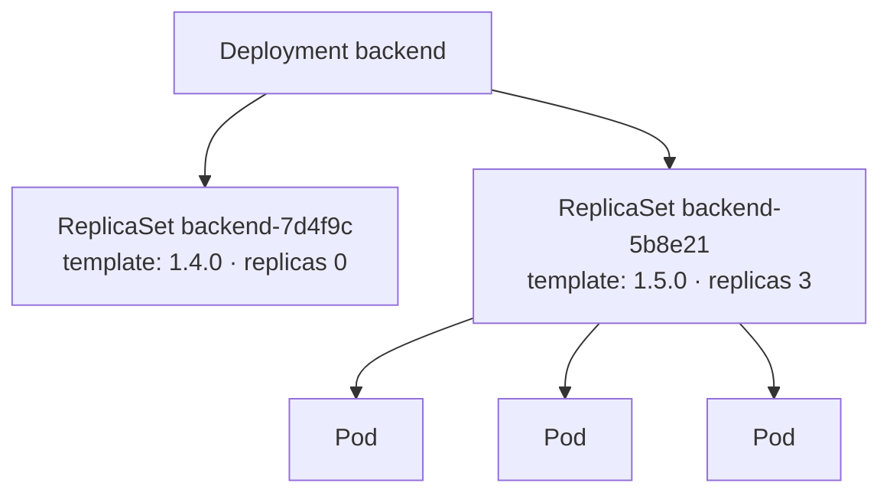

# Kubernetes ReplicaSet

> [!abstract] In one sentence
> A ReplicaSet keeps **exactly N pods matching a label selector** running: it creates pods from its **pod template** when there are too few, and deletes some when there are too many. It doesn't know about versions or updates; that's why it's almost never used directly, but created and managed by a [[Kubernetes Deployment]], one ReplicaSet per version of the pod template.

## Build-up: keeping three pods alive

### Stage 1: the problem with bare pods

Three backend [[Kubernetes Pod|pods]] created by hand run on three nodes. One node dies: its pod is gone and nothing replaces it. Someone deletes a pod by mistake: same. The cluster needs something that **counts** pods and fixes the count.

### Stage 2: a ReplicaSet

```yaml
apiVersion: apps/v1
kind: ReplicaSet
metadata:
  name: backend
  namespace: shop
spec:
  replicas: 3
  selector:                       # which pods count as "mine"
    matchLabels: { app: backend }
  template:                       # how to create a new one
    metadata:
      labels: { app: backend }    # must match the selector
    spec:
      containers:
        - name: backend
          image: registry.example.com/shop-backend:1.4.0
```

The **ReplicaSet controller** (in kube-controller-manager, see [[Kubernetes architecture]]) runs a reconciliation loop:



Each pod it creates gets an **ownerReference** pointing to the ReplicaSet, so the garbage collector deletes the pods when the ReplicaSet is deleted, and `kubectl describe pod` shows `Controlled By: ReplicaSet/backend`.

```bash
kubectl -n shop scale replicaset backend --replicas=5
kubectl -n shop get rs
```

```
NAME      DESIRED   CURRENT   READY   AGE
backend   5         5         3       2m
```

### Stage 3: what it doesn't do

Change the image in the template to `1.5.0`: **nothing happens** to the running pods. The template is only used for **new** pods. Existing pods keep `1.4.0` until they die and are replaced by `1.5.0` ones, at random, over days. No rolling update, no rollback, no history.

That gap is what a [[Kubernetes Deployment]] fills: on a template change, it creates a **new** ReplicaSet with the new template and scales it up while scaling the old one down. The old ReplicaSet is kept (scaled to 0) so a rollback is just scaling it back up.



The suffix (`7d4f9c`) is the **pod-template-hash**: a hash of the template, added as a label to the ReplicaSet's selector and its pods, so two ReplicaSets of the same Deployment never claim each other's pods.

> [!info] ReplicationController
> The older object, `ReplicationController`, does the same with equality-only selectors. It's legacy; ReplicaSets (with set-based selectors like `env in (prod, staging)`) replaced it, and Deployments manage those.

## Advanced problems

### 1. A ReplicaSet "steals" pods
A ReplicaSet counts **any** pod in its namespace that matches its selector and has no other controller, including a pod created by hand with the same labels. It adopts it, and may then delete it as an "extra" replica. Selectors must be specific, which is one reason Deployments add the template hash.

### 2. Which pod is deleted when scaling down?
Roughly: pods not yet scheduled or not ready first, then pods on nodes running more replicas, then the most recently started. It's not "the oldest" or "the one I want". A pod can be given a lower `controller.kubernetes.io/pod-deletion-cost` annotation to be preferred for deletion.

### 3. Orphaned pods
`kubectl delete rs backend --cascade=orphan` deletes the ReplicaSet but keeps the pods, now without an owner. A new ReplicaSet with a matching selector adopts them. Useful for surgery, confusing otherwise.

## Easy to get wrong
- Creating ReplicaSets directly: use a Deployment
- Expecting a template change to update running pods
- A selector that doesn't match the template's labels (rejected by the API (application programming interface)) or that matches other pods (adopted)
- Deleting old ReplicaSets of a Deployment by hand: it removes the rollback history

## Related
- Manages:: [[Kubernetes Pod]]
- Managed by:: [[Kubernetes Deployment]]
- Scaled by:: [[Kubernetes HorizontalPodAutoscaler]] (through the Deployment)
- Overview:: [[Kubernetes]], [[Kubernetes architecture]]
- Area:: [[Containers]]

## Flashcards
#flashcards

What does a ReplicaSet do? :: Keeps N pods matching its selector running, creating or deleting pods from its template
Does changing a ReplicaSet's template update running pods? :: No. Only new pods use the new template
Why use a Deployment instead of a ReplicaSet? :: Deployments do rolling updates and rollbacks by managing one ReplicaSet per template version
What is the pod-template-hash label? :: A hash of the pod template that Deployments add to ReplicaSet selectors and pods so versions don't claim each other's pods
How does a pod record its controller? :: ownerReferences (Controlled By in kubectl describe)
Can a ReplicaSet adopt pods it didn't create? :: Yes, any ownerless pod in the namespace matching its selector
What replaced ReplicationController? :: ReplicaSet (set-based selectors), managed by Deployments
