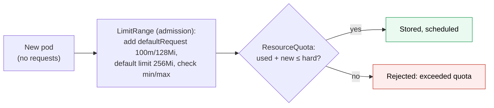

# Kubernetes ResourceQuota and LimitRange

> [!abstract] In one sentence
> A **ResourceQuota** caps what a whole [[Kubernetes Namespace]] may consume in total (CPU and memory requests and limits, storage, number of pods, Services, LoadBalancers…); a **LimitRange** sets **per-container defaults and bounds** (default requests for pods that forget them, minimum and maximum sizes). Both are checked by the API (application programming interface) server when objects are **created**, so they shape what can be admitted, not what's already running.

## Build-up: one team uses the whole cluster

### Stage 1: no limits

The cluster has 64 CPUs (central processing units) shared by three teams. The data team deploys a batch job with 200 replicas requesting 1 CPU each: the scheduler fills every node, and the shop's pods can't scale up on Black Friday. A developer deploys pods with no requests at all: the scheduler thinks they cost nothing, packs them onto one node, and they starve each other.

Two separate problems: a **team-level budget**, and **sane per-pod values**.

### Stage 2: a ResourceQuota per namespace

```yaml
apiVersion: v1
kind: ResourceQuota
metadata:
  name: shop-quota
  namespace: shop
spec:
  hard:
    requests.cpu: "20"              # sum of CPU requests of all non-terminal pods
    requests.memory: 40Gi
    limits.memory: 60Gi
    pods: "100"
    services.loadbalancers: "1"     # external load balancers cost money
    persistentvolumeclaims: "10"
    requests.storage: 500Gi
    fast-storage.storageclass.storage.k8s.io/requests.storage: 200Gi   # per StorageClass
    count/jobs.batch: "50"          # any namespaced resource can be counted
```

```bash
kubectl -n shop describe resourcequota shop-quota
```

```
Resource          Used   Hard
--------          ----   ----
requests.cpu      14250m 20
requests.memory   28Gi   40Gi
pods              41     100
```

When a new pod would push `requests.cpu` above 20, the API server **rejects** it: `exceeded quota: shop-quota, requested: requests.cpu=1, used: requests.cpu=19500m, limited: requests.cpu=20`. For a Deployment, this shows up as a ReplicaSet that can't create pods (`kubectl describe rs`), not as an error on the Deployment itself.

> [!warning] A CPU or memory quota makes requests mandatory
> Once a quota covers `requests.cpu` (or memory), every new pod in the namespace **must** declare that request, or it's rejected (`must specify requests.cpu`). The fix is a LimitRange that fills in defaults.

Quotas can be **scoped**: `scopeSelector` with a PriorityClass gives high-priority pods their own budget, `BestEffort`/`NotBestEffort` scopes count only pods with or without requests.

### Stage 3: a LimitRange for defaults and bounds

```yaml
apiVersion: v1
kind: LimitRange
metadata:
  name: container-defaults
  namespace: shop
spec:
  limits:
    - type: Container
      defaultRequest:                # applied when a container declares no request
        cpu: 100m
        memory: 128Mi
      default:                       # applied when a container declares no limit
        memory: 256Mi
      min:
        memory: 32Mi
      max:                           # no single container may ask for more
        cpu: "4"
        memory: 8Gi
    - type: PersistentVolumeClaim
      max:
        storage: 100Gi
```

- **Defaults** are written into the pod at admission, so pods that forgot requests become schedulable sensibly (and pass the quota)
- **min/max** reject containers outside the bounds
- `maxLimitRequestRatio` caps how far limits may exceed requests (limits overcommit the node; requests are what's reserved)



### Stage 4: what they don't do

- They act at **admission**: pods already running aren't evicted when a quota is lowered or a LimitRange added
- A quota is a **budget**, not a reservation: 20 CPUs of quota doesn't guarantee the nodes have 20 free CPUs
- They count **requests and limits**, not real usage. Actual usage is enforced by the kernel's cgroups through each container's limits ([[Kubernetes Pod]])
- Defaults from a LimitRange are guesses: a real app should declare its own requests

## Advanced problems

### 1. A rollout stalls with no visible error
A rolling update needs room for the surge pod (`maxSurge`), and the quota is nearly full. The Deployment shows no error; the new ReplicaSet's events say `exceeded quota`. Keep headroom of at least one surge per Deployment, or use `maxSurge: 0`.

### 2. Jobs and CronJobs fail to start
Completed pods don't count against compute quotas, but `count/jobs.batch` and `pods` quotas may count finished objects that haven't been cleaned up. `ttlSecondsAfterFinished` on Jobs ([[Kubernetes Job]]).

### 3. Every pod rejected after adding a quota
The quota covers memory requests, and pods without them are now rejected. Add a LimitRange with `defaultRequest` in the same change.

## Easy to get wrong
- A compute quota without a LimitRange: pods without requests are rejected
- Expecting quotas to evict running pods
- Treating quota as guaranteed capacity
- Forgetting surge headroom for rolling updates
- Relying on LimitRange defaults instead of real requests

## Related
- Scope:: [[Kubernetes Namespace]]
- Constrains:: [[Kubernetes Pod]], [[Kubernetes PersistentVolumeClaim]], [[Kubernetes Service]] (LoadBalancers)
- Interacts with:: [[Kubernetes Deployment]] (surge), [[Kubernetes HorizontalPodAutoscaler]] (scale-up blocked by quota)
- Overview:: [[Kubernetes]]
- Area:: [[Containers]]

## Flashcards
#flashcards

ResourceQuota vs LimitRange? :: ResourceQuota caps a namespace's total; LimitRange sets per-container defaults and min/max
What happens when a pod would exceed a ResourceQuota? :: The API server rejects it at creation
What does a CPU or memory quota require from every new pod? :: The corresponding request (or a LimitRange default)
What does LimitRange defaultRequest do? :: Fills in requests for containers that declare none
Do quotas or LimitRanges affect running pods? :: No, they're checked at admission only
Is a ResourceQuota a capacity reservation? :: No, it's a budget; the nodes may still be full
Why can a quota stall a rolling update silently? :: The surge pod can't be created; the error is in the ReplicaSet's events
How do you count any namespaced object type in a quota? :: count/<resource>.<group>, e.g. count/jobs.batch
