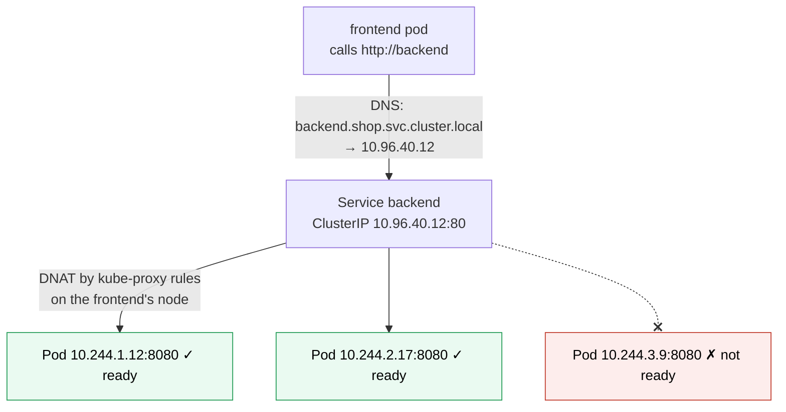

# Kubernetes Service

> [!abstract] In one sentence
> A Service gives a **stable virtual IP address and DNS name** to a changing set of pods selected by **labels**, and spreads connections over the ones that are **ready**. Its **type** decides who can reach it: **ClusterIP** (inside the cluster), **NodePort** (a port on every node), **LoadBalancer** (an external load balancer provisioned for it), **ExternalName** (a DNS alias), or **headless** (no virtual IP, DNS returns the pods directly).

## Build-up: the frontend needs to call the backend

### Stage 1: pod IPs don't work as addresses

The backend runs as 3 pods: `10.244.1.12`, `10.244.2.17`, `10.244.3.9`. Every rollout, crash or scale-up changes that list. Hard-coding pod IP (Internet Protocol) addresses in the frontend breaks within the hour, and the frontend would also have to pick one, notice when it dies, and skip pods that aren't ready.

### Stage 2: a ClusterIP Service

```yaml
apiVersion: v1
kind: Service
metadata:
  name: backend
  namespace: shop
spec:
  type: ClusterIP                  # the default
  selector:
    app: backend                   # all pods with this label…
  ports:
    - name: http
      port: 80                     # …are reachable on backend:80
      targetPort: http             # the container port named "http" (8080)
      protocol: TCP
```



Three mechanisms work together (detailed in [[Kubernetes architecture]] and [[Service discovery]]):
1. **EndpointSlices**: the EndpointSlice controller keeps, for each Service, the list of matching pods' IPs and ports, marked ready or not (from their readiness probes)
2. **kube-proxy** on every node turns "connection to `10.96.40.12:80`" into "connection to one ready pod IP" with iptables, IPVS (IP Virtual Server) or nftables rules: DNAT (destination network address translation), done in the kernel of the **calling** node, see [[NAT and PAT]]
3. **CoreDNS** answers `backend.shop.svc.cluster.local` (or `backend` from the same namespace) with the ClusterIP. Named ports also get SRV records (`_http._tcp.backend.shop.svc.cluster.local`)

`targetPort` can be a **name** (`http`) defined in the pod's container ports, so the container port can change without touching the Service.

> [!warning] A ClusterIP doesn't answer ping
> The virtual IP isn't an interface anywhere; it only exists as rules matching the Service's **ports and protocol**. `ping 10.96.40.12` fails (or behaves oddly) on a perfectly healthy Service. Test with `curl backend:80` instead.

### Stage 3: reaching it from outside

| Type | Reachable at | How it works | When |
|---|---|---|---|
| **ClusterIP** | `10.96.40.12:80`, inside the cluster | Virtual IP + rules on every node | Internal services (most of them) |
| **NodePort** | `<any node IP>:30080` | ClusterIP + the same port (30000–32767) opened on **every** node | Bare-metal clusters behind an external load balancer, tests |
| **LoadBalancer** | An external IP or hostname | NodePort + a load balancer created by the cloud controller (or MetalLB on bare metal) | Exposing one service directly, often the ingress controller itself |
| **ExternalName** | `db.example.com` via DNS | A CNAME (canonical name) record, no proxying | Giving an external dependency an in-cluster name |

```yaml
spec:
  type: LoadBalancer
  externalTrafficPolicy: Local      # keep the client's source IP; only nodes with a local pod receive traffic
```

`externalTrafficPolicy`:
- `Cluster` (default): any node accepts traffic and may forward it to a pod on another node, with SNAT (source NAT): the app sees a node IP, not the client's
- `Local`: only nodes running a ready pod receive traffic (the load balancer health-checks them), no second hop, the **client IP is preserved**. Uneven spread if pods are unevenly placed

For HTTP (Hypertext Transfer Protocol), one LoadBalancer per service gets expensive: an [[Kubernetes Ingress]] (or Gateway API) puts many services behind one.

### Stage 4: headless and selector-less Services

**Headless** (`clusterIP: None`): no virtual IP, no kube-proxy rules. DNS returns **all ready pod IPs** directly, and for a [[Kubernetes StatefulSet]], per-pod names (`postgres-0.postgres…`). For clients that balance themselves or need a specific member: databases, gRPC (Google's remote procedure call framework) clients with client-side balancing.

**Without a selector**: the Service exists, and I create its EndpointSlice by hand with external IPs. Pods use the name `legacy-db` while it points at a VM (virtual machine) at `10.0.5.20`; after a migration into the cluster, adding a selector changes nothing for clients.

## Advanced problems

### 1. The Service has no endpoints
Requests time out or the ingress returns 503. `kubectl -n shop get endpointslices -l kubernetes.io/service-name=backend` is empty: the selector doesn't match the pods' labels (a typo, or a different namespace), or no pod is ready. A selector matching nothing is valid, so nothing warns.

### 2. One pod gets all the load
Long-lived connections (HTTP/2, gRPC, database pools) are balanced **once, at connection time**: kube-proxy picks a pod per connection, not per request. New pods added by scaling receive no traffic from existing connections. Use client-side balancing over a headless Service, a service mesh, or limit connection lifetimes (see [[HTTP2]]).

### 3. Connections fail during rollouts
A pod being deleted is removed from EndpointSlices while it receives SIGTERM. Other nodes' rules update a moment later, so a few connections still arrive at a stopping pod. A `preStop` sleep of a few seconds and graceful shutdown fix it ([[Kubernetes Pod]]).

### 4. `sessionAffinity: ClientIP` doesn't stick
With `externalTrafficPolicy: Cluster`, the source IP the Service sees is a node's, not the client's, so many clients share "one" IP or one client changes. Stickiness for web users belongs in the ingress controller (cookies).

## Easy to get wrong
- Pinging a ClusterIP to test a Service
- Label typos between the selector and the pods: no endpoints, no error
- `port` vs `targetPort` mixed up
- Expecting per-request balancing for HTTP/2 or gRPC
- One LoadBalancer Service per HTTP app instead of one ingress
- Expecting the client IP with `externalTrafficPolicy: Cluster`
- Calling a Service in another namespace by its short name (use `backend.shop`)

## Related
- Selects:: [[Kubernetes Pod]] (labels, readiness)
- In front of it:: [[Kubernetes Ingress]]
- Restricted by:: [[Kubernetes NetworkPolicy]]
- Concepts:: [[Service discovery]], [[Load balancing]], [[NAT and PAT]], [[DNS]] (`ndots:5`)
- How it's implemented:: [[Kubernetes architecture]]
- Overview:: [[Kubernetes]], [[Kubernetes worked example]]
- Area:: [[Containers]]

## Flashcards
#flashcards

What does a Service provide? :: A stable virtual IP and DNS name for the ready pods matching its selector
What keeps a Service's list of pod IPs? :: EndpointSlices, maintained by the EndpointSlice controller from readiness
What turns a ClusterIP into a pod IP? :: kube-proxy rules (iptables/IPVS/nftables) doing DNAT on the calling node
DNS name of Service backend in namespace shop? :: backend.shop.svc.cluster.local
port vs targetPort? :: port: what clients call on the Service. targetPort: the container's port (number or name)
ClusterIP vs NodePort vs LoadBalancer vs ExternalName? :: Internal VIP; plus a port on every node; plus an external load balancer; a DNS CNAME alias
NodePort range? :: 30000–32767
What is a headless Service? :: clusterIP: None. DNS returns the pod IPs directly, no kube-proxy load balancing
externalTrafficPolicy Local vs Cluster? :: Local keeps the client IP and only uses nodes with a local pod. Cluster spreads across nodes but SNATs
Why can't you ping a ClusterIP? :: It's only rules for the Service's ports, not a real interface
Why are gRPC connections unevenly balanced by a Service? :: kube-proxy balances per connection, and gRPC keeps one long-lived connection
What is a Service without a selector for? :: Pointing a cluster name at manually defined endpoints (external IPs)
