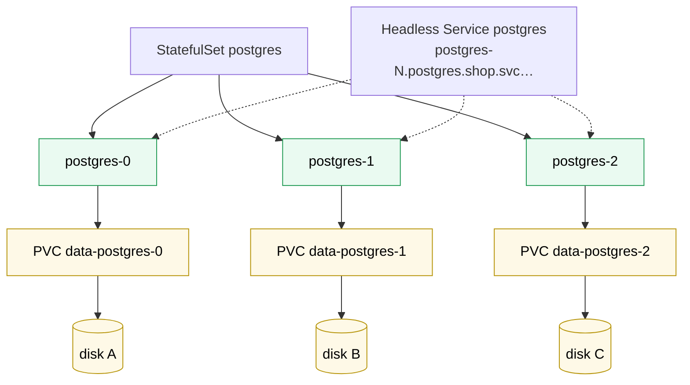

# Kubernetes StatefulSet

> [!abstract] In one sentence
> A StatefulSet runs replicas that are **not interchangeable**: each gets a **stable ordinal name** (`postgres-0`, `postgres-1`), a **stable DNS name** through a headless Service, and **its own PersistentVolumeClaim** that follows it across restarts and nodes, and they're created, updated and removed **in order**. It's the object for databases, message brokers and anything clustered, but it **doesn't** make the software replicate or fail over: that's the application's (or an operator's) job.

## Build-up: running a three-node cluster of something

The shop wants a 3-node Redis or PostgreSQL cluster (or Kafka, or etcd). Members of such a cluster are **different from each other**: one is the primary, each has its own data on its own disk, and members find each other by name in their configuration (`postgres-0` replicates from `postgres-1`…).

### Stage 1: why a Deployment fails at this

With a [[Kubernetes Deployment]] of 3 replicas:
- Pod names are random (`db-5b8e21-x7k2p`) and change on every restart, so members can't be listed in a config
- All replicas share the **same** volume claim, or none: there's no "one disk per replica"
- Pods start and stop in any order and all at once, but a cluster usually needs its first member up before the others join

### Stage 2: the StatefulSet

```yaml
apiVersion: v1
kind: Service
metadata:
  name: postgres
  namespace: shop
spec:
  clusterIP: None                  # headless: DNS returns the pod IPs, one record per pod
  selector: { app: postgres }
  ports: [{ port: 5432 }]
---
apiVersion: apps/v1
kind: StatefulSet
metadata:
  name: postgres
  namespace: shop
spec:
  serviceName: postgres            # the headless Service that gives pods their DNS names
  replicas: 3
  selector:
    matchLabels: { app: postgres }
  template:
    metadata:
      labels: { app: postgres }
    spec:
      containers:
        - name: postgres
          image: postgres:17
          env:
            - { name: PGDATA, value: /var/lib/postgresql/data/pgdata }
          volumeMounts:
            - { name: data, mountPath: /var/lib/postgresql/data }
  volumeClaimTemplates:            # one PVC per replica, created from this template
    - metadata:
        name: data
      spec:
        accessModes: [ReadWriteOnce]
        storageClassName: fast-storage
        resources:
          requests: { storage: 20Gi }
```

What each replica gets:

| Replica | Pod name | DNS name | PVC |
|---|---|---|---|
| 0 | `postgres-0` | `postgres-0.postgres.shop.svc.cluster.local` | `data-postgres-0` |
| 1 | `postgres-1` | `postgres-1.postgres.shop.svc.cluster.local` | `data-postgres-1` |
| 2 | `postgres-2` | `postgres-2.postgres.shop.svc.cluster.local` | `data-postgres-2` |



When `postgres-1` dies (or its node does), the controller recreates **`postgres-1`**, with the same DNS name and the same claim `data-postgres-1`, so the same disk. Its identity survives; only its IP address changes, which is why members address each other by DNS (Domain Name System) name, never by IP (Internet Protocol) address.

### Stage 3: ordering

With the default `podManagementPolicy: OrderedReady`:
- **Creation and scale-up**: `postgres-0` first; `postgres-1` only once `0` is running and ready; then `2`
- **Scale-down and deletion of pods**: highest ordinal first (`2`, then `1`)
- **Rolling updates** (`updateStrategy: RollingUpdate`): one pod at a time, **from the highest ordinal down**, each waiting for the previous one to be ready

`podManagementPolicy: Parallel` drops the ordering for startup and scaling (faster, for software that doesn't need it). Rolling updates stay one at a time.

Two update tools specific to StatefulSets:
- **`partition: N`**: only pods with ordinal ≥ N are updated. With `partition: 2`, only `postgres-2` gets the new version: a built-in canary. Lower the partition to continue
- **`updateStrategy: OnDelete`**: nothing is updated automatically; a pod gets the new template when someone deletes it. For software whose upgrades must be orchestrated by hand or by an operator

### Stage 4: what happens to the data

- **Scaling down** from 3 to 2 deletes pod `postgres-2` but **keeps** `data-postgres-2` (by default). Scaling back up reattaches it. Deleting the StatefulSet also keeps all PVCs
- `persistentVolumeClaimRetentionPolicy` (`whenDeleted`, `whenScaled`: `Retain` or `Delete`) changes that, for caches where old data is useless
- What happens to the **disk** when a PVC is deleted depends on the StorageClass's reclaim policy ([[Kubernetes StorageClass]])

### Stage 5: what a StatefulSet does NOT do

A StatefulSet gives **identity, storage and order**. It knows nothing about PostgreSQL:
- `replicas: 3` = three **independent** databases unless the image's configuration makes 1 and 2 replicate from 0
- If `postgres-0` (the primary) dies, nothing promotes a replica; clients connected to "the primary" fail until `postgres-0` comes back
- Backups, version upgrades with data migration, re-joining a failed member: not its job

That's what **operators** add (CloudNativePG for PostgreSQL, Strimzi for Kafka): a [[Kubernetes CustomResourceDefinition]] like `Cluster` and a controller that manages StatefulSets (or pods directly), replication, failover and backups.

## Advanced problems

### 1. A broken pod blocks the rolling update forever
With `OrderedReady`, if the new version of `postgres-2` never becomes ready, the rollout stops there, as intended. But reverting the template **doesn't** fix it: the controller waits for the broken pod to become ready before doing anything else. The fix is to revert the template **and** delete the broken pod by hand.

### 2. A dead node, and the pod never comes back
If a node becomes unreachable, its StatefulSet pods are **not** recreated elsewhere automatically: the controller can't know whether the old `postgres-1` is still running and writing to its disk, and two `postgres-1` at once would corrupt it. An administrator confirms the node is gone (deletes the Node object, or applies the `node.kubernetes.io/out-of-service` taint) before the pod is replaced. Never `kubectl delete pod --force` a StatefulSet pod unless the node is truly dead.

### 3. The pod is stuck `Pending` after its node died
Its PVC is bound to a disk in zone A; the remaining nodes with room are in zone B, where that disk can't attach. Keep capacity in every zone a StatefulSet's disks live in (see [[Kubernetes PersistentVolumeClaim]]).

### 4. Resizing the disks
`volumeClaimTemplates` can't be changed on an existing StatefulSet. To grow disks: edit each PVC (if the StorageClass allows expansion), then recreate the StatefulSet object with `--cascade=orphan` so the pods keep running and the new template matches.

## Easy to get wrong
- Thinking a StatefulSet replicates or fails over a database
- Forgetting the headless Service: no per-pod DNS names
- Addressing members by IP instead of DNS name
- Expecting PVCs to be deleted on scale-down or StatefulSet deletion
- Force-deleting pods of an unreachable node: two writers on one disk
- Reverting a broken rollout without deleting the stuck pod
- Running production databases on Kubernetes without an operator, backups or tested restores

## Related
- Manages:: [[Kubernetes Pod]], [[Kubernetes PersistentVolumeClaim]]
- Storage:: [[Kubernetes StorageClass]]
- Needs:: [[Kubernetes Service]] (headless)
- Differs from:: [[Kubernetes Deployment]]
- Operators:: [[Kubernetes CustomResourceDefinition]]
- Overview:: [[Kubernetes]], [[Kubernetes worked example]]
- Area:: [[Containers]]

## Flashcards
#flashcards

What does a StatefulSet give each replica? :: A stable ordinal name, a stable DNS name (via a headless Service), and its own PVC
What is a headless Service? :: A Service with clusterIP: None; DNS returns the pod IPs (and per-pod names for StatefulSets)
DNS name of postgres-1 in StatefulSet postgres, namespace shop? :: postgres-1.postgres.shop.svc.cluster.local
What does volumeClaimTemplates create? :: One PVC per replica, named template-podname
Order of creation and of rolling updates in a StatefulSet? :: Created 0, 1, 2… each after the previous is ready. Updated from the highest ordinal down
What does partition do in a StatefulSet rolling update? :: Only pods with ordinal ≥ partition are updated: a canary
What is updateStrategy OnDelete? :: Pods get the new template only when deleted manually
Are PVCs deleted when a StatefulSet scales down? :: No, by default they're kept and reattached on scale-up
Does a StatefulSet fail over a database? :: No. It gives identity and storage; replication and failover need the app or an operator
Why isn't a StatefulSet pod on an unreachable node recreated automatically? :: The old pod may still be running; two copies would corrupt shared storage
How do you recover a StatefulSet rollout stuck on a broken pod? :: Revert the template and delete the broken pod
