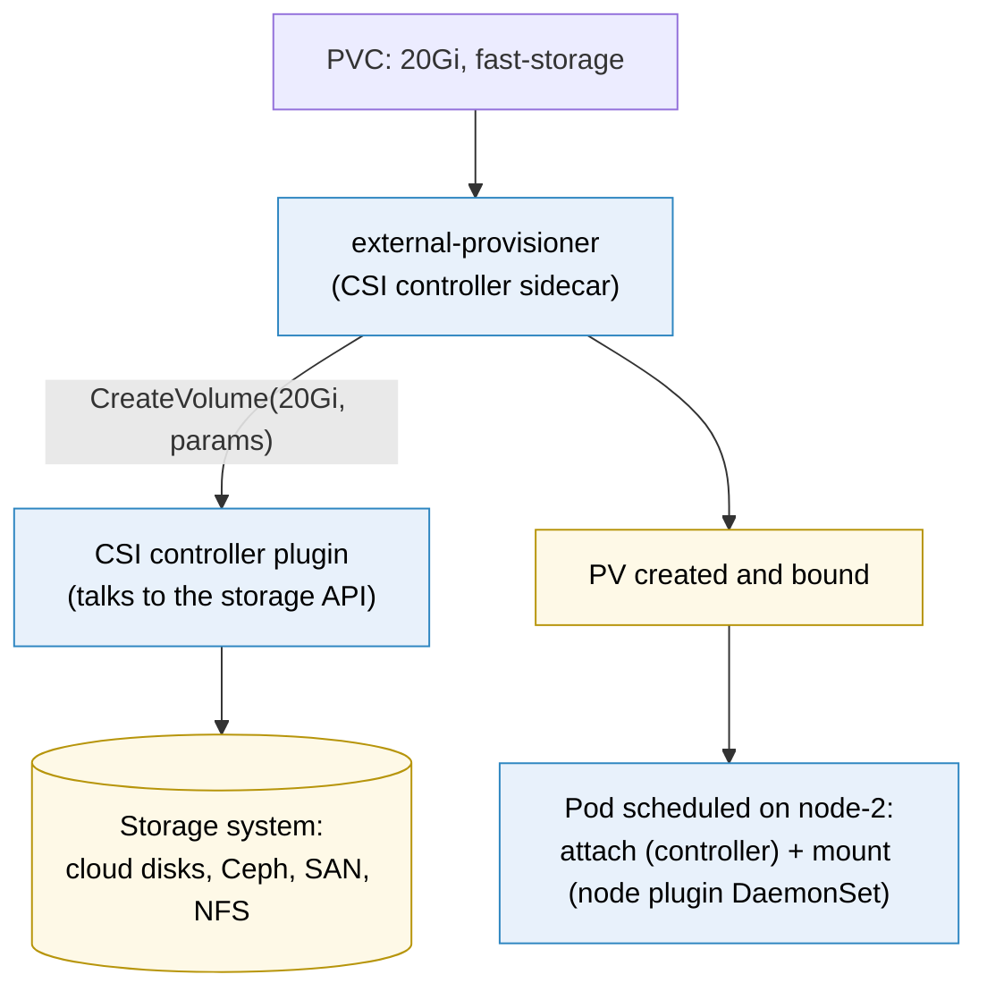

# Kubernetes StorageClass

> [!abstract] In one sentence
> A StorageClass is a **recipe for creating volumes on demand**: it names a **provisioner** (a CSI driver for some storage system), the **parameters** to pass it (disk type, performance, encryption), what happens to the disk when its claim is deleted (**reclaimPolicy**), **when** to create it (immediately or once the pod is scheduled), and whether it can grow. A [[Kubernetes PersistentVolumeClaim]] names a class, and the class's driver creates the volume.

## Build-up: offering storage tiers to the teams

### Stage 1: administrators creating disks by hand

Before dynamic provisioning, an administrator created disks in the storage system, then a [[Kubernetes PersistentVolumeClaim|PersistentVolume]] object for each, and hoped teams' claims matched their sizes. Every new database meant a ticket. And the platform team wants to offer **tiers** (fast SSDs (solid-state drives) for databases, cheap disks for logs, shared file storage for uploads) without teams knowing the storage system.

### Stage 2: classes as a menu

```yaml
apiVersion: storage.k8s.io/v1
kind: StorageClass
metadata:
  name: fast-storage
  annotations:
    storageclass.kubernetes.io/is-default-class: "false"
provisioner: block.csi.example.com           # the CSI driver's name (a cloud disk driver, Ceph block devices, a SAN vendor's…)
parameters:                                   # driver-specific: each driver documents its own
  type: ssd
  iops: "6000"
  encrypted: "true"
reclaimPolicy: Retain                         # keep the disk when the PVC is deleted
volumeBindingMode: WaitForFirstConsumer       # create it once the pod is scheduled
allowVolumeExpansion: true
mountOptions: [noatime]
```

A typical menu:

| Class | Provisioner | For |
|---|---|---|
| `fast-storage` | Block disks, SSD, high IOPS (input/output operations per second), `Retain` | Databases |
| `standard` (default) | Block disks, general purpose, `Delete` | Most claims that don't say otherwise |
| `shared-files` | A file storage driver (NFS (Network File System), CephFS, cloud file service) | ReadWriteMany claims |

Teams only write `storageClassName: fast-storage` in their claim. The class (and its driver) does the rest.

### Stage 3: the CSI driver



The **CSI (Container Storage Interface)** is the standard API (application programming interface) between Kubernetes and storage systems, like CRI (Container Runtime Interface) for runtimes and CNI (Container Network Interface) for networking ([[Kubernetes architecture]]). A CSI driver has a **controller** part (create, delete, attach, snapshot, resize volumes through the storage system's API) and a **node** part running on every node as a [[Kubernetes DaemonSet]] (format and mount the volume for pods). Storage vendors ship the drivers; Kubernetes itself no longer contains storage code for specific products.

### Stage 4: the fields that matter

**`reclaimPolicy`** (`Delete` by default, or `Retain`): copied into each PV (PersistentVolume) created by the class. `Delete` destroys the disk when the PVC (PersistentVolumeClaim) is deleted, including when a whole namespace is deleted by mistake. Important data belongs on a `Retain` class (plus backups).

**`volumeBindingMode`**:
- `Immediate` (default): the disk is created as soon as the PVC exists, in some zone. The pod may then be scheduled to a node in another zone, where a zonal disk can't attach: the pod stays `Pending`
- `WaitForFirstConsumer`: the disk is created **after** the scheduler picks a node, in that node's zone, respecting the pod's other constraints. The right choice for zonal block storage

**`allowVolumeExpansion`**: whether claims of this class can be grown by editing their size.

**Default class**: the one annotated `is-default-class: "true"` provisions claims that don't name a class. Having **two** defaults makes the choice unpredictable; having **none** leaves class-less claims `Pending`.

### Stage 5: changing a class

A StorageClass's `provisioner` and `parameters` can't be changed after creation, and existing PVs keep the settings they were created with. To change a tier: create a new class (`fast-storage-v2`), use it for new claims, and migrate data for existing volumes (snapshot and restore, or application-level copy).

## Advanced problems

### 1. Every new PVC stays `Pending`
No default class and claims without `storageClassName`, a class name typo, or the CSI driver's pods not running (`kubectl get pods -n kube-system | grep csi`). `kubectl describe pvc` shows the provisioner's error.

### 2. Disks and pods in different zones
The class uses `Immediate` binding with zonal disks. Recreate the class with `WaitForFirstConsumer` (existing PVs stay where they are).

### 3. A deleted namespace took the database with it
Its PVCs were deleted, and the class's `Delete` policy deleted the disks. `Retain` on data classes, and backups outside the cluster.

## Easy to get wrong
- Leaving the default `reclaimPolicy: Delete` on database storage
- `Immediate` binding with zonal block storage
- Two default StorageClasses, or none
- Expecting parameter changes to affect existing volumes
- Asking for ReadWriteMany from a block-storage class

## Related
- Used by:: [[Kubernetes PersistentVolumeClaim]], [[Kubernetes StatefulSet]]
- Driver runs as:: [[Kubernetes DaemonSet]] (node plugin)
- Interfaces:: [[Kubernetes architecture]] (CRI, CNI, CSI)
- Storage concepts:: [[Storage devices]], [[NFS and SMB]], *[[Block, file and object storage]]*, *[[EBS]]*
- Overview:: [[Kubernetes]], [[Kubernetes worked example]]
- Area:: [[Containers]]

## Flashcards
#flashcards

What is a StorageClass? :: A recipe for dynamically provisioning volumes: provisioner, parameters, reclaim policy, binding mode, expansion
What is a CSI driver? :: A plugin implementing the Container Storage Interface: a controller part (create/attach volumes) and a node part (mount them)
Default reclaimPolicy of a StorageClass? :: Delete
volumeBindingMode Immediate vs WaitForFirstConsumer? :: Immediate creates the disk at once, maybe in the wrong zone. WaitForFirstConsumer creates it after scheduling, in the pod's node's zone
What does allowVolumeExpansion allow? :: Growing PVCs of that class by editing their requested size
What happens with no default StorageClass? :: PVCs without a class stay Pending
Can you change a StorageClass's parameters? :: No. Create a new class and migrate
Do StorageClass changes affect existing PVs? :: No
