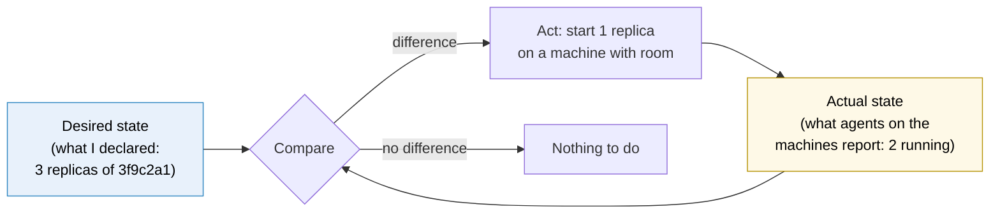
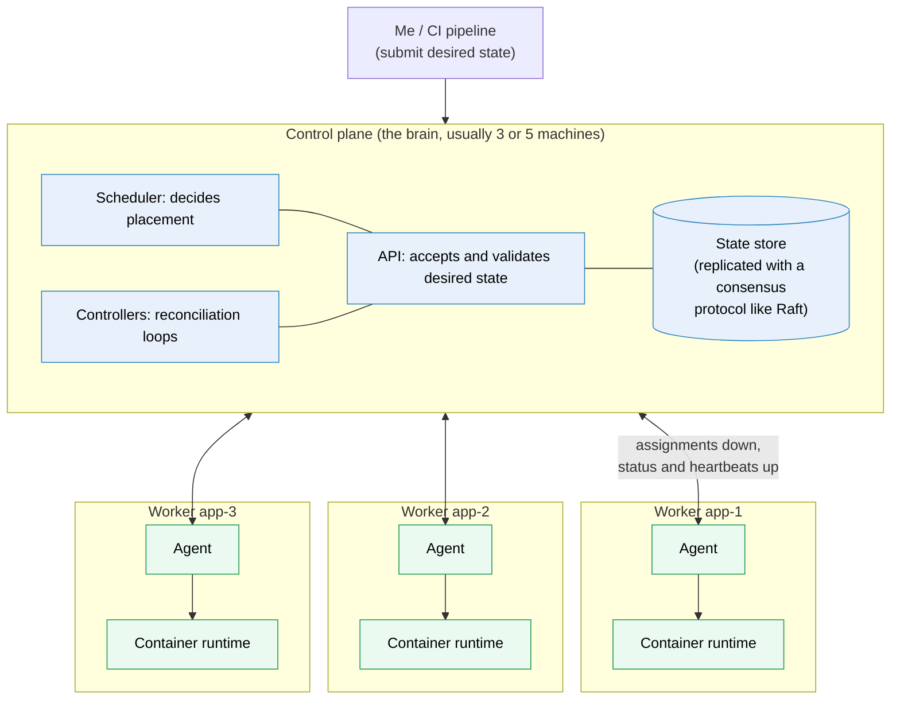

# Container orchestration

> [!abstract] In one sentence
> A container orchestrator turns **a group of machines into one pool** and keeps a **declared desired state** ("3 copies of `shop-api:3f9c2a1`, each with 1 CPU and 512 MB, reachable as `api`") true on its own: it **places** containers on machines, **replaces** them when they or their machine fail, **connects** them so they can find each other, and **changes** them gradually during deploys. Docker Swarm, Kubernetes, Nomad and ECS are all orchestrators.

## Build-up: from one server to a fleet

The shop runs with [[Docker Compose]] on one server, `app-1` (`10.0.1.11`). Traffic grows and the business wants it to survive a server failure.

### Stage 1: more servers, scripted by hand

Two more servers, `app-2` and `app-3`. A deploy script SSHes (Secure Shell) into each one and runs `docker compose pull && docker compose up -d`. A load balancer in front sends traffic to all three.

**The problems** appear quickly:
- **Placement**: the worker needs 2 GB of RAM (random-access memory) and the API (application programming interface) 512 MB. Which server has room? Someone decides, in a spreadsheet
- **Failure**: `app-2` dies at 3 a.m. Its containers are gone until someone starts them on another server, *and* edits the load balancer pool
- **Drift**: someone ran a hotfix by hand on `app-3`. Now the three servers run different versions and nobody knows
- **Deploys**: the script updates all three at once (downtime) or one by one (slow, and if the new version fails on `app-1`, the script still carries on)
- **Discovery**: the worker connects to the cache at `10.0.1.12:6379`. When the cache moves, every config changes
- **Scaling**: Black Friday needs 10 API containers. Adding them means more servers, more script edits, more load balancer edits

Every one of these is the same pattern: **a human comparing what should be running with what is running, and fixing the difference**. That's the job to automate.

### Stage 2: the orchestrator's model

An orchestrator replaces the script with two ideas.

**1. Declare, don't command.** Instead of "run this container on `app-2`", I submit a description of **what I want**:

```yaml
# not a real format: the shape every orchestrator shares
service: api
image: registry.example.com/shop-api:3f9c2a1
replicas: 3
resources: { cpu: 1, memory: 512M }
port: 8000
health_check: GET /health every 5s
update: one at a time, start the new one before stopping the old one
```

**2. A reconciliation loop.** The orchestrator stores that desired state and runs a loop, forever:



This is why an orchestrator **heals** without being told what broke. It doesn't need a rule for "server died" and another for "process crashed" and another for "someone deleted a container by hand": all three show up as "actual has 2, desired has 3", and the fix is the same.

> [!info] Level-triggered, not edge-triggered
> The loop looks at **the current state**, not at the events that happened. If it misses a "container died" event (restart, network blip), the next comparison still sees 2 instead of 3. Systems built on "react to each event exactly once" break when an event is lost; systems that re-compare the whole state converge anyway. Kubernetes calls this pattern a **controller**.

### Stage 3: what every orchestrator has to provide

Turning the model into a working system means solving the same list of problems, whatever the product:

| Job | The question it answers | Stage 1 problem it solves |
|---|---|---|
| **Cluster membership** | Which machines are in the pool, and are they alive (heartbeats)? | Failure detection |
| **Scheduling** (placement) | Which machine has the CPU/memory, the right labels, and isn't already running a copy? | Placement, spreading replicas across machines and zones |
| **Desired state store** | Where is "what should run" kept, safely, so it survives a manager dying? | Drift: one source of truth |
| **Self-healing** | Restart failed containers, reschedule the ones from a dead machine, replace unhealthy ones | Failure at 3 a.m. |
| **Service discovery and load balancing** | How does the worker find "the cache" when its IP (Internet Protocol) address changes? | Discovery (a stable name or virtual IP in front of moving containers, see [[Service discovery]]) |
| **Networking across hosts** | How does a container on `app-1` reach one on `app-3` by its own address? | Containers spread over many machines |
| **Rolling updates and rollback** | Replace replicas gradually, stop if the new ones are unhealthy, go back | Deploys |
| **Scaling** | Change the replica count, by hand or from metrics | Black Friday |
| **Configuration and secrets** | Deliver config and passwords to containers, without baking them in images | Credentials in images or scripts |
| **Storage** | Attach the right volume to a container wherever it lands | Stateful services |

### Stage 4: the shared architecture

Every orchestrator splits into the same two halves:



- Deploys come from me or from the CI (continuous integration) pipeline, which only ever talk to the control plane
- The **control plane** holds the desired state and makes decisions. It runs on several machines because losing it means nothing can be changed or healed
- The **state store** is replicated with a **consensus** protocol (usually **Raft**): a write is accepted only once a **majority** (a quorum) of control plane nodes has it. That's why control planes have an **odd number** of members: 3 tolerate 1 failure, 5 tolerate 2. With 4, a majority is still 3, so a 4th member adds no tolerance
- **Workers** run an **agent** that receives "run these containers", drives the local container runtime, and reports back what's actually running
- If the control plane goes down, **running containers keep running**: the agents don't kill them. What's lost is the ability to change anything or recover from new failures

### Stage 5: the products

| Orchestrator | Shape | Where it fits |
|---|---|---|
| **[[Docker Swarm]]** | Built into Docker Engine. Uses the Compose file format. Small and simple | Small teams, a few hosts, already on Compose |
| **[[Kubernetes]]** | The industry standard. Extensible API, huge ecosystem, every cloud offers it managed | Most production container platforms, anything that needs the ecosystem |
| **HashiCorp Nomad** | A single binary, schedules containers **and** plain processes, VMs (virtual machines), Java apps | Mixed workloads, simpler than Kubernetes, with Consul and Vault |
| **[[ECS]]** (Elastic Container Service, AWS) | Managed by AWS (Amazon Web Services), no control plane to run, deeply integrated with AWS | AWS-only shops that don't need Kubernetes' portability |

The comparison of the first two with Compose is in [[Compose vs Swarm vs Kubernetes]].

## Advanced problems

### 1. Losing quorum

Three managers, two die (or one dies and the network splits the other two apart). The survivor can't reach a majority, so it **refuses all writes**: no deploys, no rescheduling. Running containers keep serving. The fix is to bring a majority back; as a last resort, products have a "force a new cluster from this node" recovery. Prevention: managers spread across failure zones, and never an even count.

### 2. The orchestrator fights a manual fix

Someone stops a misbehaving container by hand on a worker; seconds later it's back. Someone scales a service by hand; the next deploy from the pipeline sets it back. The orchestrator reconciles **toward the declared state**, so fixes must go **into** the declared state (the repository, the pipeline), not around it.

### 3. Rescheduling makes a bad situation worse

A worker runs out of memory, its containers are killed and rescheduled on the remaining workers, which then also run out of memory: a cascade. Causes: no resource reservations (the scheduler thinks there's room), or no spare capacity for the loss of one machine. Fix: declare resource requests for every container and keep **N+1** capacity (the cluster can lose its biggest machine and still fit everything).

### 4. Flapping between healthy and unhealthy

A health check that's too strict (1-second timeout on an endpoint that queries the database) makes the orchestrator kill healthy containers under load, which increases the load on the rest. Health checks should test **the process**, be cheap, and have tolerances (several failures in a row before acting).

## In AWS

[[ECS]] is AWS's own orchestrator (control plane managed by AWS, workers on Fargate or EC2 (Elastic Compute Cloud) instances). EKS (Elastic Kubernetes Service) is managed Kubernetes: AWS runs the control plane, I run or rent the workers. AWS specifics stay in the AWS area.

## Practice

> [!example]- A worker machine is unplugged. Walk through what the orchestrator does.
> The control plane stops receiving the agent's heartbeats. After a timeout it marks the machine as down. The reconciliation loop now sees fewer running replicas than desired for every service that had containers there, the scheduler picks other machines with room, and the agents there start replacements. Service discovery stops sending traffic to the old addresses.

> [!example]- Why 3 managers and not 2?
> A write needs a majority. With 2 managers, the majority is 2, so losing either one stops all writes: 2 managers are **less** available than 1. With 3, the majority is 2, so one can fail.

> [!example]- The control plane is down for 10 minutes. Is the website down?
> Not by itself: the containers on the workers keep running and serving. During those minutes nothing can be deployed, scaled or healed, so a worker failure in that window would not be repaired.

## Easy to get wrong
- Thinking an orchestrator runs containers itself: the workers' agents and runtimes do. The control plane decides
- Thinking the control plane going down stops the applications
- Running 2 or 4 managers: an even count adds no failure tolerance
- Fixing things by hand on a node: the orchestrator reverts to the declared state
- No resource requests: the scheduler places blindly and failures cascade
- Treating "restart the container" as self-healing: real self-healing includes rescheduling elsewhere when the machine dies

## Related
- Before this:: [[Docker]], [[Docker Compose]]
- Products:: [[Docker Swarm]], [[Kubernetes]], [[ECS]]
- Compared:: [[Compose vs Swarm vs Kubernetes]]
- Deploying new versions:: [[Deployment strategies]]
- Depends on:: [[Service discovery]], [[Load balancing]], [[Network interfaces]] (overlay networks)
- Who reaches the cluster:: [[High availability networking]] (replicating managers and gateways, and where that recursion stops)
- Area:: [[Containers]]

## Flashcards
#flashcards

What does a container orchestrator do? :: Keeps a declared desired state true across a pool of machines: placement, self-healing, discovery, networking, rolling updates, scaling, config
What is a reconciliation loop? :: Compare desired state with actual state, act on the difference, repeat forever
Level-triggered vs edge-triggered reconciliation? :: Level-triggered re-compares the whole current state, so missed events don't matter. Edge-triggered reacts to each event and breaks if one is lost
What are the two halves of every orchestrator? :: A control plane (API, state store, scheduler, controllers) and workers (agent + container runtime)
Why does a control plane have an odd number of members? :: A write needs a majority; adding a member to reach an even count doesn't increase the number of failures tolerated
How many failures do 3 and 5 managers tolerate? :: 3 tolerate 1, 5 tolerate 2
What consensus protocol do Swarm and etcd use? :: Raft
What happens to running containers if the control plane is down? :: They keep running. Only changes and healing stop
What is the scheduler's job? :: Choosing which machine runs each container, based on resources, constraints and spreading
Why must manual fixes go into the declared state? :: The orchestrator reconciles toward the declared state and reverts changes made around it
What is N+1 capacity? :: Enough spare capacity that losing the biggest machine still leaves room for everything
