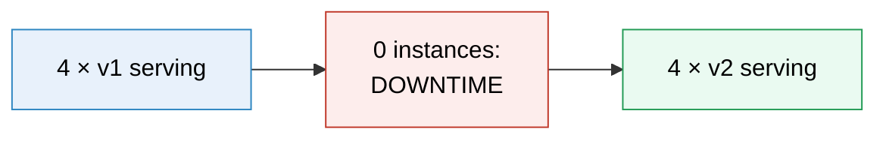
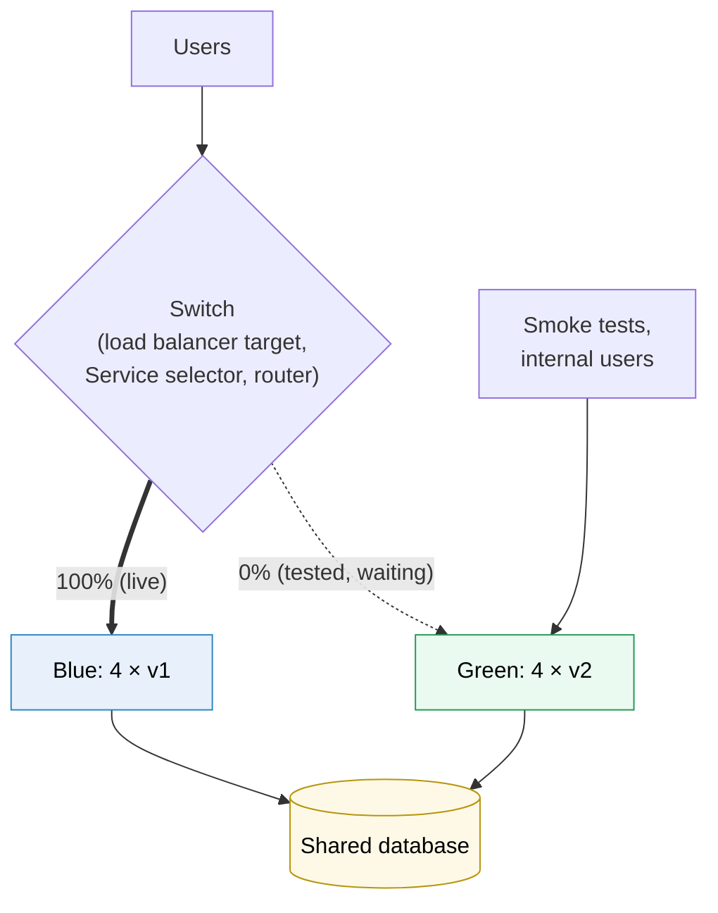
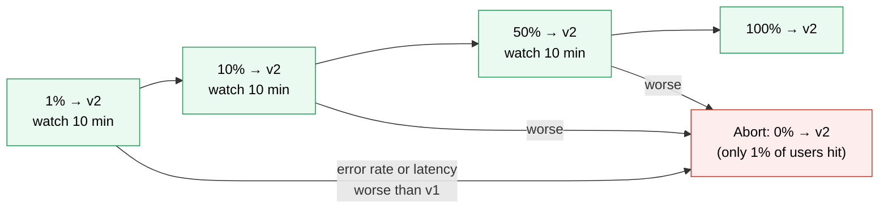
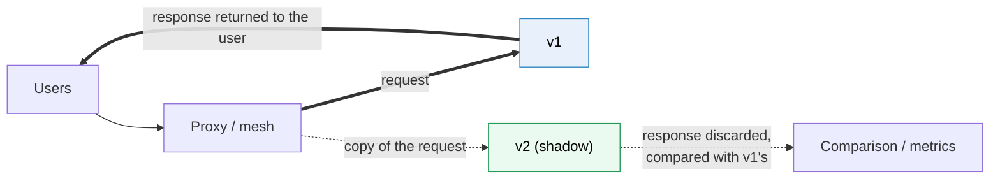
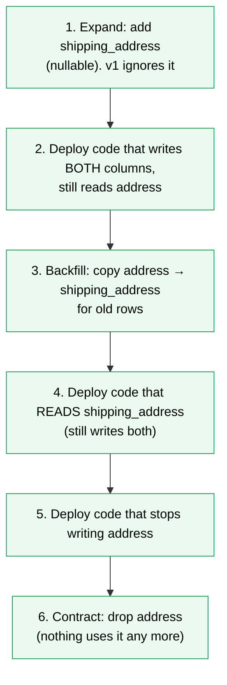

# Deployment strategies

> [!abstract] In one sentence
> A deployment strategy decides **how traffic moves from version 1 to version 2**: all at once after stopping everything (**recreate**), a few instances at a time (**rolling**), by switching between two complete environments (**blue/green**), by giving the new version a small share of real users first and growing it while watching metrics (**canary**), or by not exposing it at all and copying traffic to it (**shadow**). **A/B testing** is different: an experiment comparing two variants for users, not a safety mechanism. Every strategy trades **downtime, blast radius, rollback speed, extra capacity** and **how long two versions run side by side**.

## Build-up: shipping version 2 of the shop API

The shop API (application programming interface) runs as 4 replicas behind a load balancer (on [[Kubernetes]], [[Docker Swarm]] or [[ECS]] (Elastic Container Service): the strategies are the same). Version 2 changes the checkout code and adds a database column. The questions every strategy answers:

| Question | Why it matters |
|---|---|
| Is there **downtime**? | Users get errors during the deploy |
| How many users does a **bad version** hit before anyone notices? | The blast radius |
| How fast is the **rollback**? | Minutes of errors × users per minute |
| How much **extra capacity** does it need? | Cost, and whether the cluster has room |
| Do **v1 and v2 run at the same time**? | If yes, they must be compatible with each other and with the database |

> [!info] Deploy is not release
> **Deploying** puts the new code on servers. **Releasing** exposes it to users. Recreate and rolling do both at once. Blue/green, canary and feature flags separate them: the code is deployed, then released gradually or with a switch. Most of the safety comes from that separation.

### Stage 1: recreate

Stop all v1 instances, then start v2.



- **Downtime** for as long as v2 takes to start and become healthy
- **Blast radius**: everyone, at once
- **Rollback**: recreate again with v1 (more downtime)
- **Upside**: v1 and v2 **never** run together, and no extra capacity is needed

This is what `docker compose up -d` does (see [[Docker Compose]]). It's still the right choice when two versions **can't** coexist: a job that must have exactly one writer, a version that changes a file format both would write, a development environment where downtime doesn't matter. In Kubernetes: `strategy: type: Recreate`.

### Stage 2: rolling update

Replace instances **in batches**: start some v2, wait until they're healthy, stop some v1, repeat.

With 4 replicas, `maxSurge: 1` (at most 1 instance **above** the desired count) and `maxUnavailable: 0` (never fewer healthy instances than desired):

| Step | v1 | v2 | Serving |
|---|---|---|---|
| Start | 4 | 0 | 4 |
| 1 v2 started, passes its readiness check | 4 | 1 | 5 |
| 1 v1 stopped (drained first) | 3 | 1 | 4 |
| … repeated … | 2 | 2 | 4 |
| | 1 | 3 | 4 |
| End | 0 | 4 | 4 |

- **No downtime**, if each new instance only receives traffic once its **readiness** check passes, and each old one is **drained** (removed from the load balancer, finishes in-flight requests on SIGTERM, the termination signal) before it stops (see [[Inter-process communication]])
- **Little extra capacity**: one extra instance here. With `maxSurge: 0, maxUnavailable: 1` it needs none, but serves with 3 during the rollout
- **Blast radius grows over time**: after step 1, about 20% of requests hit v2; halfway, 50%. If v2 is broken in a way health checks don't catch (wrong prices, slow checkout), it spreads to everyone at the speed of the rollout
- **Rollback is another rolling update** back to v1: minutes, not seconds
- **v1 and v2 serve at the same time** during the whole rollout. Same user, two requests, two versions

> [!warning] Health checks decide everything in a rolling update
> The orchestrator moves to the next batch when the new instances are **healthy**. If the readiness check only says "the process is up", a v2 that returns 500 errors on checkout passes it, and the rollout completes happily. The check must test that the instance can actually serve, and the rollout should **pause and wait** (`minReadySeconds` in Kubernetes, `delay` in Swarm) so problems have time to show.

This is the default almost everywhere: Kubernetes Deployments, Swarm services, ECS services. It's fine for most changes. What it lacks is a way to **limit exposure on purpose** and to **go back instantly**.

### Stage 3: blue/green

Run **two complete environments**. **Blue** is the live one (v1). Deploy v2 to **green**, test it with no user traffic, then **switch all traffic** from blue to green in one step. Keep blue running for a while.



After the switch, green is live and blue is idle. If green misbehaves, **switch back**: rollback takes seconds, because blue is still running and warm. Once green has been fine for a while (the "bake time"), blue is torn down or becomes the target of the next deploy.

In Kubernetes, the simplest form is two Deployments (`api-blue`, `api-green`, each pod labelled with its `version`) and one Service whose selector is changed:

```yaml
apiVersion: v1
kind: Service
metadata: { name: api }
spec:
  selector: { app: api, version: green }    # was: version: blue
  ports: [{ port: 80, targetPort: 8000 }]
```

What it costs and where it bites:
- **Double capacity** during the deploy (two full environments)
- **Blast radius at the switch is 100%**: everyone moves at once. The protection is the testing before the switch and the instant rollback after it, not gradual exposure
- **The switch must be a real switch.** Changing a load balancer's target or a Service's selector is immediate. Switching through **DNS** (Domain Name System) is not: resolvers and clients cache the old answer for the TTL (time to live) or longer, so traffic trickles over for minutes or hours (see [[DNS in production]])
- **Long-lived connections stay on blue**: WebSockets, gRPC (Google's remote procedure call framework) streams and keep-alive connections opened before the switch keep going to blue until they close. Blue must drain them before being shut down
- **Green starts cold**: empty caches, no JIT (just-in-time compilation) warm-up, fresh connection pools. A perfectly healthy green can be slow for its first minute of full traffic. Warm it with synthetic traffic first
- **The database is shared**. Blue and green are separate for code, not for data. If v2 changes the schema in a way v1 can't read, switching back doesn't restore anything (stage 8)

### Stage 4: canary

Send a **small share of real traffic** to v2, compare it with v1, and increase the share step by step while the metrics stay good. The name comes from the canaries miners carried: a small, early victim that warns before everyone is affected.



- **Blast radius is chosen**: a broken v2 hits 1% of requests for 10 minutes, not everyone
- **Rollback is instant**: set v2's share back to 0
- **Detects what health checks can't**: a higher error rate on checkout, slower responses, more failed payments. The comparison is between the canary and the **baseline** (v1 at the same time), so a traffic spike that slows both isn't blamed on v2
- **Little extra capacity**: the canary is a few instances

How the traffic is split matters:

| Splitting method | Precision | Notes |
|---|---|---|
| **Replica ratio** (1 v2 pod among 10 behind one Service) | Coarse: 10% steps, tied to pod count | No extra tooling. A plain rolling update paused after the first batch is a crude canary |
| **Weighted load balancer / ingress / Gateway API route** | Exact percentages, independent of replica counts | `weight: 95` / `weight: 5` on two backends |
| **Service mesh** | Exact, plus routing by header or user | Per-request routing in the sidecars (see [[Service mesh]]) |
| **Weighted DNS** | Coarse, and slowed by caches | For whole sites or regions, not quick rollbacks |

Tools automate the loop (shift weight, query metrics, promote or abort): Argo Rollouts and Flagger on Kubernetes, the platform's own traffic shifting elsewhere.

What makes canaries hard:
- **Not enough traffic**: at 1% of 100 requests per minute, the canary sees 1 request a minute. Ten minutes of that can't show a 2% error rate. Low-traffic services need a bigger share, a longer wait, or synthetic traffic
- **Users flip between versions**: with per-request splitting, a user can see v2's page and then call v1's API. Route by **user** (a hash of the user ID (identifier), a cookie) when versions must be consistent for a session
- **Metrics must be per version**: one dashboard averaging v1 and v2 hides a canary that's failing at 1%. Every metric needs a `version` label

### Stage 5: A/B testing (an experiment, not a safety net)

A/B testing **looks** like a canary (two versions, traffic split) but answers a different question:

| | Canary | A/B test |
|---|---|---|
| Question | "Is v2 **safe**?" (errors, latency) | "Is variant B **better for the business**?" (conversion, clicks, revenue) |
| Owner | Operations / the release process | Product team |
| Who gets B | Random requests or users, growing share | A **fixed**, consistent group of users (hash of user ID) |
| Duration | Minutes to hours, then 100% | Days to weeks, until the result is statistically significant |
| End | v2 for everyone, or rollback | The winner, possibly A |
| Usually done with | Traffic routing in the infrastructure | **Feature flags** in the application, both variants in the same build |

A/B tests are usually **not** separate deployments at all: one version of the code contains both variants (a new checkout button and the old one), and a flag decides which one each user sees. Mixing them up leads to "we canaried the new checkout for a week" (an experiment run with deployment tooling, slowing every other release) or "the A/B test showed no errors" (the wrong metric).

### Stage 6: shadow (mirroring, dark launch)

Send a **copy** of live traffic to v2. Users only ever get v1's responses; v2's responses are recorded and compared, then thrown away.



- **Zero user impact**, real production traffic, real load: ideal for a rewrite of a read path, a new search engine, a performance test of a new version
- **Side effects are the danger**: if v2 handles a mirrored "place order" request for real, the customer is charged twice and gets two emails. Shadowing is safe only for **read-only** requests, or with v2's side effects pointed at fakes (a sandbox payment provider, a disabled mailer, a separate database)
- Doubles the load on everything v2 calls

### Stage 7: feature flags, separating deploy from release in code

All the strategies above route **requests** between **deployments**. A feature flag moves the switch **inside the code**:

```python
if flags.enabled("new_checkout", user_id=user.id):   # flag service decides: off, on for staff, 5% of users, everyone
    return new_checkout(cart)
return old_checkout(cart)
```

- The new checkout is **deployed dark** (with a normal rolling update), then **released** separately: staff first, then 5% of users, then everyone. Turning it off is a configuration change taking seconds, with no deploy
- A flag is also a **kill switch** for a feature that misbehaves later
- Per-user targeting gives A/B tests and canary-like rollouts of a **feature** rather than of a whole version
- **Cost: flag debt**. Every flag doubles the code paths to test. Flags that stay after the feature is fully released turn into dead code and surprise behaviour. Remove them on a schedule

### Stage 8: the database problem, and expand/contract

v2 renames the column `orders.address` to `orders.shipping_address`. With **any** strategy except recreate, v1 and v2 run at the same time on the same database. If the migration renames the column before or during the rollout, every v1 instance still running breaks; rolling back to v1 after the migration breaks too. Blue/green doesn't help: the database is shared.

The fix is to never make a change that the previous version can't live with. Split it into backward-compatible steps, each its own deploy (**expand and contract**, also called parallel change):



At every step, the running version and the previous one both work with the current schema, so any step can be rolled back by one version. It's slower (several releases for one rename), and it's the price of zero-downtime deploys. The same rule applies to anything shared between versions: **message formats** in a queue (v1 consumers must cope with v2's messages), **cache entries**, **API contracts** between services, **session formats**.

## Side by side

| | Recreate | Rolling | Blue/green | Canary | Shadow | Feature flag |
|---|---|---|---|---|---|---|
| Downtime | Yes | No | No | No | No | No |
| Blast radius of a bad version | Everyone | Grows with the rollout | Everyone at the switch (after testing) | A chosen small share | Nobody | A chosen share of users |
| Rollback | Redeploy (downtime) | Rolling back (minutes) | Switch back (seconds) | Weight to 0 (seconds) | Nothing to roll back | Flag off (seconds) |
| Extra capacity | None | 0 to a few instances | Double | A few instances | A full copy of the load | None |
| v1 and v2 together | No | Yes, during rollout | Briefly, and both on one database | Yes, for the whole canary | Yes (v2 unseen) | Both code paths in one build |
| Needs | Nothing | Good readiness checks | A real switch, double capacity | Traffic splitting, per-version metrics | Mirroring, side-effect isolation | A flag system, discipline to remove flags |
| Detects | — | Crashes, failed health checks | Problems found by pre-switch tests | Errors and latency on real traffic | Errors, diffs, performance | Feature-level issues |

## If I have to choose

- Default for stateless services → **rolling**, with real readiness checks and a pause between batches
- Versions can't coexist (single writer, incompatible formats) and a short outage is acceptable → **recreate**
- Risky release, need an instant way back, capacity is available → **blue/green**
- High-traffic service where real-traffic signals matter → **canary**, automated with per-version metrics
- Rewriting something read-only, or testing performance under real load → **shadow**
- A product change to expose gradually or test on users → **feature flag** (and A/B test through it)
- Strategies combine: canary each deploy, release features behind flags, and expand/contract the schema in every case

## Advanced problems

### 1. Rollback that can't roll back

**Symptom:** v2 is bad, the team rolls back to v1, and v1 now crashes. **Cause:** v2's migration changed the schema (or the data, or a message format) in a way v1 can't read. **Fix:** expand/contract, migrations as separate deploys, and testing that **v1 runs against the post-migration schema** before deploying v2.

### 2. The rolling update finished, but v2 is broken

**Symptom:** the rollout completed, errors are up 5%. **Cause:** the readiness check only tested that the process responded. **Fix:** readiness that tests real serving, `minReadySeconds`/delays so failures surface between batches, and automated analysis of error rate and latency (a canary step) before continuing.

### 3. Kubernetes doesn't roll back on its own

**Symptom:** a broken Deployment rollout sits half-done for an hour. **Cause:** a plain Deployment **stops** progressing when new pods never become ready, and after `progressDeadlineSeconds` (10 minutes by default) marks the rollout as failed, but it does **not** roll back automatically (Swarm can, with `failure_action: rollback`). **Fix:** the pipeline watches `kubectl rollout status` and runs `kubectl rollout undo` on failure, or a progressive delivery tool (Argo Rollouts, Flagger) does it.

### 4. Blue never drains

**Symptom:** after a blue/green switch, blue still has connections an hour later and can't be shut down without errors. **Cause:** long-lived connections (WebSocket, gRPC streams, HTTP (Hypertext Transfer Protocol) keep-alive from other services) opened before the switch. **Fix:** a maximum connection age on the servers, clients that reconnect, and a drain step that closes connections gracefully before shutdown.

### 5. The canary looked fine, then 100% fell over

**Symptom:** v2 was healthy at 10%, and overloaded the database at 100%. **Cause:** problems that only appear at full load (a slow query, a connection pool per instance multiplied by the replica count, a cache stampede) are invisible at a small share. **Fix:** watch dependency metrics (database CPU (central processing unit), connections), not only the service's own, add a 50% step with a longer wait, and load-test before.

## In AWS

[[ECS]] services do rolling updates by default (`minimumHealthyPercent` / `maximumPercent`), and support blue/green with two target groups behind a load balancer, with canary or linear traffic shifting and automatic rollback on alarms. Weighted records in [[Route 53]] give DNS-based canaries and blue/green between whole environments (with the caching delay). Auto Scaling instance refreshes roll new machine images out in batches with canary checkpoints ([[Auto Scaling]]). AWS (Amazon Web Services) AppConfig ([[Systems Manager]]) provides feature flags with gradual rollout and rollback.

## Practice

> [!example]- 4 replicas, `maxSurge: 0`, `maxUnavailable: 1`. How many instances serve during the rollout, and how much extra capacity is needed?
> 3 serve at the low point of each step (one is replaced at a time), and no extra capacity is needed. With `maxSurge: 1, maxUnavailable: 0` it's the opposite: always 4 serving, 5 running at peak.

> [!example]- Blue/green switched via DNS with a 300-second TTL. Thirty seconds after the switch, green has a bug. Why is rolling back messier than expected?
> Traffic hasn't fully moved yet: many clients still use blue's address from cache, others moved to green. Switching DNS back is just as slow. Users are split between the two versions for minutes. A load balancer or router switch avoids this.

> [!example]- The product team wants to know whether a new checkout page increases sales. Canary or A/B test?
> A/B test: a fixed, consistent group of users sees variant B for long enough to measure conversion, usually through a feature flag. A canary only checks that a version is safe and then goes to 100%.

> [!example]- Why can't the new payment service simply be shadowed with all production traffic?
> Mirrored "pay" requests would be executed for real: double charges. Shadow only read-only requests, or point the shadow's side effects at a sandbox.

> [!example]- v2 renames a column. Which strategies are safe without changing the migration plan?
> Only recreate (v1 and v2 never run together), and even then rollback to v1 breaks. With rolling, blue/green or canary, v1 and v2 share the database: use expand/contract.

## Easy to get wrong
- Thinking blue/green isolates the database: both environments usually share it
- Using DNS as the switch for blue/green and expecting an instant cutover
- Calling a canary an A/B test (or the reverse): safety check vs business experiment
- Readiness checks that only test "the process is up": broken versions pass rolling updates
- Expecting a Kubernetes Deployment to roll back on its own
- Averaging metrics across versions: a failing canary disappears in the total
- Shadowing requests that have side effects
- Schema changes that the previous version can't live with
- Forgetting that during a rolling update, the same user can hit both versions
- Leaving feature flags in the code forever

## Related
- Where deploys happen:: [[Container orchestration]], [[Kubernetes]], [[Docker Swarm]], [[ECS]]
- A full app with a migration Job:: [[Kubernetes worked example]]
- What gets deployed:: [[Docker image tags]] (deploy by digest, build once and promote)
- Traffic splitting:: [[Load balancing]] (draining, health checks), [[Service mesh]] (weighted routing), [[DNS in production]] (weighted DNS), [[Reverse proxy]]
- Graceful shutdown:: [[Inter-process communication]] (SIGTERM)
- In AWS:: [[ECS]], [[Route 53]], [[Auto Scaling]], [[Systems Manager]]
- Area:: [[Containers]]

## Flashcards
#flashcards

Deploy vs release? :: Deploy puts code on servers. Release exposes it to users. Blue/green, canary and feature flags separate them
What is a recreate deployment? :: Stop all old instances, then start the new ones: downtime, but versions never coexist
When is recreate the right choice? :: When two versions can't run at the same time (single writer, incompatible formats) and a short outage is acceptable
What is a rolling update? :: Replacing instances in batches, each new one taking traffic once healthy, until all run the new version
maxSurge vs maxUnavailable? :: How many instances may run above the desired count vs how many may be missing during a rolling update
Main weakness of a rolling update? :: A bad version that passes health checks spreads to everyone, and rollback is another slow rollout
What is blue/green deployment? :: Two full environments; deploy and test green, switch all traffic from blue to green at once, keep blue for instant rollback
Costs of blue/green? :: Double capacity, a cold green, long-lived connections on blue, and a shared database
Why is DNS a poor blue/green switch? :: Caches keep the old answer for the TTL or longer, so traffic moves slowly and rollback is slow too
What is a canary deployment? :: A small share of real traffic to the new version, compared with the baseline, increased step by step or aborted
Why must canary metrics be split by version? :: Averaged with the old version, the canary's errors disappear in the total
Why do low-traffic services make canaries hard? :: Too few requests reach the canary to detect a difference in error rate
Canary vs A/B test? :: Canary checks a version is safe (errors, latency) then goes to 100%. A/B compares business metrics for fixed user groups over days
How are A/B tests usually implemented? :: Feature flags in one build, with users assigned consistently (hash of user ID)
What is a shadow deployment? :: A copy of live traffic sent to the new version, its responses discarded and compared
Main risk of shadow traffic? :: Side effects executed twice (payments, emails, writes)
What do feature flags give? :: Release separately from deploy, gradual exposure per user, a kill switch
What is flag debt? :: Old flags left in the code, multiplying code paths and surprises
What is expand and contract? :: Splitting an incompatible change into backward-compatible steps: add, write both, backfill, switch reads, stop old writes, drop
Why doesn't blue/green make schema changes safe? :: Both environments share the database, so rollback doesn't undo the schema
Does a Kubernetes Deployment roll back automatically? :: No. It marks the rollout failed after progressDeadlineSeconds; the pipeline or a tool must undo it
Why can a canary pass at 10% and fail at 100%? :: Load-dependent problems (slow queries, connection pools, cache stampedes) only appear at full scale
