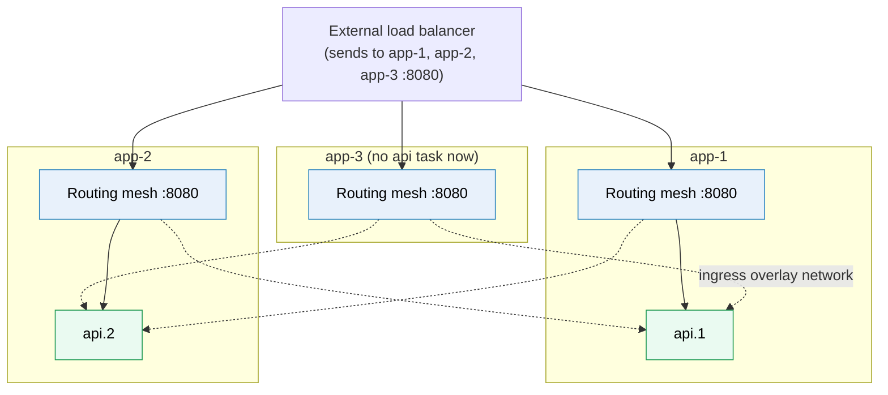

# Docker Swarm

> [!abstract] In one sentence
> Docker Swarm (Swarm mode) is the orchestrator **built into Docker Engine**: `docker swarm init` turns a few Docker hosts into a cluster of **managers** (which hold the desired state, replicated with Raft) and **workers**, and a Compose file deployed with `docker stack deploy` becomes **services** whose replicas are spread across the machines, restarted elsewhere when a machine dies, connected by **overlay networks** and reachable on any node through the **routing mesh**.

## Build-up: the shop's Compose file on three servers

The shop runs with [[Docker Compose]] on `app-1`. It needs to survive the loss of a server, and the team already knows Compose. Swarm is the smallest step from there to [[Container orchestration]].

### Stage 1: making a cluster

```bash
# on app-1 (10.0.1.11)
docker swarm init --advertise-addr 10.0.1.11
# prints a join command with a worker token

# on app-2 and app-3
docker swarm join --token SWMTKN-1-… 10.0.1.11:2377

# back on app-1
docker node ls
```

```
ID          HOSTNAME  STATUS  AVAILABILITY  MANAGER STATUS
x1… *       app-1     Ready   Active        Leader
k7…         app-2     Ready   Active
p3…         app-3     Ready   Active
```

That's the whole installation: Swarm mode is part of the Docker Engine already on the servers. `init` also creates a **certificate authority** for the cluster: every node gets a certificate, and all traffic between nodes uses mutual TLS (Transport Layer Security, see [[mTLS]]), with certificates rotated automatically.

The firewall between nodes needs: **TCP (Transmission Control Protocol) 2377** (cluster management, to managers), **TCP and UDP (User Datagram Protocol) 7946** (node-to-node gossip), and **UDP 4789** (overlay network traffic, VXLAN, Virtual Extensible LAN (local area network)).

**The problem:** with only `app-1` as a manager, the cluster's brain is a single machine. Workers keep running their containers if it dies, but nothing can be deployed or healed.

### Stage 2: three managers

```bash
docker node promote app-2 app-3
```

Now all three are managers (managers also run containers by default). They keep the cluster state in a **Raft** log replicated between them: one is the **leader**, a change is committed when a **majority** (2 of 3) has it. One manager can die and the cluster still works.

| Managers | Majority | Can lose |
|---|---|---|
| 1 | 1 | 0 |
| 3 | 2 | 1 |
| 5 | 3 | 2 |
| 7 | 4 | 3 |

Docker recommends no more than 7: more managers make every write slower without much benefit. A big cluster has 3 or 5 managers and many workers, and the managers can be kept free of workloads with `docker node update --availability drain`.

### Stage 3: services instead of containers

On a Swarm, I don't run containers, I create **services**: a desired state that Swarm keeps true.

```bash
docker service create --name api --replicas 3 -p 8080:8000 \
  registry.example.com/shop-api:3f9c2a1
docker service ps api
```

```
NAME     IMAGE                      NODE    DESIRED STATE  CURRENT STATE
api.1    …/shop-api:3f9c2a1         app-1   Running        Running 20 seconds ago
api.2    …/shop-api:3f9c2a1         app-2   Running        Running 20 seconds ago
api.3    …/shop-api:3f9c2a1         app-3   Running        Running 20 seconds ago
```

- A **service** is the declaration (image, replicas, ports, networks, update policy)
- Each replica is a **task**: one slot that the scheduler assigns to a node. A task runs exactly one container. If the container dies, the task is marked failed and a **new task** replaces it (maybe on another node)
- **Replicated** services run N tasks anywhere. **Global** services (`--mode global`) run exactly one task **on every node**: log shippers, monitoring agents

Now unplug `app-3`. The managers stop getting its heartbeats, mark it `Down`, and the reconciliation loop sees 2 running `api` tasks instead of 3: a replacement task is scheduled on `app-1` or `app-2`. When `app-3` comes back, Swarm **doesn't move tasks back** on its own (it won't disturb running containers). A `docker service update --force api` rebalances.

### Stage 4: the routing mesh, or how traffic finds the tasks

The service was published on port 8080. Which machine do I send traffic to?

**Any of them.** Swarm publishes a service's port on **every node** in the cluster, even those not running a task of that service. A connection to `app-3:8080` is load-balanced (by IPVS, IP (Internet Protocol) Virtual Server, in the kernel) to one of the service's tasks, possibly on another node, over the **ingress** overlay network.



So the external load balancer only needs the list of nodes, never the list of containers. The trade-off: an extra hop between nodes, and the application sees the routing mesh's address as the client, not the real client IP address. When the real client IP matters, publish in **host mode** (`mode: host`), which binds the port only on the nodes running a task, like a plain `docker run -p`, combined with a global service so every node has one.

### Stage 5: overlay networks between services

Inside the cluster, the API (the shop's application programming interface) must reach the cache whatever node each lands on. An **overlay network** spans all nodes: each container gets an address on it, and traffic between nodes is wrapped in **VXLAN** packets on UDP 4789 (see [[Network interfaces]]).

```bash
docker network create --driver overlay --attachable shop
```

On an overlay network, a **service name** resolves (through Swarm's DNS, Domain Name System) to a **virtual IP** (VIP), and connections to that VIP are spread across the service's healthy tasks. The worker connects to `cache:6379` and never learns where the cache runs. That's server-side [[Service discovery]], built in.

> [!warning] Overlay traffic is not encrypted by default
> The control traffic between nodes is mutual TLS, but application traffic on an overlay network is plain VXLAN unless the network is created with `--opt encrypted` (IPsec, IP security, between nodes, with a CPU (central processing unit) cost). Across untrusted networks, turn it on.

### Stage 6: deploying the Compose file as a stack

Instead of `docker service create` commands, the whole Compose file is deployed as a **stack**: one Swarm service per Compose service.

```yaml
# stack.yaml (Compose format, with deploy: sections that Swarm uses)
services:
  api:
    image: registry.example.com/shop-api:3f9c2a1
    ports: ["8080:8000"]
    networks: [shop]
    secrets: [db_password]
    environment:
      DATABASE_PASSWORD_FILE: /run/secrets/db_password
    healthcheck:
      test: ["CMD", "curl", "-fsS", "http://localhost:8000/health"]
      interval: 5s
      retries: 3
    deploy:
      replicas: 3
      resources:
        limits: { cpus: "1.0", memory: 512M }
        reservations: { cpus: "0.25", memory: 256M }
      update_config:
        parallelism: 1          # one task at a time
        delay: 10s
        order: start-first      # start the new task before stopping the old one
        failure_action: rollback
      restart_policy:
        condition: any
      placement:
        max_replicas_per_node: 1

  db:
    image: postgres:17
    networks: [shop]
    volumes: [pgdata:/var/lib/postgresql/data]
    deploy:
      placement:
        constraints: [node.labels.db == true]   # always on the node that has the data

networks:
  shop:
    driver: overlay

volumes:
  pgdata:

secrets:
  db_password:
    external: true    # created beforehand: printf 's3cr3t' | docker secret create db_password -
```

```bash
docker node update --label-add db=true app-1
docker stack deploy -c stack.yaml shop
docker stack services shop
```

What this adds over Compose:
- **Rolling updates**: changing the image tag and re-running `docker stack deploy` replaces tasks one at a time, starting each new task before stopping its old one, waiting 10 s between them. If the new tasks fail their health check, `failure_action: rollback` returns the service to the previous version. **The health check now drives decisions**: a task is only considered running once it passes, and a task that turns unhealthy is replaced
- **Secrets**: stored encrypted in the managers' Raft log, sent only to nodes running a task that uses them, and mounted as an in-memory file at `/run/secrets/db_password`. Never in an environment variable, never in the image
- **Configs**: the same mechanism for non-secret files (an nginx config)
- **Placement**: constraints (`node.labels.db == true`, `node.role == worker`), preferences (spread across `node.labels.zone`), and a maximum number of replicas per node

> [!warning] What `docker stack deploy` ignores
> Swarm can't build: `build:` is ignored, so images must be pushed to a registry first, and every node must be able to pull them. `depends_on` is ignored too: on a cluster, services start in any order and must retry their connections. Some Compose keys are Compose-only, and `deploy:` keys are Swarm's.

### Stage 7: what Swarm still doesn't do

Six months later, the shop's needs grow past what Swarm offers:
- **Stateful services**: the database is pinned to `app-1` by a label because a local volume doesn't follow a task to another node. Making storage follow the container needs a volume plugin, and the ecosystem of those is small. Most teams keep databases out of Swarm
- **No autoscaling**: the replica count is a number I set. Scaling on CPU or request rate needs an external script
- **No extensibility**: the objects are services, tasks, networks, secrets, configs. There's no way to teach Swarm a new kind of object ("a PostgreSQL cluster", "a certificate") and a controller that manages it
- **Limited access control**: anyone who can reach a manager's Docker API controls the whole cluster. Role-based access control exists only in Mirantis' commercial edition
- **No network policies**: every container on an overlay network can reach every other one on it. Isolation is only "separate networks"
- **A small ecosystem**: monitoring, ingress controllers, operators, service meshes, policy engines, managed offerings from clouds: almost all of it is built for Kubernetes

That list is roughly what [[Kubernetes]] adds, at the price of much more complexity.

> [!info] Swarm's status
> "Docker Swarm" once meant a separate product (classic Swarm, now dead). Swarm **mode**, built into Docker Engine since 2016, is what this note covers. Mirantis maintains it after buying Docker's enterprise business in 2019, and it still works and is supported, but it gets few new features and few teams start new platforms on it. It remains a reasonable choice for a handful of hosts and a team that already lives in Compose files.

## Advanced problems

### 1. Losing manager quorum

Two of three managers are lost. `docker node ls` and `docker service update` fail with `The swarm does not have a leader`. Running tasks keep going. If the lost managers can't come back, the last one recovers with `docker swarm init --force-new-cluster` (it becomes a single-manager cluster with the existing state), then other nodes are promoted again. Back up `/var/lib/docker/swarm` on a manager to recover from total loss.

### 2. Overlay networks that don't work between nodes

Containers on the same node talk, across nodes they time out. Almost always the firewall or a security group blocks **UDP 4789** (VXLAN) or **7946** (gossip), or the MTU (maximum transmission unit) is too large: VXLAN adds 50 bytes of headers, so on a network with an MTU below 1500, large packets are dropped while small ones (like a ping) pass. Set the overlay network's MTU lower (`--opt com.docker.network.driver.mtu=1450`).

### 3. The address range of overlay networks collides

Swarm's default address pool is `10.0.0.0/8`, carved into `/24` networks. If the company network also uses `10.0.x.x`, containers can't reach real hosts whose addresses fall in the overlay's ranges. Set the pool at `docker swarm init --default-addr-pool 172.20.0.0/16` (see [[IP address planning]]).

### 4. A task stuck in "pending"

`docker service ps api` shows `Pending` with `no suitable node`. The scheduler can't place it: no node satisfies a placement constraint, the reservations are larger than any node's free resources, or `max_replicas_per_node` is lower than replicas ÷ nodes. Read the error column with `--no-trunc`.

## Practice

> [!example]- A service has 3 replicas published on port 8080 in ingress mode, and the cluster has 5 nodes. On which nodes does port 8080 answer?
> All 5. The routing mesh listens on every node and forwards to a task wherever it runs.

> [!example]- Why does a rolling update with `order: start-first` need more capacity than `stop-first`?
> For a moment the old and the new task run together, so the node (or cluster) must fit one extra task. `stop-first` frees the slot first but reduces capacity during the update.

> [!example]- The API's logs show every request coming from `10.0.0.5`. Why, and how to get the real client IP?
> The routing mesh forwards the connection, so the source address is the ingress network's address. Publish the port in host mode on the nodes running the tasks (often as a global service behind the load balancer), or have the load balancer pass the client IP in a header (`X-Forwarded-For`) or the PROXY protocol.

## Easy to get wrong
- Thinking Swarm needs a separate install: Swarm mode is built into Docker Engine
- An even number of managers, or just one
- Expecting `docker stack deploy` to build images or honour `depends_on`
- A local volume "following" a task to another node: it doesn't
- Forgetting UDP 4789 and 7946 in the firewall between nodes
- Expecting overlay traffic to be encrypted by default
- Expecting tasks to move back to a node that recovers
- Putting secrets in environment variables when Swarm secrets exist

## Related
- Concepts:: [[Container orchestration]], [[Deployment strategies]] (rolling updates and beyond)
- File format from:: [[Docker Compose]]
- Compared:: [[Compose vs Swarm vs Kubernetes]], [[Kubernetes]]
- In front of the cluster:: [[High availability networking]] (keeping the external load balancer's address alive)
- Under the hood:: [[Network interfaces]] (VXLAN, bridges), [[Service discovery]], [[Load balancing]], [[mTLS]]
- Area:: [[Containers]]

## Flashcards
#flashcards

What is Docker Swarm mode? :: The orchestrator built into Docker Engine: managers with Raft-replicated state, workers, services deployed from Compose files
Swarm service vs task? :: A service is the desired state. A task is one replica slot assigned to a node, running one container
Replicated vs global service in Swarm? :: Replicated runs N tasks anywhere. Global runs one task on every node
What consensus protocol do Swarm managers use? :: Raft
How many Swarm managers are recommended at most? :: 7 (usually 3 or 5)
What is the Swarm routing mesh? :: A published port listens on every node and is load-balanced (IPVS) to the service's tasks over the ingress overlay network
How do Swarm services find each other? :: Service name → virtual IP on an overlay network, via Swarm's DNS
Ports needed between Swarm nodes? :: TCP 2377 (management), TCP/UDP 7946 (gossip), UDP 4789 (VXLAN overlay)
Is Swarm overlay traffic encrypted by default? :: No. Control traffic is mTLS, but data needs --opt encrypted
How does Swarm deliver secrets to containers? :: Encrypted in the Raft log, sent only to nodes that need them, mounted in memory at /run/secrets/<name>
What does docker stack deploy ignore from a Compose file? :: build (images must be in a registry) and depends_on
What does update_config order: start-first do? :: Starts the new task before stopping the old one during a rolling update
How do you recover a Swarm that lost manager quorum? :: Bring a majority back, or docker swarm init --force-new-cluster on a surviving manager
Main things Swarm lacks compared to Kubernetes? :: Autoscaling, extensibility (custom resources), RBAC, network policies, storage ecosystem, broad ecosystem
