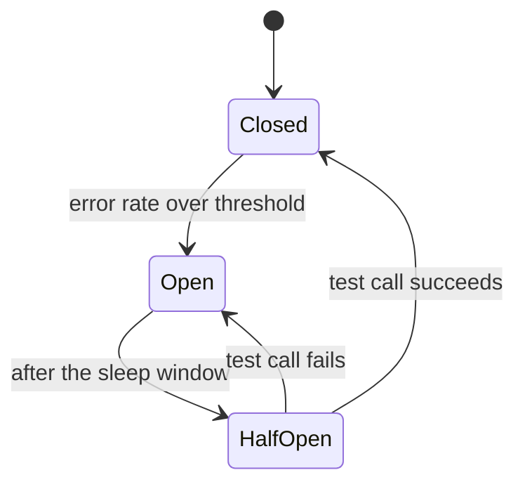
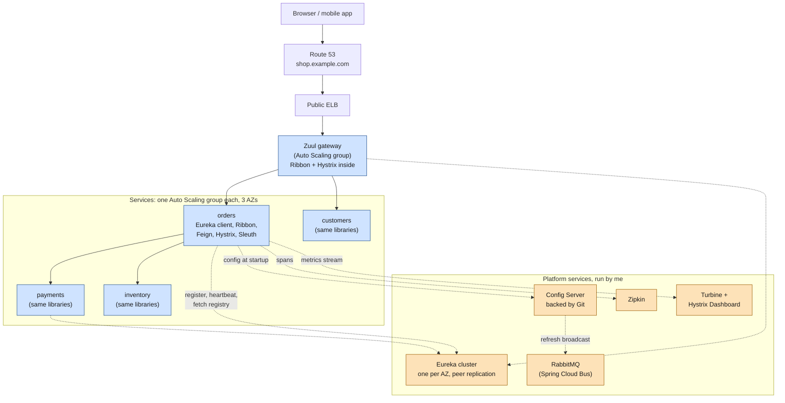
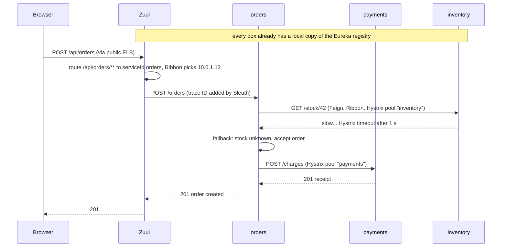
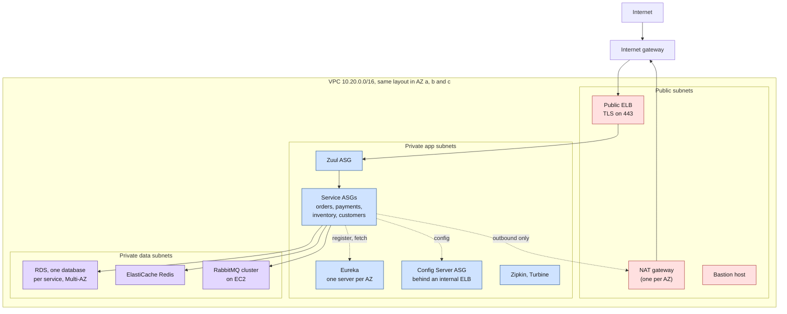
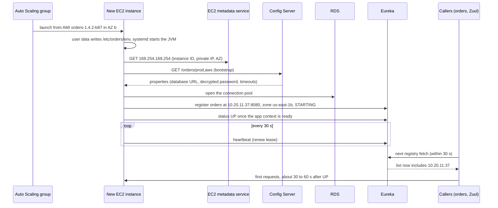
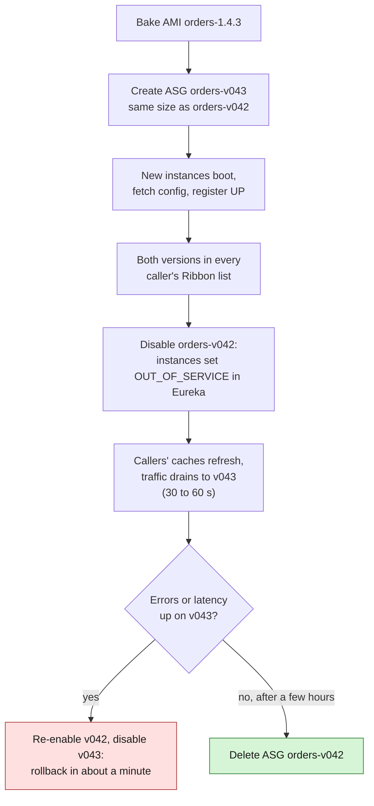
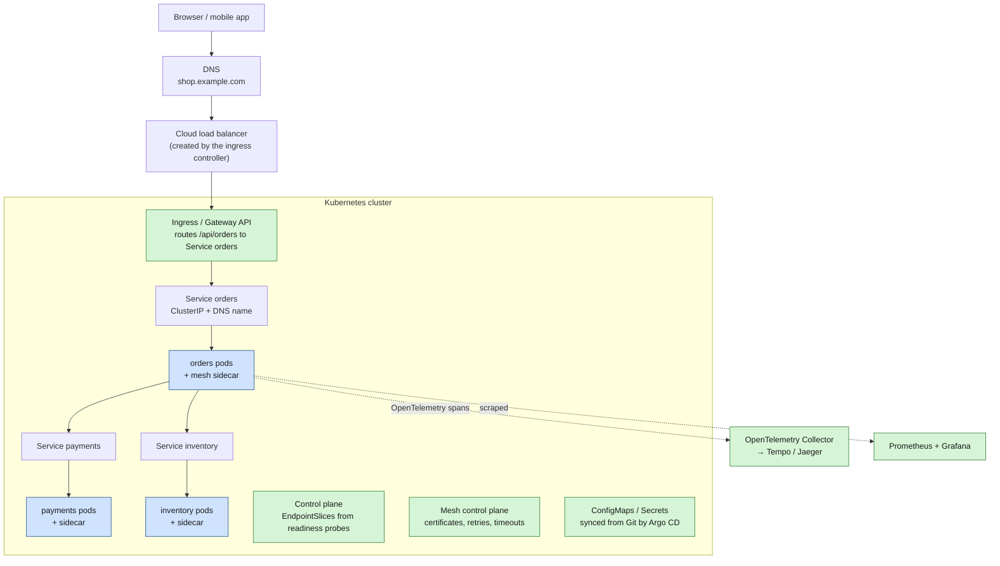

	# Spring Cloud and Netflix OSS

> [!abstract] In one sentence
> Between roughly 2012 and 2018, microservices ran on plain virtual machines with **no platform underneath**, so every concern a platform handles today (finding instances, balancing between them, cutting off failing ones, routing traffic in from outside, distributing configuration, tracing calls) was solved **inside the application**, as Java libraries: Netflix's open-source stack (**Eureka, Ribbon, Hystrix, Zuul**), packaged for Spring Boot as **Spring Cloud**. Then orchestrators (Kubernetes, ECS), service meshes and managed cloud services moved those jobs **into the platform**, where they work for any language and need no code, and most of the stack was retired.

## Build-up: a shop on virtual machines, around 2016

### Stage 0: the situation

I run an online shop. The monolith got split into services: `orders`, `payments`, `inventory`, `customers`, written in Java with Spring Boot, each owned by a different team. It runs on AWS (Amazon Web Services) **EC2 (Elastic Compute Cloud) virtual machines**, one service per VM (virtual machine) image, each service in its own **Auto Scaling group** spread over three AZs (Availability Zones). See [[Auto Scaling]].

What I **don't** have, because it doesn't exist yet or isn't mature:
- **Kubernetes** 1.0 shipped in July 2015, and almost nobody ran it in production. No ECS (Elastic Container Service) Service Connect, no Cloud Map (2018), no service mesh (Istio 1.0 is 2018)
- No container-aware load balancers: an internal ELB (Elastic Load Balancer) per service is possible, but it costs money per service, warms up slowly, adds a hop, and the Classic ELB only knows instances, not ports
- No platform that registers instances for me or health-checks them on behalf of the callers

So the question "`orders` needs to call `payments`: **which IP?**" has no answer from the infrastructure. The instances of `payments` get new IPs every time the Auto Scaling group replaces them. How all of this was actually set up on AWS, from the VPC to the deploys, is in "How it was hosted on AWS, around 2016" below.

### Stage 1: hard-coded addresses break immediately

First attempt: put the `payments` IPs in `orders`' configuration file. It breaks the first time Auto Scaling replaces a VM, and every deployment means editing config in N places. DNS (Domain Name System) records with a short TTL (time to live) help a bit, but the JVM (Java Virtual Machine) caches DNS answers (for ever, in some configurations), and DNS knows nothing about health. This is the problem [[Service discovery]] describes in general.

### Stage 2: a registry the instances talk to (Eureka)

Netflix had exactly this problem on AWS and open-sourced its answer in 2012: **Eureka**, a service registry.

- A **Eureka server** cluster runs on a few VMs (one per AZ). The servers replicate the registry to each other, peer to peer
- Each service instance embeds the **Eureka client**. At startup it **registers itself** ("I'm `payments`, at `10.0.2.17:8080`, status UP"), then sends a **heartbeat** every 30 seconds. If an instance misses heartbeats for 90 seconds, its lease expires and the server removes it
- Each client also **downloads the whole registry** and refreshes its local copy every 30 seconds. Calls look up the local copy, not the server, so if the Eureka servers all go down, services keep calling each other with the last known list

```java
// The registry: a Spring Boot app with one annotation
@SpringBootApplication
@EnableEurekaServer
public class RegistryApplication { }
```

```yaml
# payments: application.yml
spring:
  application:
    name: payments            # the name other services will look up
eureka:
  client:
    service-url:
      defaultZone: http://eureka-a:8761/eureka/,http://eureka-b:8761/eureka/,http://eureka-c:8761/eureka/
  instance:
    prefer-ip-address: true   # register the IP, not a hostname nobody can resolve
```

Why Netflix built its own instead of using ZooKeeper: ZooKeeper is **CP** (it favours consistency: a partitioned minority stops answering), and Netflix wanted **AP** (availability under partition: a slightly stale list of instances is far better than no list at all, because callers can retry on another instance). In CAP terms (Consistency, Availability, Partition tolerance), Eureka deliberately chose availability.

> [!warning] Self-preservation
> If a Eureka server suddenly stops receiving most heartbeats (below about 85% of what it expects), it assumes **the network is the problem, not the instances**, and **stops expiring anyone**. That's the famous red banner `EMERGENCY! EUREKA MAY BE INCORRECTLY CLAIMING INSTANCES ARE UP WHEN THEY'RE NOT`. Sensible during a partition, confusing in a small test setup where a few instances are stopped and never disappear from the registry.

### Stage 3: balancing in the caller (Ribbon, then Feign)

Eureka gives `orders` a list of `payments` instances. Something must **pick one per request**. With no load balancer in between, the caller does it: **Ribbon**, a client-side load balancer. It reads the list from the Eureka client, filters out instances that recently failed, and picks one (round robin by default, or zone-aware: prefer instances in my own AZ to avoid cross-AZ latency and data transfer charges).

In code, a call to a **service name** instead of a host:

```java
@Bean
@LoadBalanced                       // Ribbon intercepts and replaces "payments" with a real IP:port
RestTemplate restTemplate() { return new RestTemplate(); }

// later
restTemplate.postForObject("http://payments/charges", charge, Receipt.class);
```

**Feign** (Netflix, later OpenFeign) made it declarative: an interface, and Spring generates the HTTP (Hypertext Transfer Protocol) client, with Eureka lookup and Ribbon balancing underneath.

```java
@FeignClient(name = "payments")
public interface PaymentsClient {
    @PostMapping("/charges")
    Receipt charge(@RequestBody Charge charge);
}
```

This is **client-side discovery** (see [[Service discovery#Client-side vs server-side discovery]]): no hop through a central box, balancing per request, but the logic lives in a library inside every caller.

### Stage 4: one slow service takes everything down (Hystrix)

Black Friday: `inventory` gets slow. Every `orders` request now waits 30 seconds on it. Each waiting request holds a Tomcat thread. After 200 of them, `orders` has no threads left and stops answering **everything**, including requests that never needed `inventory`. Then the frontend, which waits on `orders`, runs out of threads too. One slow dependency, **cascading failure** across the whole shop.

**Hystrix** (Netflix, 2012) wraps every outbound call with (the patterns in depth: [[Resilience patterns]]; a hands-on tutorial: [[Hystrix]]):
- A **timeout**: never wait more than, say, 1 second
- A **bulkhead**: each dependency gets its own small thread pool (10 threads for `inventory`). When it's full, extra calls fail at once instead of eating the shared pool. One slow dependency can only exhaust *its* compartment, like the watertight compartments of a ship
- A **circuit breaker**: if more than 50% of recent calls to `inventory` failed, the circuit **opens** and calls fail instantly for a few seconds, without even trying, giving `inventory` room to recover. Then it lets one test call through (**half-open**); if it succeeds, the circuit closes again
- A **fallback**: what to return instead of an error ("stock unknown, show the product as available and check at checkout")



```java
@FeignClient(name = "inventory", fallback = InventoryFallback.class)
public interface InventoryClient {
    @GetMapping("/stock/{sku}")
    Stock stock(@PathVariable String sku);
}

@Component
class InventoryFallback implements InventoryClient {
    public Stock stock(String sku) { return Stock.unknown(sku); }  // degrade, don't fail
}
```

Each instance exposed a live metrics stream; **Turbine** aggregated the streams of all instances, and the **Hystrix Dashboard** showed every circuit, green or red, in real time.

### Stage 5: one front door (Zuul)

Browsers and the mobile app can't use Eureka. They need **one public address**, and something must route `/api/orders/**` to `orders`, check the user's token once, and apply rate limits. That's a [[Reverse proxy]] in the API (application programming interface) gateway role. **Zuul** (Netflix, 2013) is a Java gateway that is itself a Eureka client: it routes by service name, using Ribbon and Hystrix for each backend.

```yaml
zuul:
  routes:
    orders:
      path: /api/orders/**
      serviceId: orders       # looked up in Eureka, balanced with Ribbon
```

A public ELB sits in front of the Zuul instances, because Zuul itself is just another Auto Scaling group.

### Stage 6: configuration for 40 VMs (Spring Cloud Config and Bus)

Every service needs a database URL (Uniform Resource Locator), feature flags, timeouts, per environment. Baking them into the VM image means a new image per change. **Spring Cloud Config Server** serves configuration from a **Git repository**: at startup, each service asks it "I'm `orders`, profile `prod`" and receives its properties. Git gives history, review and rollback for free.

To change a value **without restarting**: beans annotated `@RefreshScope` are rebuilt when the app's `/refresh` endpoint is called. Calling it on 40 instances by hand is no fun, so **Spring Cloud Bus** connects all instances to a message broker (RabbitMQ over [[AMQP]], or [[Kafka]]): one call to `/bus-refresh` broadcasts the refresh to everyone.

### Stage 7: following a request across services (Sleuth and Zipkin)

A checkout touches five services and takes 4 seconds. Which one is slow? **Spring Cloud Sleuth** gives each request a **trace ID** (identifier), passes it in HTTP headers on every outbound call (the B3 headers, `X-B3-TraceId`), and adds it to every log line. Spans are sent to **Zipkin** (from Twitter), which draws the timeline of the whole request.

### The whole picture in 2016



One checkout, step by step:



### Why this was the right design at the time

- **There was no platform to delegate to.** Bare VMs gave me an IP and nothing else. If the app didn't do discovery, balancing and resilience, nothing did
- **Java was the monoculture.** Netflix, and most enterprises adopting microservices, wrote everything in Java. A library approach costs one dependency when every service is the same language
- **Spring Boot made it one annotation.** `@EnableEurekaClient`, `@FeignClient`, `@HystrixCommand`: a team got a production-grade microservice toolkit without operating anything new except a few Eureka and Config servers
- **Client-side balancing was genuinely better** than the load balancers available then: no extra hop, no per-service ELB bill, zone-aware routing, per-request balancing
- **It encoded hard-won lessons.** Circuit breakers, bulkheads, timeouts on every call, fallbacks: these ideas came from Netflix running at scale on AWS, and they're still correct. What changed is **where** they're implemented, not whether they're needed

### What hurt, and pushed the move

| Pain | Why |
|---|---|
| **Java only** | A Python or Go service had no Eureka client of the same quality, no Hystrix. Polyglot teams had to reimplement the stack or route through Zuul (Netflix's "Sidecar" project existed exactly to wrap non-Java apps) |
| **Infrastructure in the dependency tree** | Upgrading the retry behaviour meant upgrading a library and **redeploying every service**, team by team, over months. Versions drifted |
| **Slow convergence** | A new or dead instance took up to about 2 minutes to be seen everywhere (30 s heartbeat + 90 s lease + 30 s client cache refresh + 30 s Ribbon list refresh). Every deploy produced a burst of errors unless retries hid it |
| **Me operating the platform** | Eureka cluster, Config Server, RabbitMQ, Zipkin, Turbine: five more systems to patch, monitor and keep highly available |
| **Timeouts configured in three places** | Hystrix timeout, Ribbon connect/read timeouts and retries, Zuul timeouts, all interacting (see Advanced problems) |
| **Netflix stopped** | Hystrix went into maintenance mode in 2018 (Netflix moved to adaptive concurrency limits), Ribbon and Zuul 1 too, and Eureka 2.0 was abandoned |

## How it was hosted on AWS, around 2016

The build-up says what the code did. This section is where it **ran**: the network, the machine images, how a VM learned who it was, how Eureka itself was found, how traffic got in, how new versions were rolled out, and which AWS services sat around it. Nothing here was given by a platform: every piece was a choice and a script.

### The network: one VPC, three tiers, three AZs

One VPC (Virtual Private Cloud) per environment, `10.20.0.0/16` for production, with three subnets in each of the three AZs (see [[VPC]]):

| Tier | Subnets (AZ a / b / c) | What runs there | Route to the internet |
|---|---|---|---|
| **Public** | `10.20.0.0/24`, `10.20.1.0/24`, `10.20.2.0/24` | The public ELB nodes, one NAT (Network Address Translation) gateway per AZ, the bastion host | Internet gateway |
| **Private app** | `10.20.10.0/24`, `10.20.11.0/24`, `10.20.12.0/24` | Zuul, every service, the Eureka servers, Config Server, Zipkin, Turbine | NAT gateway of the same AZ |
| **Private data** | `10.20.20.0/24`, `10.20.21.0/24`, `10.20.22.0/24` | RDS (Relational Database Service) databases, ElastiCache Redis, the RabbitMQ cluster | None |

The app tier needs **outbound** internet even though nothing comes in: Config Server clones its Git repository from GitHub, `payments` calls the card processor's API (application programming interface), VMs install security updates. That's what the NAT gateways are for (managed NAT gateways appeared at the end of 2015; before that, a NAT **instance** per AZ that I had to patch and fail over myself). See [[NAT and PAT]]. Nobody connects to a VM over SSH (Secure Shell) except through the [[Bastion host]].

Security groups, the firewall per instance ([[Security groups]]):

| Security group | Allows in | Why |
|---|---|---|
| `sg-elb-public` | 443 from `0.0.0.0/0` | The only thing exposed to the internet |
| `sg-zuul` | 8080 from `sg-elb-public` | Only the ELB reaches the gateway |
| `sg-services` | 8080 from `sg-zuul` **and from `sg-services` itself** | Ribbon calls instance IPs **directly**, so every service must accept calls from every other service |
| `sg-eureka` | 8761 from `sg-services`, `sg-zuul`, `sg-eureka` | Registration and fetches, plus peer replication between Eureka servers |
| `sg-config` | 8888 from `sg-services`, `sg-zuul` | Config fetch at startup |
| `sg-rabbitmq` | 5672 from `sg-services`, `sg-config` | Spring Cloud Bus and async events |
| `sg-db-orders` | 5432 from `sg-orders` only | One database per service, reachable only by its owner |
| `sg-bastion` | 22 from the office IP | Administration |

> [!warning] Client-side balancing flattens the firewall
> With a load balancer per service, "only `orders` may call `payments`" is one rule on the load balancer. With Ribbon, callers hit instance IPs directly, so least privilege means a security group per service and a rule per caller pair. Most shops gave up and used one shared `sg-services` that allows itself: **every service can reach every other service on every instance**. That flat internal network is one of the things the service mesh's mTLS (mutual TLS, Transport Layer Security with certificates on both sides) and authorization policies later fixed.



(ASG = Auto Scaling group.)

### From commit to machine image: baking an AMI

There were no container images in this setup: the unit of deployment was a **VM image**, an AMI (Amazon Machine Image), one per service version. The idea Netflix popularized: **immutable servers**. Never log in to update anything; build a new image and replace the VMs.

1. **Build**: Jenkins runs `mvn clean package` on each commit. Spring Boot produces one **fat jar**, `orders-1.4.2.jar`, with Tomcat embedded: no application server to install
2. **Bake**: [[Packer]] (Netflix used its own tool, Aminator) starts from a company **base AMI** (Amazon Linux, Java 8, the log shipper, the monitoring agent, hardening), copies the jar in, installs a service unit, and snapshots the result as `orders-1.4.2-b87`
3. **What is not baked in**: anything that differs between environments (URLs, passwords). The same AMI goes to staging and production; the VM learns its environment at boot

The service unit that keeps the JVM running (shown for systemd; Amazon Linux of that era often used init.d scripts doing the same job):

```ini
[Unit]
Description=orders service
After=network-online.target

[Service]
User=app
# written at boot by user data
EnvironmentFile=/etc/orders/env
ExecStart=/usr/bin/java -Xms1g -Xmx1g -jar /opt/orders/orders.jar
Restart=always
# the JVM exits 143 on SIGTERM: a clean stop, not a failure
SuccessExitStatus=143

[Install]
WantedBy=multi-user.target
```

### Launch configuration and user data: telling the VM who it is

Each service's Auto Scaling group points at a **launch configuration** (launch templates came in 2017): the AMI, the instance type (`m4.large`), the security groups, an **instance profile** (an IAM (Identity and Access Management) role, so the app's AWS SDK (software development kit) calls to S3 (Simple Storage Service) or SQS (Simple Queue Service) need no access keys), and a **user data** script that runs at first boot:

```bash
#!/bin/bash
# user data for orders, production
mkdir -p /etc/orders
cat > /etc/orders/env <<'ENV'
SPRING_PROFILES_ACTIVE=prod,aws
SPRING_CLOUD_CONFIG_URI=http://config.internal.example.com:8888
EUREKA_CLIENT_SERVICEURL_DEFAULTZONE=http://eureka-a.internal.example.com:8761/eureka/,http://eureka-b.internal.example.com:8761/eureka/,http://eureka-c.internal.example.com:8761/eureka/
ENV
systemctl enable --now orders
```

Spring's relaxed binding turns `EUREKA_CLIENT_SERVICEURL_DEFAULTZONE` into `eureka.client.serviceUrl.defaultZone`, so the jar stays identical and only the environment variables change. In practice the Config Server URI often sat in `bootstrap.yml`, the file Spring Cloud reads **before** `application.yml`, because the config must be fetched before the rest of the app starts.

The Auto Scaling group: minimum 3, maximum 12, subnets in the three AZs, a scaling policy on a CloudWatch CPU (central processing unit) alarm ([[Auto Scaling]], [[CloudWatch alarms]]).

> [!warning] Who replaces a hung JVM?
> Internal services had **no load balancer** (Ribbon did the balancing), so their Auto Scaling group's health check could only be the **EC2 status check**: "is the VM running?". A JVM stuck in garbage collection or deadlocked passed it for ever, stayed registered in Eureka as UP (heartbeats come from a separate thread), and kept getting traffic. Fixes people used: `eureka.client.healthcheck.enabled: true`, so Spring Boot Actuator's `/health` (database reachable, disk not full) drives the Eureka status; and a small watchdog on the VM that calls `aws autoscaling set-instance-health --health-status Unhealthy` when `/health` keeps failing, so the group replaces the VM.

### Booting one instance, end to end



### How Eureka itself was set up: who finds the finder?

Eureka tells everyone where everything is. But every client must first know **where Eureka is**, and the Eureka servers run on VMs that Auto Scaling can replace with new IPs. The registry needed **stable addresses** of its own. Three common answers:

**1. Elastic IPs and DNS TXT records (Netflix's way).** Reserve one Elastic IP per Eureka server. At boot, the Eureka server picks a free Elastic IP from its zone's list and associates it with itself (its role needs `ec2:AssociateAddress`). Clients don't list servers: they read DNS **TXT records** (`txt.us-east-1.eureka.example.com` lists the zones, then `txt.us-east-1a.eureka.example.com` lists that zone's servers), with `eureka.client.use-dns-for-fetching-service-urls: true`. Adding a server is a DNS change, not a redeploy of every client. This design comes from EC2-Classic, before VPCs, when there was no private address plan to rely on.

**2. One Auto Scaling group of size 1 per AZ, with a stable name (the usual Spring shop).** Three groups, `eureka-a`, `eureka-b`, `eureka-c`, each with `min = max = 1`, pinned to one AZ's subnet. A group of 1 is a self-healing single server: if the VM dies, a new one starts in the same AZ. At boot, a user data script gives it a stable address, either:
- attaching a pre-created ENI (Elastic Network Interface) that holds a fixed private IP like `10.20.10.50` (`aws ec2 attach-network-interface`), or
- `UPSERT`ing its own IP into a Route 53 private record `eureka-a.internal.example.com` with a 60-second TTL ([[Route 53]])

**3. An internal ELB in front of all Eureka servers.** Simple for clients: one name. Fine for registering and fetching, since any server replicates to its peers. But the peers still need to address **each other individually** for replication, so this was combined with option 2 for the peer URLs.

The configuration of `eureka-a` with option 2. Each server is also a client of the other two, which is how peer replication works:

```yaml
# eureka-a: application.yml
spring:
  application:
    name: eureka
server:
  port: 8761
eureka:
  instance:
    hostname: eureka-a.internal.example.com
  client:
    register-with-eureka: true      # servers register with their peers
    fetch-registry: true
    service-url:
      defaultZone: http://eureka-b.internal.example.com:8761/eureka/,http://eureka-c.internal.example.com:8761/eureka/
  server:
    enable-self-preservation: true  # keep it on in production
```

**Making it AWS-aware.** By default a client registers a generic data-centre record. With an `aws` profile, Spring Cloud Netflix could fill it from the EC2 metadata service, so each registration carries the **instance ID, AZ and private IP**:

```java
@Bean
@Profile("aws")
public EurekaInstanceConfigBean eurekaInstanceConfig(InetUtils inetUtils) {
    EurekaInstanceConfigBean config = new EurekaInstanceConfigBean(inetUtils);
    AmazonInfo info = AmazonInfo.Builder.newBuilder().autoBuild("eureka");  // reads 169.254.169.254
    config.setDataCenterInfo(info);
    return config;
}
```

With the zone in each registration (and `eureka.client.prefer-same-zone-eureka: true`), clients talk to the Eureka server in their own AZ first, and Ribbon's zone-aware balancing keeps `orders` in AZ b calling `payments` in AZ b, avoiding cross-AZ latency and cross-AZ data transfer charges.

### Config Server, the edge, and the AWS services around it

**Config Server**: an Auto Scaling group of 2 or 3 behind an **internal ELB**, with the Route 53 name `config.internal.example.com`. It's stateless: it clones the Git repository (GitHub over HTTPS (HTTP Secure) with a read-only deploy key, or AWS CodeCommit with the instance role) to local disk and serves from it. Secrets live in Git **encrypted**, as `{cipher}AQB3...` values that Config Server decrypts before serving them. Its decryption key came from user data, or from an S3 object encrypted with KMS (Key Management Service): the usual "who protects the key" regress. The alternative "discovery first" mode registered Config Server in Eureka and let clients find it there, at the price of a startup dependency on Eureka.

**The edge**: Route 53 alias `shop.example.com` → a **public ELB** (the Classic ELB, or an ALB (Application Load Balancer) after August 2016) holding the TLS certificate (from ACM (AWS Certificate Manager), launched in 2016, or uploaded as an IAM server certificate before that). Listener 443 → Zuul instances on port 8080. The Zuul Auto Scaling group is attached to the ELB with **ELB health checks** on `/health`, so a broken Zuul gets replaced. Zuul runs in the private subnets; only the ELB nodes are public. Static assets (images, JavaScript) come from S3 through CloudFront and never touch Zuul. See [[Load balancers]].

**Data and messaging**:
- **One RDS PostgreSQL database per service**, Multi-AZ (no service reads another's tables). Connection strings and encrypted passwords come from Config Server ([[RDS]])
- **ElastiCache Redis** for carts and sessions, so any `orders` instance can serve any user
- **RabbitMQ** as a three-node cluster on EC2 that I operate (Amazon MQ only arrived at the end of 2017), carrying Spring Cloud Bus and async events like `OrderPlaced`
- Or **SQS and SNS (Simple Notification Service)** for async events, through **Spring Cloud AWS**, the Spring Cloud project that wired Spring to AWS: `@SqsListener` methods, S3 objects as Spring `Resource`s (`s3://bucket/key`), credentials from the instance profile, RDS and ElastiCache wiring. See [[SQS]], [[SNS]]

**Observability**: Spring Boot Actuator metrics pushed to Graphite/StatsD or to CloudWatch as custom metrics (Netflix used its own Atlas); logs shipped by Filebeat to an ELK (Elasticsearch, Logstash, Kibana) cluster on EC2, or by the CloudWatch Logs agent ([[CloudWatch Logs]]); Zipkin on EC2 storing spans in Elasticsearch or Cassandra, receiving them over HTTP or RabbitMQ.

**Provisioning**: all of it described in **CloudFormation** (or Terraform, from 2014): a shared stack per environment (VPC, Eureka, Config Server, RabbitMQ, bastion), then one stack per service (security group, launch configuration, Auto Scaling group, alarms, its RDS database). A trimmed service stack:

```yaml
# orders-prod: CloudFormation (YAML templates arrived in 2016)
Resources:
  OrdersLaunchConfig:
    Type: AWS::AutoScaling::LaunchConfiguration
    Properties:
      ImageId: ami-0a1b2c3d4e5f67890        # orders-1.4.2-b87
      InstanceType: m4.large
      IamInstanceProfile: !Ref OrdersInstanceProfile
      SecurityGroups: [!ImportValue prod-sg-services]
      UserData: !Base64 |
        #!/bin/bash
        # writes /etc/orders/env and starts the service (as above)
  OrdersGroup:
    Type: AWS::AutoScaling::AutoScalingGroup
    Properties:
      LaunchConfigurationName: !Ref OrdersLaunchConfig
      MinSize: 3
      MaxSize: 12
      VPCZoneIdentifier: !Split [",", !ImportValue prod-app-subnets]
      HealthCheckType: EC2                 # no ELB in front: see "Who replaces a hung JVM?"
```

### Deploying a new version: red/black with Asgard, then Spinnaker

Netflix called blue/green **red/black** ([[Deployment strategies]]). With one Auto Scaling group per version, a deploy was a sequence of AWS and Eureka calls, driven by Netflix's **Asgard** (2012) and later **Spinnaker** (open-sourced in 2015, still alive and deploying to Kubernetes today):



"Disable" meant taking instances out of discovery **without killing them**: a REST (Representational State Transfer) call per instance, `PUT /eureka/apps/ORDERS/i-0abc123/status?value=OUT_OF_SERVICE`, plus deregistering from the ELB for groups behind one. Asgard also suspended the group's `AddToLoadBalancer` process, and the Eureka server could check that flag through the AWS API, so new instances of a disabled group never got traffic. The old group stayed up, idle, for a few hours: **rollback was flipping the status back**, no rebuild. Smaller shops did rolling replacements in place instead (AWS CodeDeploy on the same group, or Ansible scripts).

### Other places it was hosted

| Hosting | How the stack fit in | The catch |
|---|---|---|
| **AWS Elastic Beanstalk** (Java SE platform) | One Beanstalk environment per service: Beanstalk created the Auto Scaling group, an ELB and the deploy logic. Eureka still handled service-to-service calls | An ELB per service that Ribbon bypassed anyway; little control over the image |
| **Docker on ECS** (2015 to 2017) | Containers instead of AMIs, the same Spring Cloud libraries inside | **Bridge networking with dynamic host ports**: the container saw itself as `172.17.0.5:8080` but was reachable at `10.20.11.37:32768`. Eureka registered the wrong address unless the host IP (from the metadata service) and the mapped port were injected. The `awsvpc` mode (an ENI per task, 2017) fixed it |
| **Pivotal Cloud Foundry + Spring Cloud Services** | Very common in enterprises, on AWS or VMware: `cf push` a jar, and the platform offered Eureka (Service Registry), Config Server and the Circuit Breaker Dashboard as **managed marketplace services** bound to apps | Commercial. The closest thing at the time to today's platforms: you stopped running Eureka yourself |
| **On premises, VMware** | The same layout on VMs, a hardware load balancer (F5) at the edge, Eureka on fixed IPs | Scaling meant tickets, not Auto Scaling |

### What all this cost before the first business feature

Counting only the platform machines in production: 3 Eureka, 2 Config Server, 3 RabbitMQ, at least 2 Zuul, Zipkin and its storage, Turbine, 3 ELK nodes, a bastion, Jenkins, plus 3 NAT gateways and the AMI bake pipeline. Fifteen-plus VMs and people to keep them patched, monitored and highly available, before `orders` served a single request. That operational weight is what Kubernetes and managed services later absorbed.

## How it became today

### The platform took the jobs

Once services ran in an **orchestrator**, the orchestrator already knew everything Eureka was being told: it started the container, it knows its IP, it runs its health check. Asking the app to report that again became redundant. See [[Container orchestration]].

| Job                                     | Spring Cloud / Netflix (≈2016)                         | Kubernetes today                                                                                                                                                                                | AWS managed today                                                                     |
| --------------------------------------- | ------------------------------------------------------ | ----------------------------------------------------------------------------------------------------------------------------------------------------------------------------------------------- | ------------------------------------------------------------------------------------- |
| **Registry**                            | Eureka, self-registration with heartbeats              | **EndpointSlices** of a [[Kubernetes Service]], filled by the platform from pod **readiness probes** (third-party registration)                                                                 | **Cloud Map**, filled automatically by ECS                                            |
| **Finding a service**                   | `http://payments` resolved by the Eureka client        | DNS name `payments.shop.svc.cluster.local` (CoreDNS) and a stable ClusterIP                                                                                                                     | ECS Service Connect short names (`http://payments:8080`), VPC Lattice service names   |
| **Load balancing**                      | Ribbon in the caller                                   | kube-proxy on every node (L4 per connection), or a mesh sidecar (L7 per request)                                                                                                                | Service Connect's Envoy proxy, internal ALB (Application Load Balancer), VPC Lattice  |
| **Timeouts, retries, circuit breaking** | Hystrix in the caller                                  | [[Service mesh]] (Istio, Linkerd): timeouts, retries, outlier detection, connection limits, set in YAML (YAML Ain't Markup Language) per route                                                  | Service Connect (retries, outlier detection), VPC Lattice                             |
| **Fallbacks** (business decisions)      | Hystrix fallbacks                                      | **Still in the app**: Resilience4j, or plain code. A proxy can't know that "stock unknown" is an acceptable answer                                                                              | Same, in the app                                                                      |
| **Edge gateway**                        | Zuul 1 behind an ELB                                   | [[Kubernetes Ingress]] or the Gateway API, with an ingress controller (nginx, Envoy Gateway, Traefik)                                                                                           | ALB, API Gateway, CloudFront in front                                                 |
| **Configuration**                       | Config Server + Git, `@RefreshScope`, Bus              | [[Kubernetes ConfigMap]] and [[Kubernetes Secret]] in Git, applied by GitOps (Argo CD, Flux); a change triggers a **rolling restart** instead of an in-place refresh                            | Systems Manager Parameter Store, Secrets Manager, AppConfig (see [[Systems Manager]]) |
| **Tracing**                             | Sleuth + Zipkin, B3 headers                            | **OpenTelemetry** (the CNCF (Cloud Native Computing Foundation) standard, W3C (World Wide Web Consortium) `traceparent` header), Jaeger or Grafana Tempo; Spring Boot 3 uses Micrometer Tracing | X-Ray, CloudWatch Application Signals, both fed by OpenTelemetry                      |
| **Live metrics**                        | Turbine + Hystrix Dashboard                            | Prometheus scraping every pod + Grafana                                                                                                                                                         | CloudWatch Container Insights, Amazon Managed Prometheus                              |
| **Service-to-service security**         | Mostly none, or TLS (Transport Layer Security) by hand | [[mTLS]] from the mesh, identities from [[Workload identity (SPIFFE)]], [[Kubernetes NetworkPolicy]]                                                                                            | Service Connect TLS, VPC Lattice IAM (Identity and Access Management) auth policies   |

The key shift: **from a library in every process to infrastructure next to (or under) every process.** The library approach needed one implementation per language and a redeploy per change; the platform approach works for any language and changes with a config push.

### The hosting side changed too

Not only the libraries went away: most of the AWS plumbing in "How it was hosted on AWS, around 2016" has a direct replacement.

| 2016 on EC2 | Today on Kubernetes (EKS or any cluster) | Today on ECS |
|---|---|---|
| AMI baked per service version with Packer | Container image per version, pushed to a registry (ECR) | Same image |
| Launch configuration + user data writing `/etc/orders/env` | Pod template: `env`, `envFrom` a ConfigMap, mounted Secrets | Task definition: environment, secrets from Parameter Store / Secrets Manager |
| One Auto Scaling group per service (per version) | A Deployment and its ReplicaSets; the cluster autoscaler or Karpenter adds nodes | An ECS service; Fargate or a capacity provider supplies the machines |
| EC2 status check, watchdog calling `set-instance-health` | Liveness probe restarts the container, readiness probe removes it from endpoints | Container health check, ALB target health |
| Eureka servers on Elastic IPs / ENIs / Route 53 records | Nothing to find: the kubelet already knows the API server's address, CoreDNS has a fixed ClusterIP | Cloud Map is managed |
| Shared `sg-services` allowing itself | [[Kubernetes NetworkPolicy]] per label, mesh authorization, security groups for pods | A security group per service, Service Connect TLS |
| Red/black with Asgard/Spinnaker: new ASG, mark old one OUT_OF_SERVICE | Rolling update of the Deployment, or Argo Rollouts / Flagger for blue/green and canary | ECS rolling or blue/green deployments |
| Instance profile per service | IRSA or EKS Pod Identity: an IAM role per ServiceAccount ([[Kubernetes ServiceAccount]]) | Task role per task definition |
| CloudFormation stack per service | Helm charts or Kustomize in Git, applied by Argo CD | CloudFormation, CDK or Terraform per service |

(EKS = Elastic Kubernetes Service, ECR = Elastic Container Registry, IRSA = IAM Roles for Service Accounts, CDK = Cloud Development Kit.)

### The same shop today, on Kubernetes



What the `orders` code looks like now: **no discovery library at all**. It calls a plain URL, and the platform makes it work.

```yaml
# orders: application.yml (Spring Boot 3)
payments:
  url: http://payments:8080          # the Kubernetes Service name; CoreDNS resolves it
inventory:
  url: http://inventory:8080
management:
  tracing:
    sampling:
      probability: 0.1               # Micrometer Tracing → OpenTelemetry exporter
```

```yaml
# payments: what replaced Eureka registration and heartbeats
apiVersion: apps/v1
kind: Deployment
metadata:
  name: payments
spec:
  replicas: 3
  selector:
    matchLabels: { app: payments }
  template:
    metadata:
      labels: { app: payments }
    spec:
      containers:
        - name: payments
          image: registry.example.com/payments:1.14.2
          ports: [{ containerPort: 8080 }]
          readinessProbe:                 # passes → pod IP added to the Service's endpoints
            httpGet: { path: /actuator/health/readiness, port: 8080 }
          lifecycle:
            preStop:                      # give endpoints time to drop the pod before it stops
              exec: { command: ["sleep", "10"] }
---
apiVersion: v1
kind: Service
metadata:
  name: payments
spec:
  selector: { app: payments }
  ports: [{ port: 8080, targetPort: 8080 }]
```

```yaml
# What replaced Hystrix timeouts and Ribbon retries (Istio)
apiVersion: networking.istio.io/v1
kind: VirtualService
metadata:
  name: inventory
spec:
  hosts: [inventory]
  http:
    - route: [{ destination: { host: inventory } }]
      timeout: 1s
      retries: { attempts: 2, perTryTimeout: 400ms, retryOn: 5xx,connect-failure }
---
apiVersion: networking.istio.io/v1
kind: DestinationRule
metadata:
  name: inventory
spec:
  host: inventory
  trafficPolicy:
    connectionPool:                       # the bulkhead: cap concurrent requests
      http: { http1MaxPendingRequests: 50, http2MaxRequests: 100 }
    outlierDetection:                     # the circuit breaker, per instance
      consecutive5xxErrors: 5
      interval: 10s
      baseEjectionTime: 30s
```

The **fallback** stays in Java, now with Resilience4j (through Spring Cloud CircuitBreaker or its annotations), because only the application knows what a degraded answer looks like:

```java
@CircuitBreaker(name = "inventory", fallbackMethod = "stockUnknown")
public Stock stock(String sku) { return inventoryClient.stock(sku); }

Stock stockUnknown(String sku, Throwable t) { return Stock.unknown(sku); }
```

### The same shop on AWS without Kubernetes

On ECS, **Service Connect** does what Eureka + Ribbon + part of Hystrix did: ECS registers each task in Cloud Map, injects an Envoy proxy next to it, and the app calls `http://payments:8080`. The ALB replaces Zuul at the edge, Parameter Store / Secrets Manager replace Config Server, X-Ray or CloudWatch with OpenTelemetry replace Zipkin. Across VPCs (Virtual Private Clouds) and accounts, **VPC Lattice** adds discovery, routing and IAM-based authorization without sidecars. Details: [[Proxies, load balancing and discovery in AWS#Service discovery in AWS]] and [[ECS]].

### What happened to each piece

| Piece | Status (2026) | Successor |
|---|---|---|
| **Eureka** | Still maintained (1.x), still in Spring Cloud Netflix, still in many older enterprise systems. Eureka 2.0 was abandoned | Kubernetes Services, Cloud Map, Consul |
| **Ribbon** | Maintenance mode from 2018, removed from Spring Cloud in 2020.0 (Ilford) | Spring Cloud LoadBalancer in the app, kube-proxy or mesh in the platform |
| **Hystrix** | Maintenance mode since 2018, removed from Spring Cloud in 2020.0 | Resilience4j in the app, mesh timeouts/retries/outlier detection in the platform |
| **Zuul 1** | Removed from Spring Cloud in 2020.0. Netflix itself moved to Zuul 2 (non-blocking, on Netty), which Spring never adopted | **Spring Cloud Gateway** (non-blocking, still active), ingress controllers, cloud API gateways |
| **Turbine / Hystrix Dashboard** | Gone with Hystrix | Prometheus + Grafana, Micrometer metrics |
| **Archaius** (Netflix config) | Removed with the others | Spring's own configuration, ConfigMaps |
| **Spring Cloud Config** | Still active; useful outside Kubernetes | ConfigMaps/Secrets + GitOps, Parameter Store, AppConfig |
| **Spring Cloud Bus** | Still exists, rarely needed on Kubernetes | Rolling restart on config change (a hash of the config in the pod template, or a tool like Reloader) |
| **Sleuth** | Not supported on Spring Boot 3 (2022) | Micrometer Tracing + OpenTelemetry |
| **Feign** | OpenFeign lives on; Spring Cloud OpenFeign considered feature-complete | Spring's declarative HTTP interfaces (`@HttpExchange`) |

### The migration in between

Most companies didn't jump from one picture to the other. Typical intermediate steps:
1. **Move the VMs into containers, keep Eureka.** Pods register their pod IPs in Eureka and call each other directly, bypassing Kubernetes Services. It works, but there are now **two registries** with two health views (Eureka heartbeats vs readiness probes) that can disagree
2. **Spring Cloud Kubernetes**: keeps Spring's `DiscoveryClient` and `@FeignClient(name = "payments")` code, but reads instances from the Kubernetes API and properties from ConfigMaps. The code barely changes, Eureka and Config Server can be switched off
3. **Drop discovery from the app**: plain `http://payments:8080` URLs, a mesh or Service Connect for retries and mTLS, Resilience4j only where a real fallback exists

## Advanced problems

### 1. Errors on every deploy (slow Eureka convergence)
**Symptom:** during each rolling deploy, a burst of connection-refused errors and 503s, lasting a minute or two.
**Why:** a stopped instance stays in callers' cached lists for up to the lease (90 s) + server cache + client refresh + Ribbon refresh.
**Fix then:** deregister explicitly on shutdown (`DiscoveryManager` shutdown, Spring does it on graceful stop), wait before killing the process, shorten lease and refresh intervals, retry on another instance for idempotent calls. **Same lesson today** in Kubernetes: a `preStop` sleep so EndpointSlices and kube-proxy catch up before the pod stops (see [[Kubernetes Pod]], [[Deployment strategies]]).

### 2. Dead instances that never leave (self-preservation)
**Symptom:** stopped instances still listed as UP; the red EMERGENCY banner.
**Why:** too many heartbeats were lost at once, so Eureka stopped expiring leases on purpose.
**Fix:** in small or test environments, disable it (`eureka.server.enable-self-preservation: false`) or adjust the renewal threshold; in production, understand it's protecting you from a network partition and make callers retry.

### 3. Timeouts that fight each other
**Symptom:** Hystrix reports a timeout while Ribbon is still retrying; or retries never happen.
**Why:** the Hystrix timeout must be **longer** than Ribbon's whole retry budget: (connect timeout + read timeout) × (retries on the same server + 1) × (servers tried). If it's shorter, Hystrix kills the call mid-retry.
**Today's version:** retries in the app **and** in the mesh **and** at the gateway multiply: 3 × 3 × 3 = 27 attempts against an already struggling service, a **retry storm**. Put retries in one layer, give each try a timeout, and keep the total under the caller's timeout.

### 4. Zuul 1 freezes under a slow backend
**Symptom:** the gateway stops answering everything when one backend is slow.
**Why:** Zuul 1 is blocking, one servlet thread per in-flight request; a slow backend holds them all. The same cascading failure Hystrix was meant to stop, at the edge.
**Fix:** Hystrix isolation per route with tight timeouts, or a non-blocking gateway (Zuul 2, Spring Cloud Gateway, Envoy).

### 5. Nothing starts when Config Server is down
**Symptom:** after an outage, services restart and fail, or start silently with default values.
**Why:** each service fetches its config at startup. Without `spring.cloud.config.fail-fast: true` it falls back to local defaults (possibly pointing at the wrong database); with it, it fails.
**Fix:** run Config Server highly available, fail fast with retries, and keep critical values available locally. Kubernetes ConfigMaps avoid this: they're stored in the cluster's own etcd and mounted by the kubelet ([[Kubernetes architecture]]).

### 6. Eureka inside Kubernetes registers unreachable names
**Symptom:** calls go to hostnames like `payments-7d9f8c-x2k4q` that don't resolve.
**Why:** the instance registered its pod hostname. **Fix:** `eureka.instance.prefer-ip-address: true`, or better, stop using Eureka there.

## When Spring Cloud still makes sense

- **No orchestrator**: services on plain VMs or bare metal, in a data centre with no Kubernetes. Eureka (or Consul) still solves the problem it was built for
- **Hybrid estates**: some services on VMs, some in Kubernetes, all needing to find each other during a migration
- **Spring Cloud Gateway** as an application-level gateway when the routing logic is Java code (custom auth, request rewriting)
- **Resilience4j** wherever a real fallback exists: that decision belongs to the application in any era
- **Recognizing it**: plenty of production systems still run this stack, and AWS and Java interview material still mentions it

## Practice

> [!example]- `orders` calls `payments` with `@FeignClient(name = "payments")`. Name everything that happens before a byte reaches `payments`, in the 2016 setup.
> The Feign proxy builds the HTTP request for `http://payments/charges`. Hystrix takes a thread from the `payments` pool and starts its timeout. Ribbon asks the Eureka client's **local cached registry** for `payments` instances, filters out recently failed ones, prefers the same AZ, picks one by round robin, and rewrites the URL to `http://10.0.2.17:8080/charges`. Sleuth adds the trace headers. Then the TCP (Transmission Control Protocol) connection opens directly to the instance: no load balancer in between.

> [!example]- The Eureka servers all crash. What happens to service-to-service calls?
> They keep working with the **last registry each client cached**. New instances can't be discovered and dead ones aren't removed, so things degrade slowly rather than stopping. This was the AP design choice.

> [!example]- Moving to Kubernetes with Istio, which Hystrix features move to the mesh and which stay in the app?
> To the mesh: timeouts, retries, connection/request limits (bulkhead), outlier detection (per-instance circuit breaking), plus mTLS and metrics. In the app: **fallbacks**, because returning "stock unknown" instead of an error is a business decision the proxy can't make. Resilience4j for those.

> [!example]- Why was client-side balancing with Ribbon a good idea in 2016, and why is per-service client logic avoided now?
> Then: no extra hop, no per-service load balancer to pay for, zone-aware, per request, and every service was Java anyway. Now: services are written in many languages, and infrastructure behaviour in a library means redeploying everything to change it. Sidecars and platform proxies keep the client-side benefits (no central hop, per-request balancing) without the library.

> [!example]- A new `payments` VM has just been launched by its Auto Scaling group. List what happens until `orders` sends it its first request, and roughly how long it takes.
> User data writes the environment file and starts the JVM. The app reads its IP, instance ID and AZ from the EC2 metadata service, fetches its properties from Config Server (through the internal ELB), opens its database pool, registers in Eureka as STARTING then UP. Callers only see it after their next registry fetch (up to 30 s) and Ribbon's next list refresh (up to 30 s more). Add the JVM startup: one to two minutes from launch to traffic.

> [!example]- How does an `orders` VM know where the Eureka servers are, when they can be replaced at any time?
> Eureka needs stable addresses of its own: Elastic IPs that each server grabs at boot, advertised through DNS TXT records (Netflix); or one Auto Scaling group of size 1 per AZ whose server attaches a fixed-IP ENI or updates its own Route 53 record (the common Spring setup), with those three names passed to clients in user data; or an internal ELB for clients, with individual names kept for peer replication.

> [!example]- Why did internal services' Auto Scaling groups often fail to replace a hung JVM, and how was it fixed?
> No ELB in front of them, so the group's health check was only the EC2 status check (VM running), and Eureka heartbeats kept coming from their own thread. Fixes: `eureka.client.healthcheck.enabled` so Actuator health drives the Eureka status, and a watchdog calling `aws autoscaling set-instance-health` when `/health` fails.

## Easy to get wrong
- Thinking Eureka removed the need for AWS plumbing: Eureka itself needed stable addresses (Elastic IPs, ENIs or Route 53 records), and its VMs, network and deploys were all hand-built
- Assuming the EC2 status check notices a hung application: it only checks the VM
- Forgetting that client-side balancing means callers reach instance IPs directly, so security groups end up flat

- Thinking the patterns died with the libraries: circuit breakers, bulkheads, timeouts and retries are still essential; they moved into the mesh, the platform or Resilience4j
- Assuming a mesh replaces fallbacks: it can fail fast, but can't decide what a degraded answer is
- Running Eureka inside Kubernetes "because the code uses it": two registries, two health views, and pods bypassing Services
- Expecting Eureka to remove a dead instance instantly: leases, caches and self-preservation make it take minutes
- Stacking retries in the app, the mesh and the gateway, and multiplying load on a failing service
- Confusing Spring Cloud **Gateway** (active, non-blocking) with **Zuul** (Zuul 1 removed from Spring Cloud)
- Thinking Config Server's live refresh is needed on Kubernetes: a rolling restart on config change is simpler and safer
- Calling Eureka "CP like ZooKeeper": it's deliberately AP, it prefers a stale list over no list

## Related
- Concept:: [[Service discovery]], [[Load balancing]], [[Reverse proxy]]
- Replaced by:: [[Kubernetes Service]], [[Kubernetes Ingress]], [[Kubernetes ConfigMap]], [[Service mesh]], [[Proxies, load balancing and discovery in AWS]]
- Depends on:: [[Container orchestration]], [[Kubernetes architecture]]
- Messaging used by Spring Cloud Bus:: [[AMQP]], [[Kafka]]
- In AWS:: [[ECS]], [[Auto Scaling]], [[Systems Manager]]
- How it was hosted:: [[VPC]], [[Security groups]], [[NAT and PAT]], [[Bastion host]], [[Packer]], [[Load balancers]], [[Route 53]], [[RDS]], [[SQS]], [[SNS]], [[CloudWatch alarms]], [[CloudWatch Logs]]
- Rollouts:: [[Deployment strategies]]
- Resilience:: [[Resilience patterns]], [[Hystrix]], [[Resilience4j]], [[Resilience in a service mesh]]

## Flashcards
#flashcards

What problem did Eureka solve? :: Finding the live instances of a service on VMs whose IPs changed with autoscaling, when no platform kept a registry
How does an instance get into Eureka? :: Self-registration at startup, then a heartbeat every 30 s; the lease expires after 90 s without one
Why do services keep working when all Eureka servers are down? :: Each client keeps a local cached copy of the registry and calls from it
Is Eureka CP or AP, and why? :: AP: a slightly stale instance list is better than no list, callers can retry elsewhere
What is Eureka's self-preservation mode? :: When too many heartbeats are lost at once, it assumes a network problem and stops expiring instances
What did Ribbon do? :: Client-side load balancing: picked an instance from the Eureka list per request, zone-aware
What did Feign add? :: Declarative HTTP clients: an annotated interface with Eureka lookup and Ribbon balancing underneath
What four things did Hystrix wrap around each call? :: A timeout, a bulkhead (own thread pool), a circuit breaker, a fallback
What are the three circuit breaker states? :: Closed (calls pass), open (fail instantly), half-open (one test call decides)
What is a bulkhead? :: A separate, limited pool per dependency so one slow dependency can't exhaust shared threads
What was Zuul's role? :: The edge API gateway: one public entry, routing paths to service names via Eureka
What did Spring Cloud Config and Bus do? :: Config Server served properties from Git at startup; Bus broadcast refresh events to all instances via RabbitMQ or Kafka
Why was the Netflix/Spring Cloud stack the right choice around 2015? :: Bare VMs had no platform discovery or balancing, everything was Java, and Spring made it a few annotations
Main drawbacks of the library approach? :: Java only, infrastructure changes need redeploying every service, slow convergence, many platform servers to operate
What replaces Eureka on Kubernetes? :: Services and EndpointSlices filled from readiness probes, plus CoreDNS names (third-party registration)
What replaces Ribbon on Kubernetes? :: kube-proxy (per connection) or a mesh sidecar (per request)
What replaces Hystrix today? :: Mesh timeouts, retries, connection limits and outlier detection, plus Resilience4j in the app for fallbacks
Why do fallbacks stay in the application? :: Choosing a degraded answer is a business decision a proxy can't make
What replaces Zuul? :: Ingress / Gateway API controllers, cloud load balancers and API gateways, or Spring Cloud Gateway
What replaces Sleuth and Zipkin? :: Micrometer Tracing and OpenTelemetry, with Jaeger, Tempo or X-Ray
<!--SR:!2026-10-09,0,230-->
What replaces Config Server on Kubernetes? :: ConfigMaps and Secrets managed with GitOps, with a rolling restart on change
What's the AWS equivalent of Eureka + Ribbon for ECS? :: ECS Service Connect: Cloud Map registry plus an injected Envoy proxy
When were Ribbon, Hystrix and Zuul 1 removed from Spring Cloud? :: Spring Cloud 2020.0 (Ilford), after maintenance mode from 2018–2019
What is the retry storm trap? :: Retries in the app, mesh and gateway multiply attempts against an already failing service
How were Spring Cloud services deployed on AWS around 2016? :: One AMI per service version (fat jar + service unit, baked with Packer/Aminator), one Auto Scaling group per service in private subnets, configured at boot by user data
How did a VM learn its environment without a different AMI? :: User data wrote environment variables (Spring profile, Config Server URI, Eureka URLs); Config Server supplied the rest
How did clients find the Eureka servers themselves? :: Stable addresses: Elastic IPs + DNS TXT records (Netflix), or one size-1 Auto Scaling group per AZ with a fixed ENI or Route 53 record
Why did Spring shops end up with a flat security group between services? :: Ribbon calls instance IPs directly, so every caller must reach every callee instance
Why couldn't Auto Scaling replace a hung service JVM? :: With no ELB, the only health check was the EC2 status check; fix with Eureka health checks from Actuator and set-instance-health
What was red/black deployment? :: Netflix's blue/green: new Auto Scaling group per version, old one marked OUT_OF_SERVICE in Eureka, kept idle for instant rollback
What broke when Spring Cloud services ran in Docker on early ECS? :: Bridge networking with dynamic host ports made Eureka register the container's address instead of host IP and mapped port
What replaced the AMI + user data + Auto Scaling group on Kubernetes? :: Container image + pod template (env, ConfigMaps, Secrets) + Deployment
