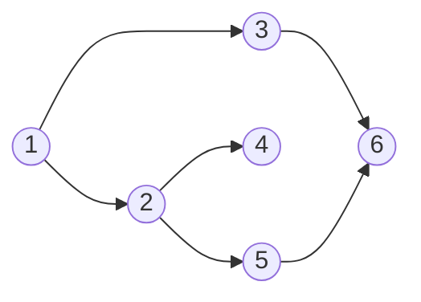

# Breadth-first search

> [!abstract] In one sentence
> Breadth-first search (BFS) explores a graph **in waves**: first the start node, then all its neighbors, then all *their* unvisited neighbors, and so on, using a **queue** (first in, first out) and a **visited** set. Because it reaches nodes in order of their distance from the start, BFS finds the **shortest path in number of edges** in an unweighted graph, in **O(V + E)** time.

## Common misconceptions

**Wrong mental model #1:** "BFS and DFS find the same things, just in a different order."

**What's actually true:** they visit the same nodes, but only BFS guarantees that the **first time** it reaches a node, it got there by a **shortest path** (fewest edges). DFS may reach a node through a long detour first. For "minimum number of hops / moves / steps", BFS is the answer.

**Wrong mental model #2:** "Mark a node as visited when I take it out of the queue."

**What's actually true:** mark it when I **put it in** the queue. Otherwise a node reachable from several nodes of the current wave gets enqueued several times: wasted work, duplicated output, and in dense graphs a queue that explodes. My implementation does this right (`visited.add(neighbor)` next to `queue.append(neighbor)`).

**Wrong mental model #3:** "A Python list works fine as the queue."

**What's actually true:** `list.pop(0)` shifts every remaining element: **O(n)** per dequeue, so BFS becomes O(V²). `collections.deque.popleft()` is O(1).

## Build-up

### Stage 1: the graph as an adjacency list

My code uses `Graph = Dict[int, List[int]]`: each node maps to its neighbors.

```python
graph = {
    1: [2, 3],
    2: [4, 5],
    3: [6],
    4: [],
    5: [6],
    6: [],
}
```



Adjacency lists use O(V + E) memory and list neighbors fast: the default representation for most graphs (versus an adjacency matrix, V² memory, for dense graphs).

### Stage 2: BFS with a queue

```python
from collections import deque

def bfs(graph, start):
    visited = {start}
    queue = deque([start])
    order = []
    while queue:
        node = queue.popleft()               # O(1), unlike list.pop(0)
        order.append(node)                   # "visit" the node
        for neighbor in graph.get(node, []):
            if neighbor not in visited:
                visited.add(neighbor)        # mark on enqueue
                queue.append(neighbor)
    return order
```

`bfs(graph, 1)` → `[1, 2, 3, 4, 5, 6]`: distance 0, then distance 1 (2, 3), then distance 2 (4, 5, 6).

| Step | Dequeued | Queue after | Visited after |
|---|---|---|---|
| 1 | 1 | 2, 3 | 1, 2, 3 |
| 2 | 2 | 3, 4, 5 | + 4, 5 |
| 3 | 3 | 4, 5, 6 | + 6 |
| 4 | 4 | 5, 6 | |
| 5 | 5 | 6 | (6 already visited, skipped) |
| 6 | 6 | empty | |

Cost: every node enqueued once (O(V)), every edge looked at once (O(E)): **O(V + E)**.

### Stage 3: shortest path, not just the order

To get the actual path, remember **who discovered each node** (its parent), then walk back from the target.

```python
def shortest_path(graph, start, target):
    parent = {start: None}
    queue = deque([start])
    while queue:
        node = queue.popleft()
        if node == target:
            path = []
            while node is not None:
                path.append(node)
                node = parent[node]
            return path[::-1]
        for neighbor in graph.get(node, []):
            if neighbor not in parent:          # parent doubles as visited
                parent[neighbor] = node
                queue.append(neighbor)
    return None                                 # unreachable
```

`shortest_path(graph, 1, 6)` → `[1, 3, 6]` (2 edges), never `[1, 2, 5, 6]`.

Track **distance** the same way (`dist[neighbor] = dist[node] + 1`), or process the queue **level by level** (`for _ in range(len(queue))`) when the answer is "how many waves".

### Stage 4: grids are graphs too

A maze, a game board, an image: each cell is a node, its up/down/left/right cells are neighbors. "Fewest moves from S to E" is BFS on the grid, with `(row, col)` tuples as nodes and walls skipped. No adjacency list needed: neighbors are computed on the fly.

### Stage 5: when edges have weights

BFS counts **edges**, not distance. If moving between nodes has a cost (km, latency, price), the fewest-edges path may not be the cheapest. Then:
- Weights 0 or 1 only → **0-1 BFS** (a deque: weight-0 edges to the front)
- Non-negative weights → *[[Dijkstra's algorithm]]* (BFS with a priority queue instead of a queue)

## Behaviour of my implementation

My version used a plain list as the queue and skipped nodes missing from the dict:

```python
current_node = queue.pop(0)
if current_node not in graph: continue
```

- `queue.pop(0)` on a list: correct, but O(n) per dequeue. Use `deque`
- `if current_node not in graph: continue` skips nodes that have **no entry** in the dict: they're marked visited but never "visited" (printed). With `{1: [2]}`, BFS from 1 prints only `1`, never `2`. `graph.get(node, [])` visits them and simply finds no neighbors
- Marking visited on enqueue: correct

## BFS in systems
- **Fewest hops**: the minimum number of routers/links between two machines, degrees of separation in a social network
- **Web crawlers**: crawl pages level by level from a seed, with a depth limit
- **Broadcast / flooding**: a switch flooding a frame, a gossip protocol spreading a message, both reach nodes in waves ([[Spanning Tree]] exists because flooding on a graph with cycles never stops without a "visited" rule)
- **Garbage collectors**: finding reachable objects from the roots (BFS or DFS)
- **Dependency resolution** by levels, peer discovery

## Practice

> [!example]- Graph `A: [B, C], B: [D], C: [D, E], D: [F], E: [F], F: []`. BFS order from A, and the shortest path A → F?
> Order: A, B, C, D, E, F. Shortest path: A → B → D → F (3 edges), the first one found through parents (A → C → D → F is the same length; which one depends on neighbor order).

> [!example]- Why mark visited when enqueuing instead of when dequeuing?
> Otherwise a node discovered by several nodes of the same wave is enqueued several times before it's processed: duplicate work and output.

> [!example]- Fewest moves for a knight from one square to another on a chessboard?
> BFS where each square is a node and the knight's 8 moves are its neighbors. The level at which the target is dequeued is the answer.

## Easy to get wrong
- Marking visited on dequeue (duplicates in the queue)
- `list.pop(0)` as a queue: O(n) per operation
- Forgetting nodes that have no adjacency entry, or nodes in other components (loop over all nodes for full coverage)
- Using BFS for the shortest path in a **weighted** graph (Dijkstra)
- Using a stack by mistake: that's DFS

## Related
- Opposite strategy:: [[Depth-first search]]
- Data structures:: *[[Stacks and queues]]*, [[Hash table]] (visited set, parent map)
- Trees:: [[Binary search tree]] (BFS on a tree = level-order traversal)
- Next:: *[[Dijkstra's algorithm]]*, *[[Graph representations]]*
- Systems:: [[Spanning Tree]], [[Routing tables]]
- Area:: [[Data structures and algorithms]]

## Flashcards
#flashcards

What data structure drives BFS? :: A queue (FIFO)
BFS time complexity? :: O(V + E)
What does BFS guarantee that DFS doesn't? :: The first time a node is reached, it's by a shortest path (fewest edges) in an unweighted graph
When should BFS mark a node visited? :: When enqueuing it, not when dequeuing
Why not use list.pop(0) for the BFS queue in Python? :: It's O(n). collections.deque.popleft() is O(1)
How to get the actual shortest path from BFS? :: Store each node's parent when discovered, then walk back from the target
What is BFS on a tree called? :: Level-order traversal
Shortest path when edges have non-negative weights? :: Dijkstra's algorithm (BFS with a priority queue)
How to process BFS level by level? :: Loop over the current queue length each round
