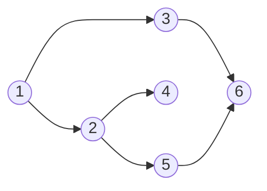
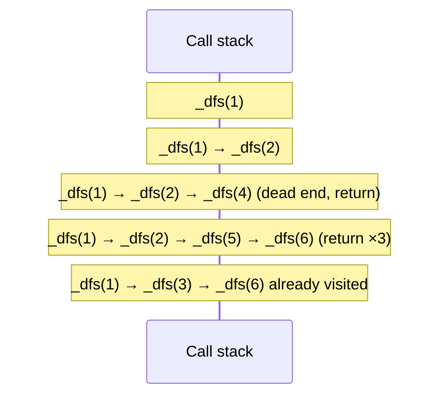

# Depth-first search

> [!abstract] In one sentence
> Depth-first search (DFS) explores a graph by going **as deep as possible** along one path before backing up to try the next branch, using either **recursion** (the call stack) or an explicit **stack** (last in, first out), plus a **visited** set so cycles don't trap it. It visits everything reachable in **O(V + E)**, and its "go deep, then come back" shape is what makes it the tool for cycle detection, topological ordering, connected components, tree traversals and backtracking.

## Common misconceptions

**Wrong mental model #1:** "Iterative DFS is just BFS with `pop()` instead of `popleft()`."

**What's actually true:** swapping the queue for a stack does give a depth-first order, but the details change:
- Neighbors are popped in **reverse** of the order they were pushed, so the order differs from the recursive version unless I push them reversed
- Where I check `visited` matters: the simple, correct version checks **when popping** and skips nodes already visited (a node can sit in the stack more than once)

**Wrong mental model #2:** "The visited check can just `pass` if the node was already seen."

**What's actually true:** `pass` does nothing, and execution continues with the node anyway. It must be **`continue`** (skip the rest of the loop body). That one word is the difference between a traversal and an infinite loop on any graph with a cycle. Both my iterative versions have this bug (below).

**Wrong mental model #3:** "DFS finds the shortest path."

**What's actually true:** DFS finds **a** path, often a long one. Shortest paths in unweighted graphs are [[Breadth-first search]]'s job.

## Build-up

Same graph as in [[Breadth-first search]]:



### Stage 1: recursive DFS

The [[Recursion]] method: `_dfs(node)` means "visit node and everything reachable from it that isn't visited yet". Assume it works for the neighbors, then the current step is: mark, visit, recurse into each neighbor.

```python
def dfs(graph, start):
    visited, order = set(), []

    def _dfs(node):
        if node in visited:
            return
        visited.add(node)
        order.append(node)                 # "visit"
        for neighbor in graph.get(node, []):
            _dfs(neighbor)

    _dfs(start)
    return order
```

`dfs(graph, 1)` → `[1, 2, 4, 5, 6, 3]`: down 1 → 2 → 4 (dead end), back to 2 → 5 → 6, back up to 1 → 3 (6 already visited).



**The limit:** each level of depth is a stack frame. A path of 5,000 nodes (a long chain, a big maze) raises `RecursionError` in Python.

### Stage 2: iterative DFS with an explicit stack

```python
def dfs_iterative(graph, start):
    visited, order = set(), []
    stack = [start]
    while stack:
        node = stack.pop()
        if node in visited:
            continue                       # continue, not pass
        visited.add(node)
        order.append(node)
        for neighbor in reversed(graph.get(node, [])):   # reversed: same order as recursive
            if neighbor not in visited:
                stack.append(neighbor)
    return order
```

Same `[1, 2, 4, 5, 6, 3]`. Without `reversed`, it's `[1, 3, 6, 2, 5, 4]`: still a valid DFS, just exploring the last neighbor first. No recursion limit: the stack is a normal list on the heap.

### Stage 3: tree traversals are DFS

On a binary tree there are no cycles, so no `visited` set is needed. The only question is **when** to handle the node relative to its subtrees:

| Order | Sequence | Typical use |
|---|---|---|
| **Pre-order** | Node, left, right | Copy or serialize a tree (parents before children), print a directory tree |
| **In-order** | Left, node, right | **Sorted output** of a [[Binary search tree]] |
| **Post-order** | Left, right, node | Delete/free a tree, compute sizes or heights (children first), evaluate an expression tree |

For the BST built from 4, 2, 6, 1, 3, 5, 7:
- Pre-order: 4, 2, 1, 3, 6, 5, 7
- In-order: 1, 2, 3, 4, 5, 6, 7
- Post-order: 1, 3, 2, 5, 7, 6, 4

My `dfs_pre_order(tree)` on the BST is the pre-order version (visit, then `_dfs(node.left)`, then `_dfs(node.right)`).

### Stage 4: what DFS is actually used for

**Connected components**: run DFS from every unvisited node, each run marks one component. "How many separate networks / islands / friend groups?"

**Cycle detection in a directed graph**: a plain `visited` set isn't enough (reaching a visited node can just mean two paths merge, like 6 above). Use three states:
- **white**: not visited yet
- **gray**: on the current path (entered, not finished)
- **black**: finished

Reaching a **gray** node means an edge back into the current path: a cycle.

```python
def has_cycle(graph):
    WHITE, GRAY, BLACK = 0, 1, 2
    state = {n: WHITE for n in graph}

    def visit(node):
        state[node] = GRAY
        for nb in graph.get(node, []):
            if state.get(nb, WHITE) == GRAY:
                return True                      # back edge
            if state.get(nb, WHITE) == WHITE and visit(nb):
                return True
        state[node] = BLACK
        return False

    return any(state[n] == WHITE and visit(n) for n in graph)
```

**Topological order** (do tasks in an order that respects dependencies): the reverse of the order in which nodes turn black. That's how build systems, package managers and schedulers order work, and a cycle means "impossible order" (circular dependency). More in *[[Topological sort]]*.

**Backtracking** (permutations, sudoku, mazes) is DFS over a tree of choices that isn't stored anywhere: choose, explore deeper, undo ([[Recursion]]).

## Bugs in my implementations

I wrote iterative DFS twice. The first version:

```python
while call_stack:
    node = call_stack.pop()
    if node in visited: pass       # never skips, and nothing is ever added to visited
    print(node)
    for neighbor in graph[node]:
        call_stack.append(neighbor)
```

The second version (marks on push):

```python
while len(stack) > 0:
    current = stack.pop()
    print(current)
    for neighbor in g[current]:
        if neighbor in visited: pass   # still pushes it below
        visited.add(neighbor)
        stack.append(neighbor)
```

| Function | Bug | Effect | Fix |
|---|---|---|---|
| Iterative, first version | `if node in visited: pass`, and `visited.add` is never called | Every node is processed each time it's popped. With a cycle (`1 → 2 → 1`): **infinite loop**. Without one: duplicates (6 printed twice in the graph above) | `continue`, and `visited.add(node)` after the check |
| Iterative, second version | Marks visited on push, but `if neighbor in visited: pass` then pushes anyway | Visited neighbors are pushed again: duplicates, infinite loop on cycles | `continue` (or `if neighbor not in visited:` around the push) |
| Recursive version | `graph[node]` raises `KeyError` for a node with no adjacency entry | Crash on leaf nodes missing from the dict | `graph.get(node, [])` |
| Recursive versions | Depth = longest path | `RecursionError` beyond ~1000 levels | Iterative version for big graphs |

Note on marking visited **on push** (as in my second version) in iterative DFS: once fixed with `continue`, it visits everything, but the order isn't always a true depth-first order (a node can be "claimed" by an earlier push before a deeper path reaches it). For traversal that's fine. For algorithms that depend on DFS order (cycle detection, topological sort), mark on pop, or use recursion.

## DFS in systems
- **Dependency graphs**: build systems (make, Bazel), package managers, Terraform's resource graph, systemd unit ordering: topological order and circular-dependency detection
- **Deadlock detection**: a cycle in the "waits-for" graph between processes or database transactions
- **Garbage collectors**: mark phase (reachability from roots)
- **Filesystem walks**: `find`, `du`, `rm -r` are depth-first (post-order for `rm -r` and `du`: children before the directory)
- **Network topology**: finding loops in a layer 2 network is a cycle-detection problem ([[Spanning Tree]])

## Practice

> [!example]- Recursive DFS from A on `A: [B, C], B: [D], C: [D, E], D: [F], E: [F], F: []`?
> A, B, D, F, C, E. (D and F are already visited when reached again from C and E.)

> [!example]- Pre-, in- and post-order of the BST built from 8, 3, 10, 1, 6?
> Pre: 8, 3, 1, 6, 10. In: 1, 3, 6, 8, 10. Post: 1, 6, 3, 10, 8.

> [!example]- Graph `1 → 2, 2 → 3, 3 → 1`. What does my first iterative version (above) do?
> Runs forever: `if node in visited: pass` doesn't skip anything and nothing is ever added to `visited`, so 1, 2, 3, 1, 2, 3… keep being pushed and printed.

> [!example]- How do I detect that tasks have a circular dependency?
> DFS with white/gray/black states: reaching a gray node (still on the current path) is a back edge, so a cycle.

## Easy to get wrong
- `pass` instead of `continue` on the visited check
- Forgetting to add nodes to `visited` at all
- Expecting the iterative order to match the recursive one without reversing the neighbors
- Using a plain visited set to detect cycles in a **directed** graph (need the "on current path" state)
- Using DFS for shortest paths
- Deep recursion on large graphs (RecursionError)
- Only starting from one node when the graph has several components

## Related
- Opposite strategy:: [[Breadth-first search]]
- Built with:: [[Recursion]], *[[Stacks and queues]]*, [[Hash table]] (visited set)
- Trees:: [[Binary search tree]] (in-order = sorted)
- Next:: *[[Topological sort]]*, *[[Backtracking]]*, *[[Graph representations]]*
- Systems:: [[Spanning Tree]]
- Area:: [[Data structures and algorithms]]

## Flashcards
#flashcards

What data structure drives DFS? :: A stack, either the call stack (recursion) or an explicit one
DFS time complexity? :: O(V + E)
In iterative DFS, what must the visited check do? :: continue (skip the node), not pass
Why does iterative DFS visit neighbors in a different order than recursive DFS? :: The stack pops the last pushed neighbor first. Push them reversed to match
Pre-order, in-order, post-order? :: Pre: node, left, right. In: left, node, right. Post: left, right, node
Which traversal gives a BST's keys sorted? :: In-order
Which traversal to delete a tree or compute subtree sizes? :: Post-order (children before the parent)
Which traversal to copy or serialize a tree? :: Pre-order (parent before children)
How to detect a cycle in a directed graph with DFS? :: Three states (white, gray, black): reaching a gray node means a back edge
How to count connected components? :: Run DFS from each unvisited node, one run per component
Does DFS find shortest paths? :: No, BFS does (unweighted)
How is a topological order obtained from DFS? :: Reverse of the order in which nodes finish
Why prefer iterative DFS for large graphs in Python? :: Recursion depth is limited to about 1000
