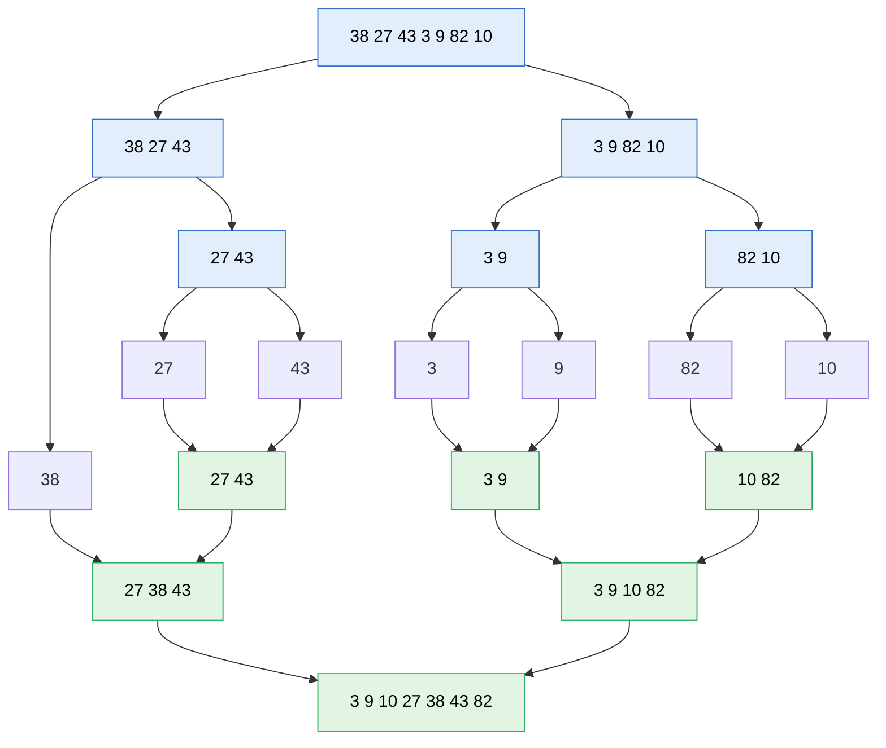

# Merge sort

> [!abstract] In one sentence
> Merge sort is **divide and conquer**: split the list in half, sort each half (recursively), then **merge** the two sorted halves by repeatedly taking the smaller of their two front elements. It always takes **O(n log n)** time, uses **O(n)** extra memory, and is **stable** (equal elements keep their original order), which is why it's the base of the sorts real languages use and of sorting data too big for memory.

## Common misconceptions

**Wrong mental model #1:** "The sorting happens when the list is split."

**What's actually true:** splitting does nothing clever: it just cuts until pieces have 0 or 1 element (already sorted). **All the work is in `merge`**, and merging two sorted lists is easy and linear. The algorithm is "merge, repeatedly, from tiny sorted pieces to one big one".

**Wrong mental model #2:** "Which half I call `left` and `right` doesn't matter."

**What's actually true:** for **sorting correctness**, it doesn't. For **stability**, it does: on equal elements, `merge` must take from the half that came **first** in the original list (`<=` on the left half). Swapping the halves silently makes the sort unstable. Stability matters when sorting records by one field after another (sort by name, then stable sort by city: names stay sorted within each city).

**Wrong mental model #3:** "O(n log n) means merge sort is always the fastest choice."

**What's actually true:** quicksort is usually faster **in memory** (in place, cache-friendly) but O(n²) in its worst case and not stable. Insertion sort beats both on tiny or nearly sorted lists. Real libraries combine them: Python's and Java's object sort is **Timsort** (merge sort + insertion sort, exploiting already-sorted runs).

## Build-up

### Stage 1: merging two sorted lists

```python
def merge(left, right):
    i = j = 0
    out = []
    while i < len(left) and j < len(right):
        if left[i] <= right[j]:        # <= keeps it stable
            out.append(left[i]); i += 1
        else:
            out.append(right[j]); j += 1
    out.extend(left[i:])               # AFTER the loop: one side is exhausted,
    out.extend(right[j:])              # the rest of the other is already sorted
    return out
```

`merge([2, 5, 8], [3, 4, 9])`: compare 2/3 → 2, 5/3 → 3, 5/4 → 4, 5/9 → 5, 8/9 → 8, then left is empty, add `[9]` → `[2, 3, 4, 5, 8, 9]`. Each element is handled once: **O(n)**.

### Stage 2: split and recurse

With my [[Recursion]] method: `merge_sort(a)` returns a sorted copy of `a`. Assume it works for each half. Then the current step is: sort both halves, merge them. Base case: lists of 0 or 1 element are already sorted.

```python
def merge_sort(a):
    if len(a) < 2:
        return a
    mid = len(a) // 2
    left = merge_sort(a[:mid])     # first half → left (stability)
    right = merge_sort(a[mid:])
    return merge(left, right)
```



### Stage 3: why O(n log n)

- The list is halved until size 1: **log₂ n levels** (1,000,000 elements → about 20 levels)
- At each level, all the merges together touch every element once: **O(n) per level**
- Total: **O(n log n)**, in the best, average and worst case alike (it doesn't care if the input is already sorted)

Memory: the merge needs a new list: **O(n)** extra. My version also creates slices (`a[:mid]`), which is fine for learning. A production version merges into one preallocated buffer using indices.

### Stage 4: when data doesn't fit in memory (external sort)

Sort a 200 GB log file on a machine with 16 GB of RAM:
1. Read 10 GB chunks, sort each in memory, write each sorted chunk ("run") to disk: 20 sorted runs
2. **K-way merge**: open all 20 runs, keep the current front element of each in a small min-*[[Heaps|heap]]*, repeatedly output the smallest and advance that run

Reading and writing sequentially is exactly what disks are fast at. GNU `sort` does this for big files, databases use it for `ORDER BY` and **sort-merge joins** when data exceeds memory, and MapReduce/Spark shuffles sort and merge between stages.

## Bugs in my implementations

**First version:**

```python
    while(i<len(a) and j < len(b)):
        if a[i] <= b[j]:
            ...
        res.extend(a[i:])     # ← indented inside the while loop
        res.extend(b[j:])
```

The two `extend` lines run **on every iteration**, appending the remaining elements again and again: the result has duplicates and is wrong. They must run once, **after** the loop. Running it on `[5, 2, 4, 1, 3]` returns a 27-element list:

```
[1, 3, 4, 3, 4, 2, 5, 2, 3, 4, 3, 4, 5, 3, 4, 3, 4, 5, 4, 3, 4, 5, 3, 4, 5, 4, 5]
```

Small inputs (two single elements) happen to come out right, which is why a quick test with `[2, 1]` doesn't catch it. Test with 5+ elements.

Also `left = merge_sort(a[sp:])` and `right = merge_sort(a[:sp])` are swapped (the second half is called `left`). Once the `extend` bug is fixed, the output is sorted but **not stable**.

**Second version:** the merge uses `if l[i] > r[j]: take l[i]`, so it takes the **larger** element first: the list comes out in **descending** order. Fine if intended, but equal elements then come from the right half first, so it's not stable either.

## Merge sort next to other sorts

| | Merge sort | Quicksort | Heapsort | Timsort | Insertion sort |
|---|---|---|---|---|---|
| Time (worst) | O(n log n) | O(n²) | O(n log n) | O(n log n) | O(n²) |
| Time (typical) | O(n log n) | O(n log n), fastest in practice | O(n log n) | O(n) on sorted data | O(n) on nearly sorted |
| Extra memory | O(n) | O(log n) | O(1) | O(n) | O(1) |
| Stable | **Yes** | No | No | **Yes** | Yes |
| Where | Linked lists, external sorting, stable sorting | C `qsort`, many in-memory sorts (introsort) | Guaranteed bounds, little memory | Python `sorted`, Java objects | Small pieces inside hybrid sorts |

Merge sort is also the natural sort for [[Linked list|linked lists]]: splitting with fast/slow pointers and merging by relinking nodes needs no extra array.

## Practice

> [!example]- Merge `[1, 4, 7]` and `[2, 3, 8, 9]`. How many comparisons?
> 1/2 → 1, 4/2 → 2, 4/3 → 3, 4/8 → 4, 7/8 → 7. Left exhausted, append `[8, 9]`. 5 comparisons. Result `[1, 2, 3, 4, 7, 8, 9]`.

> [!example]- Sort `[(Bob, 30), (Ann, 25), (Cid, 30)]` by age with a stable sort. Order of Bob and Cid?
> Bob before Cid, same as in the input, because the sort is stable. An unstable sort may swap them.

> [!example]- How many levels of splitting for 1,024 elements, and roughly how much work?
> log₂ 1024 = 10 levels, each O(n): about 10 × 1024 element moves.

> [!example]- Why is merge sort used for sorting files bigger than RAM?
> Sorted chunks can be merged by streaming them sequentially from disk, keeping only the front element of each chunk in memory.

## Easy to get wrong
- Putting the "append the rest" lines inside the merge loop
- Using `<` instead of `<=` on the left side, or swapping halves: loses stability
- Forgetting that merging needs O(n) extra memory
- Thinking the split does the sorting: merge does
- Slicing everywhere in Python creates many copies (fine for learning, not for production)

## Related
- Built with:: [[Recursion]] (tree recursion)
- Works well on:: [[Linked list]]
- Next:: *[[Quicksort]]*, *[[Heaps]]* (k-way merge), *[[Binary search]]*
- Cost analysis:: *[[Big-O notation]]*
- Area:: [[Data structures and algorithms]]

## Flashcards
#flashcards

Merge sort in one sentence? :: Split in half, sort each half recursively, merge the two sorted halves
Merge sort time complexity? :: O(n log n) in best, average and worst case
Merge sort extra memory? :: O(n) for merging (arrays)
Is merge sort stable? :: Yes, if merge takes from the left half on ties (<=)
Where does merge sort do its real work? :: In merge: combining two sorted lists in linear time
Why log n levels? :: The list is halved until pieces of size 1
What is external sorting? :: Sorting data bigger than memory: sort chunks, write them as runs, then k-way merge them from disk
What sort does Python's sorted() use? :: Timsort, a merge sort + insertion sort hybrid
Merge sort vs quicksort? :: Merge: guaranteed O(n log n), stable, O(n) memory. Quick: usually faster in memory, in place, O(n²) worst, unstable
Why is merge sort good for linked lists? :: Merging relinks nodes without extra arrays, and no random access is needed
Bug: extend(rest) inside the merge loop? :: Remaining elements get appended on every iteration, producing duplicates
