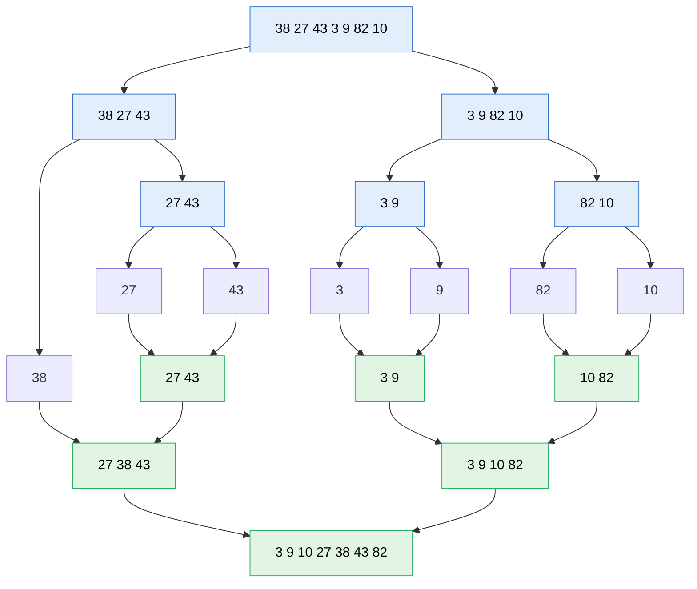

# Merge sort

> [!abstract] In one sentence
> Merge sort is the canonical **divide and conquer** algorithm: split the input in half, sort each half recursively, and **merge** the two sorted halves in linear time. It runs in **Θ(n log n)** on every input, is **stable**, needs only **sequential** access, and its merge step generalizes to merging k sorted streams, which makes it the algorithm behind sorting linked lists, sorting data larger than memory, and the hybrid sorts real languages ship (Timsort).

## 1. The merge step and its invariant

```python
def merge(left, right):
    i = j = 0
    out = []
    while i < len(left) and j < len(right):
        if left[i] <= right[j]:            # <= : on ties, take from the left → stable
            out.append(left[i]); i += 1
        else:
            out.append(right[j]); j += 1
    out.extend(left[i:])                   # after the loop: at most one side has items left,
    out.extend(right[j:])                  # and they are all >= everything in out
    return out
```

**Invariant**: `out` holds the `i + j` smallest elements of `left ∪ right`, in sorted order, and `left[i]`, `right[j]` are the smallest remaining in each list. Each iteration appends the smaller of the two fronts, which is the smallest remaining overall, so the invariant holds. When one side is exhausted, the other's remainder is sorted and not smaller than anything in `out`.

Cost: each element is appended once, at most `len(left) + len(right) − 1` comparisons: **Θ(n)** time, Θ(n) output space.

**Stability**: elements that compare equal keep their input order because ties take from `left`, and every element of `left` came before every element of `right` in the input. With `<` instead of `<=`, or with the halves swapped, the sort is still correct but no longer stable. Stability is what allows multi-key sorting by successive passes: sort by name, then stable-sort by city, and names stay sorted within each city.

## 2. The recursion

Using the [[Recursion]] method: `merge_sort(a)` returns a sorted copy of `a`. Assume it sorts any shorter list. Split, sort both halves, merge. Lists of length 0 or 1 are sorted.

```python
def merge_sort(a):
    if len(a) < 2:
        return a
    mid = len(a) // 2
    return merge(merge_sort(a[:mid]), merge_sort(a[mid:]))   # first half stays "left"
```



### Cost

Recurrence: **T(n) = 2T(n/2) + Θ(n)**. Reading it off the recursion tree: there are ⌈log₂ n⌉ levels, and the merges on one level touch all n elements once, so Θ(n) per level and **Θ(n log n)** total. The master theorem gives the same (a = 2, b = 2, f(n) = n = n^(log_b a) → Θ(n log n)).

- Same bound in best, average and worst case: merge sort doesn't adapt to sorted input (Timsort does)
- Comparisons in the worst case: n⌈log₂ n⌉ − 2^⌈log₂ n⌉ + 1, within a few percent of the theoretical minimum
- Extra memory: Θ(n) for the merge buffer (one buffer allocated once is enough); the slicing version above allocates O(n log n) in total across calls, fine for learning, wasteful in production
- Stack depth: ⌈log₂ n⌉ (about 20 for a million elements, never a recursion-limit problem)

### Why Θ(n log n) is optimal for comparison sorts

Any algorithm that sorts by comparing elements can be drawn as a binary decision tree whose leaves are the n! possible orderings. A binary tree with n! leaves has height ≥ log₂(n!) ≈ n log₂ n − 1.44n. So **every comparison sort needs Ω(n log n) comparisons in the worst case**. For n = 20: log₂(20!) ≈ 61 comparisons minimum, against 20·log₂ 20 ≈ 86 for the n log n estimate. Only sorts that don't compare (counting sort, radix sort, on integers with a bounded range) beat it.

## 3. Bottom-up merge sort (no recursion)

Merge runs of width 1 into width 2, then 4, 8, … until one run covers the array. Same Θ(n log n), no recursion, and the shape the external sort uses:

```python
def merge_sort_bottom_up(a):
    a = list(a); n = len(a); buf = a[:]
    width = 1
    while width < n:
        for lo in range(0, n, 2 * width):
            mid, hi = min(lo + width, n), min(lo + 2 * width, n)
            i, j, k = lo, mid, lo
            while i < mid and j < hi:
                if a[i] <= a[j]: buf[k] = a[i]; i += 1
                else:            buf[k] = a[j]; j += 1
                k += 1
            while i < mid: buf[k] = a[i]; i += 1; k += 1
            while j < hi:  buf[k] = a[j]; j += 1; k += 1
        a, buf = buf, a                   # swap roles instead of copying back
        width *= 2
    return a
```

## 4. Merge sort on linked lists

On a [[Linked list]], merge sort is the natural choice: find the middle with slow/fast pointers, cut, sort both halves, merge by **relinking nodes**. No extra array (O(log n) stack only), no random access needed, and still stable. Quicksort and heapsort both rely on random access and fit lists poorly.
(`merge_sorted` is the two-pointer list merge from [[Linked list]].)

```python
def sort_list(head):
    if head is None or head.next is None:
        return head
    slow, fast = head, head.next
    while fast and fast.next:                 # slow stops at the end of the first half
        slow, fast = slow.next, fast.next.next
    mid, slow.next = slow.next, None          # cut
    return merge_sorted(sort_list(head), sort_list(mid))   # merge by relinking
```

## 5. Using the merge to compute things: counting inversions

An **inversion** is a pair i < j with a[i] > a[j]. It measures how unsorted a list is (0 sorted, n(n−1)/2 reversed), and how similar two rankings are. Brute force is O(n²). During the merge, when an element of `right` is taken before the remaining `left[i:]`, it is smaller than all of them: that's `len(left) − i` inversions at once.

```python
def sort_and_count(a):
    if len(a) < 2:
        return a, 0
    mid = len(a) // 2
    left, x = sort_and_count(a[:mid])
    right, y = sort_and_count(a[mid:])
    out, i, j, cross = [], 0, 0, 0
    while i < len(left) and j < len(right):
        if left[i] <= right[j]:
            out.append(left[i]); i += 1
        else:
            out.append(right[j]); j += 1
            cross += len(left) - i            # right[j] beats every remaining left element
    out.extend(left[i:]); out.extend(right[j:])
    return out, x + y + cross
```

`[2, 4, 1, 3, 5]` → 3 inversions (2>1, 4>1, 4>3). `[5, 4, 3, 2, 1]` → 10. O(n log n). The general lesson: **the merge sees every cross-half pair implicitly**, so pair-counting questions across halves can be answered in the merge.

## 6. K-way merge and external sorting

Merging k sorted sequences with a min-*[[Heaps|heap]]* holding the current front of each: pop the smallest, push the next element from the same sequence. O(N log k) for N total elements.

```python
import heapq

def kway_merge(runs):
    heap = [(run[0], r, 0) for r, run in enumerate(runs) if run]
    heapq.heapify(heap)
    out = []
    while heap:
        val, r, i = heapq.heappop(heap)
        out.append(val)
        if i + 1 < len(runs[r]):
            heapq.heappush(heap, (runs[r][i + 1], r, i + 1))
    return out
```

**External sort** (data bigger than RAM), e.g. 200 GB on a machine with 16 GB:
1. **Run generation**: read ~10 GB at a time, sort in memory, write each sorted run: 20 runs
2. **Merge**: one k-way merge over the 20 runs, reading each run sequentially with a buffer per run, writing the output sequentially

Total I/O: read and write the data twice (800 GB), **all sequential**, which is what disks and object stores are fastest at. If k runs exceed the number of buffers that fit in memory, merge in several passes. This is how GNU `sort` handles large files (temporary files + merge), how databases execute `ORDER BY` and **sort-merge joins** that spill to disk, and the "sort and shuffle" phase in MapReduce and Spark. LSM-tree databases (RocksDB, Cassandra) keep data as sorted runs on disk and **compact** them with the same k-way merge.

## 7. Timsort and the sorts in practice

**Timsort** (Python's `sorted`/`list.sort`, Java's object sort, Android, V8): find naturally ascending (or strictly descending, reversed) **runs** in the input, extend short runs to a minimum length (32–64) with insertion sort, then merge runs with merge-sort logic, maintaining a stack of runs with size rules that keep merges balanced. **Galloping mode** switches to exponential search when one run keeps "winning", so merging data with long ordered stretches costs far fewer comparisons. Result: Θ(n) on already-sorted or reversed input, Θ(n log n) worst case, stable.

| | Merge sort | Quicksort | Heapsort | Timsort | Insertion sort |
|---|---|---|---|---|---|
| Worst time | Θ(n log n) | Θ(n²) | Θ(n log n) | Θ(n log n) | Θ(n²) |
| Best time | Θ(n log n) | Θ(n log n) | Θ(n log n) | **Θ(n)** | **Θ(n)** |
| Extra memory | Θ(n) | O(log n) | O(1) | Θ(n) | O(1) |
| Stable | **Yes** | No | No | **Yes** | Yes |
| Access pattern | Sequential | Random | Random | Sequential-ish | Sequential |
| Where | Linked lists, external sorting, stable sorting | In-memory primitives (introsort in C++ `std::sort`, dual-pivot in Java primitives) | Bounded worst case, little memory | Python, Java objects | Small subarrays inside hybrids |

## 8. Bugs in my implementations

**First version:**

```python
    while(i<len(a) and j < len(b)):
        if a[i] <= b[j]:
            ...
        res.extend(a[i:])     # ← indented inside the while loop
        res.extend(b[j:])
```

The two `extend` lines run on **every iteration**, re-appending the remaining elements each time. On `[5, 2, 4, 1, 3]` it returns a 27-element list:

```
[1, 3, 4, 3, 4, 2, 5, 2, 3, 4, 3, 4, 5, 3, 4, 3, 4, 5, 4, 3, 4, 5, 3, 4, 5, 4, 5]
```

Merging two single elements happens to come out right (the loop runs once), so a test with `[2, 1]` passes: test merge code with 5+ elements and with duplicates. It also recursed with `left = merge_sort(a[sp:])` (the **second** half as `left`): once the indentation is fixed, the output is sorted but not stable.

**Second version:** the merge takes `l[i]` when `l[i] > r[j]`, i.e. the **larger** front first: the output is in **descending** order, and ties are taken from the right half, so it's not stable either.

## Practice

> [!example]- Merge `[1, 4, 7]` and `[2, 3, 8, 9]`: how many comparisons, and why not 7?
> 1/2, 4/2, 4/3, 4/8, 7/8: 5 comparisons. After the left list is exhausted, `[8, 9]` is appended without comparing. At most `len(left) + len(right) − 1 = 6` are ever needed.

> [!example]- Count inversions of `[3, 1, 2]` with the merge method.
> Split `[3]` | `[1, 2]`. Right half has 0. Merge: 1 < 3 → +1 (one remaining left element), 2 < 3 → +1, then 3. Total 2: (3,1), (3,2).

> [!example]- Sort 1 TB with 8 GB of RAM: how many runs, and can one merge pass finish it?
> About 125 runs of 8 GB (fewer if the run generation uses replacement selection, which produces runs about twice the memory size). A 125-way merge needs 125 input buffers: with 8 GB, each can be ~60 MB, so one pass works. Total I/O ≈ 4 TB sequential.

> [!example]- Why is merge sort preferred over quicksort for linked lists?
> Merging relinks nodes with no extra array and only sequential access. Quicksort's partitioning and pivot selection rely on random access.

> [!example]- Why can't any comparison sort beat Ω(n log n) in the worst case?
> Its decision tree must have n! leaves (one per possible input order), so its height, the worst-case number of comparisons, is at least log₂(n!) ≈ n log₂ n.

## Related
- Built with:: [[Recursion]] (divide and conquer)
- Works well on:: [[Linked list]]
- Next:: *[[Quicksort]]*, *[[Heaps]]* (k-way merge), *[[Binary search]]*
- Cost analysis:: *[[Big-O notation]]*
- Area:: [[Data structures and algorithms]]

## Flashcards
#flashcards

Merge invariant? :: out holds the i + j smallest elements in order; the fronts left[i], right[j] are each list's smallest remaining
Merge cost? :: Θ(n) time, at most n − 1 comparisons
What makes merge sort stable? :: On ties, merge takes from the left half (<=), which came first in the input
Merge sort recurrence and solution? :: T(n) = 2T(n/2) + Θ(n) = Θ(n log n), in every case
Merge sort extra memory and stack depth? :: Θ(n) buffer, ⌈log₂ n⌉ stack depth
Lower bound for comparison sorting? :: Ω(n log n): the decision tree has n! leaves, height ≥ log₂(n!)
What is bottom-up merge sort? :: Merge runs of width 1, 2, 4, … iteratively, no recursion
Why is merge sort natural for linked lists? :: Split with slow/fast pointers, merge by relinking: no extra array, sequential access
How does merge sort count inversions? :: When right[j] is taken before left[i:], it forms len(left) − i inversions
K-way merge cost with a heap? :: O(N log k)
What is external sorting? :: Sort memory-sized chunks into runs on disk, then k-way merge them sequentially
Where is external merge sort used? :: GNU sort on big files, database ORDER BY and sort-merge joins that spill, MapReduce/Spark shuffles, LSM-tree compaction
What does Timsort add to merge sort? :: Detects natural runs, insertion-sorts short runs, balanced run merging, galloping: Θ(n) on sorted input
Merge sort vs quicksort? :: Merge: Θ(n log n) guaranteed, stable, Θ(n) memory, sequential. Quick: faster in memory, in place, Θ(n²) worst, unstable
Bug: extend(rest) inside the merge loop? :: Remaining elements are appended on every iteration, producing duplicates
