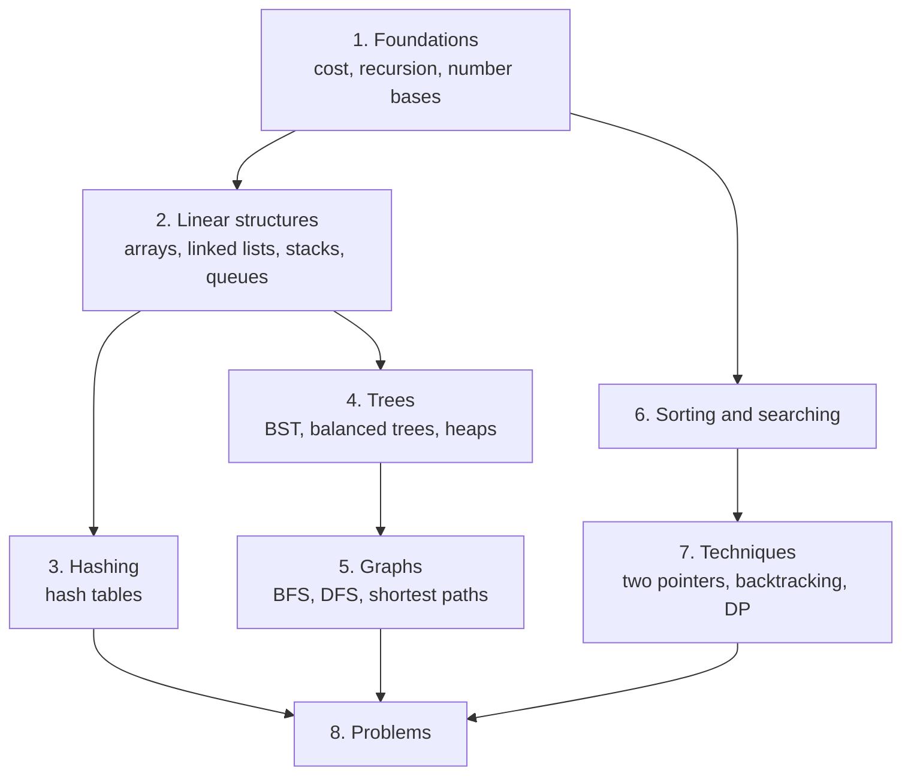

# Data structures and algorithms

> What this covers: how to organize data in memory and how to process it efficiently: the structures (lists, hash tables, trees, graphs), the algorithms that work on them (traversals, sorting, searching), the techniques behind them (recursion, two pointers, dynamic programming), and the interview-style problems I practice with. Code examples are in Python. Each note also points to where the structure shows up in real systems.

## Sub-topics
Each sub-topic has its own index with the same reading order, for studying one part at a time (and a cleaner graph).
- [[Programming foundations]]: what everything else builds on: recursion, number bases
- [[Data structures]]: linked lists, hash tables, trees
- [[Algorithms]]: searching and sorting algorithms, and practice problems

## How to use this

Read the sections **top to bottom**: each one assumes the ones above it. Links in *italics* are notes not written yet (the roadmap).



## 1. Foundations
- *[[Big-O notation]]*: measuring cost as the input grows. O(1), O(log n), O(n), O(n log n), O(n²), amortized cost, time vs space
- [[Recursion]]: how to solve recursive problems. My 5-step method made precise (induction, termination), designing the function's parameters, how many calls (linear, divide and conquer, choices), the combine for count/exists/best/list, base cases, cost from the recursion tree, memoization, backtracking and pruning, worked examples, debugging
- [[Stack and heap]]: how long a value must live decides where it lives. Lifetime vs virtual address vs physical frame, C's storage durations, why calls use a stack (frames, the stack pointer, LIFO), recursion and the 8 MiB limit (depth and big local arrays), why a heap (outliving the call, run-time sizes), pointer vs pointee, what survives a return and ownership, a table of C declarations (static, globals, BSS, char s[] vs char *s), costs side by side, Python/Java/Go (references, escape analysis), heap memory vs the heap data structure, and lifetime bugs (dangling pointers, use after free, double free, leaks, stack smashing and canaries)
- [[Number base conversion]]: positional notation, division and Horner's rule, regrouping bits, fractions and why 0.1 isn't exact, two's complement and overflow, bit operations, endianness and network byte order
- Not written yet: *[[Bit manipulation]]*

## 2. Linear structures
- [[Linked list]]: cost model and cache locality, a method for rewiring pointers, sentinels (Linux `list_head`), reversal, two-pointer techniques with Floyd's proof, LRU cache, skip lists, and the bugs in my implementation
- Not written yet: *[[Arrays and dynamic arrays]]* · *[[Stacks and queues]]*

## 3. Hashing
- [[Hash table]]: hashing vs compression, the hash/equality contract, chaining vs open addressing (probe math, tombstones), resizing and amortization, Python/Java/Swiss table internals, hash flooding, partitioning, the shared-bucket bug
- Not written yet: *[[Consistent hashing]]*

## 4. Trees
- [[Binary search tree]]: the interval invariant, search/insert/delete with proofs, successor/floor/range/LCA, order statistics, height and rotations, AVL/red-black/B+ trees, BST vs hash table
- Not written yet: *[[Balanced trees]]* (AVL, red-black, B-trees) · *[[Heaps]]* · *[[Tries]]*

## 5. Graphs
- [[Breadth-first search]]: the queue invariant and shortest-path proof, path reconstruction, levels, multi-source, BFS over states, 0-1 BFS, bidirectional, bipartiteness
- [[Depth-first search]]: discovery/finish times, edge classification, directed vs undirected cycles, topological sort (DFS and Kahn), iterative DFS limits, traversal orders, components, bridges, SCC
- Not written yet: *[[Graph representations]]* · *[[Topological sort]]* · *[[Dijkstra's algorithm]]*

## 6. Sorting and searching
- [[Merge sort]]: merge invariant and stability, recurrence and the Ω(n log n) lower bound, bottom-up and linked-list versions, counting inversions, k-way merge and external sorting, Timsort
- Not written yet: *[[Quicksort]]* · *[[Binary search]]*

## 7. Techniques
- Not written yet: *[[Two pointers]]* · *[[Backtracking]]* · *[[Dynamic programming]]*

## 8. Problems
- [[Arrays and strings problems]]: a 5-step method (input model → brute force → bottleneck → tool → edge cases) applied to CtCI chapter 1, with my versions' failures

## Related areas
- [[Networking]]: routing tables (prefix tries), switch MAC tables (hash tables), Spanning Tree (graphs without loops)
- [[Messaging]]: Kafka's key → partition hashing
- [[Storage]]: B-trees in databases and filesystems, external sorting

## Weakest first
```dataview
TABLE WITHOUT ID file.link AS Note, type AS Type, confidence AS Conf
FROM ""
WHERE topic = this.file.name AND confidence
SORT confidence ASC
```

## Open questions
- 
