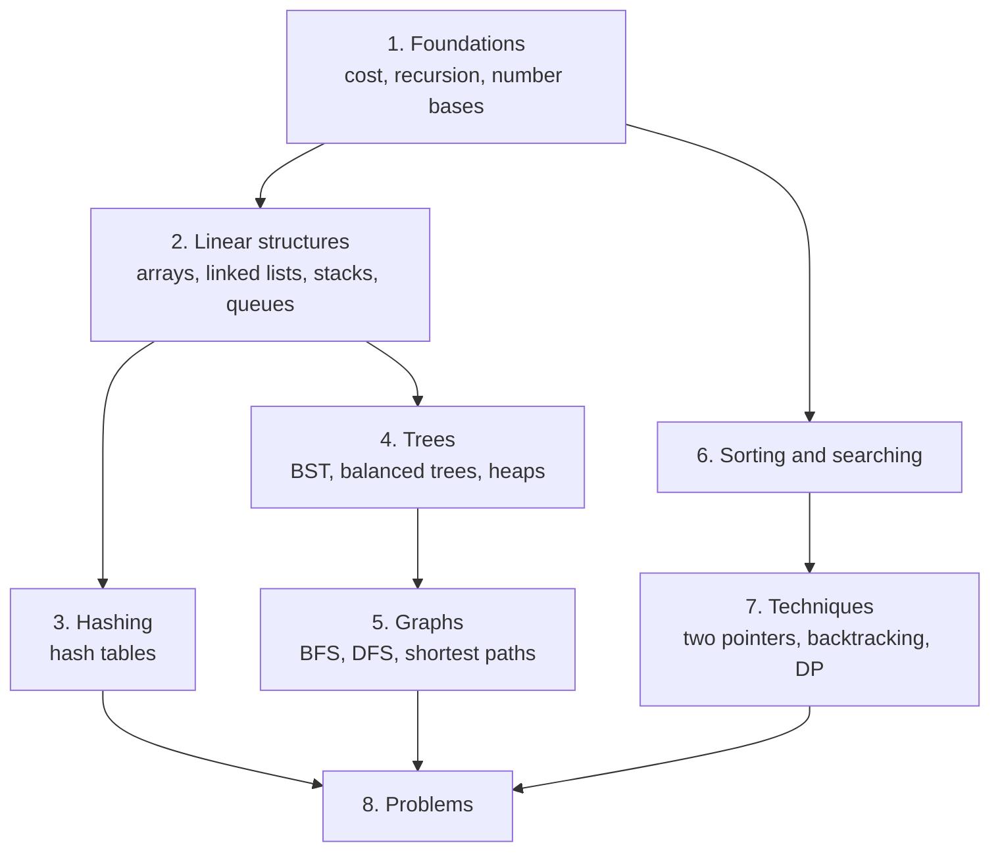

# Data structures and algorithms

> What this covers: how to organize data in memory and how to process it efficiently: the structures (lists, hash tables, trees, graphs), the algorithms that work on them (traversals, sorting, searching), the techniques behind them (recursion, two pointers, dynamic programming), and the interview-style problems I practice with. Code examples are in Python. Each note also points to where the structure shows up in real systems.

## How to use this

Read the sections **top to bottom**: each one assumes the ones above it. Links in *italics* are notes not written yet (the roadmap).



## 1. Foundations
- *[[Big-O notation]]*: measuring cost as the input grows. O(1), O(log n), O(n), O(n log n), O(n²), amortized cost, time vs space
- [[Recursion]]: how to solve recursive problems. My 5-step method made precise (induction, termination), designing the function's parameters, how many calls (linear, divide and conquer, choices), the combine for count/exists/best/list, base cases, cost from the recursion tree, memoization, backtracking and pruning, worked examples, debugging
- [[Number base conversion]]: repeated division and Horner's method, hex/octal by grouping bits, where bases show up (IPs, MACs, chmod)
- Not written yet: *[[Bit manipulation]]*

## 2. Linear structures
- [[Linked list]]: singly, doubly, circular. Costs vs arrays, reversing, fast/slow pointers (middle, Floyd's cycle detection), the dummy head, LRU caches, and the bugs in my implementation
- Not written yet: *[[Arrays and dynamic arrays]]* · *[[Stacks and queues]]*

## 3. Hashing
- [[Hash table]]: hash → bucket, collisions (chaining vs open addressing), load factor and resizing, why O(1) is average/amortized, hash flooding, the shared-object bug in my version, hashing in Kafka, load balancers and switches
- Not written yet: *[[Consistent hashing]]*

## 4. Trees
- [[Binary search tree]]: the ordering rule, search/insert/delete (three cases, in-order successor), sorted in-order traversal, why O(log n) needs balance
- Not written yet: *[[Balanced trees]]* (AVL, red-black, B-trees) · *[[Heaps]]* · *[[Tries]]*

## 5. Graphs
- [[Breadth-first search]]: queue + visited-on-enqueue, waves by distance, shortest paths by edge count, grids
- [[Depth-first search]]: recursion or a stack, `continue` not `pass`, pre/in/post-order tree traversals, components, directed cycle detection, topological order
- Not written yet: *[[Graph representations]]* · *[[Topological sort]]* · *[[Dijkstra's algorithm]]*

## 6. Sorting and searching
- [[Merge sort]]: divide and conquer, merging, O(n log n) always, stability, external sorting for data bigger than memory
- Not written yet: *[[Quicksort]]* · *[[Binary search]]*

## 7. Techniques
- Not written yet: *[[Two pointers]]* · *[[Backtracking]]* · *[[Dynamic programming]]*

## 8. Problems
- [[Arrays and strings problems]]: Cracking the Coding Interview chapter 1 (check permutation, URLify, palindrome permutation, one away), the patterns behind them, and what my solutions get wrong

## Related areas
- [[Networking]]: routing tables (prefix tries), switch MAC tables (hash tables), Spanning Tree (graphs without loops)
- [[Messaging]]: Kafka's key → partition hashing
- [[Storage]]: B-trees in databases and filesystems, external sorting

## Weakest first
```dataview
TABLE WITHOUT ID file.link AS Note, type AS Type, confidence AS Conf
FROM ""
WHERE topic = this.file.name AND confidence
SORT confidence ASC
```

## Open questions
- 
