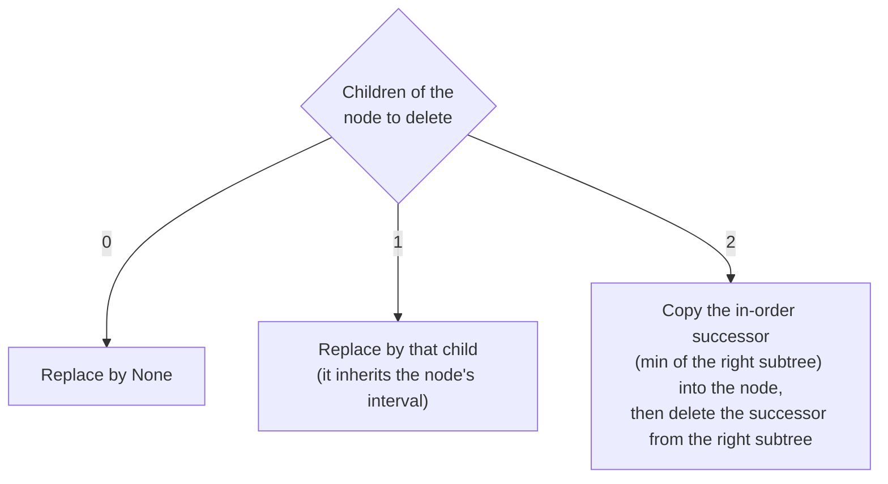
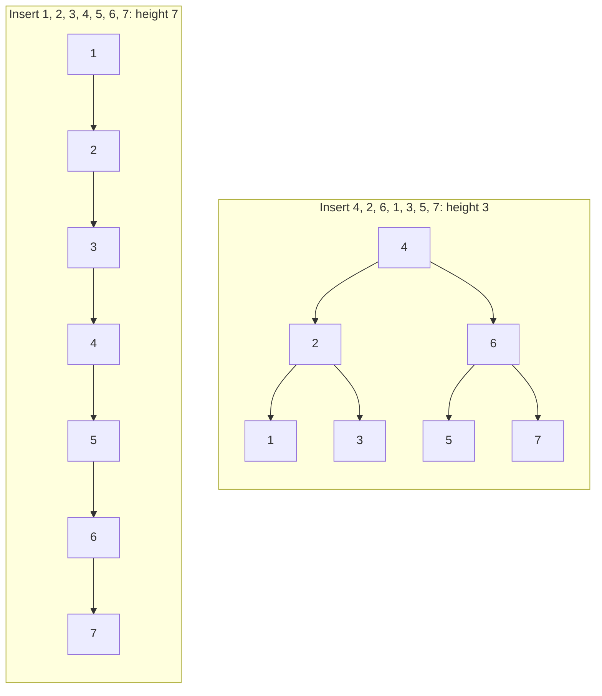
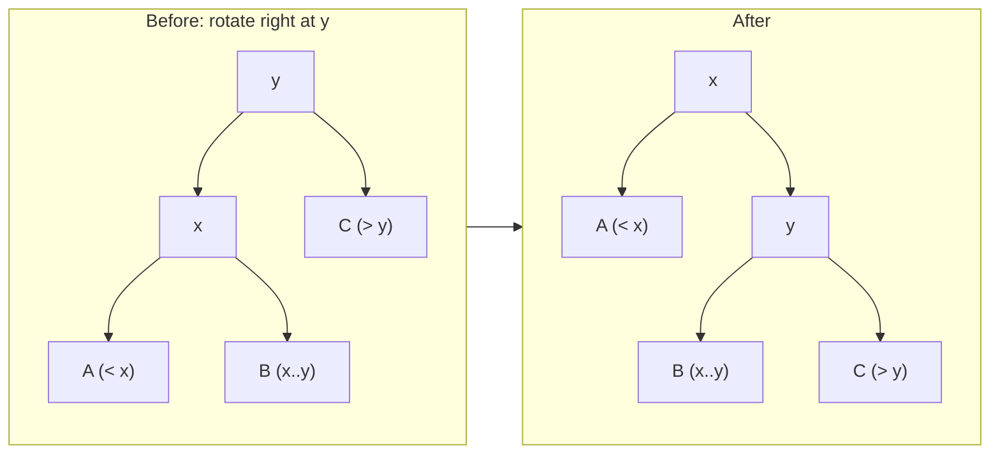

# Binary search tree

> [!abstract] In one sentence
> A binary search tree stores keys in nodes with at most two children under one invariant: **every key in a node's left subtree is smaller than the node's key, and every key in its right subtree is larger**. Each comparison discards one whole subtree, so search, insert, delete, predecessor/successor, floor/ceiling and range queries all cost **O(h)**, where h is the height: Θ(log n) if the tree is balanced, Θ(n) if insertions arrive in sorted order. In return for that fragility, a BST keeps the data **ordered**, which a [[Hash table]] can't.

## 1. The invariant, precisely

For every node x: `max(keys in x.left) < x.key < min(keys in x.right)`. The condition is on **whole subtrees**, not on direct children. Equivalent formulation used by every algorithm below: each node's key lies in an **open interval (low, high)** inherited from its ancestors: going left from x tightens `high` to x.key, going right tightens `low`.

Consequence: an **in-order traversal** (left, node, right) visits keys in sorted order. That's the BST's second capability next to O(h) search: sorted iteration in O(n), and every "order" query below.

Validation follows the interval form directly:

```python
def is_bst(node, low=float("-inf"), high=float("inf")):
    if node is None:
        return True
    if not (low < node.key < high):
        return False
    return is_bst(node.left, low, node.key) and is_bst(node.right, node.key, high)
```

Checking only `node.left.key < node.key < node.right.key` accepts `5 → left 3 → right 6`, where 6 sits in 5's left subtree.

## 2. Core operations

### Search and insert

Search walks one root-to-leaf path. Insert is an unsuccessful search followed by attaching a new leaf where the search fell off. The recursive version uses the "return the updated subtree" contract from [[Recursion]]:

```python
def insert(node, key, value):
    if node is None:
        return Node(key, value)                     # the empty spot where it belongs
    if key < node.key:
        node.left = insert(node.left, key, value)   # reattach the updated subtree
    elif key > node.key:
        node.right = insert(node.right, key, value)
    else:
        node.value = value                          # existing key: map semantics
    return node
```

Equal keys update the value (a **map**). Keeping duplicates needs a policy: a count per node, or "equal goes right" (then searches must continue right after a hit).

Recursion depth equals the path length, so on a degenerate tree it hits Python's recursion limit. Iterative versions are a plain loop with a `parent` pointer:

```python
def insert_iterative(root, key, value):
    if root is None:
        return Node(key, value)
    node = root
    while True:
        if key == node.key:
            node.value = value; return root
        nxt = node.left if key < node.key else node.right
        if nxt is None:
            if key < node.key: node.left = Node(key, value)
            else:              node.right = Node(key, value)
            return root
        node = nxt
```

### Delete: three cases



Why case 3 is correct: the successor `s` is the smallest key larger than the node's key, so it is larger than everything in the left subtree and smaller than everything else in the right subtree: it satisfies the node's interval. And `s` has **no left child** (otherwise that child would be smaller), so deleting it is case 0 or 1. Using the in-order **predecessor** (max of the left subtree) is symmetric; production code alternates or picks randomly, because always using the successor slowly skews the tree left over many deletions.

### Successor, predecessor, floor, ceiling

The **successor** of a key is the smallest key strictly larger. Two situations:
- The node has a right subtree → the minimum of that subtree (go right once, then left all the way)
- Otherwise → the nearest ancestor for which the node is in the **left** subtree

Without parent pointers, one descent from the root handles both: every time the search goes **left**, the current node is a candidate (it's larger than the key), and the last candidate is the answer.

```python
def successor(root, key):
    succ, node = None, root
    while node:
        if key < node.key:
            succ, node = node, node.left      # node > key: candidate, look for smaller
        else:
            node = node.right                 # node <= key: answer is to the right
    return succ.key if succ else None

def floor(root, key):                         # largest key <= key
    best, node = None, root
    while node:
        if node.key == key:
            return key
        if node.key < key:
            best, node = node.key, node.right
        else:
            node = node.left
    return best
```

On the tree built from 50, 30, 70, 20, 40, 60, 80, 35, 45: successor(45) = 50, successor(80) = none, floor(58) = 50, floor(10) = none.

### Range query

All keys in `[lo, hi]`: an in-order traversal that **prunes** subtrees that can't contain keys in range. Cost O(h + k) for k results.

```python
def range_query(node, lo, hi, out):
    if node is None:
        return
    if lo < node.key:                          # left subtree may hold keys >= lo
        range_query(node.left, lo, hi, out)
    if lo <= node.key <= hi:
        out.append(node.key)
    if node.key < hi:                          # right subtree may hold keys <= hi
        range_query(node.right, lo, hi, out)
```

`range_query(root, 33, 65)` on the same tree → `[35, 40, 45, 50, 60]`.

### Lowest common ancestor

In a BST the LCA of a and b is the first node on the path from the root where a and b **split** (one goes left, the other right, or one equals the node). O(h), no extra memory:

```python
def lca(root, a, b):
    node = root
    while node:
        if a < node.key and b < node.key:   node = node.left
        elif a > node.key and b > node.key: node = node.right
        else:                               return node.key
```

## 3. Augmenting the tree: order statistics

Store in each node the **size** of its subtree (maintained on insert/delete). Then "k-th smallest" and "rank of x" become O(h):

```python
def kth_smallest(node, k):                     # 1-based
    while node:
        left = node.left.size if node.left else 0
        if k == left + 1:
            return node.key
        if k <= left:
            node = node.left
        else:
            k -= left + 1                      # skip the left subtree and this node
            node = node.right
```

The same idea (store an aggregate of the subtree in each node, keep it updated on the way back up) gives interval trees, segment-tree-like range sums, and "count keys < x" queries.

## 4. Height: the whole cost model

| Insertion order | Height | Cost per operation |
|---|---|---|
| Sorted (1, 2, 3, …) | n | Θ(n): the tree is a linked list |
| Random permutation | ~2.99 log₂ n asymptotically in theory; measured ≈ 22 for n = 1000 (vs minimum 10). **Average node depth** ≈ 1.39 log₂ n (≈ 11 for n = 1000) | Θ(log n) expected |
| Built from a sorted array by always taking the middle | ⌈log₂(n + 1)⌉ | Θ(log n), but only until the next unlucky inserts |



Real data is often sorted or nearly sorted (timestamps, auto-increment IDs), which is the worst case. Hence balancing.

### Rotations: restructuring without breaking the invariant

A **rotation** changes the shape around one edge in O(1) while preserving the in-order sequence. Right rotation at y (with left child x): x becomes the subtree root, y becomes x's right child, and x's old right subtree (keys between x and y) becomes y's left subtree.



```python
def rotate_right(y):
    x = y.left
    y.left = x.right        # B moves under y
    x.right = y
    return x                # new subtree root (caller reattaches it)
```

Every self-balancing BST is "a BST + a balance invariant + rotations to restore it after insert/delete":

| Tree | Balance invariant | Height bound | Trade-off | Used in |
|---|---|---|---|---|
| **AVL** | Subtree heights differ by ≤ 1 at every node | ≤ 1.44 log₂ n | Stricter: faster lookups, more rotations on updates | Read-heavy in-memory indexes |
| **Red-black** | Coloring rules: no red-red parent/child, same black count on every root-to-leaf path | ≤ 2 log₂ n | Fewer rotations per update (≤ 2 per insert, ≤ 3 per delete) | Java `TreeMap`, C++ `std::map`, Linux CFS scheduler and memory areas |
| **Treap / skip list** | Random priorities / levels | O(log n) expected | Simple code | Redis sorted sets (skip list) |
| **B-tree / B+ tree** | Nodes hold many keys (hundreds), all leaves at the same depth | log_fanout n | Shallow and wide to match disk pages | PostgreSQL/MySQL indexes, most filesystems |

B+ trees are why a database finds one row among billions in 3–4 page reads: with a fanout of ~500 keys per 8 KB page, 3 levels hold 125 million keys and 4 levels about 60 billion. Leaves are linked, so range scans (`WHERE created_at BETWEEN …`) walk leaves sequentially. More in *[[Balanced trees]]*.

## 5. BST vs hash table

| Need | BST (balanced) | [[Hash table]] |
|---|---|---|
| Exact lookup | O(log n) | **O(1)** expected |
| Sorted iteration | **O(n)** | O(n log n) (sort first) |
| Min / max, predecessor / successor, floor / ceiling | **O(log n)** | O(n) |
| Range `[lo, hi]` | **O(log n + k)** | O(n) |
| k-th smallest, rank | **O(log n)** with sizes | O(n) |
| Worst-case guarantee | O(log n) (balanced) | O(n) (collisions) |
| Key requirement | Total order (`<`) | Hash + equality |

In Python: `dict`/`set` are hash tables. For ordered maps, `sortedcontainers.SortedDict` (a B-tree-like list of sorted lists) or `bisect` on a sorted list.

## 6. Construction and conversion

- **From a sorted array, balanced**: root = middle element, recursively build both halves. O(n), height ⌈log₂(n + 1)⌉ (15 keys → height 4)
- **Tree → sorted list**: in-order traversal. Building it as `inorder(left) + [x] + inorder(right)` copies lists at each level (O(n·h)); append to one shared list or `yield from` instead
- **Sorting with a BST** (insert all, read in-order) is O(n log n) only if balanced: it's the idea behind tree sort

```python
def from_sorted(xs, lo=0, hi=None):
    if hi is None:
        hi = len(xs)
    if lo >= hi:
        return None
    mid = (lo + hi) // 2
    node = Node(xs[mid])
    node.left = from_sorted(xs, lo, mid)
    node.right = from_sorted(xs, mid + 1, hi)
    return node
```

## 7. Notes on my implementation

My BST (recursive insert/search/delete with the "return the updated subtree" pattern, successor-based delete, in-order traversal) is correct. Two things to know about it:
- The traversal was written as list concatenation:
  ```python
  return self._inorder(node.left) + [(node.key, node.value)] + self._inorder(node.right)
  ```
  which copies at every level: O(n·h) total, O(n²) on a degenerate tree
- All methods are recursive and the tree isn't balanced, so 1,000+ keys inserted in sorted order raise `RecursionError`

## Practice

> [!example]- Insert 50, 30, 70, 20, 40, 60, 80, then delete 50. New root, and why is it valid?
> 60, the in-order successor (leftmost node of the right subtree). It's larger than everything on the left (20, 30, 40) and smaller than the rest of the right subtree (70, 80). The old 60 was a leaf, so removing it is trivial.

> [!example]- Successor of 45 in the tree from 50, 30, 70, 20, 40, 60, 80, 35, 45, without parent pointers.
> Descend from the root: 45 < 50 → candidate 50, go left. 45 > 30 → right. 45 > 40 → right. 45 = 45 → right (None). Last candidate: 50.

> [!example]- With subtree sizes stored, find the 4th smallest in that tree.
> Root 50, left size 5 (20, 30, 35, 40, 45) → 4 ≤ 5, go left. Node 30, left size 1 (20): 4 > 2, so k = 4 − 2 = 2, go right. Node 40, left size 1 (35): k = 2 = left + 1 → 40. (Sorted: 20, 30, 35, 40.)

> [!example]- Why does a right rotation keep the in-order order?
> In-order before: A, x, B, y, C. After: A, x, B, y, C. Only the parent/child links changed; B, which lies between x and y, moves from x's right to y's left, still between them.

> [!example]- A table of 2 billion rows has a B+ tree index with ~500 keys per page. How many page reads for a lookup?
> log₅₀₀(2·10⁹) ≈ 3.5, so 4 levels: about 4 page reads, usually fewer since the top levels stay cached in memory.

## Related
- Built with:: [[Recursion]]
- Traversals:: [[Depth-first search]] (pre/in/post-order), [[Breadth-first search]] (level order)
- Compared with:: [[Hash table]], [[Linked list]] (what a degenerate BST becomes)
- Next:: *[[Balanced trees]]*, *[[Heaps]]*, *[[Tries]]*
- Area:: [[Data structures and algorithms]]

## Flashcards
#flashcards

The BST invariant, precisely? :: Every key in a node's left subtree is smaller and every key in its right subtree is larger (whole subtrees, not just children)
How to validate a BST? :: Pass an open interval (low, high) down: left child gets (low, key), right child gets (key, high)
Cost of BST operations? :: O(h): Θ(log n) balanced, Θ(n) degenerate
What does in-order traversal of a BST produce? :: The keys in sorted order
Delete a node with two children? :: Copy its in-order successor (min of right subtree) into it, then delete the successor, which has no left child
Why does the successor have no left child? :: A left child would be a smaller key still larger than the deleted node, contradicting "smallest larger key"
Successor without parent pointers? :: Descend from the root, recording the node each time you go left; the last recorded node is the successor
Cost of a range query on a BST? :: O(h + k) for k results, pruning subtrees outside the range
LCA of two keys in a BST? :: First node where the keys split (one left, one right, or one equals the node)
How to support k-th smallest in O(h)? :: Store subtree sizes in each node
Expected average node depth of a random BST? :: About 1.39 log₂ n (2 ln n)
What does a rotation preserve and cost? :: Preserves in-order order, O(1), changes the shape around one edge
AVL vs red-black? :: AVL: heights differ by ≤ 1, ≤ 1.44 log n, faster reads. Red-black: ≤ 2 log n, fewer rotations on updates
Why do databases use B+ trees? :: Hundreds of keys per page make the tree 3–4 levels deep for billions of rows, and linked leaves serve range scans
What can a BST do that a hash table can't efficiently? :: Ordered operations: sorted iteration, min/max, predecessor/successor, floor/ceiling, ranges, rank
How to build a balanced BST from a sorted array? :: Take the middle as root, build both halves recursively: O(n)
