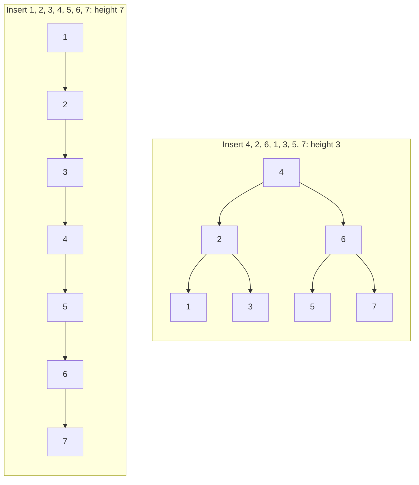
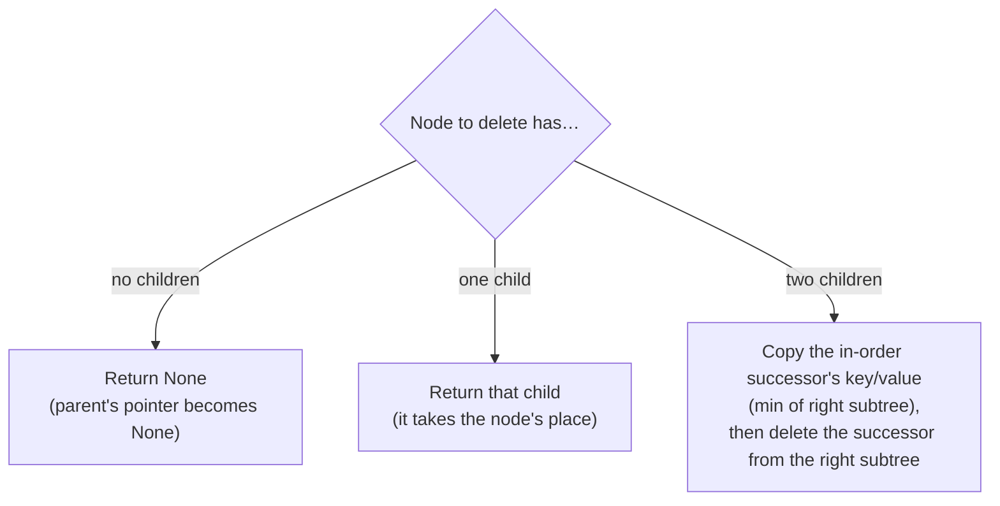

# Binary search tree

> [!abstract] In one sentence
> A binary search tree (BST) is a binary tree where, for **every** node, all keys in its **left subtree are smaller** and all keys in its **right subtree are larger**. That one rule lets search, insert and delete discard half the remaining tree at each step, so they cost **O(height)**: O(log n) when the tree is balanced, O(n) when it degenerates into a line. An in-order traversal returns the keys **sorted**.

## Common misconceptions

**Wrong mental model #1:** "A BST is O(log n)."

**What's actually true:** it's **O(h)**, the height of the tree. The height depends on the **insertion order**. Inserting keys already sorted (1, 2, 3, 4, 5…) builds a tree where every node only has a right child: a linked list with extra steps, O(n) per operation. O(log n) is only guaranteed by **self-balancing** trees (AVL, red-black), which rotate nodes to keep the height low.



**Wrong mental model #2:** "To check a tree is a valid BST, check each node against its two children."

**What's actually true:** the rule is about **whole subtrees**. In this tree every parent/child pair looks fine, but 6 is in the **left** subtree of 5 while being larger than 5: invalid.

```
      5
     /
    3
     \
      6      ← 6 > 3 ok locally, but 6 > 5 and it's left of 5
```

The correct check passes **bounds** down: every node in the left subtree of 5 must be in `(-∞, 5)`.

**Wrong mental model #3:** "Deleting a node with two children is hard to define."

**What's actually true:** replace its key with its **in-order successor** (the smallest key in its right subtree), then delete that successor from the right subtree, where it has at most one child. Order stays correct because the successor is larger than everything on the left and smaller than everything else on the right.

## Build-up (my implementation)

### Stage 1: search

At each node: equal → found, smaller → go left, larger → go right, `None` → not there.

```python
def _search(self, node, key):
    if node is None:
        return None
    if key < node.key:
        return self._search(node.left, key)
    elif key > node.key:
        return self._search(node.right, key)
    return node.value
```

Each step goes one level down: O(h).

### Stage 2: insert, "return the updated subtree"

My recursive pattern (see [[Recursion]]): `_insert(node, key, value)` **returns the subtree after insertion**. Assuming it works for the children, the current step only reattaches the result.

```python
def _insert(self, node, key, value):
    if node is None:                      # empty spot: the new node goes here
        return BSTNode(key, value)
    if key < node.key:
        node.left = self._insert(node.left, key, value)
    elif key > node.key:
        node.right = self._insert(node.right, key, value)
    else:
        node.value = value                # same key: update (map semantics)
    return node
```

Equal keys **update** the value, so my BST behaves like a **map** (one value per key). A BST that must keep duplicates needs a rule (always go right, or a count per node).

### Stage 3: delete, three cases



Example: delete 4 from the balanced tree above. Its successor is 5 (leftmost in the right subtree `6 → 5`). 4 becomes 5, then 5 is deleted from the right subtree (a leaf, case 1).

My `_delete` does exactly this, with `_find_min` walking left from `node.right`.

### Stage 4: in-order traversal gives sorted output

Left subtree, then the node, then the right subtree: the BST rule guarantees ascending order. That's the BST's other superpower besides search: **ordered** operations (sorted iteration, min/max, "next key after x", range queries `20 ≤ key ≤ 40`) that a [[Hash table]] can't do.

```python
def _inorder(self, node, out):
    if node is None:
        return
    self._inorder(node.left, out)
    out.append((node.key, node.value))
    self._inorder(node.right, out)
```

My version builds the result with `self._inorder(left) + [x] + self._inorder(right)`, which **copies lists at every level**: O(n·h) total, O(n²) on a degenerate tree. Passing one `out` list (above) or using a generator (`yield from`) keeps it O(n).

The other orders (pre-order, post-order) are in [[Depth-first search]].

### Stage 5: keeping the height low

Plain BST performance depends on luck. Real libraries use **balanced** trees:
- **AVL**: heights of the two subtrees of every node differ by at most 1, fixed with rotations. Faster lookups
- **Red-black**: looser balance, fewer rotations on insert/delete. Used by Java's `TreeMap`, C++ `std::map`, the Linux kernel's scheduler (CFS) and memory maps
- **B-trees / B+ trees**: many keys per node, so the tree is very **wide and shallow**, matching disk pages. Every relational database index (PostgreSQL, MySQL InnoDB) and most filesystems use them

## Advanced problems

| Symptom | Cause | Fix |
|---|---|---|
| Operations get slow as data grows, especially with timestamps or IDs as keys | Keys inserted in sorted order → degenerate tree, O(n) | Balanced tree (AVL/red-black), or a library structure. In Python: `sortedcontainers.SortedDict`, or `bisect` on a list |
| `RecursionError` on a large tree | Recursive methods on a degenerate tree with depth > ~1000 | Iterative search/insert (a simple loop), balanced tree |
| Validation says "valid" for an invalid tree | Checking only parent vs children | Pass `(low, high)` bounds down, or check that the in-order traversal is strictly increasing |
| In-order traversal slow | List concatenation at each level | Accumulator list or generator |
| Deleting a two-child node corrupts the order | Used the max of the **right** subtree, or forgot to delete the successor | Successor = min of the right subtree (or predecessor = max of the left) |

## Practice

> [!example]- Insert 50, 30, 70, 20, 40, 60, 80, then delete 50. What's the new root?
> 60: the in-order successor of 50 (leftmost node of the right subtree 70 → 60). 60 replaces 50, then the old 60 (a leaf) is removed.

> [!example]- In-order traversal of the tree built from 8, 3, 10, 1, 6, 14, 4, 7?
> 1, 3, 4, 6, 7, 8, 10, 14. Always sorted for a valid BST.

> [!example]- When would I pick a BST over a hash table?
> When I need order: sorted iteration, min/max, the next key after x, range queries. A hash table is faster (O(1) average) for pure lookup by exact key.

## Easy to get wrong
- "BST = O(log n)": only if balanced. Sorted inserts make it O(n)
- Validating with parent/child comparisons only
- Forgetting to reattach the returned subtree (`node.left = self._insert(...)`), so the insert is lost
- Two-child delete: the successor is the **minimum of the right** subtree, and it must then be deleted from there
- Duplicate keys: decide between update and a duplicate rule
- Recursive methods on deep, unbalanced trees hit Python's recursion limit

## Related
- Built with:: [[Recursion]]
- Traversals:: [[Depth-first search]] (pre/in/post-order), [[Breadth-first search]] (level order)
- Compared with:: [[Hash table]] (no order, O(1) average), [[Linked list]] (what a degenerate BST becomes)
- Next:: *[[Balanced trees]]*, *[[Heaps]]*, *[[Tries]]*
- Area:: [[Data structures and algorithms]]

## Flashcards
#flashcards

The BST property? :: For every node, all keys in the left subtree are smaller and all keys in the right subtree are larger
Cost of BST search, insert, delete? :: O(h): O(log n) balanced, O(n) degenerate
What makes a BST degenerate? :: Inserting keys in sorted order: every node gets one child, it becomes a linked list
What does in-order traversal of a BST return? :: The keys in sorted order
How to delete a node with two children? :: Replace it with its in-order successor (min of the right subtree), then delete the successor from the right subtree
Delete a node with one child? :: Replace it with that child
Why is checking each node against its children not enough to validate a BST? :: The rule applies to whole subtrees. Pass min/max bounds down instead
Why does my recursive insert return a node? :: It returns the updated subtree, which the parent reattaches (node.left = _insert(...))
BST vs hash table? :: BST keeps order (sorted iteration, ranges, min/max). Hash table is O(1) average lookup with no order
Which trees guarantee O(log n)? :: Self-balancing trees: AVL, red-black (and B-trees on disk)
Why do databases use B-trees instead of binary trees? :: Many keys per node makes the tree shallow, matching disk pages: few disk reads per lookup
Why is `inorder(left) + [x] + inorder(right)` slow? :: It copies lists at every level: O(n·h), O(n²) when degenerate
