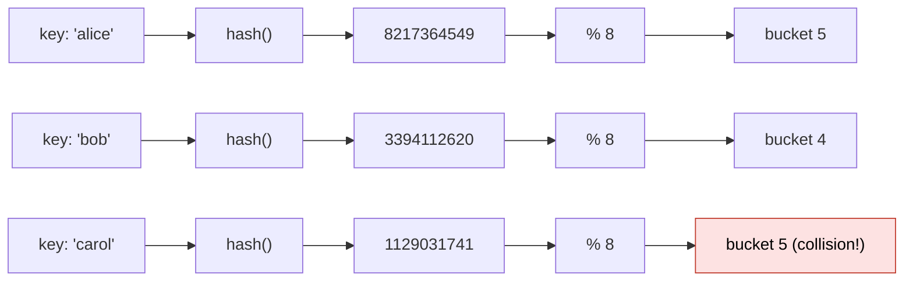
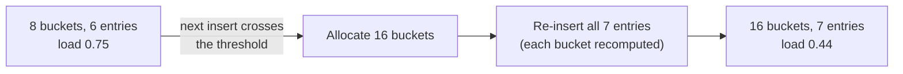

# Hash table

> [!abstract] In one sentence
> A hash table stores key → value pairs in an array of **buckets**: a **hash function** turns the key into a number, `hash(key) % number_of_buckets` picks the bucket, and the pair goes there. Lookup jumps straight to the right bucket instead of searching, so insert, lookup and delete are **O(1) on average**, as long as **collisions** (several keys in one bucket) stay rare by keeping the table from getting too full.

## Common misconceptions

**Wrong mental model #1:** "Hash tables are O(1), period."

**What's actually true:** O(1) **on average**, assuming a good hash function and a table that **resizes** before it fills up. The worst case is every key landing in one bucket: O(n) per operation (or O(log n) if buckets are balanced trees). Resizing itself costs O(n) once in a while, which averages out to O(1) per insert (**amortized**).

**Wrong mental model #2:** "Two different keys never get the same hash."

**What's actually true:** collisions are **guaranteed** (the pigeonhole principle: infinitely many possible keys, a few buckets). Even with perfect 64-bit hashes, `% 8` maps them to 8 buckets. Every hash table needs a **collision strategy**, and the table must still compare the actual keys (`==`) to find the right one.

**Wrong mental model #3:** "Any object can be a key."

**What's actually true:** a key's hash must **never change** while it's in the table, and equal keys must have equal hashes. That's why Python refuses lists and dicts as keys (`TypeError: unhashable type: 'list'`) and accepts strings, numbers and tuples of those. A key whose hash changed is still in the table, in a bucket nobody will ever look in again.

## Build-up

### Stage 1: from a key to a bucket



A good hash function spreads keys **uniformly** over buckets and is fast. Python's `hash()` is randomized per process for strings (`PYTHONHASHSEED`), so the same string hashes differently in two runs: fine for an in-memory table, wrong for anything stored or shared between processes.

### Stage 2: collisions, two strategies

| | **Separate chaining** | **Open addressing** |
|---|---|---|
| Idea | Each bucket holds a small collection ([[Linked list]], or a tree) of all its pairs | One pair per slot. On collision, **probe** other slots (next one, quadratic jumps, double hashing) until a free one |
| Full table? | Never full, chains just get longer | Must resize before full, slows down a lot past ~70% |
| Delete | Remove from the chain | Leave a **tombstone**, otherwise later probes stop too early and lose keys |
| Memory/cache | Pointers, scattered nodes | Contiguous array, cache-friendly |
| Used by | Java `HashMap` (lists, turned into **red-black trees** past 8 entries per bucket) | Python `dict`, Go maps (variants), Rust `HashMap` (SwissTable) |

**My implementation uses chaining with a [[Binary search tree]] in each bucket**: the same idea as Java 8's tree buckets. A bucket with many colliding keys costs O(log k) instead of O(k), *if* the tree stays balanced.

### Stage 3: load factor and resizing

**Load factor** = number of entries / number of buckets. As it grows, chains get longer (or probes longer) and O(1) erodes.

The fix: past a threshold (0.75 in Java, about 2/3 in Python), allocate a table about **twice** as big and **re-insert every entry** (rehash), since `hash % 8` and `hash % 16` give different buckets.



That one insert costs O(n), but doubling means it happens rarely enough that **n inserts cost O(n) in total**: O(1) amortized per insert.

### Stage 4: when hashing goes wrong

- **Bad hash function**: hashing a user ID by its last digit, or `hash = len(key)`: most keys pile into few buckets
- **Hash flooding (a denial-of-service attack)**: an attacker sends thousands of HTTP parameters crafted to collide in the server's hash table, turning each request into O(n²) work. That's why Python, Ruby, Rust and others **randomize** string hashing per process (SipHash with a secret seed)
- **Modulo and structure**: `% size` with a power-of-two size only uses the low bits of the hash, so a weak hash with patterns in the low bits collides a lot. Prime sizes or a mixing step fix it

## Bugs in my implementation

My table was created like this:

```python
self.table = [BST()] * size
```

`[x] * size` creates a list of `size` **references to the same object**. All buckets are **one shared BST**: every key goes into the same tree, and the "hash table" is just a BST with extra steps. It still returns correct results, which is what makes this bug hard to notice.

```python
self.table = [BST() for _ in range(size)]   # a new BST per bucket
```

The same trap hits `[[0] * 3] * 3` for a 2D grid: changing `grid[0][0]` changes all three rows.

Missing compared to a real hash table: no **resizing** (with a fixed size, the load factor grows forever), no **delete**, and keys must be **comparable** (`<`, `>`) as well as hashable because of the BST buckets, which a chained list wouldn't require.

## Where hash tables show up in systems
- **Python `dict` and `set`**, every language's maps, object attributes, symbol tables in compilers
- **Caches**: memcached, Redis, a DNS resolver's cache ([[DNS]]), with a [[Linked list]] for LRU eviction
- **Network devices**: a switch's MAC address table maps MAC → port. Filling it with fake MACs (**MAC flooding**) makes the switch flood every frame to all ports ([[Hubs, switches and routers]])
- **Partitioning data**: [[Kafka]] picks a partition with `hash(key) % partitions`. Adding partitions changes the modulo, so keys move: the same problem as resizing, but across machines
- **Load balancers and distributed caches**: plain `hash % servers` moves almost every key when a server is added. **Consistent hashing** moves only ~1/N of them ([[Load balancing]], *[[Consistent hashing]]*)
- **Databases**: hash indexes and hash joins
- **Deduplication and integrity**: content hashes (SHA-256) identify files and blocks, but those are cryptographic hashes, a different job than bucket selection

## Practice

> [!example]- 8 buckets, 6 entries, threshold 0.75. What happens on the next insert, and what does it cost?
> 7/8 = 0.875 > 0.75, so the table grows to 16 buckets and re-inserts all 7 entries: O(n) for that insert, O(1) amortized overall.

> [!example]- Why can't a Python list be a dict key, but a tuple can?
> A list is mutable: its hash would change if its contents changed, leaving it in the wrong bucket. A tuple of hashable items is immutable, so its hash is stable.

> [!example]- `[BST()] * 4` vs `[BST() for _ in range(4)]`?
> The first is 4 references to one BST (all buckets shared). The second creates 4 independent BSTs.

> [!example]- Count how many times each word appears in a text. Data structure and cost?
> A hash table word → count (`dict` or `collections.Counter`): O(1) average per word, O(n) total.

## Easy to get wrong
- "O(1) always": average and amortized, worst case O(n)
- Forgetting that the keys themselves must still be compared after landing in a bucket
- Mutable keys, or keys whose `__hash__` doesn't match `__eq__`
- `[obj] * n` sharing one object across all slots
- No resizing: performance degrades as the load factor grows
- Deleting in open addressing without tombstones
- Relying on Python's `hash()` of strings across processes (randomized)
- Using `hash % n` to spread keys over servers and moving everything when n changes

## Related
- Buckets built with:: [[Linked list]] (chaining), [[Binary search tree]] (my tree buckets)
- Compared with:: [[Binary search tree]] (ordered, O(log n) if balanced)
- Used in problems:: [[Arrays and strings problems]] (frequency counting)
- In systems:: [[Kafka]], [[Load balancing]], [[DNS]], [[Hubs, switches and routers]]
- Area:: [[Data structures and algorithms]]

## Flashcards
#flashcards

How does a hash table find a key's bucket? :: hash(key) modulo the number of buckets
Average and worst-case cost of hash table lookup? :: O(1) average, O(n) worst case (all keys colliding)
Why are collisions unavoidable? :: Many more possible keys than buckets (pigeonhole principle)
Separate chaining vs open addressing? :: Chaining: each bucket holds a list/tree of entries. Open addressing: one entry per slot, probe other slots on collision
What is the load factor? :: Entries divided by buckets
What happens when the load factor passes its threshold? :: The table grows (usually doubles) and every entry is rehashed into the new buckets
Why is insert O(1) amortized despite O(n) resizes? :: Doubling makes resizes rare enough that n inserts cost O(n) total
Why do deletes in open addressing need tombstones? :: An empty slot would stop later probes early and hide keys stored after it
What does Java's HashMap do with long bucket chains? :: Converts them to red-black trees (O(log k) per bucket)
Two rules for hash table keys? :: The hash must not change while stored, and equal keys must have equal hashes
Why is Python's string hash randomized per process? :: To prevent hash-flooding denial-of-service attacks
What's wrong with `[BST()] * size`? :: All slots reference the same single BST object
Why does adding Kafka partitions move keys? :: The partition is hash(key) % partitions, so changing the count changes the result, like a hash table resize
What does consistent hashing improve over hash % servers? :: Adding or removing a server moves only about 1/N of the keys
