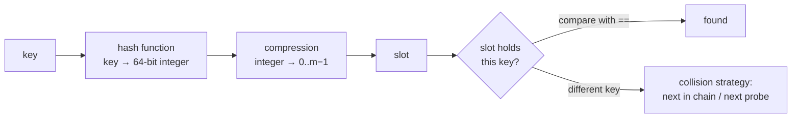

# Hash table

> [!abstract] In one sentence
> A hash table maps keys to values by computing **`index = h(key) mod m`** into an array of m slots, so a lookup touches one slot (plus a few on **collision**) instead of searching. Its O(1) is an **expected, amortized** bound that rests on three engineering choices: a hash function that spreads keys uniformly, a collision strategy, and a **resize policy** that keeps the load factor α = n/m bounded.

## 1. The pipeline: key → hash → slot



Two separate steps that are often confused:
- **Hashing**: turn an arbitrary key into a fixed-size integer. Must be **deterministic** and consistent with equality: `a == b ⇒ h(a) == h(b)`. Should spread similar keys far apart (**avalanche**: one changed input bit flips about half the output bits)
- **Compression**: map that integer to a slot. `h % m` with m prime uses all bits; `h & (m − 1)` with m a power of two is a single AND but **only keeps the low bits**, so tables that use it (Python, Java) either mix the hash first (Java XORs the high 16 bits into the low ones) or perturb their probe sequence with the high bits (Python)

Collisions are unavoidable (pigeonhole), so every slot access still **compares the stored key with **. Storing the full hash next to the key lets the table skip most expensive comparisons (compare hashes first).

### The hash/equality contract

| Rule                                         | Consequence if broken                                                         |
| -------------------------------------------- | ----------------------------------------------------------------------------- |
| `a == b` ⇒ `hash(a) == hash(b)`              | Equal keys land in different slots: duplicates, lookups that miss             |
| `hash(k)` constant while `k` is in the table | The key sits in a slot nobody will probe again: it's "lost" but still counted |
| Hash quality: distinct keys rarely collide   | Long chains/probe runs: O(n) operations                                       |

Python enforces the second rule by refusing mutable built-ins as keys (`TypeError: unhashable type: 'list'`). A user class that defines `__eq__` without `__hash__` becomes unhashable for the same reason.

## 2. Collision resolution

### Separate chaining

Each slot holds a small collection of the entries that hash there.

- Expected chain length = **α**. Unsuccessful search: ~1 + α slots examined. Successful: ~1 + α/2
- Never "full": α can exceed 1, it just gets slower
- Delete is simple: remove from the chain
- Chains as lists are pointer-chasing (cache misses). Java's `HashMap` converts a bucket to a **red-black tree** once it holds 8+ entries (and the table has 64+ buckets), capping a bad bucket at O(log k)

### Open addressing

All entries live in the array itself. On collision, follow a **probe sequence** until an empty slot.

| Probing | Sequence | Trait |
|---|---|---|
| **Linear** | h, h+1, h+2, … | Best cache behavior, but **primary clustering**: runs of occupied slots merge and grow |
| **Quadratic** | h, h+1, h+4, h+9, … | Breaks primary clusters, keys with the same h still share a path (secondary clustering) |
| **Double hashing** | h, h+d, h+2d, … with d = h₂(key) | Different keys get different paths, closest to uniform |
| **Robin Hood** (linear variant) | On insert, a key far from home takes the slot of one closer to home | Evens out probe lengths, lowers variance |

Expected probes under uniform hashing: unsuccessful search ≈ **1 / (1 − α)**, successful ≈ (1/α)·ln(1/(1 − α)). At α = 0.5: 2 probes. At α = 0.9: 10. Linear probing degrades faster (≈ ½(1 + 1/(1 − α)²) for a miss: 50.5 at α = 0.9). Hence open-addressing tables resize early (Python at α = 2/3, many linear-probing tables at 0.5–0.7).

**Deletion needs tombstones.** Emptying a slot would cut the probe chain: a key stored *after* it would become unreachable (lookups stop at the first empty slot). The slot is marked **deleted**: lookups skip it and continue, inserts may reuse it. Too many tombstones slow lookups, so a rehash also purges them.

```python
class LinearProbing:
    EMPTY, TOMB = object(), object()

    def __init__(self, cap=8):
        self.keys, self.vals, self.n = [self.EMPTY] * cap, [None] * cap, 0

    def _probe(self, key):
        i = hash(key) % len(self.keys)
        while True:
            yield i
            i = (i + 1) % len(self.keys)

    def get(self, key):
        for i in self._probe(key):
            k = self.keys[i]
            if k is self.EMPTY:
                return None                       # end of the chain: absent
            if k is not self.TOMB and k == key:
                return self.vals[i]

    def delete(self, key):
        for i in self._probe(key):
            k = self.keys[i]
            if k is self.EMPTY:
                return False
            if k is not self.TOMB and k == key:
                self.keys[i], self.vals[i] = self.TOMB, None   # keep the chain intact
                self.n -= 1
                return True
```

(`put` walks the same probe, remembers the first tombstone, updates in place if the key exists, otherwise writes into the first tombstone or the empty slot, and resizes past α = 0.5.)

## 3. Resizing and the amortized O(1)

When α passes the threshold, allocate m' ≈ 2m and **reinsert every entry** (each one's slot depends on m). One insert costs O(n), but with doubling the total copy work over n inserts is n + n/2 + n/4 + … < 2n: **O(1) amortized** per insert.

A minimal chained table with resizing:

```python
class HashTable:
    def __init__(self, capacity=8):
        self.buckets = [[] for _ in range(capacity)]   # a NEW list per bucket
        self.size = 0

    def _bucket(self, key):
        return self.buckets[hash(key) % len(self.buckets)]

    def put(self, key, value):
        b = self._bucket(key)
        for i, (k, _) in enumerate(b):
            if k == key:
                b[i] = (key, value)
                return
        b.append((key, value))
        self.size += 1
        if self.size / len(self.buckets) > 0.75:
            self._resize(2 * len(self.buckets))

    def get(self, key, default=None):
        for k, v in self._bucket(key):
            if k == key:
                return v
        return default

    def _resize(self, capacity):
        old, self.buckets = self.buckets, [[] for _ in range(capacity)]
        for b in old:
            for k, v in b:
                self.buckets[hash(k) % capacity].append((k, v))
```

100 inserts starting at 8 buckets end at 256 buckets (resizes at 7, 13, 25, 49, 97 entries).

Two production refinements:
- **Incremental rehashing** (Redis): keep both tables, move a few buckets on each operation, so no single request pays the full O(n) pause. Matters for latency-sensitive servers with millions of keys
- **Shrinking**: tables that grew during a spike keep their memory unless the implementation shrinks below a low threshold (Python dicts don't shrink on delete, only on rebuild)

## 4. Real implementations

| Implementation | Strategy | Notable design |
|---|---|---|
| **Python `dict`** | Open addressing, perturbed probing (`i = 5i + 1 + perturb`, perturb shifts in the high hash bits) | **Compact layout** (3.6+): a sparse array of small indices + a dense array of entries in insertion order. Less memory, fast iteration, **insertion order guaranteed** (3.7+). Resizes at α = 2/3 |
| **Java `HashMap`** | Chaining, power-of-two table, `h ^ (h >>> 16)` mixing | Treeifies buckets ≥ 8 entries. Resizes at 0.75 |
| **Go `map`** | Buckets of 8 slots + overflow buckets; newer versions use Swiss tables | Incremental growth |
| **Rust `HashMap`, Abseil `flat_hash_map`** | **Swiss table**: open addressing with a metadata byte per slot (7 hash bits) | Checks 16 slots at once with one SIMD instruction |

### Hash flooding

If an attacker can choose keys (HTTP parameters, JSON fields) and knows the hash function, they can send thousands of keys that collide, turning each insert into O(n) and a request into O(n²) CPU: a denial of service (the 2011 attacks on PHP, Java, Python, Ruby web servers). The fix is a **keyed hash** with a secret per-process seed: Python, Rust and others use **SipHash** for strings. Consequence: Python's `hash("abc")` differs between runs (`PYTHONHASHSEED`), so it must never be persisted or used to route data between processes.

## 5. Hashing beyond the in-memory table

| Use | What changes |
|---|---|
| **Partitioning** across machines ([[Kafka]] partitions, sharded databases) | `hash(key) % N` is a hash table whose "slots" are machines. Changing N remaps almost every key: the resize problem, but data must physically move |
| **Consistent hashing** ([[Load balancing]], distributed caches) | Keys and servers on a ring: adding a server moves only ~1/N of the keys. *[[Consistent hashing]]* |
| **Switch MAC tables, routing caches, conntrack** | Hash tables in network devices and kernels. Filling a switch's MAC table with random source MACs (**MAC flooding**) makes it flood every frame ([[Hubs, switches and routers]]) |
| **Caches** ([[DNS]] resolvers, memcached, Redis) | A hash table + an eviction policy ([[Linked list]] for LRU) |
| **Bloom filters** | k hash functions setting bits: "definitely not present" or "probably present", tiny memory. Databases skip disk reads with them |
| **Cryptographic hashes** (SHA-256) | Different goal: infeasible to find collisions or invert. Too slow for table indexing, used for integrity and content addressing |

## 6. Hash tables as a problem-solving tool

The reflex: "I'm about to search a collection inside a loop" → build a hash set/map first and make each search O(1).

| Pattern | Example | From → to |
|---|---|---|
| Seen-set | First duplicate, "does x exist" | O(n²) → O(n) |
| Complement lookup | Two-sum: for each x, is `target − x` already seen? | O(n²) → O(n) |
| Frequency map | Anagrams, palindrome permutation ([[Arrays and strings problems]]) | Sorting O(n log n) → O(n) |
| Grouping by a canonical key | Group anagrams by `sorted(word)` or a letter-count tuple | |
| Memoization | Cache results by arguments ([[Recursion]]) | Exponential → polynomial |
| Index map | Value → position, for O(1) "where is x" | |

## 7. Bugs in my implementation

My table was created like this:

```python
self.table = [BST()] * size
```

`[x] * size` repeats a **reference** to one object: all slots are the same BST, so every key goes into one tree and the "hash table" is a BST with an O(1) detour. Lookups still return correct values, which is why the bug is invisible in tests that only check results. Correct: `[BST() for _ in range(size)]`. The same trap: `[[0] * 3] * 3` makes three references to one row.

Design notes on that version, compared with section 3:
- Using a [[Binary search tree]] per bucket is the Java-style treeified bucket, but it requires keys to be **orderable** (`<`) as well as hashable, and an unbalanced BST bucket gives no worst-case guarantee
- No resizing: α grows without bound, and the expected O(1) disappears as n grows past `size`
- No delete

## Practice

> [!example]- Open addressing at α = 0.8 vs 0.5: expected probes for a failed lookup under uniform hashing?
> 1/(1 − α): 5 at 0.8, 2 at 0.5. Linear probing is worse (≈ 13 at 0.8), which is why it resizes earlier.

> [!example]- Why can't open addressing simply empty a slot on delete?
> Lookups stop at the first empty slot. Emptying a slot in the middle of a probe run hides every key inserted after it in that run. A tombstone keeps the run connected.

> [!example]- A table doubles at α > 0.75 starting from 8 slots. How many total element moves for 1000 inserts?
> Resizes happen at 7, 13, 25, 49, 97, 193, 385 and 769 entries: 1538 moves in total, under 2n, so O(1) amortized per insert.

> [!example]- Two-sum: indices of two numbers adding to `target` in O(n).
> One pass with a dict value → index: for each `x` at `i`, if `target - x` is in the dict, return both indices, otherwise store `x → i`.

> [!example]- A service shards users with `hash(user_id) % 4`. It moves to 5 shards. Roughly what fraction of users move?
> About 80%: a key stays only if `h % 4 == h % 5`, which holds for 4 of every 20 values. Consistent hashing would move about 1/5.

## Related
- Buckets built with:: [[Linked list]], [[Binary search tree]]
- Compared with:: [[Binary search tree]] (ordered, O(log n) when balanced, range queries)
- Used in:: [[Arrays and strings problems]], [[Recursion]] (memoization)
- In systems:: [[Kafka]], [[Load balancing]], [[DNS]], [[Hubs, switches and routers]]
- Area:: [[Data structures and algorithms]]

## Flashcards
#flashcards

Hashing vs compression in a hash table? :: Hashing maps the key to a fixed-size integer, compression maps that integer to a slot (mod m or mask)
Why do power-of-two tables mix the hash first? :: h & (m−1) keeps only the low bits, so patterns in them would collide
The hash/equality contract? :: a == b implies hash(a) == hash(b), and a key's hash must not change while stored
Expected chain length with separate chaining? :: The load factor α = n/m
Expected probes for a failed lookup with open addressing (uniform)? :: 1/(1 − α)
What is primary clustering? :: In linear probing, occupied runs merge and grow, lengthening probes
Why does open addressing need tombstones? :: An emptied slot would end probe sequences early and hide later keys
Why is insert O(1) amortized despite O(n) resizes? :: Doubling makes the total copy work a geometric series under 2n
What is incremental rehashing? :: Keeping old and new tables and migrating a few buckets per operation (Redis), avoiding long pauses
Python dict internals? :: Open addressing with perturbed probing, compact layout (index array + dense ordered entries), resize at 2/3
Java HashMap's defense against long buckets? :: Buckets with 8+ entries become red-black trees
What is a Swiss table? :: Open addressing with a metadata byte per slot, probing 16 slots per SIMD instruction
What is hash flooding? :: Sending keys crafted to collide, making table operations O(n): a DoS
Defense against hash flooding? :: A keyed hash with a secret per-process seed (SipHash)
Why must Python's hash() of a string not be persisted? :: It's randomized per process (PYTHONHASHSEED)
What's wrong with [BST()] * size? :: Every slot references the same single object
Fraction of keys that move going from hash % 4 to hash % 5? :: About 80%
What is a Bloom filter? :: k hash functions setting bits: "definitely not present" or "probably present" in tiny memory
The hash table reflex in algorithm design? :: Replace a search inside a loop by an O(1) set/map lookup
