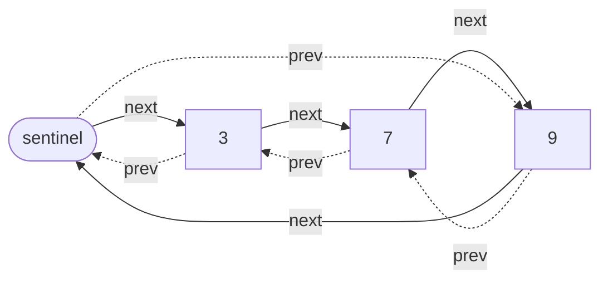
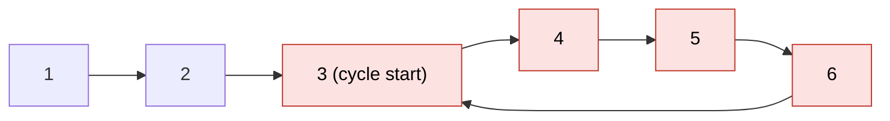

# Linked list

> [!abstract] In one sentence
> A linked list is a sequence of separately allocated **nodes**, each holding a value and a pointer to the next node (and, doubly linked, to the previous). It trades **random access** (O(n) to reach position i) for **O(1) splicing** at any node you already hold a pointer to, and every algorithm on it is an exercise in **rewiring pointers in the right order without losing the rest of the list**.

## 1. Cost model: what a pointer-based sequence really costs

| Operation | Dynamic array (Python `list`) | Singly (head) | Singly (head + tail) | Doubly (head + tail) |
|---|---|---|---|---|
| Access index i | **O(1)** | O(i) | O(i) | O(min(i, n−i)) from the closer end |
| Insert/remove at front | O(n) shift | **O(1)** | **O(1)** | **O(1)** |
| Append | O(1) amortized | O(n) | **O(1)** | **O(1)** |
| Remove last | O(1) | O(n) | O(n) (needs the predecessor) | **O(1)** |
| Insert after a held node | O(n) | **O(1)** | **O(1)** | **O(1)** |
| Remove a held node | O(n) | O(n) (needs the predecessor) | O(n) | **O(1)** |
| Search by value | O(n) | O(n) | O(n) | O(n) |
| Memory per element | Value only (+ slack capacity) | Value + 1 pointer + allocation header | same | Value + 2 pointers + header |

The Big-O column hides the constant that usually decides in practice: **memory locality**. Array elements sit in consecutive memory, so a scan loads whole cache lines and the prefetcher streams them. List nodes are scattered across the heap: every `next` is a potential **cache miss** (~100 ns from RAM vs ~1 ns from L1). A linear scan of 1M integers in an array can be an order of magnitude faster than over 1M list nodes. Linked lists win when the workload is **splicing at known positions**, not scanning.

Python's `list` is a dynamic array. `collections.deque` is a doubly linked list of fixed-size **blocks** (64 items each): O(1) at both ends with much better locality than one node per item.

## 2. Rewiring pointers without losing the list

Every linked-list operation is a short sequence of pointer assignments. The method that avoids bugs:

1. **Draw before and after**: the nodes involved and every pointer that must change
2. **Save what you'd lose**: any node reachable *only* through a pointer you're about to overwrite goes into a variable first (`nxt = cur.next` before `cur.next = prev`)
3. **Order the assignments** so that each one reads only pointers not yet overwritten (or saved)
4. **Check the boundary cases**: empty list, one node, operating on the head, operating on the tail, value not found
5. **Re-check the invariants**: singly: the last node's `next` is `None` and `head` is the first node. Doubly: for every node X, `X.next.prev is X`, `head.prev is None`, `tail.next is None`

Example: inserting `n` after `p` in a doubly linked list. Four pointers change, and the order matters: `n`'s own pointers can be set first (they overwrite nothing), then the neighbors.

```python
n.prev, n.next = p, p.next      # 1. new node points to its neighbors
p.next.prev = n                 # 2. old successor points back to n  (needs p.next, still intact)
p.next = n                      # 3. only now overwrite p.next
```

Swapping steps 2 and 3 makes `p.next.prev = n` set `n.prev = n`.

## 3. Sentinels: deleting the special cases

Almost every linked-list bug is a head/tail/empty special case. A **sentinel** (dummy) node that is always present removes them:

- **Singly, dummy head**: `dummy.next = head`. Every real node now has a predecessor, so "delete the head" is the same code as "delete any node". Return `dummy.next` at the end
- **Doubly, circular sentinel**: one sentinel whose `next` is the first node and `prev` is the last. An empty list is the sentinel pointing to itself. Insert and remove never test for `None`



This is exactly the design of the Linux kernel's `list_head`: a circular doubly linked list with a sentinel, and **intrusive** (the `next`/`prev` fields are embedded inside the struct being listed, so one object can sit in several lists and no separate node is allocated).

## 4. Reversal

**Iterative**, three pointers, O(n) time, O(1) space:

```python
def reverse(head):
    prev, cur = None, head
    while cur:
        nxt = cur.next          # save the rest
        cur.next = prev         # flip one pointer
        prev, cur = cur, nxt    # advance
    return prev                 # new head
```

Loop invariant: `prev` is the head of the already-reversed prefix, `cur` the head of the untouched suffix. Each iteration moves one node from the suffix to the front of the prefix.

**Recursive** (see [[Recursion]]): `reverse(head)` returns the new head of the reversed list. Assume it works for `head.next`, then `head.next` is the **tail** of that reversed part, so `head.next.next = head; head.next = None`. O(n) stack: unusable on long lists in Python.

Variations built on the same loop: reverse a sublist between positions m and n (walk to m − 1 with a dummy head, reverse n − m + 1 nodes, reconnect both ends), reverse in groups of k.

## 5. Two-pointer techniques

| Problem | Pointers | Why it works | Cost |
|---|---|---|---|
| **Middle** | slow +1, fast +2 | When fast has covered n, slow has covered n/2 | O(n), O(1) |
| **k-th from the end** | lead starts k ahead, then both +1 | Gap stays k: when lead hits `None`, trail is k from the end | O(n), O(1), one pass |
| **Cycle detection** (Floyd) | slow +1, fast +2 | Inside a cycle the gap shrinks by 1 per step, so they must meet | O(n), O(1) |
| **Cycle start** | after meeting: one from head, one from meeting point, both +1 | See proof below | O(n), O(1) |
| **Merge two sorted lists** | one per list + a tail with a dummy head | Always append the smaller front node | O(n + m), O(1) |
| **Intersection of two lists** | a walks A then B, b walks B then A | Both travel lenA + lenB, so they align at the shared node | O(n + m), O(1) |

```python
def kth_from_end(head, k):
    lead = trail = head
    for _ in range(k):
        if lead is None:
            return None            # list shorter than k
        lead = lead.next
    while lead:
        lead, trail = lead.next, trail.next
    return trail

def merge_sorted(a, b):
    dummy = tail = Node(None)
    while a and b:
        if a.val <= b.val:
            tail.next, a = a, a.next
        else:
            tail.next, b = b, b.next
        tail = tail.next
    tail.next = a or b             # append the leftover run
    return dummy.next
```

### Floyd's cycle detection, and why the start can be found



Let **μ** = steps from head to the cycle start, **λ** = cycle length. When they meet, slow has walked `μ + x` steps (x = position inside the cycle), fast has walked twice that, and the difference is a whole number of laps: `2(μ + x) − (μ + x) = μ + x = kλ`. So `μ = kλ − x`: walking **μ more steps from the meeting point** lands on position `x + μ = kλ`, i.e. the cycle start. A pointer from the head walking μ steps also lands there. Move both one step at a time: they meet exactly at the start.

```python
def cycle_start(head):
    slow = fast = head
    while fast and fast.next:
        slow, fast = slow.next, fast.next.next
        if slow is fast:                    # inside the cycle
            slow = head
            while slow is not fast:
                slow, fast = slow.next, fast.next
            return slow
    return None                             # fast fell off: no cycle
```

On the list above, `cycle_start` returns node 3. Same algorithm finds the duplicate in an array of n + 1 values in `1..n` (treat `i → a[i]` as `next`).

## 6. LRU cache: the canonical hash map + doubly linked list

"Keep the N most recently used entries, evict the least recently used, O(1) per operation." A [[Hash table]] gives O(1) lookup of a key's node; a doubly linked list keeps nodes in usage order and allows O(1) unlink/move-to-front. Sentinels at both ends remove every special case.

```python
class LRUCache:
    def __init__(self, capacity):
        self.cap, self.map = capacity, {}
        self.head, self.tail = Node(), Node()          # sentinels
        self.head.next, self.tail.prev = self.tail, self.head

    def _unlink(self, n):
        n.prev.next, n.next.prev = n.next, n.prev

    def _push_front(self, n):
        n.prev, n.next = self.head, self.head.next
        self.head.next.prev = n
        self.head.next = n

    def get(self, key):
        n = self.map.get(key)
        if n is None:
            return None
        self._unlink(n); self._push_front(n)           # mark as most recent
        return n.val

    def put(self, key, val):
        if key in self.map:
            n = self.map[key]; n.val = val
            self._unlink(n); self._push_front(n)
            return
        if len(self.map) == self.cap:
            lru = self.tail.prev                       # least recent
            self._unlink(lru); del self.map[lru.key]
        n = Node(key, val); self.map[key] = n; self._push_front(n)
```

`Node` here holds `key, val, prev, next` (the key is needed to delete the map entry on eviction). With capacity 2: put a, put b, get a, put c → b is evicted. Python's `OrderedDict` (`move_to_end`, `popitem(last=False)`) is this same structure. Real caches use approximations (CLOCK, sampled LRU in Redis) because a strict list costs a lock and pointer writes on every **read**.

## 7. Variants worth knowing

| Variant | Idea | Used for |
|---|---|---|
| **Circular** | Last node points to the first | Round-robin scheduling, ring buffers of nodes. Loops stop when back at the start, never at `None` |
| **Skip list** | Sorted linked list with extra "express lane" levels, each node promoted with probability ½ | O(log n) expected search/insert, simpler than balanced trees and easy to make concurrent: Redis sorted sets, LevelDB/RocksDB memtables |
| **Unrolled list** | Each node holds a small array of items | Better cache locality (`deque`'s blocks) |
| **Persistent list** | Nodes are immutable, "prepend" shares the old list as the tail | Functional languages, cheap snapshots |
| **Intrusive list** | Link fields live inside the object | Kernels, allocators: no extra allocation, O(1) removal given the object |

## 8. Bugs in my implementation

My first implementation had these, all in boundary cases:

```python
# singly: delete_by_value
if current.data == data:
    self.head = current.next          # no return: falls through
while current.next and current.next.data != data:
    current = current.next
current.next = cast(Node, current.next).next   # crashes if not found
```

```python
# doubly: append (prepend has the same shape)
if self.is_empty():
    self.head = new
    self.tail = new                   # no return: falls through
new.next = self.tail                  # points backwards, prev never set
self.tail = new
```

| Method | Effect | Fix |
|---|---|---|
| Singly `delete_by_value` | After removing the head, keeps going and removes a second node; if the value isn't present, `current.next` is `None` and `.next` raises | Dummy head (section 3), relink only if found |
| Doubly `append` | Empty case falls through; the new node points **back** to the old tail, `tail.next` and every `prev` stay unset | `node.prev = tail; tail.next = node; tail = node`, with `return` in the empty case |
| Doubly `prepend` | Empty case falls through to `new.next = self.head` where head is `new`: a **self-loop**, the next traversal never ends | Same as append, mirrored, and set `head.prev` |
| Doubly `delete` | Value not found: the loop walks off the end, then reads `current.prev` on `None` | `if cur is None: return` |
| Circular `append` | Empty case assigns `self.head = current` (`None`) instead of the new node, then dereferences it | `self.head = node; node.next = node; return` |

All five are the section 2 checklist's step 4: the operation was right for the general case and wrong for empty / head / not-found. Sentinels remove most of them by construction.

## Practice

> [!example]- Reverse only positions 2 to 4 of `1 → 2 → 3 → 4 → 5`.
> Dummy head, walk to node 1 (position m − 1). Reverse 3 nodes starting at 2 with the usual loop, giving `4 → 3 → 2` and leaving `cur` at 5. Reconnect: node 1's `next` = 4, node 2's `next` = 5. Result `1 → 4 → 3 → 2 → 5`.

> [!example]- Find the 2nd node from the end of `1 → 2 → 3 → 4 → 5` in one pass.
> Lead moves 2 ahead (to 3). Move both until lead is `None`: trail ends on 4.

> [!example]- In Floyd's algorithm, why can't fast jump over slow without meeting?
> Inside the cycle, each step reduces the distance from fast to slow (in the direction of travel) by exactly 1. A gap that decreases by 1 each step reaches 0, it can't skip it.

> [!example]- Why does an LRU cache need a doubly linked list, not a singly linked one?
> Moving an accessed node to the front means unlinking it from the middle in O(1), which needs its predecessor: `prev`.

> [!example]- Two lists merge into a common tail (Y shape). Find the merge node in O(1) space.
> Pointer a walks A then switches to B's head, pointer b walks B then A. After at most lenA + lenB steps they're on the same node (the merge point) or both `None`.

## Related
- Used by:: [[Hash table]] (chaining, LRU), [[Merge sort]] (the natural sort for lists)
- Techniques:: [[Recursion]], *[[Two pointers]]*
- Compared with:: *[[Arrays and dynamic arrays]]*, *[[Stacks and queues]]*
- Area:: [[Data structures and algorithms]]

## Flashcards
#flashcards

Access index i in a linked list? :: O(i), walk from the head (O(min(i, n−i)) doubly from the closer end)
Why is a linked list scan slower than an array scan beyond Big-O? :: Nodes are scattered in memory, every next pointer can be a cache miss
What is collections.deque internally? :: A doubly linked list of fixed-size blocks: O(1) at both ends with decent locality
Why is removing the tail O(n) in a singly linked list? :: The new tail is the predecessor, reachable only from the head
Rule before overwriting a pointer? :: Save any node reachable only through it (nxt = cur.next)
Doubly linked list invariant? :: For every node X, X.next.prev is X. head.prev and tail.next are None
Correct order to insert n after p (doubly)? :: Set n.prev and n.next, then p.next.prev = n, then p.next = n
What does a sentinel node buy? :: Every real node has neighbors: no head/tail/empty special cases
Empty circular doubly linked list with a sentinel? :: The sentinel points to itself (next and prev)
What is an intrusive list? :: Link fields embedded in the object itself (Linux list_head): no separate allocation, O(1) removal
Loop invariant of iterative reversal? :: prev heads the reversed prefix, cur heads the untouched suffix
k-th node from the end in one pass? :: Lead pointer k ahead, then move both until lead is None
Why does Floyd's algorithm detect a cycle? :: Inside the cycle the gap shrinks by 1 each step, so fast and slow must meet
How to find the cycle start after Floyd's meeting? :: Reset one pointer to head, move both 1 step: they meet at the start (μ = kλ − x)
Which structures make an LRU cache? :: Hash map key → node + doubly linked list in usage order
Why does the LRU node store its key? :: To delete the hash map entry when the node is evicted
What is a skip list? :: A sorted linked list with probabilistic express levels: O(log n) expected search (Redis sorted sets)
Find the merge node of two Y-shaped lists in O(1) space? :: Each pointer walks its list then the other's: they align after lenA + lenB steps
Three boundary cases for every list operation? :: Empty list, operating on the head/tail, value not found
