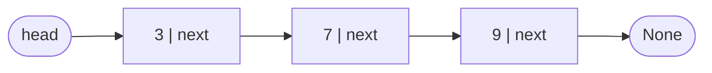
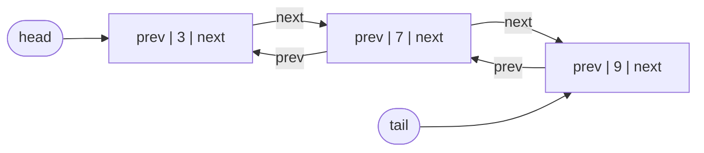
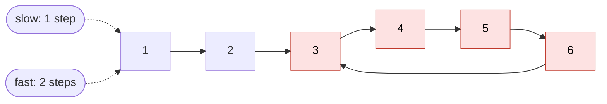

# Linked list

> [!abstract] In one sentence
> A linked list stores items in separate **nodes**, each holding a value and a **pointer to the next node** (and in a doubly linked list, to the previous one). The list itself only knows its **head** (and maybe its **tail**). Inserting or removing next to a node I already hold is O(1), but **finding** anything means walking from the head: O(n), with no indexing.

## Common misconceptions

**Wrong mental model #1:** "Linked lists are faster than arrays for inserting and deleting."

**What's actually true:** only the **relinking** is O(1). Getting to the right place is O(n). And arrays win in practice far more often than the Big-O table suggests, because their elements sit next to each other in memory (CPU cache), while list nodes are scattered.

| Operation | Array / Python `list` | Singly linked (head only) | Singly (head + tail) | Doubly (head + tail) |
|---|---|---|---|---|
| Access item i | **O(1)** | O(n) | O(n) | O(n) |
| Insert/remove at front | O(n) (shift everything) | **O(1)** | **O(1)** | **O(1)** |
| Append at end | O(1) amortized | O(n) (walk to the end) | **O(1)** | **O(1)** |
| Remove at end | O(1) | O(n) | O(n) (need the node before the tail) | **O(1)** |
| Remove a node I hold a pointer to | O(n) | O(n) (need its predecessor) | O(n) | **O(1)** |
| Search by value | O(n) | O(n) | O(n) | O(n) |
| Extra memory | None | 1 pointer per item | 1 pointer per item | 2 pointers per item |

**Wrong mental model #2:** "Python's `list` is a linked list."

**What's actually true:** it's a **dynamic array** (contiguous, resized by over-allocating). `collections.deque` is the structure for O(1) at both ends (a doubly linked list of fixed-size blocks).

**Wrong mental model #3:** "Deleting a node means deleting it."

**What's actually true:** deleting means **re-pointing the neighbors around it** (`prev.next = node.next`). The node becomes unreachable and garbage-collected. All the bugs live in that re-pointing: the head, the tail, and the "not found" case.

## Build-up

### Stage 1: singly linked list, head only



```python
class Node:
    def __init__(self, data):
        self.data = data
        self.next = None

class SinglyLinkedList:
    def __init__(self):
        self.head = None

    def prepend(self, data):            # O(1)
        node = Node(data)
        node.next = self.head
        self.head = node

    def append(self, data):             # O(n): walk to the end
        node = Node(data)
        if self.head is None:
            self.head = node
            return
        cur = self.head
        while cur.next:
            cur = cur.next
        cur.next = node
```

**The problem:** appending walks the whole list every time. 100,000 appends = ~5 billion steps.

### Stage 2: keep a tail pointer

Keep `self.tail` and appending is O(1): `self.tail.next = node; self.tail = node`. Every operation that changes the last node must now update `tail` too (removing the last node, emptying the list), which is a new place for bugs.

**The remaining problem:** removing the last node (or any node I hold) still needs its **predecessor**, and a singly linked list can only go forward.

### Stage 3: doubly linked list

Each node also points back: `prev`. Now any node I hold can be unlinked in O(1).



The invariant to keep on every operation: **for every node X, `X.next.prev is X`** (and `head.prev is None`, `tail.next is None`).

```python
class DoublyLinkedList:
    def __init__(self):
        self.head = None
        self.tail = None

    def append(self, data):
        node = Node(data)            # Node with data, next, prev
        if self.head is None:
            self.head = self.tail = node
            return                   # don't fall through!
        node.prev = self.tail
        self.tail.next = node
        self.tail = node

    def prepend(self, data):
        node = Node(data)
        if self.head is None:
            self.head = self.tail = node
            return
        node.next = self.head
        self.head.prev = node
        self.head = node

    def delete(self, data):
        cur = self.head
        while cur and cur.data != data:
            cur = cur.next
        if cur is None:              # not found
            return
        if cur.prev:
            cur.prev.next = cur.next
        else:
            self.head = cur.next
        if cur.next:
            cur.next.prev = cur.prev
        else:
            self.tail = cur.prev
```

This is the structure behind an **LRU cache**: a [[Hash table]] maps key → node, and the doubly linked list keeps nodes in "recently used" order. Touching a key = unlink its node and move it to the front, both O(1).

### Stage 4: circular linked list

The last node points back to the head instead of `None`. Useful when the "end" isn't meaningful: round-robin scheduling (whose turn is next, forever), circular buffers. Any loop must stop when it comes back to the start (`while cur.next is not self.head`), not when it reaches `None`, which never happens.

### Stage 5: two-pointer techniques

**Reverse in place** (three pointers):

```python
def reverse(self):
    prev, cur = None, self.head
    while cur:
        nxt = cur.next      # save the rest of the list
        cur.next = prev     # flip this pointer
        prev = cur          # move both forward
        cur = nxt
    self.head = prev
```

**Find the middle** (fast and slow): `slow` moves 1, `fast` moves 2. When `fast` reaches the end, `slow` is in the middle. One pass, no length needed.

**Detect a cycle** (Floyd's tortoise and hare): same two pointers. If there's a cycle, `fast` eventually laps `slow` and they meet. If `fast` reaches `None`, there's no cycle. O(n) time, **O(1) memory** (versus a `visited` set, O(n) memory).



Bonus: to find **where** the cycle starts, after they meet, move one pointer back to the head and advance both **one** step at a time. They meet at the cycle's first node (node 3 above).

### Stage 6: the dummy head trick

Most bugs in my code (below) come from the head being a special case. A **dummy node** placed before the real head removes the special case: every real node has a predecessor.

```python
def delete_by_value(self, data):
    dummy = Node(None)
    dummy.next = self.head
    prev = dummy
    while prev.next and prev.next.data != data:
        prev = prev.next
    if prev.next:                       # found
        prev.next = prev.next.next
    self.head = dummy.next
```

## Bugs in my implementation

Real bugs from my first implementation of these three lists, worth remembering because they're the classic ones:

| Method | Bug | Effect | Fix |
|---|---|---|---|
| `SinglyLinkedList.delete_by_value` | After removing the head, no `return`: the loop continues | Removes a **second** node too (or crashes) | `return` after the head case, or the dummy head above |
| `SinglyLinkedList.delete_by_value` | Value not found: loop ends at the last node, then `current.next = current.next.next` | `AttributeError` on `None` (the `cast` hides it from the type checker, not at runtime) | Only relink `if current.next` |
| `DoublyLinkedList.append` | Empty case doesn't `return`, then `new.next = self.tail; self.tail = new` | The new node points **backwards** to the old tail, `tail.next` is never set, `prev` never set | Code in Stage 3 |
| `DoublyLinkedList.prepend` | Empty case doesn't `return`: `new.next = self.head` where head is `new` | The node points to **itself**: an infinite loop on the next traversal. `head.prev` is never set | Code in Stage 3 |
| `DoublyLinkedList.delete` | Not-found case walks off the end, `current` becomes `None` | Crash on `current.prev` | `if cur is None: return` |
| `CircularLinkedList.append` | Empty case sets `self.head = current` (which is `None`), not the new node | Crash on the first append | `self.head = node; node.next = node; return` |

Pattern: **every operation must handle three cases**: empty list, the node is the head (or tail), the node isn't there.

## Where linked lists show up in real systems
- **LRU caches** (hash map + doubly linked list), including OS page caches and Redis-style eviction
- **The Linux kernel**: `list_head` intrusive doubly linked lists everywhere (processes, open files, network buffers)
- **Hash table buckets** with separate chaining ([[Hash table]])
- **Free lists** in memory allocators, **undo/redo** history, **browser history**
- **Queues** where both ends change often (`collections.deque`)

## Practice

> [!example]- Reverse `1 → 2 → 3 → None`. Show `prev`, `cur` after each loop iteration.
> Start prev=None, cur=1. After 1: `1 → None`, prev=1, cur=2. After 2: `2 → 1`, prev=2, cur=3. After 3: `3 → 2`, prev=3, cur=None. Head = prev = 3: `3 → 2 → 1 → None`.

> [!example]- Find the middle of `1 → 2 → 3 → 4 → 5` with fast/slow pointers.
> (slow, fast): (1,1) → (2,3) → (3,5). `fast.next` is None, stop. Middle = 3. For an even length (1..4) the loop stops with slow on 3, the second of the two middles.

> [!example]- Why is removing the tail O(n) in a singly linked list even with a tail pointer?
> After removing it, the new tail is the node **before** it, and the only way to find that node is walking from the head. A doubly linked list has `tail.prev`.

> [!example]- Detect a cycle in O(1) memory.
> Floyd's algorithm: slow moves 1, fast moves 2. They meet if and only if there's a cycle. Fast reaching None means no cycle.

## Easy to get wrong
- The three cases on every operation: empty list, head/tail node, value not found
- Forgetting to `return` after handling the empty case, then running the general case too
- Doubly linked: updating `next` but not `prev` (or forgetting `head.prev` / `tail`)
- Losing the rest of the list while reversing (save `next` before flipping)
- Loops on circular lists that wait for `None`
- Assuming linked lists beat arrays: finding the spot is O(n), and arrays are cache-friendly
- Python's `list` is an array. `deque` for fast operations at both ends

## Related
- Used by:: [[Hash table]] (chaining, LRU caches)
- Techniques:: [[Recursion]] (recursive traversal and reversal), *[[Two pointers]]*
- Compared with:: *[[Arrays and dynamic arrays]]*, *[[Stacks and queues]]*
- Area:: [[Data structures and algorithms]]

## Flashcards
#flashcards

What does a linked list node hold? :: A value and a pointer to the next node (and the previous one in a doubly linked list)
Access item i in a linked list? :: O(n), walk from the head
Insert at the front of a linked list? :: O(1)
Append to a singly linked list without a tail pointer? :: O(n)
Why is removing the tail O(n) in a singly linked list? :: You need the node before it, which requires walking from the head
What does a doubly linked list buy? :: O(1) removal of any node you hold, and O(1) at both ends
Invariant of a doubly linked list? :: For every node X, X.next.prev is X. head.prev and tail.next are None
Is Python's list a linked list? :: No, a dynamic array. collections.deque gives O(1) at both ends
How to reverse a singly linked list in place? :: Three pointers: save next, point current to prev, advance prev and current
How to find the middle in one pass? :: Slow pointer 1 step, fast pointer 2 steps. When fast ends, slow is the middle
Floyd's cycle detection? :: Slow and fast pointers meet if and only if there's a cycle. O(1) memory
How to find where a cycle starts? :: After slow and fast meet, reset one to head, advance both 1 step: they meet at the start
What is a dummy head node for? :: Removes the head special case: every real node has a predecessor
Which structure combination makes an LRU cache? :: Hash map (key → node) + doubly linked list (usage order)
Three cases every linked list operation must handle? :: Empty list, the node is the head or tail, the value isn't found
