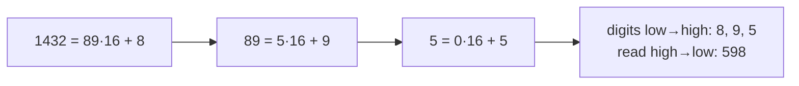

# Number base conversion

> [!abstract] In one sentence
> A numeral in base b is a polynomial in b: `dₖ…d₁d₀ = Σ dᵢ·bⁱ`. Converting **to** base b is repeated division (remainders give digits from the lowest up), converting **from** base b is Horner's rule, and bases that are powers of two convert into each other by **regrouping bits**. On real machines the same bits also carry a **width**, a **sign convention** (two's complement), and a **byte order** (endianness), which is where most base-related bugs in systems work actually come from.

## 1. Positional notation

`1432` in base 16: find digits dᵢ ∈ [0, 15] with `1432 = d₂·16² + d₁·16 + d₀`.

| Power | 16² = 256 | 16¹ = 16 | 16⁰ = 1 |
|---|---|---|---|
| Digit | 5 | 9 | 8 |
| Contribution | 1280 | 144 | 8 |

`1432 = 0x598 = 0o2630 = 0b101_1001_1000`. One value, four notations. The representation is unique once leading zeros are dropped.

A k-digit base-b numeral covers `0 … bᵏ − 1`, so writing n needs **⌊log_b n⌋ + 1 digits**: n = 1432 needs 11 bits, 3 hex digits, 4 decimal digits. Changing base changes the digit count by a constant factor (`log_b n = log₂ n / log₂ b`), which is why one hex digit always equals 4 bits.

## 2. Algorithms

### To base b: repeated division

`n = q·b + r` with `0 ≤ r < b`: the remainder r is the **last digit**, and q is the number formed by the other digits. Repeat on q.



```python
DIGITS = "0123456789ABCDEFGHIJKLMNOPQRSTUVWXYZ"

def to_base(n, base):
    if n == 0:
        return "0"
    sign = "-" if n < 0 else ""
    n = abs(n)
    out = []
    while n > 0:
        n, r = divmod(n, base)
        out.append(DIGITS[r])          # lowest digit first
    return sign + "".join(reversed(out))
```

Cost: one iteration per output digit, O(log_b n) divisions (on big integers each division costs more, but for machine-sized numbers it's constant).

My first converter (hex only, with the same loop) returned `''` for 0 and for negative numbers: `while x > 0` never runs. Its digit mapping `chr(r - 10 + ord('A'))` for r ≥ 10 is right; a lookup string is simpler and generalizes to any base up to 36.

### From base b: Horner's rule

Evaluate `((d₂·b + d₁)·b + d₀)` left to right: one multiply-add per digit, no powers.

```python
def from_base(s, base):
    value = 0
    for ch in s.upper():
        value = value * base + DIGITS.index(ch)
    return value
```

`"598"`, base 16: 0 → 5 → 5·16 + 9 = 89 → 89·16 + 8 = 1432. The intermediate values (5, 89) are the quotients of the division algorithm in reverse: the two algorithms are inverses step by step.

### Between powers of two: regrouping

b = 2ᵏ means one base-b digit is exactly k bits. Group bits from the **right** (least significant), pad the left with zeros:

```
1432 = 101 1001 1000 (binary)
groups of 4: 0101 1001 1000 → 5 9 8         = 0x598
groups of 3: 010 110 011 000 → 2 6 3 0      = 0o2630
```

No arithmetic at all, which is why hex is the standard way to display bytes: **1 byte = 8 bits = exactly 2 hex digits**, and every hex digit maps to a fixed 4-bit pattern (`A = 1010`, `F = 1111`).

### Fractions: repeated multiplication

For the fractional part, multiply by b: the integer part is the next digit **after** the point.

`0.625` to binary: 0.625·2 = **1**.25 → 0.25·2 = **0**.5 → 0.5·2 = **1**.0 → `0.101₂` (exact: ½ + ⅛).

`0.1` to binary: 0.2 → **0**, 0.4 → **0**, 0.8 → **0**, 1.6 → **1**, 1.2 → **1**, 0.4 → **0**, … → `0.0001100110011…₂`, repeating forever. A fraction terminates in base b only if its denominator's prime factors divide b: 1/10 = 1/(2·5) can't terminate in base 2. That's why floating point (IEEE 754 binary64) stores 0.1 **rounded**, and `0.1 + 0.2 == 0.30000000000000004`. Money and anything needing exact decimal fractions uses integers (cents) or decimal types.

## 3. Fixed width and negative numbers

Machine integers have a **width** (8, 16, 32, 64 bits). Unsigned n-bit values cover `0 … 2ⁿ − 1`. Arithmetic wraps **modulo 2ⁿ**: an 8-bit 255 + 1 is 0.

### Two's complement

Signed integers are stored so that the same adder works for signed and unsigned: the bit pattern of −x is `2ⁿ − x`. Equivalently, **invert all bits and add 1**. The top bit has weight **−2ⁿ⁻¹** instead of +2ⁿ⁻¹.

| 8-bit pattern | Unsigned | Two's complement |
|---|---|---|
| `00000101` | 5 | 5 |
| `11111011` | 251 | −5 (`~00000101 + 1`) |
| `01111111` | 127 | 127 (max) |
| `10000000` | 128 | **−128** (min, its own negation) |
| `11111111` | 255 | −1 |

Range of n-bit signed: `−2ⁿ⁻¹ … 2ⁿ⁻¹ − 1` (−128…127 for 8 bits). Consequences that bite:
- **Overflow**: `INT_MAX + 1` wraps to `INT_MIN` in C/Java (undefined behavior for signed ints in C); the classic `(lo + hi) / 2` overflow in binary search, fixed with `lo + (hi − lo) / 2`
- `abs(INT_MIN)` is still negative: −2ⁿ⁻¹ has no positive counterpart
- Reading the same bytes as signed vs unsigned gives different numbers (a 16-bit port `0xFFFF` is 65535 unsigned, −1 signed)

Python integers have **arbitrary precision** (no overflow), so to see a fixed-width pattern, mask it: `format(-5 & 0xFF, "08b")` → `'11111011'`. To interpret an 8-bit pattern as signed: `v - 256 if v >= 128 else v`.

### Bit operations as base-2 arithmetic

| Expression | Meaning |
|---|---|
| `x << k` | x · 2ᵏ |
| `x >> k` | ⌊x / 2ᵏ⌋ (arithmetic shift keeps the sign) |
| `x & (2ᵏ − 1)` | x mod 2ᵏ (the low k bits) |
| `x & (1 << k)` | Test bit k |
| `x \| (1 << k)`, `x & ~(1 << k)`, `x ^ (1 << k)` | Set, clear, toggle bit k |
| `x & (x − 1)` | Clear the lowest set bit (0 iff x is a power of two or 0) |
| `x & -x` | Isolate the lowest set bit |

These are the operations behind subnet math (`ip & mask` = network address, see [[IP addressing and subnetting]]), permission bits, flags, and bit-vector sets ([[Arrays and strings problems]]). Hash tables use `h & (m − 1)` as a fast `h mod m` for power-of-two sizes ([[Hash table]]).

## 4. Byte order (endianness)

A 32-bit integer occupies 4 bytes; the **order** they are stored or sent in is a convention:

| | Bytes of 1432 = 0x00000598 |
|---|---|
| **Big-endian** (most significant byte first) | `00 00 05 98` |
| **Little-endian** (least significant byte first) | `98 05 00 00` |

- x86 and most ARM systems are little-endian in memory
- **Network byte order is big-endian**: every multi-byte field in IP, TCP and UDP headers (ports, lengths, addresses) is sent most significant byte first ([[Network layers]]). Port 443 = `0x01BB` goes on the wire as `01 BB`; a little-endian host holds it as `BB 01` in memory. That's what `htons`/`ntohs` ("host to network short") convert
- Bugs: parsing a binary file or packet with the wrong byte order gives plausible-looking garbage (port 443 read as 47873)

In Python: `(1432).to_bytes(4, "big")` → `00 00 05 98`, `int.from_bytes(b, "little")`, and `struct.pack("!H", 443)` (`!` = network order).

## 5. Reading bases in systems work

| Where | Base | Example |
|---|---|---|
| IPv4 addresses and masks | Binary, shown as 4 decimal bytes | `255.255.255.192` = 26 one-bits = `/26` ([[IP addressing and subnetting]]) |
| IPv6 | Hex, 16-bit groups | `2001:db8::1` |
| MAC addresses | Hex bytes | `00:1a:2b:3c:4d:5e` ([[ARP]]) |
| Unix permissions | **Octal**: one digit = the 3 bits rwx | `chmod 754` = `111 101 100` = `rwxr-xr--` |
| Memory addresses, pointers | Hex | `0x7ffd5e2c` |
| Hashes, keys, certificates fingerprints | Hex (or base64) | SHA-256 = 64 hex digits = 32 bytes |
| Packet and file dumps | Hex + ASCII | `xxd`, `hexdump -C`, `tcpdump -X` |
| Colors | Hex bytes | `#FF8800` = R 255, G 136, B 0 |

Python built-ins: `hex(1432)` → `'0x598'`, `bin(5)` → `'0b101'`, `oct(493)` → `'0o755'`, `int("598", 16)` → 1432, `int("0b101", 0)` (prefix-detected) → 5, `f"{1432:x}"`, `f"{5:08b}"` → `'00000101'`, `bytes.fromhex("01bb")`.

## Practice

> [!example]- Convert 1432 to base 7.
> 1432 = 204·7 + 4, 204 = 29·7 + 1, 29 = 4·7 + 1, 4 = 0·7 + 4 → `4114₇`. Check: 4·343 + 1·49 + 1·7 + 4 = 1432.

> [!example]- What 8-bit pattern is −20 in two's complement?
> 20 = `00010100`. Invert: `11101011`. Add 1: `11101100` (= 236 unsigned = 256 − 20).

> [!example]- A packet capture shows a TCP destination port as bytes `1F 90`. Which port?
> Network order is big-endian: 0x1F90 = 31·256 + 144 = 8080.

> [!example]- Does 0.375 have an exact binary representation? 0.3?
> 0.375 = 3/8: yes, `0.011₂`. 0.3 = 3/10: no, the denominator has a factor 5.

> [!example]- Network address of `192.168.10.77/26`, by bits.
> /26 masks the last byte with `11000000` (192). 77 = `01001101` → AND → `01000000` = 64. Network `192.168.10.64`.

> [!example]- How many hex digits does a 128-bit IPv6 address have, and how many bits does `chmod 7` set?
> 128 / 4 = 32 hex digits (8 groups of 4). Octal 7 = `111`: read, write and execute.

## Related
- Systems:: [[IP addressing and subnetting]], [[ARP]], [[Network layers]] (byte order on the wire)
- Used in:: [[Arrays and strings problems]] (bit vectors), [[Hash table]] (masking as modulo)
- Next:: *[[Bit manipulation]]*
- Area:: [[Data structures and algorithms]]

## Flashcards
#flashcards

A base-b numeral as a formula? :: Σ dᵢ·bⁱ (a polynomial in b)
How many base-b digits does n need? :: ⌊log_b n⌋ + 1
Converting to base b? :: Repeated division: remainders are digits from the lowest up, then reverse
Converting from base b without powers? :: Horner's rule: value = value·b + digit, left to right
Why does one hex digit equal 4 bits? :: 16 = 2^4, so regrouping bits by 4 converts directly
Converting a fraction to base b? :: Repeatedly multiply by b; the integer parts are the digits after the point
When does a fraction terminate in base b? :: When its denominator's prime factors all divide b (1/10 doesn't terminate in binary)
Why is 0.1 + 0.2 ≠ 0.3 in floating point? :: 0.1 and 0.2 have infinite binary expansions and are stored rounded
Two's complement of −x in n bits? :: 2^n − x: invert the bits of x and add 1
Range of an n-bit signed integer? :: −2^(n−1) to 2^(n−1) − 1
8-bit two's complement of −1 and −128? :: 11111111 and 10000000
Why does abs(INT_MIN) overflow? :: −2^(n−1) has no positive counterpart in n bits
What does x & (2^k − 1) compute? :: x mod 2^k (the low k bits)
Big-endian vs little-endian? :: Most significant byte first vs least significant byte first
What byte order do network protocols use? :: Big-endian (network byte order)
What does htons do? :: Converts a 16-bit value from host to network (big-endian) byte order
Why are Unix permissions octal? :: One octal digit is exactly the 3 bits rwx
Python: show −5 as an 8-bit pattern? :: format(-5 & 0xFF, "08b") → 11111011
