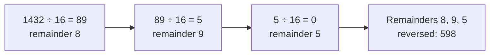

# Number base conversion

> [!abstract] In one sentence
> A number written in base **b** is a sum of digits times powers of b (`1432 = 5·16² + 9·16 + 8`, so `0x598`). To convert a number **to** base b, repeatedly divide by b and collect the **remainders**, which come out **last digit first**. To convert **from** base b, go left to right multiplying the running value by b and adding each digit. Bases 2, 8 and 16 convert into each other by **grouping bits**, which is why hex is everywhere in systems work.

## Common misconceptions

**Wrong mental model #1:** "Converting to hex changes the number."

**What's actually true:** the **value** is the same, only the **notation** changes. `1432`, `0x598`, `0b10110011000` and `0o2630` are one number written four ways. A computer stores it as bits either way. The base only matters when turning the number into text or reading it back.

**Wrong mental model #2:** "The first remainder is the first digit."

**What's actually true:** `x % b` gives the **lowest** digit (the units). Each division shifts to the next digit up. So the remainders come out **right to left**, and the list must be **reversed** (my converter does `hex_digits.reverse()`).

**Wrong mental model #3:** "Hex digits go 0–9 then 10, 11…"

**What's actually true:** each position holds **one** symbol, so values 10–15 need single symbols: `A`–`F`. My converter maps them with `chr(remainder - 10 + ord('A'))`: 10 → `A`, 15 → `F`.

## Build-up

### Stage 1: positional notation

In base 10, `1432 = 1·10³ + 4·10² + 3·10 + 2`. Base 16 works the same with powers of 16:

| Power of 16 | 16² = 256 | 16¹ = 16 | 16⁰ = 1 |
|---|---|---|---|
| Digit | 5 | 9 | 8 |
| Value | 1280 | 144 | 8 |

`1280 + 144 + 8 = 1432`, so `1432 = 0x598`.

### Stage 2: to base b (repeated division), my `convert_to_hex`



My version, made general and with the edge cases handled:

```python
DIGITS = "0123456789ABCDEFGHIJKLMNOPQRSTUVWXYZ"

def to_base(x, base):
    if x == 0:
        return "0"                     # loop below would return ""
    sign = "-" if x < 0 else ""
    x = abs(x)
    out = []
    while x > 0:
        out.append(DIGITS[x % base])   # lowest digit first
        x //= base
    return sign + "".join(reversed(out))
```

Running my original `convert_to_hex`: `1432 → '598'`, `255 → 'FF'`, but `0 → ''` and `-5 → ''` (the `while x > 0` loop never runs). Cost: one loop iteration per output digit, **O(log_b x)**.

### Stage 3: from base b (Horner's method)

Read the digits left to right: `value = value * b + digit`.

```python
def from_base(s, base):
    value = 0
    for ch in s.upper():
        value = value * base + DIGITS.index(ch)
    return value
```

`"598"` in base 16: `0 → 5 → 5·16 + 9 = 89 → 89·16 + 8 = 1432`. It's the division algorithm run backwards (89 and 5 appear in both).

### Stage 4: binary ↔ hex ↔ octal by grouping bits

16 = 2⁴, so **one hex digit = exactly 4 bits**. 8 = 2³, so **one octal digit = 3 bits**. No division needed: group the bits from the right.

```
1432 in binary:      101 1001 1000
groups of 4:        0101 1001 1000
hex:                   5    9    8      → 0x598

groups of 3:         10 110 011 000
octal:                2   6   3   0     → 0o2630
```

That's why hex is the standard way to **show bytes**: one byte = 8 bits = exactly 2 hex digits (`0x00`–`0xFF`), and reading hex back into bits is mechanical.

| Hex | Binary | Hex | Binary |
|---|---|---|---|
| 0 | 0000 | 8 | 1000 |
| 1 | 0001 | 9 | 1001 |
| 2 | 0010 | A | 1010 |
| 3 | 0011 | B | 1011 |
| 4 | 0100 | C | 1100 |
| 5 | 0101 | D | 1101 |
| 6 | 0110 | E | 1110 |
| 7 | 0111 | F | 1111 |

### Stage 5: where bases show up in systems work

| Where | Base | Example |
|---|---|---|
| IPv4 addresses and masks | Binary (written in decimal per byte) | `255.255.255.192` = `11111111.11111111.11111111.11000000` = `/26` ([[IP addressing and subnetting]]) |
| IPv6 addresses | Hex, 16 bits per group | `2001:db8::1` |
| MAC addresses | Hex, one byte per pair | `00:1a:2b:3c:4d:5e` ([[ARP]]) |
| Unix permissions | **Octal**, 3 bits per digit (read/write/execute) | `chmod 754` = `rwx r-x r--` = `111 101 100` |
| Memory addresses, hashes, colors, byte dumps | Hex | `0x7ffd5e2c`, SHA-256 digests, `#FF8800`, `xxd`, `tcpdump -X` |
| Bit flags and masks | Binary / hex | `flags & 0x02` checks bit 1 (see the bit vector in [[Arrays and strings problems]]) |

Python's built-ins: `hex(1432)` → `'0x598'`, `bin(5)` → `'0b101'`, `oct(493)` → `'0o755'`, `int('598', 16)` → `1432`, `f"{1432:x}"` → `'598'`, `f"{5:08b}"` → `'00000101'`.

## Practice

> [!example]- Convert 255 to binary and hex.
> 255 = 2⁸ − 1 = `11111111` = `0xFF`. All 8 bits of a byte set.

> [!example]- Convert `0x2F` to decimal.
> 2·16 + 15 = 47.

> [!example]- What does `chmod 640` give, and why octal?
> 6 = `110` = rw-, 4 = `100` = r--, 0 = `000` = ---: `rw-r-----`. Octal because each digit is exactly the 3 permission bits of one group (owner, group, others).

> [!example]- Convert 1432 to base 7 by repeated division.
> 1432 ÷ 7 = 204 r 4, 204 ÷ 7 = 29 r 1, 29 ÷ 7 = 4 r 1, 4 ÷ 7 = 0 r 4. Reversed: `4114`. Check: 4·343 + 1·49 + 1·7 + 4 = 1372 + 49 + 7 + 4 = 1432.

## Easy to get wrong
- Forgetting to reverse the remainders
- `x = 0` returns an empty string (handle it before the loop)
- Negative numbers (handle the sign separately)
- Grouping bits from the **left** instead of the right (pad on the left)
- Confusing the value with its representation: `0x10` is sixteen, not ten
- Hex digits A–F are case-insensitive when reading, but pick one case when writing

## Related
- Systems:: [[IP addressing and subnetting]] (binary masks), [[ARP]] (MAC addresses)
- Used in:: [[Arrays and strings problems]] (bit vectors), [[Hash table]] (hash values shown in hex)
- Next:: *[[Bit manipulation]]*
- Area:: [[Data structures and algorithms]]

## Flashcards
#flashcards

How to convert a number to base b? :: Divide by b repeatedly, collect the remainders, reverse them
Why reverse the remainders? :: x % b gives the lowest digit first
How to convert a base-b string to a number? :: Horner: value = value * b + digit, left to right
How many bits per hex digit? :: 4 (16 = 2^4)
How many bits per octal digit? :: 3 (8 = 2^3)
How many hex digits per byte? :: 2
1432 in hex? :: 0x598 (5·256 + 9·16 + 8)
255 in hex and binary? :: 0xFF, 11111111
Why are Unix permissions written in octal? :: Each octal digit is exactly 3 bits: read, write, execute
What does `chmod 754` mean? :: rwxr-xr-- (owner rwx, group r-x, others r--)
Python: parse "598" as hex? :: int("598", 16)
Edge case my hex converter misses? :: 0 returns an empty string (and negatives too)
