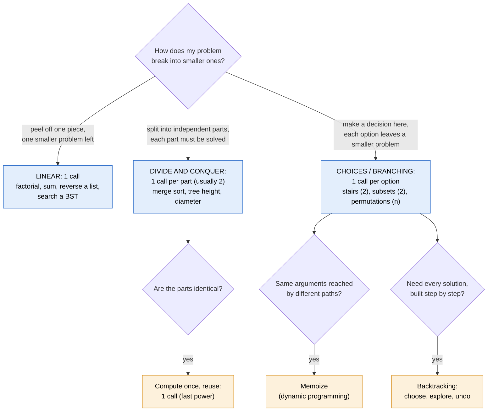
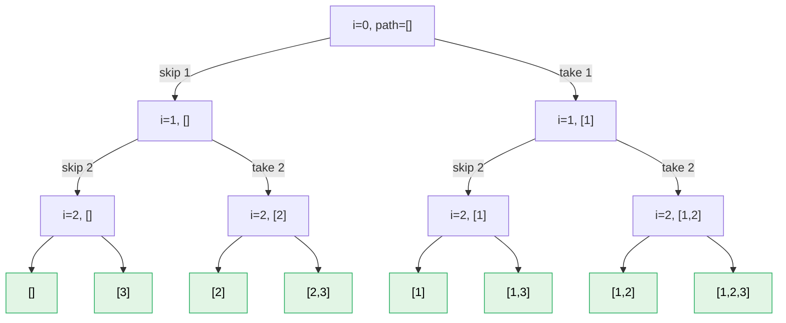

# Recursion

> [!abstract] In one sentence
> A recursive solution is a **recurrence**: the answer for an input is defined from the answers for **strictly smaller** inputs of the **same problem**, down to inputs small enough to answer directly. Solving a recursive problem is therefore not about tracing calls; it's about three design decisions: **what exactly the function returns** (and which parameters it needs), **how the problem decomposes into smaller subproblems** (which decides **how many recursive calls**), and **how their answers combine** (which depends on whether the question asks to count, decide, optimize or list).

## 1. The method

The 5 steps I use, made precise:

| # | Step | The question to answer | Output of the step |
|---|---|---|---|
| 1 | **Define the function** | "`f(params)` returns … for …" in one exact sentence. Which parameters are needed to describe a subproblem? | A signature + a contract |
| 2 | **Assume it works on smaller inputs** | What are the smaller instances of this same problem? | The list of subproblems |
| 3 | **Build the answer from them** | If I had every subproblem's answer, how do I get mine? | The recurrence (the `return` line) |
| 4 | **Base cases** | Which inputs can't be decomposed further? Does **every** call chain reach one? | The `if` lines at the top |
| 5 | **Simulate a small input** | Does `f` on size 0, 1, 2, 3 give the right result? | Confidence (or the bug) |

Write step 3 **before** step 4. The recurrence defines the solution; the base case is just where it stops, and it's usually obvious once the recurrence is written ("the smallest thing the recurrence can be called with").

### Why "assume it works" is legitimate

It's **strong induction**. If:
- the base cases return the right answer, and
- for every input, *assuming* `f` is correct on all strictly smaller inputs, the recurrence produces the right answer,

then `f` is correct on every input. So when designing, I only ever reason about **one level**: my input, its subproblems, the combination. Never trace the full call tree to design; trace only to **check** (step 5).

### Termination

Every recursive call must make a **measure** strictly decrease toward a base case: `n`, the list length, `len(nums) - i`, the subtree size, the remaining amount. If I can't name the measure, the function may not terminate. (Example: `ways(n)` calling `ways(n - 2)` needs a base case for `n < 0` too, or odd paths skip past 0 forever.)

## 2. Step 1 in depth: defining the function and its state

Most hard recursive problems are hard because of **step 1**, not step 3. The function must be defined so that the subproblems are **instances of the same function**.

### Choose parameters that describe "the rest of the problem"

Ask: *"After handling one piece, what do I need to know to solve what's left?"* Those are the parameters.

| Problem | Naive definition | Definition that recurses well |
|---|---|---|
| Sum of a list | `sum(xs)` with `xs[1:]` (copies: O(n²)) | `sum_from(xs, i)` = sum of `xs[i:]`, recursing on `i + 1` |
| Is this tree a BST? | `is_bst(node)` (can't check ancestors) | `is_bst(node, low, high)` = all keys in this subtree are in `(low, high)` |
| Root-to-leaf path with sum `t`? | `has_path(node)` | `has_path_sum(node, remaining)` |
| Generate valid parentheses | `parens(n)` | `go(path, opened, closed)`: what's built so far + the counts that constrain what's allowed next |

The pattern: a public function with the natural signature, and an **inner helper** with the extra state:

```python
def sum_list(xs):
    def sum_from(i):                 # sum of xs[i:]
        if i == len(xs):
            return 0
        return xs[i] + sum_from(i + 1)
    return sum_from(0)
```

### Information flows in two directions

| Direction | Mechanism | Carries | Example |
|---|---|---|---|
| **Down** (top-down) | Parameters | Context from ancestors: bounds, depth, remaining target, path so far | `is_bst(node, low, high)`, `has_path_sum(node, remaining)` |
| **Up** (bottom-up) | Return values | Results from subproblems: heights, sums, counts, sub-solutions | `height(node)`, `merge_sort(a)` |
| **Both + a side channel** | Return one thing, update a variable for another | When the answer at a node isn't the value its parent needs | Tree diameter (below): returns height, records the best diameter |

A common mistake is forcing everything through the return value when the parent needs something different from the final answer. Then: **return what the parent needs, record the answer on the side** (a `nonlocal` variable).

## 3. Step 2 in depth: how many recursive calls?

The number of calls is **not a style choice**. It's the number of **subproblems the current problem decomposes into**, and that comes from the structure of the problem. Three structures cover almost everything:



### 3a. One call: linear recursion

The input shrinks by one piece: `n → n - 1`, a list → its tail, a node → one child (BST search chooses **one** side, it never needs both).

**Reverse a linked list.** Step 1: `reverse(head)` returns the head of the reversed list starting at `head`. Step 2: one subproblem, the list after `head`. Step 3: `reverse(head.next)` returns the new head (the old last node), and `head.next` is now the **tail** of that reversed part, so hang `head` after it:

```python
def reverse(head):
    if head is None or head.next is None:    # 0 or 1 node: already reversed
        return head
    new_head = reverse(head.next)            # assume: rest is reversed
    head.next.next = head                    # old next (now the tail) points back to me
    head.next = None                         # I'm the new tail
    return new_head
```

### 3b. One call per part: divide and conquer

The problem is **made of** several independent parts, and the whole answer needs **all** of them: both halves of an array ([[Merge sort]]), both subtrees of a node. One call per part, then combine.

**Height of a binary tree.** Step 1: `height(node)` = number of nodes on the longest downward path from `node`. Subproblems: the two subtrees (both needed: the longest path could be on either side). Combine: the taller one, plus me.

```python
def height(node):
    if node is None:
        return 0
    return 1 + max(height(node.left), height(node.right))
```

**Diameter of a binary tree** (longest path between any two nodes, in edges): the classic case where the parent needs something different from the answer. The longest path through a node is `height(left) + height(right)`, but what the **parent** needs from me is my **height**. So: return height, record the best diameter on the side.

```python
def diameter(root):
    best = 0
    def height(node):
        nonlocal best
        if node is None:
            return 0
        l, r = height(node.left), height(node.right)
        best = max(best, l + r)            # longest path passing through this node
        return 1 + max(l, r)               # what my parent needs
    height(root)
    return best
```

One traversal, O(n). Calling a separate `height()` from every node instead would be O(n²).

**When the parts are identical, don't make two calls.** Computing xⁿ by splitting the exponent:

```python
def power_slow(x, n):                      # two calls on the same subproblem
    if n == 0: return 1
    if n == 1: return x
    return power_slow(x, n // 2) * power_slow(x, n - n // 2)

def power(x, n):                           # one call, result reused
    if n == 0: return 1
    half = power(x, n // 2)
    return half * half if n % 2 == 0 else half * half * x
```

For x⁶⁴: `power_slow` makes **127** calls (T(n) = 2T(n/2) + 1 → O(n)), `power` makes **8** (T(n) = T(n/2) + 1 → O(log n)). Rule: **one call per *different* subproblem**. Two calls on the same arguments is wasted work.

### 3c. One call per option: choices

At each step there's a **decision** to make, and each option leaves a smaller instance of the same problem. One call per option, then combine the options' answers. The decision to identify is usually "what happens to **this** element / at **this** step?"

**Climbing stairs** (steps of 1 or 2, how many ways to climb n?): the decision is the **first** move. Two options → two calls.

```python
def ways(n):
    if n < 0:  return 0          # overshot: not a way
    if n == 0: return 1          # exactly at the top: one way (do nothing more)
    return ways(n - 1) + ways(n - 2)
```

**Subsets** of `[1, 2, 3]`: the decision for element `i` is **include it or not**. Two options per element → two calls, depth n, 2ⁿ leaves (one per subset).



**Permutations**: the decision is "which unused element goes in the **next** position". The number of options is variable (n, then n − 1…), so the calls are in a **loop**: n calls at the top, n − 1 below each, n! leaves.

| Structure | Decision at each step | Calls per step | Leaves |
|---|---|---|---|
| Subsets | Take or skip element i | 2 | 2ⁿ |
| Permutations | Which unused element goes next | n − depth | n! |
| Combinations of size k | Take or skip, stop when k taken | 2 (pruned) | C(n, k) |
| Stairs / coin change | Which step/coin first | Number of step sizes / coins | Exponential without memo |

### 3d. The combine step depends on the question

The **same** branching structure answers different questions depending on how I combine the options:

| The question asks… | Combine with | Base cases return | Stairs example |
|---|---|---|---|
| **How many** ways? | `+` (sum) | 1 for a valid end, 0 for invalid | `ways(n-1) + ways(n-2)` |
| **Is there** a way? | `or` / `any` (short-circuits) | `True` / `False` | `can(n-1) or can(n-2)` |
| **Do all** satisfy? | `and` / `all` | `True` for empty | `is_bst(left, …) and is_bst(right, …)` |
| **Best** way (fewest, cheapest, longest)? | `min` / `max` (+ the cost of this step) | 0 at the goal, `inf` / `-inf` if impossible | `1 + min(coins(a - c) for c in coins)` |
| **List** all ways? | Collect / concatenate, or backtracking | `[[]]` (one empty solution) or append to output | Subsets, permutations |

Example of the "best" row, fewest coins to make an amount:

```python
from functools import cache
from math import inf

def min_coins(coins, amount):
    @cache
    def f(a):                                 # fewest coins summing to a
        if a == 0: return 0
        if a < 0:  return inf                 # impossible branch
        return 1 + min(f(a - c) for c in coins)
    result = f(amount)
    return -1 if result == inf else result
```

`min_coins([1, 5, 6, 9], 11)` → 2 (5 + 6). A greedy "take the biggest coin first" gives 9 + 1 + 1 = 3: trying **all** options at each step is exactly what recursion buys.

## 4. Step 4 in depth: base cases

- The base case is **the smallest input the recurrence can be called with**: look at the calls in step 3 and ask what they shrink to. `n - 1` and `n - 2` from `n ≥ 0` can reach `0` and `-1`
- **Empty** is usually the best base case: empty list, `None` node, `i == len(xs)`, amount `0`. It removes special cases for size 1 and makes leaves work automatically (`height(None) = 0` handles leaves with no extra code)
- Distinguish **success** and **failure** ends in branching problems (`n == 0` → 1 way, `n < 0` → 0 ways)
- The base value must be the **identity** of the combine: 0 for sums, 1 for products, `True` for `and`, `False` for `or`, `[[]]` for "list of solutions" (one empty solution, not zero solutions)

## 5. Cost: read it off the recursion tree

Draw the tree of calls for a generic input: **depth d**, **branching factor b** (calls per node), **work per call** w.

| Pattern | Recurrence | Cost | Examples |
|---|---|---|---|
| Linear, O(1) work | T(n) = T(n−1) + O(1) | O(n) time, O(n) stack | Factorial, list sum, reverse list |
| Halving, one call | T(n) = T(n/2) + O(1) | O(log n) | Binary search, fast power |
| Halving, two calls, linear combine | T(n) = 2T(n/2) + O(n) | O(n log n) | [[Merge sort]] |
| Every node of a tree once | T = Σ O(1) per node | O(n) | Height, diameter, traversals ([[Depth-first search]]) |
| Two calls, shrink by 1 | T(n) = T(n−1) + T(n−2) + O(1) | O(φⁿ) ≈ O(1.618ⁿ) | Naive Fibonacci, naive stairs |
| Two choices per element | T(n) = 2T(n−1) + O(1) | O(2ⁿ) | Subsets |
| n − depth choices | T(n) = n·T(n−1) | O(n!) | Permutations |

Two numbers to compute every time:
- **Time** ≈ number of nodes in the tree × work per node. For branching recursion, nodes ≈ bᵈ
- **Stack space** = **depth** of the tree (only one path is on the stack at a time), not the number of nodes. Subsets has 2ⁿ calls but only n frames at once

### Overlapping subproblems → memoization

When different branches call `f` with the **same arguments**, the tree recomputes them. Naive `ways(5)` computes `ways(3)` twice and `ways(2)` three times. Test: *can two different paths of decisions lead to the same remaining problem?* For stairs, "1 then 2" and "2 then 1" both leave `n - 3`: yes.

Then memoize: cache results by arguments. The cost becomes **number of distinct argument values × work per call**:

```python
@cache
def ways(n):
    if n < 0:  return 0
    if n == 0: return 1
    return ways(n - 1) + ways(n - 2)    # now O(n): n distinct values of n
```

This only works if the function is **pure** in its arguments (the result depends only on them). A function that reads a mutable `path` can't be memoized. That's the line between **dynamic programming** (overlapping subproblems, memoize) and **backtracking** (enumerate everything, no overlap to exploit). More in *[[Dynamic programming]]*.

## 6. Backtracking: building solutions with shared state

When the question is "list every valid X" and solutions are built step by step, carrying copies of partial solutions down every branch is wasteful. Backtracking uses **one** mutable partial solution: **choose** (modify it), **explore** (recurse), **undo** (restore it) so the next option starts from the same state.

```python
def subsets(nums):
    out = []
    def go(i, path):                 # decide nums[i:], path = choices so far
        if i == len(nums):
            out.append(path[:])      # copy: path will keep changing
            return
        go(i + 1, path)              # option 1: skip nums[i]
        path.append(nums[i])         # option 2: take nums[i]  (choose)
        go(i + 1, path)              #                          (explore)
        path.pop()                   #                          (undo)
    go(0, [])
    return out
```

**Pruning** cuts branches that can't lead to a valid solution **before** exploring them. Generate all valid strings of n pairs of parentheses: the state is what's built and how many `(` and `)` are used. A `(` is allowed while `opened < n`, a `)` only while `closed < opened`. Invalid strings are never built, instead of generating all 2²ⁿ strings and filtering.

```python
def parens(n):
    out = []
    def go(path, opened, closed):
        if len(path) == 2 * n:
            out.append("".join(path))
            return
        if opened < n:
            path.append("("); go(path, opened + 1, closed); path.pop()
        if closed < opened:
            path.append(")"); go(path, opened, closed + 1); path.pop()
    go([], 0, 0)
    return out
```

`parens(3)` → `((()))`, `(()())`, `(())()`, `()(())`, `()()()`.

Permutations are the same skeleton with a `used` array and a loop over the options. Sudoku, n-queens, word search and combination sums are all this skeleton with different choices, constraints and goals.

## 7. Worked example, start to finish: does a root-to-leaf path sum to a target?

1. **Define**: `has_path_sum(node, remaining)` returns True if some path from `node` down to a **leaf** has keys summing to `remaining`. The parameter `remaining` carries information **down** (what the path still needs)
2. **Subproblems**: the path continues into the left or the right subtree, with `remaining - node.key`. It's a **choice** (one path), not divide and conquer (both)
3. **Combine**: question "is there one?" → `or`
4. **Base cases**: `None` → False (no path here). A **leaf** → does its key equal `remaining`? (Testing at `None` instead would accept paths that stop at a node with one child, which aren't root-to-leaf)
5. **Simulate** on the tree `4 → (2 → 1, 3), (6 → 5, 7)` with target 7: 4 needs 3 more → node 2 needs 1 → leaf 1 equals 1 → True

```python
def has_path_sum(node, remaining):
    if node is None:
        return False
    if node.left is None and node.right is None:
        return node.key == remaining
    rest = remaining - node.key
    return has_path_sum(node.left, rest) or has_path_sum(node.right, rest)
```

Cost: each node visited at most once, O(n). Stack: tree height.

## 8. Debugging recursive code

**Trace with indentation** to see the call tree:

```python
def trace(f):
    depth = 0
    def wrapper(*args):
        nonlocal depth
        print("  " * depth + f"{f.__name__}{args}")
        depth += 1
        result = f(*args)
        depth -= 1
        print("  " * depth + f"-> {result}")
        return result
    return wrapper

@trace
def fact(n):
    return 1 if n == 0 else n * fact(n - 1)
```

```
fact(3,)
  fact(2,)
    fact(1,)
      fact(0,)
      -> 1
    -> 1
  -> 2
-> 6
```

| Symptom | Cause | Fix |
|---|---|---|
| `RecursionError: maximum recursion depth exceeded` | A base case is never reached (the measure doesn't decrease, or skips past the base: `n - 2` from odd n), or real depth > ~1000 | Name the decreasing measure, add the "overshoot" base case (`n < 0`). For deep inputs, iterate (below) |
| Returns `None` sometimes | A branch calls itself without `return` | Every path returns: `return self._search(node.left, key)` |
| Off by one everywhere | Base value isn't the combine's identity (`[]` instead of `[[]]`, 1 instead of 0) | Check the base case against the smallest real input by hand |
| Answer counted twice | Two decision paths describe the same solution (e.g. coin combinations `1+2` and `2+1` when order shouldn't matter) | Impose an order on choices (only use coins ≥ the last one: pass an index) |
| Exponential slowness | Overlapping subproblems | Memoize (pure function of its arguments) |
| Backtracking results all empty or identical | Saved `path` (a reference) instead of `path[:]` | Copy when saving |
| State leaks between branches | Forgot the undo, or a mutable default argument `def f(x, acc=[])` | Undo after each choice. `acc=None` defaults |
| O(n²) where O(n) was expected | Slicing (`xs[1:]`) or list concatenation at each level | Pass indexes, append to one output list |

## 9. From recursion to iteration

Every recursive function can run with an **explicit stack**, which is what the call stack was doing. Python's limit (~1000 frames, no tail-call optimization) makes this necessary for deep inputs (long lists, degenerate trees, big graphs).
- **Linear tail-shaped** recursion (the recursive call is the last thing, nothing to combine after) → a plain loop with variables
- **Tree recursion with combine after** → stack of frames, or reorder the work (post-order needs a "visited children" marker). See the iterative version in [[Depth-first search]]
- **Memoized recursion** → a bottom-up table filled in order of increasing size (dynamic programming), no recursion at all

## Practice

> [!example]- Count the nodes of a binary tree. Which structure, how many calls, what combine?
> Divide and conquer: the count needs both subtrees. Two calls, combine with `+`: `count(node) = 0 if node is None else 1 + count(node.left) + count(node.right)`. O(n).

> [!example]- Is a value present in a binary search tree? How many calls?
> One. The BST property tells me which side it must be on, so only one subproblem exists. A plain binary tree (no ordering) needs both sides with `or`.

> [!example]- Number of ways to climb n stairs with steps of 1, 2 or 3. Calls, combine, base cases, cost with and without memo?
> Three calls (first move), combine with `+`, base `n == 0 → 1`, `n < 0 → 0`. Without memo about O(1.84ⁿ); with memo O(n).

> [!example]- All combinations of k elements from n. What's the decision, and where do I prune?
> Take or skip element i (2 calls). Stop with a solution when k are taken. Prune when the elements left can't fill the remaining slots (`len(nums) - i < k - len(path)`).

> [!example]- Count the ways to make 4 with coins [1, 2] where order doesn't matter (1+1+2 = 2+1+1). Why does `ways(a) = Σ ways(a - c)` overcount, and what's the fix?
> It counts ordered sequences (1+1+2, 1+2+1, 2+1+1 separately). Add an index parameter: `ways(a, i)` = ways using coins from index i on, with two choices: use coin i again (`ways(a - coins[i], i)`) or move past it (`ways(a, i + 1)`). Answer: 3 (1+1+1+1, 1+1+2, 2+2).

> [!example]- `x^n` with `power(x, n//2) * power(x, n//2)`: what's wrong?
> Two calls on the same subproblem: T(n) = 2T(n/2) + 1 = O(n). Compute `half` once and square it: O(log n).

> [!example]- Longest path between any two nodes in a tree: why doesn't returning the diameter from each subtree work on its own?
> The parent needs the subtrees' heights to compute the path through itself, not their diameters. Return the height, track the best `left + right` in a side variable.

## Easy to get wrong
- Starting from the base case, or tracing the whole call tree, instead of defining `f` and trusting the smaller calls
- A function definition too weak to recurse on (missing the parameters that carry state: index, bounds, remaining target)
- Two calls where the parts are identical (compute once and reuse)
- Two calls where only one subproblem exists (BST search)
- Choosing the combine by habit instead of by question type (count `+`, exists `or`, best `min/max`, list collect)
- Base values that aren't the combine's identity
- Missing the "overshoot" base case in branching recursion (`n < 0`)
- Not noticing overlapping subproblems, or memoizing a function that depends on mutable state
- Counting the same solution twice through different decision orders
- Forgetting that stack depth, not call count, is the memory cost

## Related
- Applied in:: [[Binary search tree]] (insert/search/delete), [[Depth-first search]] (traversals), [[Merge sort]] (divide and conquer), [[Linked list]] (recursive reversal)
- Next:: *[[Backtracking]]*, *[[Dynamic programming]]*
- Cost analysis:: *[[Big-O notation]]*
- Where the frames live:: [[Stack and heap]] (stack frames, the 8 MiB limit, why deep recursion overflows)
- Area:: [[Data structures and algorithms]]

## Flashcards
#flashcards

What three design decisions solve a recursive problem? :: What the function returns (and its parameters), how the problem decomposes (number of calls), how the sub-answers combine
Why is "assume it works for smaller inputs" valid? :: Strong induction: correct base cases + correct recurrence given smaller correct answers ⇒ correct for all inputs
What guarantees a recursive function terminates? :: A measure that strictly decreases on every call and reaches a base case
How do I choose the parameters of a recursive function? :: Ask what I need to know to solve the rest of the problem after handling one piece (index, bounds, remaining target, path)
Top-down vs bottom-up information in recursion? :: Down through parameters (bounds, remaining, depth), up through return values (heights, sums, sub-results)
What to do when the parent needs something different from the final answer? :: Return what the parent needs, record the answer in a side variable (e.g. diameter: return height, track best)
When is recursion linear (one call)? :: When the problem shrinks to exactly one smaller problem (peel one piece, BST search)
When does recursion make one call per part? :: Divide and conquer: the answer needs all independent parts (both halves, both subtrees)
When does recursion make one call per option? :: When there's a decision at each step and each option leaves a smaller problem (stairs, subsets, permutations)
Why does fast power make one call, not two? :: The two halves are the same subproblem: compute once, square. O(log n) instead of O(n)
Combine for "how many ways"? :: Sum (+), base 1 for a valid end, 0 for invalid
Combine for "is there a way"? :: or / any
Combine for "best way"? :: min/max plus the step's cost, inf for impossible branches
Combine for "list all ways"? :: Collect solutions (or backtracking with a shared path)
What should a base case return? :: The identity of the combine (0 for +, 1 for ×, True for and, False for or, [[]] for lists of solutions)
How to estimate recursive time from the tree? :: Number of nodes (≈ branching^depth) × work per call
What is the stack space of a recursive function? :: Its maximum depth, not its number of calls
T(n) = 2T(n/2) + O(n)? :: O(n log n) (merge sort)
T(n) = T(n/2) + O(1)? :: O(log n) (binary search, fast power)
T(n) = 2T(n−1) + O(1)? :: O(2^n) (subsets)
How to detect overlapping subproblems? :: Different decision paths lead to the same arguments
Cost after memoization? :: Number of distinct argument values × work per call
When can't a function be memoized? :: When its result depends on mutable state, not only its arguments
Backtracking pattern? :: Choose (modify shared state), explore (recurse), undo (restore)
What is pruning? :: Not exploring branches that can't lead to a valid solution
How to avoid counting the same combination twice? :: Impose an order on choices, e.g. an index so items are only chosen from i onwards
Why make "empty" the base case? :: It removes size-1 special cases (height(None) = 0 handles leaves automatically)
