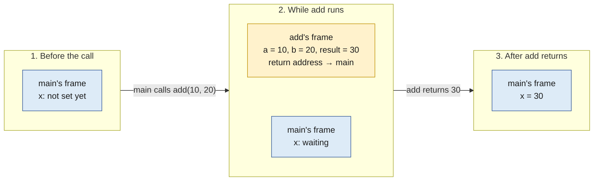
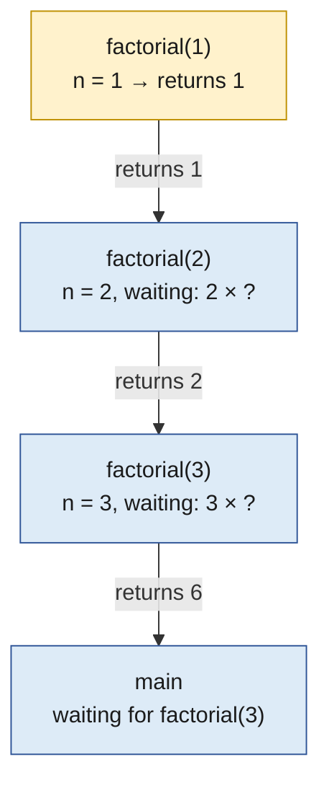
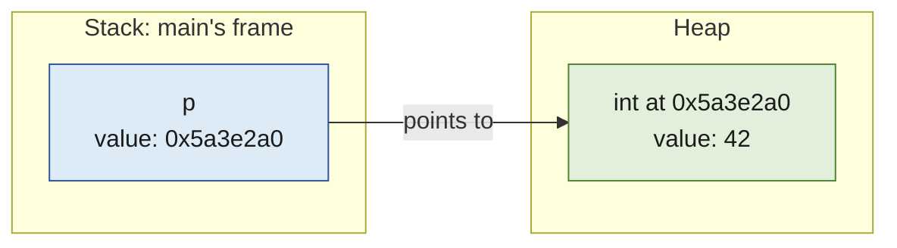

# Stack and heap

> [!abstract] In one sentence
> The stack holds the state of function calls and is reclaimed automatically when each call returns, in last-in first-out order; the heap holds objects whose lifetime the program chooses, from allocation until they're freed or collected. Where a declaration puts a value follows from the lifetime it needs, and the compiler, runtime and allocator decide the actual storage.

## The plan of this note

Every value in a running program needs storage for as long as it's in use. The whole stack/heap question comes down to one idea: **how long a value must live decides where it can live.**
1. **Three different questions** hide behind "where is my variable?": its lifetime, its virtual address, its physical RAM (random-access memory). This note is about the first one
2. **Why a stack**: function calls nest and finish in reverse order, so their storage can be a stack
3. **Recursion** makes that concrete: one function, many live calls, one frame each. And the stack's size limit
4. **Why a heap**: some values must outlive the call that created them, which a stack can't do
5. **Lifetimes in practice**: what survives a `return` and what doesn't
6. **What each declaration does**: a table of C declarations and where they go
7. **What each costs**: why the stack is fast and the heap flexible
8. **Other languages**: Python, Java and Go answer the same question differently
9. **The bugs** that come from getting lifetimes wrong

C comes first because it shows everything explicitly; the other languages come at the end. The view from the operating system (regions, pages, `malloc` talking to the kernel) is in [[Program memory layout]].

## Step 1: three questions behind "where is my variable?"

```c
int main(void) {
    int x = 42;
    return 0;
}
```

"`x` is on the stack" is a good first answer, but it mixes up three separate questions:

| Question | Who answers it | For `x` |
|---|---|---|
| **How long must it live?** (its *lifetime*) | The language rules, from the declaration | Until `main` returns: it's an **automatic** local variable |
| **Which virtual address does it have, if any?** | The compiler (and allocator, for dynamic memory) | A slot in `main`'s stack frame, **if** it needs to be in memory at all |
| **Which physical RAM holds that address?** | The kernel and the MMU (memory management unit) | Whatever frame backs that stack page ([[Virtual memory]]) |

The middle answer has an "if": the compiler may keep `x` in a CPU (central processing unit) register and never give it an address, or remove it altogether because its value is never used. With optimization on (`gcc -O2`), this `main` compiles to just "return 0". Taking the address (`&x`) forces it into memory, and then it typically goes in the stack frame.

So the accurate statement is: **`x` has automatic lifetime, and the stack is the usual way to implement that when it needs memory.** C calls these lifetimes **storage durations**, and there are three main ones:

| Storage duration | Declared as | Lives | Usually stored in |
|---|---|---|---|
| **Automatic** | a local variable or parameter | from entering its block until leaving it | the stack (or registers) |
| **Static** | a global, or a local marked `static` | the whole run of the program | the data or BSS (block started by symbol) region |
| **Allocated** | memory from `malloc` | from `malloc` until `free` | the heap |

The rest of the note is about the first and the last, and why both are needed.

## Step 2: why function calls use a stack

Take a call:

```c
int add(int a, int b) {
    int result = a + b;
    return result;
}

int main(void) {
    int x = add(10, 20);
    return x;
}
```

While `add` runs, `main` is paused in the middle of a statement: it needs its own state (`x`, where it was) kept intact, and `add` needs storage for `a`, `b` and `result`. When `add` returns, its storage is no longer needed, but `main`'s is. And that pattern holds for any program: **the call that started last always finishes first**. `main` calls `f`, `f` calls `g`: `g` returns before `f`, which returns before `main`.

Storage that's always freed in the reverse order it was taken is exactly a **stack**, LIFO (last in, first out): push on call, pop on return. Each call's piece of the stack is its **stack frame**, holding some combination of:
- its local variables that need memory
- its arguments, or copies of them (on x86-64 the first six are passed in registers)
- the **return address**: where to continue in the caller
- saved registers and temporary values



*The newest frame is drawn on top. In memory, x86-64 stacks grow towards lower addresses.*

**Why the stack is so fast.** The CPU keeps the address of the top of the stack in a register, the **stack pointer** (`rsp` on x86-64). Making room for a whole frame is one instruction, "subtract 32 from the stack pointer"; freeing it on return is "add 32". No searching for free space, no bookkeeping, nothing to free by hand, and the top of the stack is almost always in the CPU cache because it was just used.

**What "freed" means.** Returning doesn't erase anything: the bytes of `add`'s frame still hold `30` until the next call reuses that space. But `result` no longer exists as a variable, and reading it through a leftover pointer is undefined behavior (Step 9).

## Step 3: recursion, one frame per live call

```c
int factorial(int n) {
    if (n <= 1)
        return 1;
    return n * factorial(n - 1);
}
```

`factorial(3)` runs the same code three times, and the three calls are alive **at the same time**: `factorial(3)` can't finish its multiplication until `factorial(2)` returns, which waits for `factorial(1)`. Each needs its own `n` and its own unfinished multiplication, so each gets its own frame:



The deepest call returns first, then the one below continues, and so on: LIFO again. [[Recursion]] is built on exactly this, and its "call stack" is this stack.

**The stack has a size limit.** The main thread's stack can grow to `ulimit -s`, **8 MiB** (mebibytes, 8 × 1,048,576 bytes) by default on Linux; other threads get a fixed size when they start ([[Program memory layout]]). Going past it crashes the program with a segmentation fault: a **stack overflow**. What that limit means in practice:
- **Recursion depth.** If a frame of `factorial` takes 32 bytes, 8 MiB holds 8,388,608 / 32 = 262,144 nested calls. A function with a few local variables and saved registers might use 100 bytes or more, so the limit is tens of thousands of levels, not millions. Recursing over a linked list of a million nodes overflows
- **Big local arrays.** `int a[1000000];` inside a function is 4,000,000 bytes, about 3.8 MiB: almost half of the whole stack, in one frame. Two nested calls to such a function overflow, and on a thread with a 128 KiB (kibibyte) stack, one call does

Compilers can remove frames (inlining a small function into its caller, or turning a call in tail position into a jump), and arguments often stay in registers. So frames are the model, not a promise that every local gets its own memory slot.

## Step 4: why a heap

The stack can only do one thing: free storage when the call that took it returns. Some values don't fit that:
- **A value that must outlive its function.** A function that builds a list and returns it: if the list lived in the function's frame, it would be dead by the time the caller sees it
- **A size known only at run time, possibly large.** A buffer for a file whose size the program reads at run time; an array that grows as items arrive
- **Data shared between threads or structures** whose lifetime isn't tied to any one call: a cache, the nodes of a tree, a queue between threads

For those, the program needs storage it can take at any moment and give back at any moment, in any order. That's the **heap**: a region managed by an **allocator** (`malloc` and `free` in C), which hands out blocks on request and takes them back when told. Its price is that someone has to decide when each block is given back.

```c
#include <stdlib.h>

int main(void) {
    int *p = malloc(sizeof(int));
    *p = 42;
    free(p);
    return 0;
}
```

There are **two** things here, in two places:
- `p` is a local variable of `main` (automatic lifetime, on the stack). Its value is an address
- the `int` that `malloc` returned is a heap block (allocated lifetime). `p` holds its address



*Addresses are illustrative.*

**A pointer's location and its target's location are independent.** A stack variable can point into the heap (as here), a heap object can point to another heap object (a linked list node to the next one), a global can point into the heap. "Is it on the stack or the heap?" has to be asked separately about the pointer and about what it points to.

After `free(p)`, the block goes back to the allocator for reuse, but `p` itself still exists until `main` returns, and still holds the old address. It's now a **dangling pointer**: using `*p` is undefined behavior. Setting `p = NULL` after `free` makes accidental use crash cleanly instead.

## Step 5: what survives a return

```c
int *bad(void) {
    int x = 42;
    return &x; /* x dies here: the caller gets a dangling pointer */
}

int *good(void) {
    int *p = malloc(sizeof(int));
    if (p != NULL)
        *p = 42;
    return p;             /* p dies here, but the heap block it points to lives on */
}

int main(void) {
    int *q = good();
    if (q != NULL) {
        printf("%d\n", *q);
        free(q);          /* the caller now owns the block, so the caller frees it */
    }
    return 0;
}
```

- In `bad`, `x` is automatic: its lifetime ends at the `return`, so the address handed back points into a frame that the next call will overwrite. GCC (the GNU Compiler Collection, GNU standing for "GNU's Not Unix") warns `function returns address of local variable`, and recent versions may even replace the returned address with `NULL` so that the bug crashes at once instead of reading stale data
- In `good`, `p` dies at the `return` too, but `p` was only the pointer. The heap block isn't tied to any call: it stays until someone calls `free`. The caller receives the address and with it the responsibility of freeing it. That responsibility is called **ownership**, and in C it lives only in comments and conventions ("the caller must free the result")

A `return` ends the automatic lifetimes of that call. It doesn't touch anything allocated.

## Step 6: what each declaration does

| Declaration | Lifetime | Typical storage | Note |
|---|---|---|---|
| `int x = 5;` in a function | automatic | stack, or a register | gone when the block ends |
| `static int x = 5;` in a function | static | data region | one copy shared by all calls, keeps its value between calls |
| `int x = 5;` at file level (global) | static | data region | visible to the whole program |
| `int zeros[1000];` at file level | static | BSS | all zeros, takes no space in the executable file |
| `int a[100];` in a function | automatic | stack | 400 bytes in the frame, or optimized away |
| `int a[1000000];` in a function | automatic | stack | about 3.8 MiB in one frame: risky (Step 3) |
| `int *p = malloc(1000000 * sizeof(int));` | `p`: automatic, block: allocated | `p` on the stack, block on the heap (its own mapping, at this size) | must be freed |
| `char s[] = "hi";` in a function | automatic | stack | a **writable copy** of the 3 bytes `h`, `i`, `\0` |
| `char *s = "hi";` in a function | `s`: automatic, the text: static | `s` on the stack, `"hi"` in read-only data | writing `s[0] = 'H'` crashes |

The last two lines look almost the same and behave differently: the array declaration copies the text into the frame, the pointer declaration points at a constant that lives for the whole program in a read-only page.

These are the usual implementations, not guarantees about placement: optimization changes where values live. The lifetime rules are what the language guarantees; "stack" and "heap" are how compilers and libraries meet them.

## Step 7: what each costs

| | Stack | Heap |
|---|---|---|
| **Allocate** | One instruction: move the stack pointer | Allocator call: find a free block of the right size, maybe ask the kernel for more |
| **Free** | Automatic and free of cost, on return | Explicit (`free`) or by a garbage collector; takes work |
| **Lifetime** | Tied to the call, strictly LIFO | Any order, as long as the program likes |
| **Size** | Small and fixed per thread (8 MiB main thread, often less for others) | Limited by the address space and RAM |
| **Threads** | Each thread has its own stack: no sharing, no locking | One heap shared by all threads: the allocator needs locks or per-thread pools |
| **Fragmentation** | None: always one contiguous top | Freed blocks leave holes between live ones |
| **Cache** | The top of the stack is almost always in the CPU cache | Blocks can be anywhere, scattered |
| **Typical bugs** | Returning addresses of locals, stack overflow, overflowing a local buffer | Leaks, use after free, double free, overflowing a heap block |

Rule of thumb in C: put a value on the stack when it's small and dies with the function; use the heap when it must outlive the function, is large, or has a size known only at run time.

## Step 8: other languages

The same question, "how long must this value live?", exists in every language. What changes is who answers it.

**Python.** Every object (an `int`, a list, an instance) is a heap object. A function's local variables are names in its frame that hold **references** to objects:

```python
def make():
    data = [1, 2, 3]   # the list is a heap object; "data" is a name in make's frame
    return data        # the frame ends, the list lives on: lst still refers to it

lst = make()
```

There's no `free`: CPython counts the references to each object and frees it when the count drops to zero (plus a cycle collector for objects that refer to each other). Python frames are themselves heap objects, and Python still caps the depth: `sys.getrecursionlimit()` is **1000** by default, and going deeper raises `RecursionError`. The limit protects the interpreter: before Python 3.11 every Python call also used the C stack of the interpreter itself, so a runaway recursion would have crashed the whole process instead of raising an error. That's the limit [[Recursion]] works around with an explicit stack.

**Java.** Local variables of primitive types (`int`, `double`) and **references** live in the method's frame; objects created with `new` are on the heap, freed by the garbage collector when nothing references them:

```java
Person p = new Person();   // p (a reference) in the frame, the Person object on the heap
```

A deep recursion throws `StackOverflowError`; the thread stack size is set with `-Xss`. The JVM (Java virtual machine) can also do **escape analysis**: if an object provably never leaves the method, the JIT (just-in-time) compiler may skip the heap allocation entirely and keep its fields in registers or the frame.

**Go.** The compiler decides with escape analysis, and the program never says "heap":

```go
func newCounter() *int {
    x := 0
    return &x      // legal in Go: x escapes, so the compiler puts it on the heap
}
```

`go build -gcflags=-m` prints the decision: `moved to heap: x`. The C bug of Step 5 is impossible here because the compiler gives `x` heap lifetime when it sees the address escape, and the garbage collector frees it later.

In all three, source-level objects and their storage aren't one-to-one: the language guarantees lifetimes, and the implementation picks the storage.

> [!warning] The heap is not the heap data structure
> "Heap" memory has nothing to do with the *[[Heaps|heap]]* data structure (the tree behind priority queues). The memory meaning is just "a pile of memory to take blocks from", and the two names are a coincidence. The stack, on the other hand, really is a stack in the data-structure sense: LIFO push and pop (*[[Stacks and queues]]*).

## Step 9: the bugs that come from lifetimes

| Bug | What happens | Symptom | Caught by |
|---|---|---|---|
| **Returning the address of a local** | Pointer into a frame that's been reused | Garbage values that change after other calls, or a crash | Compiler warnings |
| **Use after free** | Reading or writing a block the allocator gave to someone else | Corrupted data elsewhere, crashes later, security holes | AddressSanitizer (`-fsanitize=address`), Valgrind |
| **Double free** | Freeing the same block twice corrupts the allocator's lists | `free(): double free detected` abort | glibc checks, AddressSanitizer |
| **Leak** | A block is never freed and nothing points to it any more | Memory grows steadily under load | LeakSanitizer, Valgrind, heap profilers |
| **Stack overflow** | Too deep recursion or too big local arrays | Segmentation fault, often with a huge stack trace | Crash dumps; fix with iteration or the heap |
| **Stack buffer overflow** | Writing past a local array overwrites the frame, including the return address | `*** stack smashing detected ***`, or an exploitable hole | Stack canaries (a guard value checked before return), AddressSanitizer |

The last one shows why frames matter for security: the return address sits in the frame next to local arrays, so a write past the end of `char buf[16]` can change where the function returns to. Compilers place a random **canary** value between the locals and the return address and check it before returning; that check produces the "stack smashing" message.

## In real systems

- **Servers with a thread per connection** reserve one stack per thread: 1,000 connections × 8 MiB = 8 GiB (gibibytes) of stack addresses. Only touched pages use RAM, but it's why such servers set smaller thread stacks, and why event loops (one stack, many connections) scale further ([[Processes and threads]])
- **Databases manage their own heap.** PostgreSQL allocates per-query memory in *memory contexts* on top of `malloc`, and frees a whole context at once when the query ends: a heap with stack-like lifetimes, so nothing leaks between queries ([[PostgreSQL architecture]])
- **Garbage-collected services** (Java, Go) are sized mostly by their heap: `-Xmx` for the JVM, `GOMEMLIMIT` for Go. Stack overflows show up as `StackOverflowError` or `goroutine stack exceeds` in logs, almost always from unbounded recursion
- **Containers** limit the whole process's memory: heap, stacks and everything else count against the same cgroup (control group) limit ([[Program memory layout]], [[Virtual memory]])

## Practice

> [!example]- When `create()` returns, what happens to `x` and to the allocated integer?
> ```c
> int *create(void) {
>     int x = 10;
>     int *p = malloc(sizeof(int));
>     *p = x;
>     return p;
> }
> ```
> `x` (and `p` itself) are automatic: their lifetime ends at the return. The allocated `int` is on the heap and survives, holding 10; the caller gets its address and must free it. The kernel doesn't unmap anything: the stack page stays, only the frame is popped.

> [!example]- `char a[] = "hi"; a[0] = 'H';` works, `char *b = "hi"; b[0] = 'H';` crashes. Why?
> `a` is an array in the frame, initialized with a copy of the text: it's writable. `b` is a pointer to the string constant, which is in a read-only page; writing to it faults (`SIGSEGV`, the segmentation fault signal).

> [!example]- A recursive function has 64-byte frames. Roughly how deep can it go on an 8 MiB stack? And in Python?
> 8 MiB / 64 bytes = 8,388,608 / 64 = 131,072 calls (a bit less: the stack also holds `main` and library frames). Python stops at its recursion limit, 1000 by default, with `RecursionError`.

> [!example]- In Go, `func f() *int { x := 1; return &x }` is correct; in C the same thing is a bug. Why?
> Go's compiler sees that `x`'s address escapes the function and allocates it on the heap, where the garbage collector keeps it alive. C always gives a local automatic lifetime, whatever happens to its address.

> [!example]- A function takes a `size_t n` from user input and declares `int buf[n];` (a variable-length array). What's the risk?
> A large `n` makes one frame bigger than the stack: an instant stack overflow, and with a large enough `n`, the stack pointer can jump past the guard gap into other memory. Use `malloc` for sizes that come from input.

## Easy to get wrong

- "On the stack" describes the usual implementation of automatic lifetime; the compiler may use a register or nothing at all
- A pointer and what it points to have independent lifetimes and locations: `p` on the stack, `*p` on the heap
- Returning from a function frees its frame, not the heap blocks it allocated
- After `free(p)`, `p` still holds the old address: it's dangling, not `NULL`
- Popping a frame doesn't erase it: stale values stay until overwritten, which is why bugs with dangling pointers sometimes seem to "work"
- `char s[] = "…"` copies into the frame; `char *s = "…"` points at read-only data
- Memory "heap" and the heap data structure are unrelated; the call stack really is a LIFO stack
- In Python every object is on the heap; in Go the compiler chooses; in Java objects are on the heap unless escape analysis removes the allocation

## Related
- Builds on:: [[Recursion]] (the call stack, depth limits, converting to an explicit stack)
- The operating system's side:: [[Program memory layout]] (regions, the allocator, `brk`/`mmap`, thread stack sizes), [[Virtual memory]] (pages and frames behind both)
- Data structures with the same names:: *[[Stacks and queues]]*, *[[Heaps]]*
- Heap objects linked by pointers:: [[Linked list]], [[Binary search tree]]
- In real systems:: [[Processes and threads]], [[PostgreSQL architecture]]
- Area:: [[Data structures and algorithms]]

## Flashcards
#flashcards
What decides whether a value can live on the stack? :: Its lifetime: if it dies when the function returns, a stack frame works; if it must outlive the call, it needs the heap (or static storage)
Three questions behind "where is my variable"? :: Its lifetime (language rules), its virtual address (compiler/allocator), its physical frame (kernel and MMU)
C's three main storage durations? :: Automatic (locals: stack/registers), static (globals and static locals: data/BSS), allocated (malloc: heap)
Why can function calls use a stack? :: The call that started last always returns first, so storage is freed in reverse order: LIFO
What's in a stack frame? :: Locals that need memory, arguments or copies, the return address, saved registers, temporaries
Why is stack allocation so fast? :: One instruction moves the stack pointer to make room for the whole frame; returning moves it back
Does returning from a function erase its frame? :: No: the bytes stay until reused, but the variables no longer exist; using them is undefined behavior
Why does recursion need one frame per call? :: All the calls are alive at once, each waiting with its own arguments and unfinished work
Default main-thread stack limit on Linux? :: 8 MiB (ulimit -s)
Why is int a[1000000] inside a function risky? :: It's about 3.8 MiB in one frame, nearly half the 8 MiB stack; nested calls or a small thread stack overflow
What problems does the heap solve that the stack can't? :: Values that outlive their function, sizes known only at run time or large, data shared across calls and threads
In int *p = malloc(4), where are p and *p? :: p (the pointer) is a local, usually on the stack; *p is a heap block
What is a dangling pointer? :: A pointer still holding the address of an object whose lifetime ended (freed block or dead local)
What does a return free? :: The automatic variables of that call (its frame); heap blocks it allocated stay until freed
What is ownership in C? :: The convention saying who must free a heap block, e.g. "the caller frees the result"
char s[] = "hi" vs char *s = "hi"? :: The array is a writable copy in the frame; the pointer points to a read-only constant (writing crashes)
What does a static local variable change? :: Its lifetime: one copy in the data region for the whole program, keeping its value between calls
Stack vs heap allocation cost? :: Stack: a stack-pointer move, freed for free on return. Heap: an allocator search, explicit free or garbage collection, fragmentation, locking between threads
Where do Python objects live? :: Always on the heap; frames hold references; freed by reference counting and a cycle collector
Python's default recursion limit and why it exists? :: 1000; it raises RecursionError before a runaway recursion can crash the interpreter (Python calls used the C stack before 3.11)
How does Go decide stack or heap? :: Escape analysis: a value whose address escapes the function is moved to the heap (go build -gcflags=-m shows it)
What is JVM escape analysis for? :: Removing heap allocations of objects that never leave a method
Is memory "heap" related to the heap data structure? :: No, the names are a coincidence; the call stack, though, is a real LIFO stack
What is a stack canary? :: A random value placed before the return address and checked on return, to detect stack buffer overflows ("stack smashing detected")
Use after free vs double free vs leak? :: Using a freed block; freeing a block twice (corrupts the allocator); never freeing a block nothing points to
