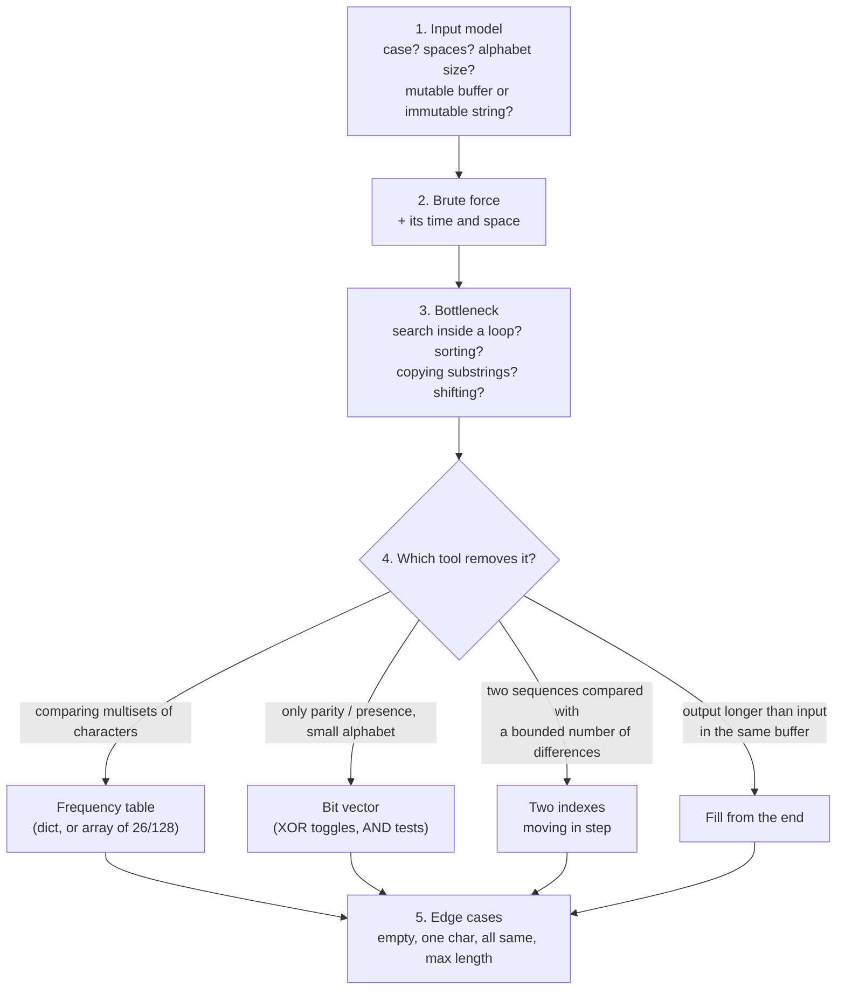

# Arrays and strings problems

> [!abstract] In one sentence
> The *Cracking the Coding Interview* chapter 1 problems I solved, worked through as a method: pin down the input model, write the brute force and its cost, find the **bottleneck** (usually a search inside a loop or repeated copying), and replace it with one of four tools: a **frequency table**, a **bit vector**, **two indexes** moving in step, or **writing from the end** of a buffer.

## 1. The method



Step 1 decides correctness, not just speed: "is `Tact Coa` a palindrome permutation?" is true only if case and spaces are ignored. Step 3 is where the improvement comes from: name the exact operation that makes the brute force slow.

### Cost model facts for strings in Python

| Operation | Cost | Consequence |
|---|---|---|
| `s[i]` | O(1) | Indexing is fine |
| `s[i:j]` | O(j − i), **copies** | Slicing in a loop turns O(n) into O(n²) |
| `s += t` in a loop | Copies `s` each time (CPython sometimes optimizes, don't rely on it) | Collect parts in a list, `"".join(parts)` once |
| `sorted(s)` | O(n log n) | Often replaceable by counting in O(n) |
| `Counter(s)` / dict counting | O(n), O(k) space (k distinct characters) | k ≤ alphabet size |
| Fixed array of 26 / 128 counts | O(n), O(1) space | When the alphabet is known and small |

Strings are **immutable** in Python and Java: "in-place" string problems are about character arrays (C, Java `char[]`), which in Python means a `list` of characters.

## 2. Check permutation (1.2)

> Is one string a permutation of the other? `"listen"`, `"silent"` → true.

**Model**: same multiset of characters. **Brute force**: for each character of s1, find and remove a matching one in s2: O(n²). **Bottleneck**: the search inside the loop. **Tools**: sort both (O(n log n)), or count (O(n)).

```python
def check_permutation(s1, s2):
    if len(s1) != len(s2):
        return False
    freq = {}
    for ch in s1:
        freq[ch] = freq.get(ch, 0) + 1
    for ch in s2:
        if freq.get(ch, 0) == 0:       # s2 has more of ch than s1
            return False
        freq[ch] -= 1
    return True
```

This is my solution, and it's correct. Why it's correct: the length check plus "never go below zero" means s2 uses each character at most as often as s1, with the same total, so the counts are equal. Without the length check, `"ab"` vs `"a"` would pass. For ASCII, a `[0] * 128` array instead of a dict is O(1) space and faster.

Unicode caveat: `"é"` can be one code point (U+00E9) or two (`e` + combining accent). Two visually identical strings can fail the check; normalize first (`unicodedata.normalize("NFC", s)`) if the input is user text.

## 3. URLify (1.3)

> Replace each space with `%20`. Given a character array with enough free space at the end and the "true length": `"Mr John Smith    ", 13` → `"Mr%20John%20Smith"`.

**Model**: in place, the output (true_length + 2·spaces) is longer than the input, in the same buffer. **Brute force**: scan left to right, shift everything right by 2 at each space: O(n²). **Bottleneck**: the shifting. **Tool**: compute the final length, then fill **from the end**. The write index starts at the final end and is always ≥ the read index, so no unread character is ever overwritten. O(n), O(1) extra.

```python
def urlify(chars, true_length):          # chars: list with free space at the end
    spaces = chars[:true_length].count(" ")
    write = true_length + 2 * spaces - 1
    for read in range(true_length - 1, -1, -1):
        if chars[read] == " ":
            chars[write - 2:write + 1] = ["%", "2", "0"]
            write -= 3
        else:
            chars[write] = chars[read]
            write -= 1
    return chars[:true_length + 2 * spaces]
```

`"a  b"` (two spaces) becomes `a%20%20b`: each space is replaced, nothing is collapsed. In Python with a real string, `s[:true_length].replace(" ", "%20")`.

**My version** split the input into words and appended `%20` after each word:

```python
if buffer != ' ':          # meant: != ''
    list_words.append(buffer)
for word in list_words:
    res += (word + '%20')
```

| Input | My output | Expected |
|---|---|---|
| `"Mr John Smith"` | `Mr%20John%20Smith%20` | `Mr%20John%20Smith` |
| `"Mr John Smith    "` | `Mr%20John%20Smith%20%20` | `Mr%20John%20Smith` (true length 13) |
| `"a  b"` | `a%20b%20` | `a%20%20b` |

Three issues: `%20` after the last word, the `!= ' '` test adds an empty word when the input ends with spaces, and consecutive spaces collapse because the problem was modeled as "join words" instead of "replace each space". Plus `res +=` in a loop.

## 4. Palindrome permutation (1.4)

> Is the string a permutation of a palindrome? `"Tact Coa"` → true (`"taco cat"`). Case and non-letters are ignored.

**Model**: a palindrome has every character an even number of times except at most one (the middle). Order is irrelevant, only **parity** of counts. **Tools**: frequency table, or, since only parity matters, a **set of odd characters** or a **bit vector**.

```python
def palindrome_permutation(s):
    odd = set()
    for ch in s.lower():
        if not ch.isalpha():
            continue
        odd ^= {ch}                      # toggle membership = flip parity
    return len(odd) <= 1
```

### The bit vector version

One integer, bit k = parity of letter k (`a` = bit 0). XOR with `1 << k` flips it. At the end, the string qualifies if **at most one bit is set**. A number has at most one bit set iff `x & (x − 1) == 0`: subtracting 1 flips the lowest set bit and every bit below it, so the AND clears exactly the lowest set bit, and the result is 0 iff that was the only one.

```
x         = 0b0010000   one bit set       x & (x-1) = 0           → ok
x - 1     = 0b0001111
x         = 0b0010100   two bits set      x & (x-1) = 0b0010000   → not ok
x - 1     = 0b0010011
```

```python
def palindrome_permutation_bits(s):
    bits = 0
    for ch in s.lower():
        if "a" <= ch <= "z":
            bits ^= 1 << (ord(ch) - ord("a"))
    return bits & (bits - 1) == 0
```

**My versions**: the dict version had the right logic but counted every character, so `"Tact Coa"` returned **False** (the space and the two cases of `t` count separately). The bit version computed `ord(char) - ord('a')` for every character: a space gives −65, and `1 << -65` raises `ValueError: negative shift count`. The fix in both: normalize case and filter to the alphabet first (step 1 of the method).

| Approach | Time | Space |
|---|---|---|
| Dict/set | O(n) | O(k) |
| Bit vector | O(n) | O(1), one integer (works only for a small, known alphabet) |

## 5. One away (1.5)

> Insert, remove or replace one character. Are two strings zero or one edit apart? `pale, ple` → true, `pales, pale` → true, `pale, bale` → true, `pale, bake` → false.

**Model**: insert into one string = remove from the other, so there are only two cases. Lengths differ by more than 1 → false. Equal lengths → at most one position differs. Lengths differ by 1 → removing one character of the longer string gives the shorter. **Brute force**: try every possible single edit: O(n²) or worse. **Tool**: **two indexes** walking both strings, allowing one mismatch.

```python
def one_away(a, b):
    if abs(len(a) - len(b)) > 1:
        return False
    if len(a) > len(b):
        a, b = b, a                       # a is the shorter (or equal)
    i = j = 0
    found_diff = False
    while i < len(a) and j < len(b):
        if a[i] != b[j]:
            if found_diff:
                return False
            found_diff = True
            if len(a) == len(b):
                i += 1                    # replace: advance both
        else:
            i += 1                        # match: advance the shorter
        j += 1                            # the longer always advances
    return True
```

O(n) time, O(1) space. Tested on all the book's cases plus `ab, ba` (false: two replacements), `pale, pa` (false: two removals), `apple, aple`, `a, b`, `"", a`.

**My first attempt** tried to repair the strings while scanning, and only looped up to the shorter length:

| Input | First attempt | Correct |
|---|---|---|
| `pale, ple` | False | True |
| `baller, baler` | False | True |
| `ab, ba` | True | False |
| `pale, pa` | True | False |

Looping to `min(len)` never looks at the tail of the longer string, so differences there are invisible (`pale, pa`). **My refined version** finds the first mismatch and compares the rests with slices (`s1[i+1:] == s2[i+1:]` for equal lengths, `s1[i:] == s2[i+1:]` otherwise): correct on every case, O(n) time but O(n) extra space for the slices, which the two-index version avoids.

## 6. Generalizations worth knowing

| Problem | Extends | Tool |
|---|---|---|
| Group anagrams | Check permutation | Hash map from a canonical key (sorted string or a 26-count tuple) to the list of words |
| Find all anagrams of p in s | Check permutation | Sliding window of length len(p) with a running count array: O(n) |
| Edit distance (any number of edits) | One away | Dynamic programming over prefixes: O(n·m) (*[[Dynamic programming]]*) |
| Longest palindromic substring | Palindrome | Expand around each center: O(n²), or Manacher O(n) |
| String compression `aabcccccaaa → a2b1c5a3` (1.6) | | One pass with a run counter, parts joined at the end |

## Practice

> [!example]- Is `"aabbccd"` a permutation of a palindrome? `"aabbcd"`?
> `"aabbccd"`: only `d` is odd → yes (`abcdcba`). `"aabbcd"`: `c` and `d` are odd → no.

> [!example]- What is `0b1011000 & (0b1011000 - 1)` and what does it mean?
> `0b1011000 − 1 = 0b1010111`, AND = `0b1010000` ≠ 0: more than one bit is set.

> [!example]- Trace the two-index `one_away("apple", "aple")`.
> a = "aple", b = "apple". a/a, p/p match. l vs p differ → found_diff, lengths differ so only j moves. l/l, e/e match. True.

> [!example]- Why does URLify's backwards fill never overwrite an unread character?
> Write starts at the final end (≥ read) and moves left 1 per normal character (as does read) and 3 per space (read moves 1), so the gap write − read only shrinks at spaces and reaches 0 exactly when no spaces remain to the left.

> [!example]- Check permutation for ASCII strings in O(1) extra space.
> A 128-entry count array: increment for s1, decrement for s2, fail on a negative count; plus the length check.

## Related
- Tools:: [[Hash table]] (frequency tables), [[Number base conversion]] (bits and binary)
- Techniques:: *[[Two pointers]]*, *[[Bit manipulation]]*, *[[Dynamic programming]]*
- Area:: [[Data structures and algorithms]]

## Flashcards
#flashcards

Five steps to attack an array/string problem? :: Input model, brute force + cost, name the bottleneck, pick the tool, edge cases
Why is slicing in a loop dangerous in Python? :: Each slice copies: O(n) per slice, O(n²) overall
Check permutation in O(n)? :: Length check + frequency counts (dict or 128-array)
Why does check permutation need the length check? :: Without it, a shorter s2 passes the "never below zero" test
Palindrome permutation condition? :: At most one character has an odd count
Why does x & (x − 1) == 0 mean at most one bit set? :: x − 1 flips the lowest set bit and those below it, so the AND clears exactly the lowest set bit
How does a bit vector track character parity? :: XOR with 1 << k flips bit k for letter k
Why fill URLify from the end? :: The output is longer than the input in the same buffer: writing backwards never overwrites unread characters
One away: the three cases? :: Length difference > 1 false; same length at most one differing position; length differs by 1, skip one char in the longer
Why does looping only to the shorter length break one away? :: Differences in the tail of the longer string are never examined
Group anagrams key? :: The sorted word or a 26-count tuple
Unicode trap in string comparison? :: The same visible character can be one or several code points: normalize (NFC) first
