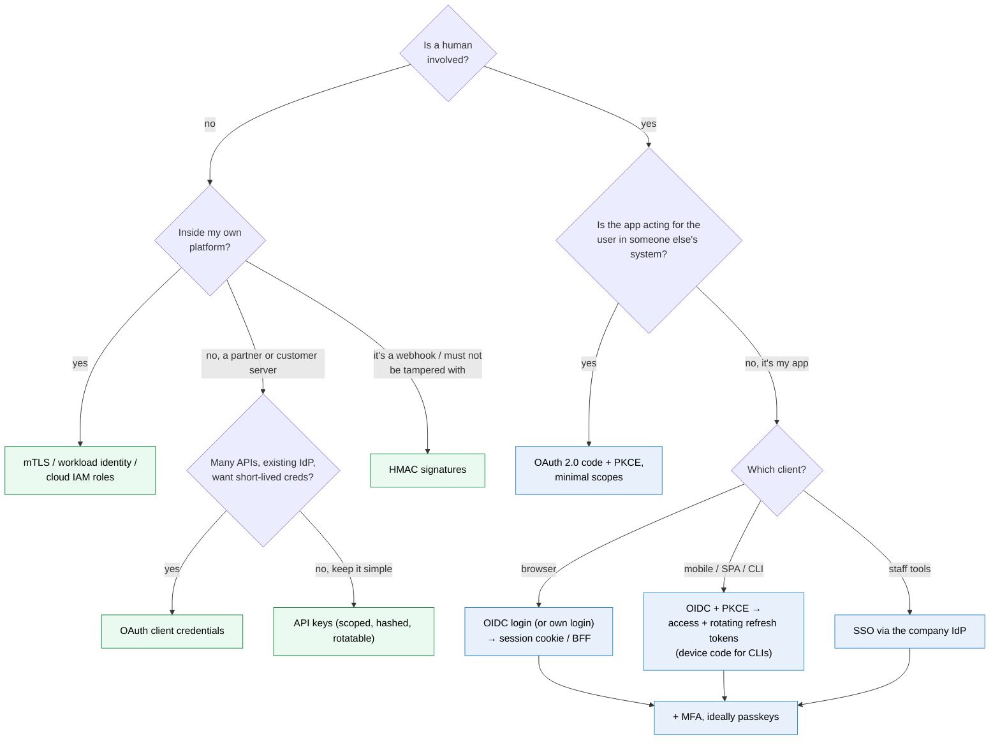
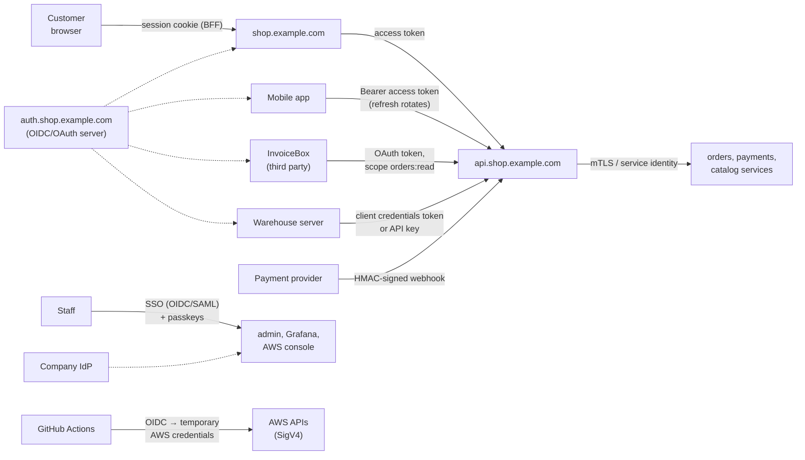

# Choosing an authentication method

> [!abstract] The short answer
> Pick by **who the client is**: people in a browser get a **session cookie** (from your own login or, better, from **OIDC** via an identity provider, which gives **SSO**); mobile apps and SPAs (single-page applications) get **OIDC login + short access tokens + rotating refresh tokens** (or a BFF (backend for frontend)); third-party apps acting for users get **OAuth (Open Authorization) authorization code + PKCE (Proof Key for Code Exchange)**; partner servers get **API (application programming interface) keys** or **OAuth client credentials**; webhooks and tamper-sensitive calls get **HMAC (hash-based message authentication code) signatures**; your own services use **mTLS (mutual TLS) / workload identity**; and every human login should end in **MFA**, ideally passkeys. Basic and Digest are only for simple internal tools and legacy devices.

## Side by side

| Method | Client sends each request | Server checks | Revoke | Lifetime of what travels | Best for | Avoid for |
|---|---|---|---|---|---|---|
| [[Basic and Digest authentication\|Basic]] | `user:password` (base64) | Password hash every time | Change password | Forever | Internal tools, Git with PATs (personal access tokens) | Anything user-facing |
| [[Basic and Digest authentication\|Digest]] | MD5 (Message Digest 5) response to a nonce | Recompute with stored HA1 (hash 1: MD5 of username:realm:password) | Change password | Per nonce | Legacy devices | Anything new |
| [[Session authentication\|Session cookie]] | Random session ID (identifier) (cookie) | Lookup in a store | **Instant** | Hours–days | Browser apps | Third-party APIs, mobile |
| [[API keys\|API key]] | Long random key (header) | Hash lookup | Per key, instant | Months | Partner servers, scripts | Browsers, mobile apps, acting for users |
| [[JWT and bearer tokens\|JWT bearer]] | Signed token | Signature + claims, no lookup | Hard (wait for `exp`) | Minutes | Many services verifying identity | Long-lived sessions |
| [[Access and refresh tokens\|Access + refresh]] | Short access token; refresh only to the auth server | Signature (access), lookup (refresh) | Refresh: instant; access: within minutes | Minutes / days | Mobile, SPAs, OAuth clients | |
| [[OAuth 2.0]] (code + PKCE) | Access token obtained with user consent | As above | Grant revoked by user/admin | Minutes | Third-party apps acting for users | Logging users in by itself |
| [[OAuth 2.0#Stage 6: no user at all (client credentials)\|OAuth client credentials]] | Access token for the client itself | As above | Disable client | Minutes | Machine-to-machine | |
| [[OpenID Connect]] | (login only) ID token → then a session or tokens | Validate ID token | Via the session/tokens | Login event | "Log in with", SSO, CI (continuous integration) workloads | Calling APIs with the ID token |
| [[Single sign-on]] (OIDC/SAML) | (login only) via IdP | Assertion / ID token | Disable at IdP (+ SCIM (System for Cross-domain Identity Management)) | Login event | Workforce apps | |
| [[HMAC request signing]] | Signature over method, path, body, time | Recompute HMAC | Rotate secret | Per request (minutes) | Webhooks, AWS (Amazon Web Services) APIs, tamper-sensitive calls | Browsers |
| [[mTLS]] | Client certificate in TLS (Transport Layer Security) handshake | Chain to trusted CA (certificate authority) | Revoke / short-lived certs | Hours–days (cert) | Service-to-service, devices | Public user logins |
| [[Multi-factor authentication and passkeys\|Passkeys / MFA]] | (login only) signature or code | Public key / TOTP (time-based one-time password) | Remove credential | Login event | Every human login | Machines |

## What they share

- Every one of them ends with an **identity**; none of them decides what that identity may do. Authorization (roles, ownership checks, scopes) is always a separate step ([[Authentication and authorization]])
- All require **TLS**
- All bearer-style credentials (passwords, session IDs, API keys, tokens) are "whoever holds it is me": short lifetimes, careful storage, never in URLs (Uniform Resource Locators) or logs

## Where they actually differ

Three questions sort them:

**1. Does the long-term secret travel on every request?**
- Yes: Basic, API keys
- No, only a derived/temporary credential: sessions, tokens
- No, only a proof: HMAC, mTLS, WebAuthn (Web Authentication)

**2. How does the server verify?**
- Lookup in a store (stateful, instantly revocable): sessions, API keys, opaque tokens, refresh tokens
- Cryptographic check alone (stateless, scales, hard to revoke): JWTs (JSON Web Tokens; JSON: JavaScript Object Notation), HMAC, certificates

**3. Who is authenticated?**
- A person directly: passwords, MFA, passkeys, sessions
- A person **through** an identity provider: OIDC, SAML (Security Assertion Markup Language), SSO
- An app acting **for** a person: OAuth authorization code
- An app or service **as itself**: API keys, client credentials, mTLS, HMAC, workload identity

## How the shop combines them

One company, all of them at once, each where it fits:

| Flow | Method | Why |
|---|---|---|
| Customer on the website | OIDC login at `auth.shop.example.com` → BFF session cookie | Tokens never reach JavaScript; instant logout |
| Customer in the mobile app | OIDC + PKCE, 15-min access tokens, rotating refresh tokens in the Keychain | No cookies on mobile; long login without long-lived access |
| InvoiceBox | OAuth authorization code + PKCE, `orders:read` | User consent, limited, revocable, no password shared |
| Warehouse sync | Client credentials (or a scoped API key) | No user; short-lived tokens preferred |
| Payment webhooks | HMAC with timestamp | Proves origin and integrity, replay window |
| Service to service | mTLS through the mesh, plus the user's token propagated for authorization | Strong identity without shared secrets |
| Staff tools and AWS | SSO from the company IdP, passkeys required | One place for MFA and leavers |
| CI/CD (CD: continuous delivery) to AWS | GitHub OIDC → `AssumeRoleWithWebIdentity` ([[ECS production stack]]) | No stored AWS keys |

## If you have to choose

- Human, browser, my app → **session cookie** after **OIDC** (or my own login with MFA)
- Human, mobile/SPA → **OIDC + access/refresh tokens**, or a **BFF**
- Many internal apps → **SSO** (OIDC first, SAML when the vendor only speaks SAML)
- Third-party app for a user → **OAuth code + PKCE**
- Partner server → **API key** (simple) or **client credentials** (ecosystem)
- Webhooks → **HMAC**
- My services → **mTLS / workload identity / cloud roles**
- Every human → **MFA**, passkeys for admins
- Never → secrets in URLs, implicit flow, password grant, JWTs in `localStorage`, Digest for new systems

## Flashcards
#flashcards

Method for people using my web app in a browser? :: Session cookie (after my own login or OIDC), or a BFF holding tokens
Method for a mobile app calling my API? :: OIDC + PKCE login, short access tokens, rotating refresh tokens in secure storage
Method for a third-party app acting for a user? :: OAuth 2.0 authorization code + PKCE with minimal scopes
Method for a partner's server? :: API key or OAuth client credentials
Method for webhooks? :: HMAC signature with a timestamp
Method for my own services talking to each other? :: mTLS / workload identity / cloud IAM (Identity and Access Management) roles
Method for many internal staff apps? :: SSO through the company IdP (OIDC or SAML) with MFA
Which methods are stateful (instantly revocable)? :: Sessions, API keys, opaque tokens, refresh tokens
Which methods verify without a lookup? :: JWTs, HMAC signatures, client certificates
Which methods never send the secret? :: HMAC signing, mTLS, WebAuthn/passkeys
What do all authentication methods leave to the app? :: Authorization: deciding what the identity may do
