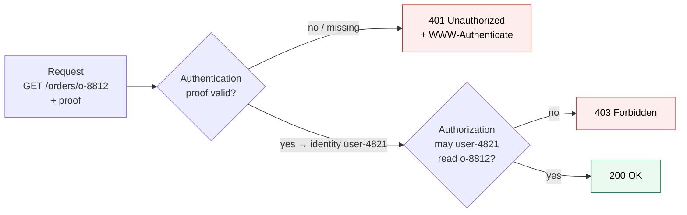
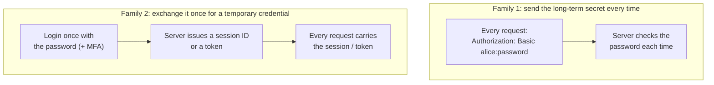
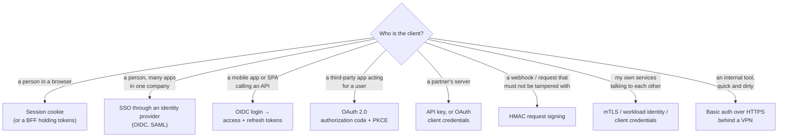

# Authentication and authorization

> [!abstract] In one sentence
> **Authentication** answers "who is making this request?" by checking a proof (a password, a key, a token, a certificate), **authorization** answers "is that identity allowed to do this?", and because HTTP forgets everything between requests, every web authentication method is a different answer to one question: **what does each request carry to prove who sent it, and how does the server check it?**

## Build-up: the shop gets users

The shop: a website `shop.example.com`, an API `api.shop.example.com` used by the website and a mobile app, partners who pull orders through the API, and internal admin tools for staff. Everything starts open.

### Stage 1: anyone can do anything

```bash
curl https://api.shop.example.com/orders/o-8812
# {"id":"o-8812","customer":"alice@example.com","total":129.90,"address":"…"}
```

Anyone who guesses an order ID reads a customer's address. The server needs to know **who** asks (authentication) and then decide **whether** they may (authorization). Two separate questions, often confused:

| | Authentication (AuthN) | Authorization (AuthZ) |
|---|---|---|
| Question | Who are you? | What are you allowed to do? |
| Input | A proof: password, key, token, certificate | An identity + the action + the resource |
| Output | An identity (`user-4821`, `partner-acme`, `svc-billing`) | Allow or deny |
| Fails with | **401 Unauthorized** (badly named: it means *unauthenticated*) | **403 Forbidden** |
| Example | Alice's password is correct | Alice may read **her own** orders, not o-9001 |



> [!warning] Authenticated is not authorized
> The most common API vulnerability isn't broken login, it's **missing authorization**: the API checks that a token is valid, then returns `/orders/o-9001` to anyone logged in. OWASP lists it first ("broken object level authorization"). Every method in this area only gives an **identity**; checking what that identity may touch is a separate step in the app.

### Stage 2: what counts as proof (factors)

A proof belongs to one of three **factors**:

| Factor | Examples | Weakness |
|---|---|---|
| Something I **know** | Password, PIN, security answer | Phished, guessed, reused, leaked in breaches |
| Something I **have** | Phone (TOTP app, push), security key, smart card, a private key file | Stolen, lost, SIM-swapped |
| Something I **am** | Fingerprint, face | Can't be changed if copied; usually only unlocks a "have" factor locally |

**MFA** combines two different factors (two passwords are still one factor), see [[Multi-factor authentication and passkeys]].

Machines can't type passwords or use phones: their proofs are **secrets** (API keys, client secrets), **private keys** (certificates in [[mTLS]], signing keys in [[HMAC request signing]]) or a **workload identity** granted by the platform (see [[Workload identity (SPIFFE)]]).

### Stage 3: HTTP forgets, so every request must prove itself

HTTP is **stateless** (see [[HTTP]]): each request stands alone, and the next one may even arrive on another TCP connection or another server behind the load balancer. Proving who I am once at login doesn't help request number two. So every request carries **something**. Two families:



Family 1 ([[Basic and Digest authentication]], [[API keys]]) is simple, but the long-term secret travels constantly and every leak (a log line, a proxy) exposes it forever. Family 2 ([[Session authentication]], [[JWT and bearer tokens]], [[Access and refresh tokens]]) limits the damage: what travels expires, can be revoked, and can't be used to change the password.

Inside family 2, the big split is **how the server checks** the credential:

| | **Stateful** (reference) | **Stateless** (self-contained) |
|---|---|---|
| What the client holds | A random ID meaning nothing by itself | A signed document with the identity inside (JWT) |
| Server checks by | Looking it up in a store (memory, Redis, database) | Verifying the signature, no lookup |
| Revoke now | Delete it from the store | Hard: valid until it expires |
| Scale | Every server needs the store | Any server with the public key |
| Example | Session cookie, opaque OAuth token | JWT access token |

### Stage 4: where the proof travels

| Carrier | Example | Notes |
|---|---|---|
| `Authorization` header | `Authorization: Bearer eyJ…`, `Basic YWxp…` | The standard place. Scheme first, then credentials |
| Cookie | `Cookie: session=8f2c…` | Sent **automatically** by browsers: convenient, and the reason CSRF exists |
| Custom header | `X-API-Key: sk_live_…` | Common for API keys |
| TLS client certificate | In the handshake | Not visible in HTTP at all ([[mTLS]]) |
| Query string | `?api_key=…` | **Avoid**: URLs end up in logs, browser history, `Referer` headers, proxies |

The standard handshake for header-based schemes: the server answers `401` with a **`WWW-Authenticate`** header saying which scheme it expects, and the client retries with `Authorization`:

```http
HTTP/1.1 401 Unauthorized
WWW-Authenticate: Bearer realm="api.shop.example.com", error="invalid_token", error_description="token expired"
```

**TLS is mandatory for all of them.** Every credential in this area, password, session ID, token, API key, is readable by anyone on the path without HTTPS (see [[TLS]]).

### Stage 5: storing passwords (if I must)

Family 2 still starts with a login, so the server stores something to check passwords against. Never the password, never a plain hash:

| Stored | Problem |
|---|---|
| Plain password | One database leak = every account, and every other site where users reused it |
| Encrypted password | The key sits next to the database; same as plain once both leak |
| `SHA-256(password)` | Fast hashes: GPUs test **billions** of guesses per second; identical passwords give identical hashes |
| `SHA-256(salt + password)` | Salt fixes identical hashes and precomputed tables, but it's still fast to brute-force |
| **`argon2id` / `bcrypt` / `scrypt` with a per-user salt** | Deliberately **slow and memory-hungry**: each guess costs ~100 ms and memory, so brute-forcing a leak becomes impractical |

```text
$argon2id$v=19$m=65536,t=3,p=4$c2FsdHNhbHRzYWx0$Jf1v…   ← algorithm, cost parameters, salt, hash: all in one string
```

Then rate-limit logins, check new passwords against breach lists, and offer MFA. Better still: **don't store passwords at all**, and delegate login to an identity provider ([[Single sign-on]], [[OpenID Connect]]) or passkeys.

## The map of methods



The comparison of all of them, and how the shop combines them: [[Choosing an authentication method]].

## Threats every method has to face

| Threat | What happens | Main defenses |
|---|---|---|
| Phishing | User types credentials into a fake site | Passkeys/WebAuthn (bound to the real origin), SSO with MFA |
| Credential stuffing | Leaked passwords from other sites tried at scale | Rate limiting, breach checks, MFA |
| Theft of a token or session | XSS reads it, logs or proxies capture it | `HttpOnly` cookies, short lifetimes, never in URLs, sender-constrained tokens |
| Replay | A captured request is sent again | TLS, short expiry, nonces/timestamps ([[HMAC request signing]]) |
| CSRF | Another site makes the browser send a request **with its cookies** | `SameSite` cookies, CSRF tokens ([[Session authentication]]) |
| Broken authorization | Valid identity reads others' data | Object-level checks in every handler |
| Long-lived secrets leaking | Keys in Git, CI logs, images | Short-lived credentials, secret scanning, rotation |

## In AWS
- [[IAM]] is authentication **and** authorization for AWS APIs: requests are signed with SigV4 ([[HMAC request signing]]), policies decide what's allowed. A `403 AccessDenied` from AWS is authorization; `InvalidClientTokenId` / `SignatureDoesNotMatch` are authentication
- Amazon **Cognito** is a managed user directory and OIDC/OAuth server for app users; [[AWS Identity Center]] is SSO for the workforce into AWS accounts and apps
- API Gateway and ALB can authenticate before the app sees the request (JWT authorizers, Cognito/OIDC on ALB listeners)

## Practice

> [!example]- A logged-in user gets data from another user's order by changing the ID in the URL. Authentication or authorization bug?
> Authorization: the identity was established correctly, but the app didn't check the order belongs to that identity.

> [!example]- 401 or 403: a request with an expired token? A valid token without the admin role?
> Expired token: 401 (not authenticated). Valid token, missing permission: 403.

> [!example]- Why is `SHA-256(salt + password)` not good enough?
> It's fast: attackers can try billions of guesses per second on a leaked database. Password hashes must be slow and memory-hard (argon2id, bcrypt, scrypt).

> [!example]- Why shouldn't an API key go in the query string?
> URLs are logged by servers and proxies, kept in browser history and leaked in Referer headers.

> [!example]- What's the core trade-off between a session ID and a JWT?
> Session ID: server lookup on every request, instant revocation. JWT: verified by signature alone, scales without a store, but can't easily be revoked before expiry.

## Easy to get wrong
- Treating 401 as "forbidden" (it means unauthenticated)
- Checking that a token is valid and forgetting to check what it allows
- Two passwords as "two-factor"
- Credentials in URLs
- Any credential over plain HTTP
- Fast hashes (MD5, SHA-*) for passwords
- Long-lived secrets where short-lived credentials are possible

## Related
- Methods:: [[Basic and Digest authentication]], [[Session authentication]], [[API keys]], [[JWT and bearer tokens]], [[Access and refresh tokens]], [[HMAC request signing]], [[Multi-factor authentication and passkeys]]
- Protocols:: [[OAuth 2.0]], [[OpenID Connect]], [[Single sign-on]]
- Choosing:: [[Choosing an authentication method]]
- Transport:: [[HTTP]], [[TLS]], [[mTLS]], [[Workload identity (SPIFFE)]]
- In AWS:: [[IAM]], [[AWS Identity Center]]
- Area:: [[Identity and access]]

## Flashcards
#flashcards

Authentication vs authorization? :: AuthN: who are you (checks a proof). AuthZ: what may you do (checks permissions)
What does HTTP 401 mean? :: Unauthenticated: missing or invalid credentials (despite the name "Unauthorized")
What does HTTP 403 mean? :: Authenticated but not allowed
What is broken object level authorization? :: The API accepts any valid identity and returns objects that don't belong to it
The three authentication factors? :: Something you know, have, are
Why must every HTTP request carry proof? :: HTTP is stateless: each request is independent
Two families of web authentication? :: Send the long-term secret every time (Basic, API key) vs exchange it once for a session or token
Stateful vs stateless credentials? :: Stateful: random ID looked up in a store, instantly revocable. Stateless: signed token verified without lookup, hard to revoke
What is the WWW-Authenticate header? :: Sent with 401 to tell the client which authentication scheme to use
Why never put credentials in URLs? :: Logged by servers/proxies, saved in history, leaked via Referer
How should passwords be stored? :: Slow, salted, memory-hard hashes: argon2id, bcrypt or scrypt
Why are fast hashes bad for passwords? :: Attackers test billions of guesses per second on a leaked database
Is TLS optional with token authentication? :: No, every credential type is readable without TLS
