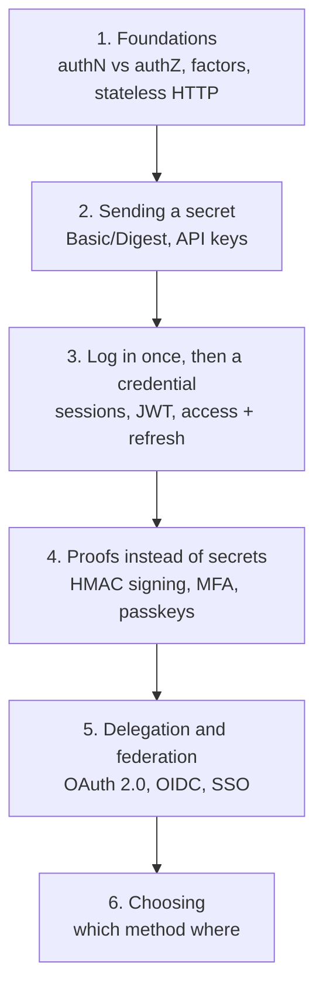

# Identity and access

> What this covers: how systems know **who** is calling and **what** they may do: authentication methods (passwords, sessions, keys, tokens, signatures, MFA), the protocols that delegate and federate identity (OAuth 2.0, OpenID Connect, SAML, SSO), and how to choose between them. Vendor-neutral first. AWS's own identity services ([[IAM]], [[AWS Identity Center]], Cognito) live in the AWS area and are linked from here.

## How to use this

Read the sections **top to bottom**: each one assumes the ones above it. Links in *italics* are notes I haven't written yet (the roadmap).



## 1. Foundations
- [[Authentication and authorization]]: who are you vs what may you do (401 vs 403, broken object-level authorization), the three factors, why stateless HTTP forces every request to carry proof, the two families (send the secret each time vs exchange it for a session/token), stateful vs stateless verification, where credentials travel, storing passwords (argon2id, bcrypt), the map of methods and the threats they face

## 2. Sending a secret with every request
- [[Basic and Digest authentication]]: the `401` + `WWW-Authenticate` challenge, `base64(user:password)` (decoded by hand: not encryption), nginx `auth_basic` with htpasswd, why it breaks down (password on every request, slow hashes, no logout), Digest's nonce + MD5 response computed step by step, why Digest died (password-equivalent HA1, MD5, TLS), where Basic is still fine
- [[API keys]]: one key per client, high-entropy keys with prefixes for secret scanning, storing them hashed and showing them once, lookup → rate limit → scope, zero-downtime rotation with two keys, why keys don't belong in browsers or mobile apps, personal access tokens, API keys vs OAuth client credentials, leaks, API Gateway's usage-plan keys aren't authentication

## 3. Log in once, then carry a credential
- [[Session authentication]]: login form → random session ID → session store → cookie, cookie flags (`HttpOnly`, `Secure`, `SameSite`, `__Host-`), sharing sessions across servers (sticky vs Redis vs signed cookies), CSRF and its defenses, session fixation, idle and absolute timeouts, instant revocation, when cookies get awkward (mobile, cross-origin, BFF)
- [[JWT and bearer tokens]]: bearer semantics, opaque vs self-contained tokens, a JWT built by hand with openssl, claims (`iss`, `sub`, `aud`, `exp`), verification steps, HS256 vs RS256 and JWKS key rotation, `alg: none` and algorithm confusion, the revocation problem, where JWTs fit and where they don't
- [[Access and refresh tokens]]: the lifetime dilemma, two tokens with two audiences, the refresh flow, rotation and reuse detection (token families), where each client stores tokens (BFF, SPA memory, Keychain/Keystore, CLI), idle vs absolute lifetimes, `offline_access`, sender-constrained tokens (DPoP, mTLS), parallel refresh races

## 4. Proofs instead of secrets
- [[HMAC request signing]]: why bearer secrets aren't enough for webhooks, HMAC-SHA256 over the raw body (computed by hand), constant-time comparison, timestamps and nonces against replay, AWS SigV4 (canonical request, string to sign, derived signing key, presigned URLs), HMAC vs API keys vs mTLS vs asymmetric signatures
- [[Multi-factor authentication and passkeys]]: factor strength from SMS to FIDO2, TOTP computed step by step (HMAC of the time step, dynamic truncation), MFA fatigue and number matching, WebAuthn registration and login, why passkeys are phishing-resistant, synced passkeys vs security keys, rollout and recovery, what MFA doesn't protect (stolen sessions)
- Also in Networking: [[mTLS]] (client certificates), [[Workload identity (SPIFFE)]] (service identities without secrets)

## 5. Delegation and federation
- [[OAuth 2.0]]: the password anti-pattern, the four roles, the authorization code flow parameter by parameter, why a code and not a token, PKCE for public clients, scopes and consent, client credentials for machines, the device code flow (`aws sso login`, `gh auth login`), deprecated grants and OAuth 2.1, why OAuth isn't login, redirect URI attacks and consent phishing
- [[OpenID Connect]]: what OAuth was missing for login, the ID token vs the access token, validating an ID token (`aud`, `nonce`), identifying users by `iss` + `sub` (not email), discovery and JWKS, scopes/claims/UserInfo, logout (RP-initiated, back-channel), OIDC for machines (GitHub Actions, Kubernetes), OIDC vs SAML
- [[Single sign-on]]: one IdP for many apps, why the second login is silent (the IdP session), SAML's AuthnRequest/assertion/ACS flow with a real assertion, SAML vs OIDC, SP- vs IdP-initiated, JIT vs SCIM provisioning and leavers, the risks of one basket (availability, compromise, break-glass accounts)
- Not written yet: *[[SAML]]* (deep dive: bindings, metadata, signature wrapping) · *[[Kerberos]]* (tickets, KDC, Windows domains) · *[[LDAP and Active Directory]]* (directories, binds, groups)

## 6. Choosing
- [[Choosing an authentication method]]: every method side by side (what travels, how it's checked, revocation, best use), the three questions that sort them, a decision flowchart, and how the shop combines all of them in one architecture
- Not written yet: *[[Authorization models]]* (RBAC, ABAC, ReBAC, policy engines like OPA and Cedar)

## Related areas
- [[Networking]]: [[HTTP]] (stateless requests, headers), [[TLS]] and [[mTLS]], [[Certificates and PKI]], [[Encryption basics]] (signatures, HMAC, key pairs), [[Reverse proxy]] (auth at the edge)
- [[AWS]]: [[IAM]] (SigV4, policies), [[AWS Identity Center]] (workforce SSO), [[ECS production stack]] (GitHub OIDC to AWS), Cognito

## Weakest first
```dataview
TABLE WITHOUT ID file.link AS Note, type AS Type, confidence AS Conf
FROM ""
WHERE topic = this.file.name AND confidence
SORT confidence ASC
```

## Open questions
- 
