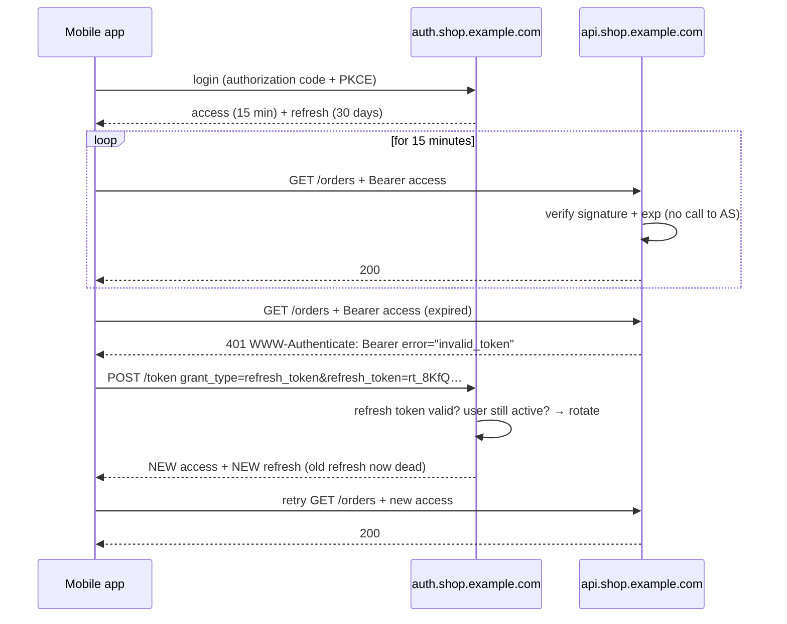
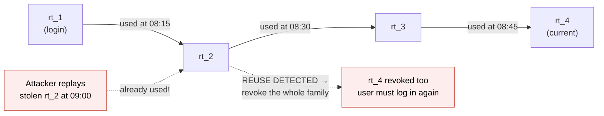
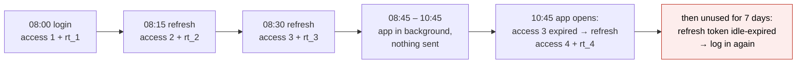

# Access and refresh tokens

> [!abstract] In one sentence
> Instead of one long-lived token, the client gets two: a **short-lived access token** (minutes) sent to the APIs (application programming interfaces) on every request, cheap to verify and harmless soon after it leaks, and a **long-lived refresh token** (days to months) sent **only** to the authorization server to get new access tokens, stored carefully, **revocable**, and **rotated** on each use so a stolen copy is detected; that pair gives long logins without long-lived credentials on the wire.

## Build-up: keeping the mobile app logged in

The shop's mobile app logs Alice in once and calls `api.shop.example.com` with a bearer token ([[JWT and bearer tokens]]). How long should that token live?

### Stage 1: the lifetime dilemma

| Token lives… | Good | Bad |
|---|---|---|
| **30 days** | Alice logs in once a month | A token copied from a log, a backup or a compromised device works for **30 days**. Revoking it needs a denylist checked everywhere |
| **10 minutes** | A leaked token is useless almost immediately | Alice types her password (and MFA (multi-factor authentication) code) every 10 minutes |

One token can't be both. So split the job in two.

### Stage 2: two tokens, two jobs

At login, the authorization server (see [[OAuth 2.0]]) returns:

```json
{
  "access_token":  "eyJhbGciOiJSUzI1NiIsImtpZCI6IjIwMjYtMTAifQ.eyJzdWIiOiJ1c2VyLTQ4MjEi…",
  "token_type":    "Bearer",
  "expires_in":    900,
  "refresh_token": "rt_8KfQ2mZx7wN4pL0vC9sB3yHjT6uE1aR5",
  "scope":         "openid orders:read orders:write"
}
```

| | **Access token** | **Refresh token** |
|---|---|---|
| Sent to | **Every API** (resource servers) | **Only** the authorization server's token endpoint |
| Lifetime | 5–60 min (15 here) | Days to months, often with a sliding window |
| Format | Often a JWT (JSON Web Token; JSON: JavaScript Object Notation), verified locally by APIs | Usually **opaque**, looked up in the auth server's database |
| Exposure | High: every request, many services, logs | Low: one endpoint, rarely sent |
| Revocation | Waits for expiry (or denylist) | **Instant**: delete the database row |
| If stolen | Minutes of access | Detected through rotation (Stage 3) |



The refresh request:

```bash
curl -s https://auth.shop.example.com/oauth2/token \
  -d grant_type=refresh_token \
  -d refresh_token=rt_8KfQ2mZx7wN4pL0vC9sB3yHjT6uE1aR5 \
  -d client_id=shop-mobile
# {"access_token":"eyJ…","expires_in":900,"refresh_token":"rt_Yb3nW…","token_type":"Bearer"}
```

Every refresh is also a **checkpoint**: the auth server can refuse if the account was disabled, the password changed, the session was revoked from another device, or the user must accept new terms. Revocation reaches the user within one access-token lifetime.

Clients refresh **slightly before** `expires_in` runs out (or on the first 401), so requests don't fail mid-way.

### Stage 3: rotation and reuse detection

A refresh token living 30 days is still a juicy target. **Rotation**: each refresh returns a **new** refresh token and invalidates the old one. The auth server keeps the chain (a "token family"):



If an old refresh token shows up again, either the legitimate app or a thief has a copy, and the server can't tell which: it revokes the **entire family**. The thief loses access, and the user just logs in again. Without rotation, a stolen refresh token works silently for its whole lifetime.

### Stage 4: where to keep the tokens

| Client | Access token | Refresh token |
|---|---|---|
| **Server-side web app / BFF (backend for frontend)** | Server memory or session store | Server-side store, **never sent to the browser**. The browser only has a `HttpOnly` session cookie (see [[Session authentication]]) |
| **SPA (single-page application) (pure browser app)** | **JavaScript memory** (a variable, lost on reload) | The weakest case: in-memory too (re-login or silent refresh on reload), or in an `HttpOnly`, `SameSite` cookie scoped to the token endpoint. **Not `localStorage`**: any XSS (cross-site scripting) reads it |
| **Mobile app** | Memory | OS (operating system) secure storage: iOS **Keychain**, Android **Keystore**-backed encrypted storage |
| **CLI (command-line interface) tool** | Memory | OS keyring, or a `0600` file under the user's config dir (`~/.aws/sso/cache`, `~/.config/gh/hosts.yml`) |
| **Server / daemon (client credentials)** | Memory, cached until near expiry | Usually none: it just asks for a new access token with its own credentials |

The trend for browser apps: keep tokens **off the browser** entirely with a BFF. A browser can't keep a secret from injected JavaScript; a server can.

### Stage 5: lifetimes in practice



| Setting | Typical value | Why |
|---|---|---|
| Access token | 5–15 min (APIs with sensitive data), up to 60 min | Damage window if leaked |
| Refresh **idle** timeout | 7–30 days | App unused for a month → log in again |
| Refresh **absolute** lifetime | 30–90 days (or until logout) | Even a constantly used chain ends; forces fresh authentication (and MFA) periodically |
| Step-up | Re-authenticate for payments, email change | High-risk actions need fresh proof, not just a valid token |

`offline_access` (an [[OpenID Connect]] scope) is how a client asks for a refresh token at all: a refresh token lets the app act **when the user isn't present**, so it's often shown on the consent screen.

### Stage 6: binding tokens to their owner

Rotation detects theft after the fact. **Sender-constrained** tokens make a stolen token useless:

| Mechanism | How | Status |
|---|---|---|
| **DPoP (Demonstrating Proof of Possession)** (RFC (Request for Comments, an internet standards document) 9449) | The client holds a key pair; each request carries a fresh signed proof (method, URL (Uniform Resource Locator), time) with that key; the token is bound to the key's thumbprint | Growing support (IdPs (identity providers), SPAs, mobile) |
| **mTLS-bound (mTLS: mutual TLS) tokens** (RFC 8705) | The token is bound to the client's TLS (Transport Layer Security) certificate ([[mTLS]]); the API checks the connection uses that certificate | Server-to-server, open banking |

A thief with the token but not the private key gets nowhere. Public SPA clients often get refresh tokens **only** with DPoP or a BFF.

## Advanced problems

### 1. Logged out when two tabs refresh at once

Two tabs (or two parallel requests in a mobile app) hit 401 together and both refresh with the same refresh token. With strict rotation, the second use looks like **reuse**: the whole family is revoked. Fixes: refresh in one place (a single in-flight refresh promise, a shared worker), and on the server a **short grace period** where the previous token returns the same new pair.

### 2. Users never get logged out

Sliding refresh with no **absolute** lifetime: an active app keeps refreshing forever, and a token stolen once lives forever. Always cap the family's total lifetime.

### 3. Revocation that doesn't revoke

The user clicks "log out everywhere"; the auth server deletes refresh tokens, but access tokens (JWTs) keep working for up to their lifetime, and some services cache introspection results longer. Know the real worst-case delay = access token lifetime + caches, and keep it acceptable.

### 4. Refresh tokens in logs and analytics

Mobile crash reporters, HTTP (Hypertext Transfer Protocol) logging interceptors or proxy logs capture the token endpoint's request body. Scrub token parameters in every logging layer; the token endpoint is the most sensitive URL in the system.

## In AWS
- **Cognito** user pools: access and ID (identifier) tokens valid 5 min–1 day (default 1 h), refresh tokens 1 h–10 years (default 30 days), optional **refresh token rotation**, `GlobalSignOut`/`RevokeToken` to kill refresh tokens
- AWS (Amazon Web Services)'s own credentials follow the same idea: **STS (Security Token Service) temporary credentials** (15 min–12 h) instead of long-lived access keys, and `aws sso login` stores an SSO (single sign-on) token plus a refresh token in `~/.aws/sso/cache` to mint short-lived role credentials ([[AWS Identity Center]])

## Practice

> [!example]- Why not just use one token valid for 30 days?
> A leak gives 30 days of access, and revoking it needs a lookup on every request. Short access + revocable refresh tokens keep both the damage window and the revocation cost small.

> [!example]- Which servers ever see the refresh token?
> Only the authorization server's token endpoint. APIs only see access tokens.

> [!example]- An old refresh token is presented again. What does the server do and why?
> Revokes the whole token family: it can't tell whether the thief or the app holds the copy, so it forces a fresh login.

> [!example]- Where should a SPA keep its access token?
> In memory. Better still, don't hold tokens in the browser: use a BFF with an HttpOnly session cookie.

> [!example]- Why does a refresh need an absolute lifetime as well as an idle timeout?
> Otherwise an active (or stolen) chain refreshes forever.

> [!example]- How does DPoP stop a stolen access token from working?
> Each request needs a proof signed with a private key the token is bound to; the thief doesn't have it.

## Easy to get wrong
- Long-lived access tokens "for convenience"
- Sending refresh tokens to APIs
- Refresh tokens without rotation (or without reuse detection)
- No absolute lifetime on refresh chains
- Tokens in `localStorage`
- Parallel refreshes triggering reuse detection
- Logging the token endpoint's request bodies
- Assuming "logout" kills access tokens instantly

## Related
- Concepts first:: [[Authentication and authorization]]
- Token format:: [[JWT and bearer tokens]]
- Who issues them:: [[OAuth 2.0]], [[OpenID Connect]]
- Browser alternative:: [[Session authentication]] (BFF)
- Binding to keys:: [[mTLS]]
- Area:: [[Identity and access]]

## Flashcards
#flashcards

Why split access and refresh tokens? :: Short-lived access tokens limit leak damage; long-lived refresh tokens keep users logged in and are revocable
Where is an access token sent? :: To every API (resource server) on each request
Where is a refresh token sent? :: Only to the authorization server's token endpoint
Typical access token lifetime? :: 5–60 minutes
Usual format of access vs refresh tokens? :: Access: often JWT (local verification). Refresh: usually opaque (database lookup)
What is refresh token rotation? :: Each refresh returns a new refresh token and invalidates the old one
What happens on refresh token reuse? :: The whole token family is revoked, forcing a new login
Why does every refresh act as a checkpoint? :: The auth server can refuse for disabled users, revoked sessions or changed passwords
Where should a mobile app store a refresh token? :: Keychain (iOS) / Keystore-backed storage (Android)
Why not localStorage for tokens? :: Any XSS can read it
Idle vs absolute refresh lifetime? :: Idle: expires if unused. Absolute: maximum total lifetime of the chain
What does the offline_access scope request? :: A refresh token, to act while the user isn't present
What is DPoP? :: Binding tokens to a client key pair; each request carries a signed proof of possession
Why do parallel refreshes cause logouts? :: With rotation, the second use of the same refresh token looks like reuse; fix with a single in-flight refresh or a grace period
Worst-case delay of "log out everywhere"? :: Access token lifetime plus any caches of introspection
