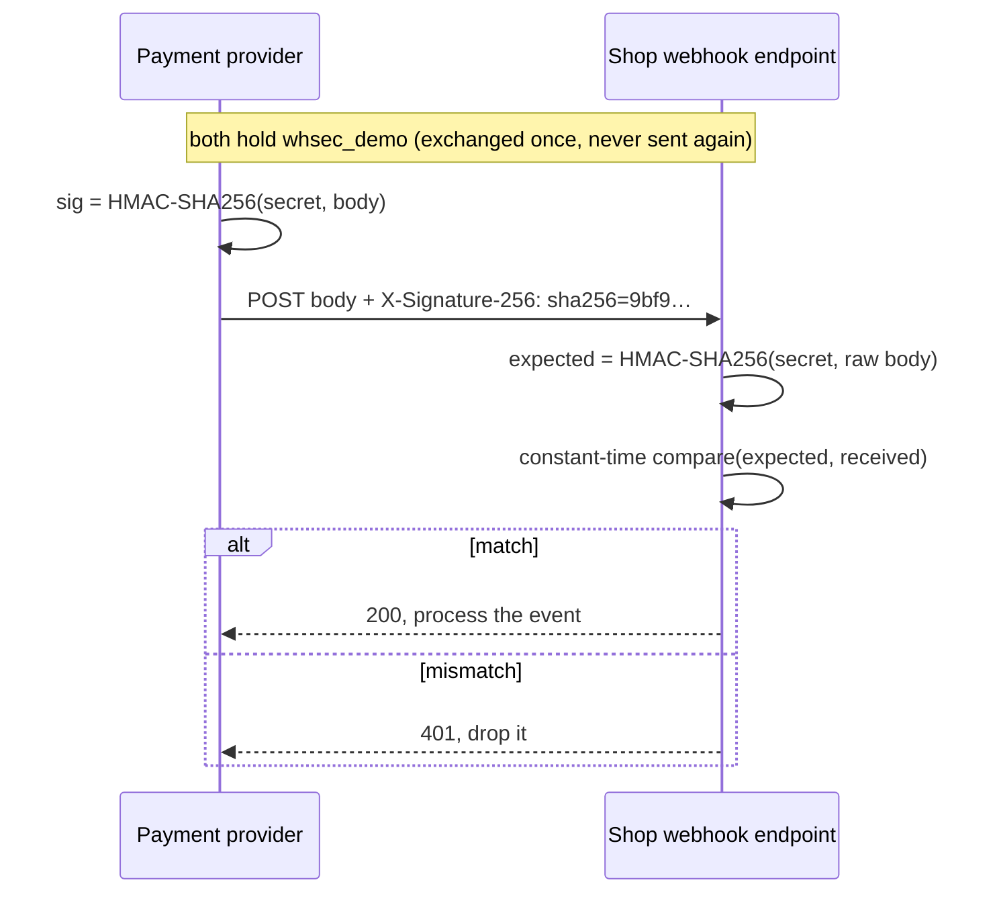
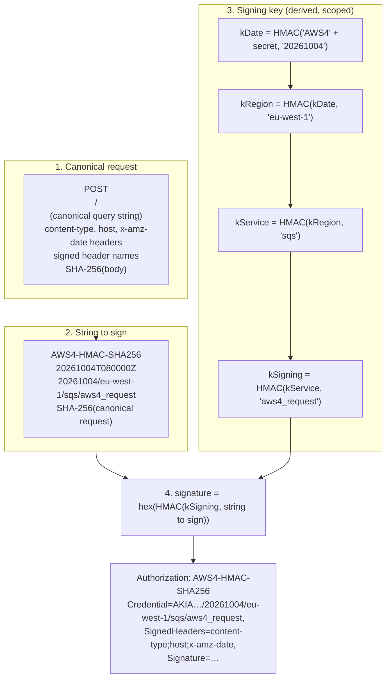

# HMAC request signing

> [!abstract] In one sentence
> Instead of sending a secret with each request (where anyone who captures it can reuse it), the client and server share a secret and the client sends a **signature**: an HMAC of the request's important parts (method, path, body hash, timestamp) computed with that secret; the server recomputes it, so the signature proves **who** sent the request **and** that it wasn't modified, the secret never travels, and a timestamp limits replay; this is how webhooks are verified and how every AWS API call is authenticated (SigV4).

## Build-up: the payment provider tells the shop an order is paid

When Alice pays, the payment provider sends a **webhook** to `https://api.shop.example.com/webhooks/payments`:

```http
POST /webhooks/payments HTTP/1.1
Content-Type: application/json

{"event":"order.paid","order":"o-8812"}
```

The shop then ships the order. Anyone on the internet can POST that same JSON to that URL.

### Stage 1: why a bearer secret isn't enough

Option: the provider adds a shared secret in a header (`X-Webhook-Token: whsec_demo`). Better than nothing, but:
- The secret **travels with every request**: any log, proxy or debugging tool that records headers leaks it forever
- It proves nothing about the **body**: a man in the middle (or a buggy proxy) could change `o-8812` to another order and the token would still be valid
- A captured request can be **replayed** endlessly

### Stage 2: HMAC, a keyed fingerprint

An **HMAC** (hash-based message authentication code) is `HMAC(key, message)`: a hash that only someone holding the key can compute, and that changes completely if even one byte of the message changes.

```bash
printf '%s' '{"event":"order.paid","order":"o-8812"}' | openssl dgst -sha256 -hmac 'whsec_demo' | awk '{print $2}'
# 9bf9dc11b3cbddd0601ca9e4f40af8e63de7d8f442e2745ea44a1fa98bc48184
```

The provider sends the **signature**, not the secret:

```http
POST /webhooks/payments HTTP/1.1
Content-Type: application/json
X-Signature-256: sha256=9bf9dc11b3cbddd0601ca9e4f40af8e63de7d8f442e2745ea44a1fa98bc48184

{"event":"order.paid","order":"o-8812"}
```

The shop recomputes the HMAC over the **raw body bytes** with its copy of the secret and compares:



- **Authenticity**: only a holder of the secret could produce that signature
- **Integrity**: change one character of the body and the signature fails
- **No secret on the wire**: a captured request reveals the signature for **that** body only

This is exactly how GitHub (`X-Hub-Signature-256`), Stripe, Shopify and Slack sign their webhooks, with small variations.

```python
import hmac, hashlib

def verify(raw_body: bytes, header: str, secret: bytes) -> bool:
    expected = "sha256=" + hmac.new(secret, raw_body, hashlib.sha256).hexdigest()
    return hmac.compare_digest(expected, header)   # constant time
```

### Stage 3: stopping replays (timestamps and nonces)

The signature covers the body, but an attacker who captured one valid request can still **resend it** unchanged. Fix: sign a **timestamp** too, and reject old messages.

```text
signed payload = "1791100800" + "." + body
header:  X-Signature: t=1791100800,v1=<HMAC-SHA256(secret, signed payload)>
```

The server rejects requests whose `t` is more than ~5 minutes from its clock, and verifies the signature over `t.body` (so the timestamp can't be altered). Within the window, an event ID or **nonce** remembered for 5 minutes catches exact duplicates. Stripe's `Stripe-Signature: t=…,v1=…` is this scheme.

Webhook handlers must be **idempotent** anyway: providers retry deliveries, so the same event can legitimately arrive twice (dedupe on the event ID).

### Stage 4: signing full API requests (AWS SigV4)

For webhooks, signing the body is enough. A general API must also sign **which** endpoint and parameters: otherwise a signed `GET /orders/o-8812` could be redirected to `DELETE /orders/o-8812`. AWS's **Signature Version 4** is the reference design, used by every AWS API call, every SDK and the CLI.



What each piece buys:
- **Canonical request**: method, path, query, chosen headers and the body hash in a fixed, normalized form, so both sides hash exactly the same bytes. Change anything signed and it fails
- **Date in the signature** + `x-amz-date` header: requests are only valid for ~15 minutes (replay window). `SignatureDoesNotMatch` and `RequestTimeTooSkewed` errors come from here
- **Derived signing key** scoped to date, region and service: AWS's frontends verify with a key that's useless for other days, regions or services, and the secret access key itself is never used directly
- The access key ID (`AKIA…`, or `ASIA…` for temporary credentials plus `X-Amz-Security-Token`) says **whose** secret to use

```bash
aws sqs list-queues --debug 2>&1 | grep -E 'CanonicalRequest|StringToSign|Signature=' | head
```

**Presigned URLs** are the same signature placed in the query string: `https://bucket.s3.amazonaws.com/invoice.pdf?X-Amz-Algorithm=…&X-Amz-Credential=…&X-Amz-Expires=300&X-Amz-Signature=…`. Anyone with the URL can do **that one operation on that one object** until it expires, without credentials of their own (see [[S3]]).

### Stage 5: HMAC vs the alternatives

| | Bearer secret (API key) | HMAC signing | mTLS | Asymmetric signatures |
|---|---|---|---|---|
| Secret on the wire | Yes, every request | No | No (private key stays local) | No |
| Body integrity | No (only TLS) | Yes | Per connection (TLS) | Yes |
| Replay protection | No | With timestamp/nonce | TLS session | With timestamp/nonce |
| Server holds | Hash of the key | **The same secret** (must be stored readable) | CA certificate | Public key only |
| Complexity | Trivial | Canonicalization is fiddly | Certificates, CA | Key distribution |
| Examples | Most partner APIs | AWS SigV4, webhooks | Service meshes, banking | HTTP Message Signatures, JWT client assertions, Git commit signing |

The drawback of HMAC: the server must keep the **actual secret** (not a hash) to recompute signatures, so a server-side leak exposes it. Asymmetric schemes (Ed25519 signatures, as in the newer IETF **HTTP Message Signatures** standard, or private_key_jwt in [[OAuth 2.0]]) let the server store only a public key.

## Advanced problems

### 1. Signature never matches although the secret is right

The server computed the HMAC over a **re-serialized** body (a framework parsed the JSON and the code re-encoded it: different spacing or key order) instead of the **raw bytes received**. Always verify against the raw request body, before parsing. For SigV4: a proxy that rewrites headers or the path encoding breaks the canonical request.

### 2. Timing attacks on the comparison

`if expected == received:` stops at the first different byte; measuring response times lets an attacker guess the signature byte by byte. Use `hmac.compare_digest`, `crypto.timingSafeEqual`, `subtle.ConstantTimeCompare`.

### 3. `RequestTimeTooSkewed` / expired signatures

A server or container with a drifting clock. AWS rejects requests signed more than 15 minutes off. Run NTP (chrony; on EC2 the Amazon Time Sync Service at `169.254.169.123`).

### 4. Rotating a webhook secret

Rotating breaks delivery if both sides don't switch at once. Providers support **two active secrets** during rotation (several `v1=` signatures in the header, or the receiver accepting either secret for a while), the same two-key pattern as [[API keys#Stage 5: rotation without downtime]].

## In AWS
- **Every AWS API request** is SigV4-signed by the SDK/CLI with credentials from the environment, a profile, or a role (instance profile, ECS task role, IRSA). An `InvalidSignatureException` / `SignatureDoesNotMatch` is an authentication failure, `AccessDenied` an authorization one (see [[IAM]])
- API Gateway can require **IAM authorization**: callers SigV4-sign requests with their AWS credentials, the cleanest way for AWS workloads to call private APIs
- SNS signs messages it delivers to HTTPS endpoints (with certificates, not HMAC) so subscribers can verify them ([[SNS]]); EventBridge API destinations and many SaaS webhooks into AWS use HMAC headers

## Practice

> [!example]- What does an HMAC signature prove that a bearer API key doesn't?
> That the body (and other signed parts) weren't modified, and the secret itself never travels.

> [!example]- How does a timestamp in the signed payload stop replays?
> The server rejects messages outside a short window, and the timestamp can't be changed without breaking the signature.

> [!example]- Why verify a webhook against the raw body?
> Re-serializing parsed JSON can change bytes (spacing, key order), so the HMAC wouldn't match.

> [!example]- Why does SigV4 derive a signing key from date, region and service?
> The key used for verification is scoped and short-lived; the long-term secret is never used directly.

> [!example]- An AWS CLI call fails with RequestTimeTooSkewed. Cause?
> The machine's clock is more than 15 minutes off; fix NTP.

## Easy to get wrong
- Comparing signatures with `==`
- Verifying a re-serialized body
- Signing the body but not the method/path (APIs) or a timestamp (replays)
- Non-idempotent webhook handlers
- Storing HMAC secrets as if they were password hashes (they must be recoverable, so protect them like keys)
- Clock drift on signers
- Rotating a signing secret without an overlap period

## Related
- Concepts first:: [[Authentication and authorization]]
- What it improves on:: [[API keys]], [[Basic and Digest authentication]]
- Cryptography:: [[Encryption basics]], [[JWT and bearer tokens]] (HS256 is an HMAC too)
- In AWS:: [[IAM]], [[S3]] (presigned URLs), [[SNS]]
- Area:: [[Identity and access]]

## Flashcards
#flashcards

What is an HMAC? :: A keyed hash: HMAC(key, message), computable only with the key, changes completely if the message changes
What does HMAC request signing prove? :: The sender holds the secret and the signed parts weren't modified; the secret never travels
How is a webhook signature verified? :: Recompute HMAC-SHA256(secret, raw body) and compare in constant time with the header
How do signed timestamps prevent replay? :: Messages outside a short window are rejected; the timestamp is covered by the signature
Why must webhook handlers be idempotent? :: Providers retry, so the same event can arrive more than once
What does AWS SigV4 sign? :: A canonical request: method, path, query, selected headers, body hash, plus date and credential scope
What is the SigV4 credential scope? :: date/region/service/aws4_request, used to derive the signing key
How long is a SigV4 signature valid? :: About 15 minutes (clock skew causes RequestTimeTooSkewed)
What is an S3 presigned URL? :: A SigV4 signature in the query string allowing one operation on one object until expiry
Why compare signatures in constant time? :: Early-exit comparison leaks matching bytes through timing
Main drawback of HMAC vs asymmetric signatures? :: The server must store the actual shared secret
Most common reason a webhook signature fails? :: Verifying a re-serialized body instead of the raw bytes
