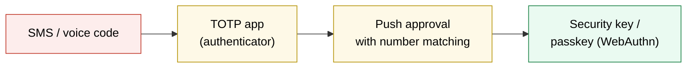
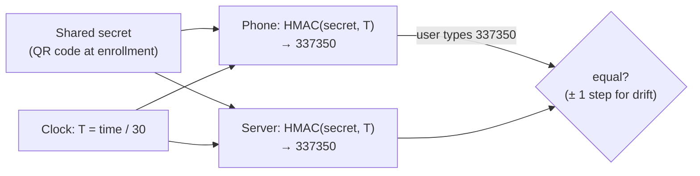
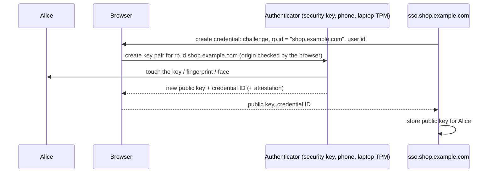
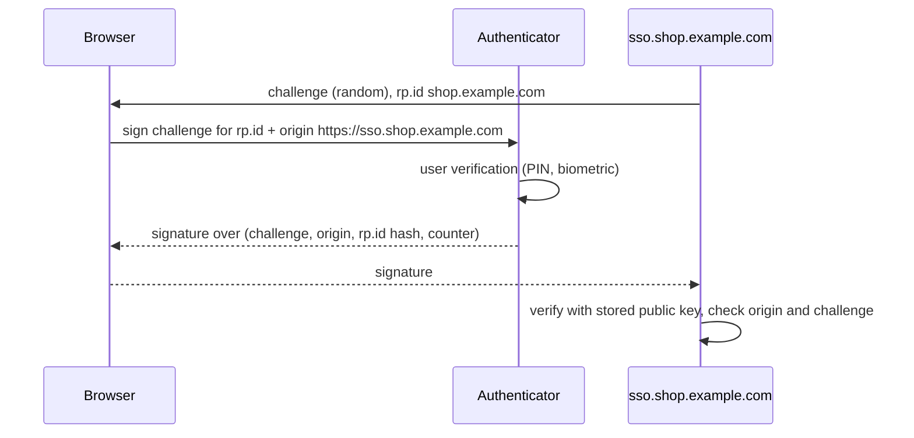
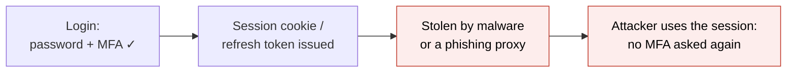

# Multi-factor authentication and passkeys

> [!abstract] In one sentence
> **MFA** requires proofs from two different factors (usually a password plus something you have), so a stolen password alone isn't enough; the common second factors range from **SMS (Short Message Service) codes** (weak), **TOTP** apps (a 6-digit HMAC (hash-based message authentication code) of the current time, good but phishable) and **push** approvals (vulnerable to fatigue), to **WebAuthn/FIDO2** security keys and **passkeys**, which sign a server challenge with a private key bound to the **real website's origin**, making them **phishing-resistant** and good enough to replace the password entirely.

## Build-up: staff accounts keep getting taken over

The shop's admin back-office and its identity provider ([[Single sign-on]]) protect everything. Passwords keep leaking: reused from breached sites, typed into a fake "IT (information technology) portal" page.

### Stage 1: add a second factor

A password is "something I know". Adding "something I have" means an attacker needs **both**. The question is which "something I have", because they differ enormously in how they fail:



| Factor | How it fails |
|---|---|
| **SMS / voice** | **SIM (Subscriber Identity Module) swap** (attacker convinces the carrier to move the number), SS7 (Signaling System No. 7) interception, malware reading SMS, phishable |
| **TOTP** app | **Phishable**: a fake page asks for the code and relays it within 30 s; secret can be copied at enrollment |
| **Push** ("Approve sign-in?") | **MFA fatigue**: attacker with the password spams prompts until the user taps Approve. Number matching (type the number shown on screen) mostly fixes it |
| **WebAuthn (Web Authentication) / passkey** | Bound to the domain: a phishing site can't get a usable signature. Lost device → needs recovery |

### Stage 2: how TOTP works

**TOTP** (time-based one-time password, RFC (Request for Comments, an internet standards document) 6238) needs no network at all on the phone. At enrollment, the server generates a random secret and shows it as a QR (Quick Response) code:

```text
otpauth://totp/Shop%20Admin:alice@shop.example.com?secret=JBSWY3DPEHPK3PXP&issuer=Shop%20Admin&digits=6&period=30
```

The phone app and the server both compute, every 30 seconds:

1. `T = floor(unix_time / 30)`: the current time step
2. `h = HMAC-SHA1(secret, T as 8 bytes)`: a 20-byte HMAC
3. **Dynamic truncation**: take the low 4 bits of the last byte as an offset, read 4 bytes there, clear the top bit
4. `code = that number mod 10⁶`, padded to 6 digits

Worked example, secret `JBSWY3DPEHPK3PXP` at 2026-10-04 08:00:00 UTC (Coordinated Universal Time) (Unix time 1791100800):

```text
T       = 1791100800 / 30 = 59703360
HMAC    = 61 2e 15 72 e5 83 1e 9a c6 84 28 dd f0 c3 09 7b 29 e4 53 f5
offset  = last byte 0xf5 & 0x0f = 5
4 bytes at offset 5 = 83 1e 9a c6 → & 0x7fffffff = 0x031e9ac6 = 52337350
code    = 52337350 mod 1000000 = 337350
```

```bash
oathtool --totp -b JBSWY3DPEHPK3PXP        # current code (package: oath-toolkit)
```



Properties:
- Codes expire after 30 s; servers accept ±1 step for clock drift and must **reject reuse** of a code already accepted
- The server stores the **secret** (it must recompute codes), so a server breach exposes every user's TOTP seed: encrypt them at rest
- **HOTP (HMAC-based one-time password)** (RFC 4226) is the counter-based ancestor: `T` is a counter incremented on each use instead of time
- TOTP stops password-only attacks, but **not a real-time phishing proxy** (tools like Evilginx sit between the user and the real site, relay the password and the code, and keep the session cookie)

### Stage 3: phishing-resistant: WebAuthn and passkeys

The flaw shared by passwords, SMS and TOTP: the user **types something** that works on any site. If the site is fake, the secret goes to the attacker. **WebAuthn** (the browser API (application programming interface), part of FIDO2 (Fast IDentity Online 2)) replaces typed secrets with a **key pair per website**:

**Registration** (once per site):



**Authentication**:



Why it defeats phishing:
- The **browser** puts the real origin into what gets signed. On `sso-shop-example.evil.example`, the authenticator has no key for that domain, and even a relayed challenge produces a signature for the wrong origin, which the real server rejects
- The server stores only a **public key**: a database breach reveals nothing usable
- Nothing to type, nothing to reuse across sites

**Passkeys** are WebAuthn credentials made convenient:

| | Device-bound security key (YubiKey) | Synced passkey |
|---|---|---|
| Private key lives | In the hardware key, never exportable | In the platform's password manager (iCloud Keychain, Google Password Manager, 1Password), synced across the user's devices, end-to-end encrypted |
| Lost device | Need a backup key | Still on the other devices |
| Assurance | Highest (key provably never left the hardware, attestation) | High, depends on the sync account's security |
| Typical | Admins, break-glass accounts | Everyone |

With **user verification** (the device checks a PIN (personal identification number) or biometric), one passkey is already **two factors** (possession of the device + knowledge/biometric), so it can **replace the password** entirely, not just add to it.

### Stage 4: rolling MFA out

| Decision | Recommendation |
|---|---|
| Where to enforce | At the **IdP**, once, for every app behind SSO |
| Which methods | Passkeys/security keys for admins and IdP admins (phishing-resistant required); TOTP or number-matching push acceptable for others; SMS only as a last resort |
| Enrollment | Bootstrap securely: right after a fresh identity check, not "enroll whatever device on first login" an attacker could do first |
| Recovery | One-time **recovery codes** (store hashed, like passwords), a second registered key, or a help-desk process with real identity verification (the help desk is a favorite attack path) |
| When to ask | At login, and **step-up** before sensitive actions (payout changes, adding a new MFA device, admin consoles) |
| Remember device | A device cookie can skip MFA for N days on a known device; never for admin access |
| Machines | MFA is for humans; machines use short-lived credentials and keys ([[Workload identity (SPIFFE)]], [[HMAC request signing]]) |

### Stage 5: what MFA doesn't protect



MFA protects the **login**. Whatever the login produces (session cookie, refresh token) is a bearer credential afterwards: infostealer malware and adversary-in-the-middle proxies steal **sessions**, not passwords. Countermeasures: phishing-resistant MFA (stops the proxy), short sessions for sensitive apps, step-up for sensitive actions, binding sessions/tokens to the device (DPoP (Demonstrating Proof of Possession), device-bound session credentials), and detecting sessions suddenly used from another country.

## Advanced problems

### 1. TOTP codes rejected for one user

The phone's clock is off (manual time setting), or the code was already used in this window. Servers usually accept ±1 step; the user should enable automatic time.

### 2. MFA fatigue attack

A user reports dozens of unexpected push prompts at night: their password is known. Number matching or passkeys, limits on prompts, alerting on repeated denials, and resetting the password.

### 3. Lost the only factor

A user lost the phone with the only authenticator. If the recovery path is "email a link", MFA is only as strong as the email account. Require two registered methods or recovery codes; help-desk resets verified properly (video call, manager confirmation).

### 4. Passkey works on one domain, not another

The passkey's **RP (relying party) ID (identifier)** is `shop.example.com`; it works on that domain and its subdomains, not on `shop-example.com` or a different TLD (top-level domain). Choose the RP ID carefully (usually the registrable domain) before rolling out.

## In AWS
- IAM (Identity and Access Management) users and the root user support **MFA**: virtual TOTP apps, FIDO2 security keys/passkeys, hardware TOTP tokens. The **root user** should have phishing-resistant MFA and be a break-glass account only
- IAM policies can require MFA with the condition `aws:MultiFactorAuthPresent`; temporary credentials from `sts get-session-token --serial-number … --token-code …` carry the MFA flag
- [[AWS Identity Center]] and Cognito support TOTP and WebAuthn; with an external IdP, MFA is enforced there

## Practice

> [!example]- Why is a password plus a security question not MFA?
> Both are "something you know": one factor twice.

> [!example]- How does the server verify a TOTP code without contacting the phone?
> Both share the secret and the clock; the server computes HMAC(secret, floor(time/30)), truncates it and compares (allowing ±1 step).

> [!example]- Why can a phishing proxy defeat TOTP but not a passkey?
> The user types the TOTP code into the fake page, which relays it in time. A passkey signature includes the origin; the fake origin's signature is rejected, and the authenticator has no key for that domain anyway.

> [!example]- What's MFA fatigue and the fix?
> Spamming push prompts until the user approves; number matching or phishing-resistant methods.

> [!example]- After a successful MFA login, malware steals the session cookie. Does MFA help?
> No, MFA protected the login only. Short sessions, device binding, step-up and anomaly detection do.

## Easy to get wrong
- Treating SMS as strong MFA
- Thinking TOTP is phishing-resistant
- Weak recovery (email reset) undoing strong MFA
- Allowing a new MFA device to be added without step-up
- Not rejecting reused TOTP codes, storing TOTP secrets unencrypted
- "Remember this device" on admin access
- Believing MFA protects sessions after login
- Root/IdP admin accounts with only TOTP

## Related
- Concepts first:: [[Authentication and authorization]] (factors)
- Where to enforce it:: [[Single sign-on]], [[OpenID Connect]] (acr/amr claims)
- What it produces afterwards:: [[Session authentication]], [[Access and refresh tokens]]
- Same HMAC building block:: [[HMAC request signing]]
- Public-key cryptography:: [[Encryption basics]]
- In AWS (Amazon Web Services):: [[IAM]], [[AWS Identity Center]]
- Area:: [[Identity and access]]

## Flashcards
#flashcards

What is MFA? :: Authentication requiring proofs from at least two different factors
Why is SMS a weak second factor? :: SIM swap, SS7 interception, malware, and it's phishable
How is a TOTP code computed? :: HMAC-SHA1(secret (SHA1: Secure Hash Algorithm 1), floor(time/30)), dynamic truncation, mod 10^6
TOTP vs HOTP? :: TOTP uses a time step; HOTP uses an incrementing counter
What does the TOTP QR code contain? :: An otpauth:// URI (Uniform Resource Identifier) with the shared secret, issuer, account, digits and period
Is TOTP phishing-resistant? :: No, a real-time proxy can relay the code
What is MFA fatigue? :: Spamming push approvals until the user accepts; fixed by number matching or FIDO2
What is WebAuthn? :: A browser API where an authenticator signs server challenges with a per-site private key
Why is WebAuthn phishing-resistant? :: Signatures are bound to the origin/RP ID; a fake site can't obtain a valid one
What does a WebAuthn server store? :: The user's public key and credential ID (nothing secret)
What is a passkey? :: A WebAuthn credential, often synced across the user's devices by the platform
Device-bound security key vs synced passkey? :: Hardware key never exports the private key (highest assurance); synced passkey survives device loss
Can a passkey replace the password? :: Yes, with user verification it combines possession and PIN/biometric
What does MFA not protect? :: Sessions and tokens issued after login (cookie theft, AiTM proxies)
What is step-up authentication? :: Asking for fresh authentication before a sensitive action
IAM condition key requiring MFA? :: aws:MultiFactorAuthPresent
